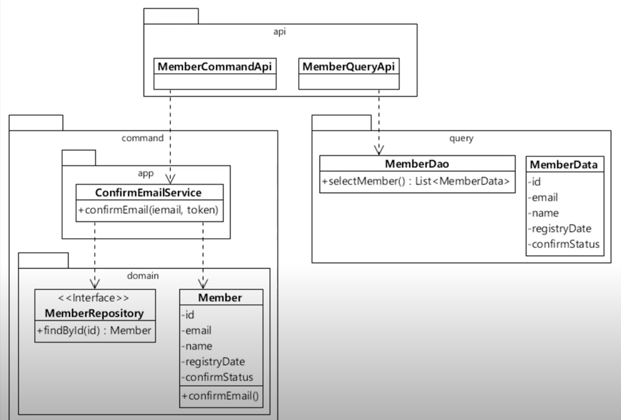
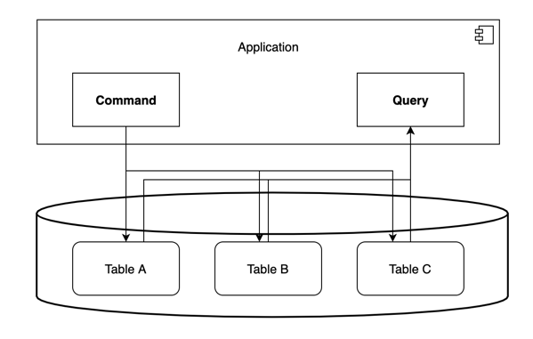
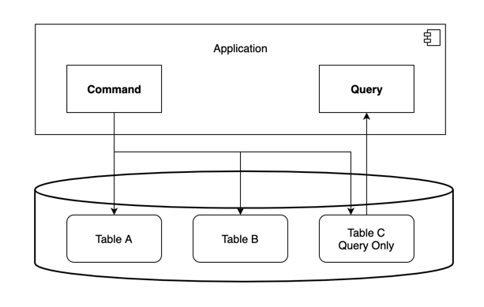
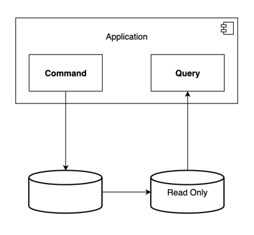
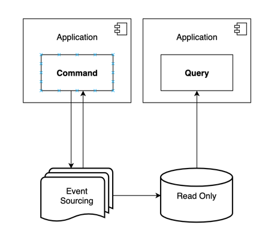

# CQRS

## 용어정리
Command and Query Responsibility Segregation
명령과 조회를 나누는 것
- Command : 시스템 데이터 변경 기능(INSERT, UPDATE, DELETE)
- Query : 시스템 데이터 조회 기능 (SELECT)
- Responsibility Segregation : 구성요소의 역할 (클래스, 함수, 패키지, 모듈, DB, 서버 등등..)

## 왜 나누어야 하는가
같은 Entity여도 명령과 쿼리는 사용 시점과 빈도가 틀리다.
같은 데이터도 기능별로도 묶어서 조회하는 기능이 다름. (하나로하면 너무 무거워질 수 있음)
서로다른 이유로 코드가 변경이 되고 변경 빈도가 다른 기능들이 한곳에 있으면 이는 곧 객체의 책임이 크다는것. (SRP 위반)

## 구현 방법

### Noraml

<!-- %3CmxGraphModel%3E%3Croot%3E%3CmxCell%20id%3D%220%22%2F%3E%3CmxCell%20id%3D%221%22%20parent%3D%220%22%2F%3E%3CmxCell%20id%3D%222%22%20value%3D%22Application%26lt%3Bbr%26gt%3B%26lt%3Bbr%26gt%3B%26lt%3Bbr%26gt%3B%26lt%3Bbr%26gt%3B%26lt%3Bbr%26gt%3B%26lt%3Bbr%26gt%3B%22%20style%3D%22html%3D1%3BdropTarget%3D0%3BfontSize%3D14%3B%22%20vertex%3D%221%22%20parent%3D%221%22%3E%3CmxGeometry%20x%3D%22120%22%20y%3D%22-560%22%20width%3D%22520%22%20height%3D%22140%22%20as%3D%22geometry%22%2F%3E%3C%2FmxCell%3E%3CmxCell%20id%3D%223%22%20value%3D%22%22%20style%3D%22shape%3Dmodule%3BjettyWidth%3D8%3BjettyHeight%3D4%3B%22%20vertex%3D%221%22%20parent%3D%222%22%3E%3CmxGeometry%20x%3D%221%22%20width%3D%2220%22%20height%3D%2220%22%20relative%3D%221%22%20as%3D%22geometry%22%3E%3CmxPoint%20x%3D%22-27%22%20y%3D%227%22%20as%3D%22offset%22%2F%3E%3C%2FmxGeometry%3E%3C%2FmxCell%3E%3CmxCell%20id%3D%224%22%20value%3D%22%22%20style%3D%22strokeWidth%3D2%3Bhtml%3D1%3Bshape%3Dmxgraph.flowchart.database%3BwhiteSpace%3Dwrap%3BfontSize%3D14%3B%22%20vertex%3D%221%22%20parent%3D%221%22%3E%3CmxGeometry%20x%3D%22120%22%20y%3D%22-365%22%20width%3D%22530%22%20height%3D%22140%22%20as%3D%22geometry%22%2F%3E%3C%2FmxCell%3E%3CmxCell%20id%3D%225%22%20style%3D%22edgeStyle%3DorthogonalEdgeStyle%3Brounded%3D0%3BorthogonalLoop%3D1%3BjettySize%3Dauto%3Bhtml%3D1%3B%22%20edge%3D%221%22%20source%3D%228%22%20target%3D%2211%22%20parent%3D%221%22%3E%3CmxGeometry%20relative%3D%221%22%20as%3D%22geometry%22%3E%3CmxPoint%20x%3D%22220%22%20y%3D%22-310%22%20as%3D%22targetPoint%22%2F%3E%3CArray%20as%3D%22points%22%2F%3E%3C%2FmxGeometry%3E%3C%2FmxCell%3E%3CmxCell%20id%3D%226%22%20style%3D%22edgeStyle%3DorthogonalEdgeStyle%3Brounded%3D0%3BorthogonalLoop%3D1%3BjettySize%3Dauto%3Bhtml%3D1%3B%22%20edge%3D%221%22%20source%3D%228%22%20target%3D%2213%22%20parent%3D%221%22%3E%3CmxGeometry%20relative%3D%221%22%20as%3D%22geometry%22%3E%3CmxPoint%20x%3D%22380%22%20y%3D%22-310%22%20as%3D%22targetPoint%22%2F%3E%3CArray%20as%3D%22points%22%3E%3CmxPoint%20x%3D%22220%22%20y%3D%22-390%22%2F%3E%3CmxPoint%20x%3D%22370%22%20y%3D%22-390%22%2F%3E%3C%2FArray%3E%3C%2FmxGeometry%3E%3C%2FmxCell%3E%3CmxCell%20id%3D%227%22%20style%3D%22edgeStyle%3DorthogonalEdgeStyle%3Brounded%3D0%3BorthogonalLoop%3D1%3BjettySize%3Dauto%3Bhtml%3D1%3B%22%20edge%3D%221%22%20source%3D%228%22%20parent%3D%221%22%3E%3CmxGeometry%20relative%3D%221%22%20as%3D%22geometry%22%3E%3CmxPoint%20x%3D%22520%22%20y%3D%22-310%22%20as%3D%22targetPoint%22%2F%3E%3CArray%20as%3D%22points%22%3E%3CmxPoint%20x%3D%22220%22%20y%3D%22-390%22%2F%3E%3CmxPoint%20x%3D%22520%22%20y%3D%22-390%22%2F%3E%3C%2FArray%3E%3C%2FmxGeometry%3E%3C%2FmxCell%3E%3CmxCell%20id%3D%228%22%20value%3D%22Command%22%20style%3D%22html%3D1%3BfontStyle%3D1%3BfontSize%3D14%3B%22%20vertex%3D%221%22%20parent%3D%221%22%3E%3CmxGeometry%20x%3D%22160%22%20y%3D%22-500%22%20width%3D%22120%22%20height%3D%2260%22%20as%3D%22geometry%22%2F%3E%3C%2FmxCell%3E%3CmxCell%20id%3D%229%22%20value%3D%22Query%22%20style%3D%22html%3D1%3BfontStyle%3D1%3BfontSize%3D14%3B%22%20vertex%3D%221%22%20parent%3D%221%22%3E%3CmxGeometry%20x%3D%22480%22%20y%3D%22-500%22%20width%3D%22120%22%20height%3D%2260%22%20as%3D%22geometry%22%2F%3E%3C%2FmxCell%3E%3CmxCell%20id%3D%2210%22%20style%3D%22edgeStyle%3DorthogonalEdgeStyle%3Brounded%3D0%3BorthogonalLoop%3D1%3BjettySize%3Dauto%3Bhtml%3D1%3BfontSize%3D14%3B%22%20edge%3D%221%22%20source%3D%2211%22%20target%3D%229%22%20parent%3D%221%22%3E%3CmxGeometry%20relative%3D%221%22%20as%3D%22geometry%22%3E%3CArray%20as%3D%22points%22%3E%3CmxPoint%20x%3D%22240%22%20y%3D%22-380%22%2F%3E%3CmxPoint%20x%3D%22540%22%20y%3D%22-380%22%2F%3E%3C%2FArray%3E%3C%2FmxGeometry%3E%3C%2FmxCell%3E%3CmxCell%20id%3D%2211%22%20value%3D%22Table%20A%22%20style%3D%22rounded%3D1%3BwhiteSpace%3Dwrap%3Bhtml%3D1%3BfontSize%3D14%3B%22%20vertex%3D%221%22%20parent%3D%221%22%3E%3CmxGeometry%20x%3D%22160%22%20y%3D%22-310%22%20width%3D%22120%22%20height%3D%2260%22%20as%3D%22geometry%22%2F%3E%3C%2FmxCell%3E%3CmxCell%20id%3D%2212%22%20style%3D%22edgeStyle%3DorthogonalEdgeStyle%3Brounded%3D0%3BorthogonalLoop%3D1%3BjettySize%3Dauto%3Bhtml%3D1%3BfontSize%3D14%3B%22%20edge%3D%221%22%20source%3D%2213%22%20target%3D%229%22%20parent%3D%221%22%3E%3CmxGeometry%20relative%3D%221%22%20as%3D%22geometry%22%3E%3CArray%20as%3D%22points%22%3E%3CmxPoint%20x%3D%22380%22%20y%3D%22-380%22%2F%3E%3CmxPoint%20x%3D%22540%22%20y%3D%22-380%22%2F%3E%3C%2FArray%3E%3C%2FmxGeometry%3E%3C%2FmxCell%3E%3CmxCell%20id%3D%2213%22%20value%3D%22Table%20B%22%20style%3D%22rounded%3D1%3BwhiteSpace%3Dwrap%3Bhtml%3D1%3BfontSize%3D14%3B%22%20vertex%3D%221%22%20parent%3D%221%22%3E%3CmxGeometry%20x%3D%22320%22%20y%3D%22-310%22%20width%3D%22120%22%20height%3D%2260%22%20as%3D%22geometry%22%2F%3E%3C%2FmxCell%3E%3CmxCell%20id%3D%2214%22%20style%3D%22edgeStyle%3DorthogonalEdgeStyle%3Brounded%3D0%3BorthogonalLoop%3D1%3BjettySize%3Dauto%3Bhtml%3D1%3BfontSize%3D14%3B%22%20edge%3D%221%22%20source%3D%2215%22%20target%3D%229%22%20parent%3D%221%22%3E%3CmxGeometry%20relative%3D%221%22%20as%3D%22geometry%22%2F%3E%3C%2FmxCell%3E%3CmxCell%20id%3D%2215%22%20value%3D%22Table%20C%22%20style%3D%22rounded%3D1%3BwhiteSpace%3Dwrap%3Bhtml%3D1%3BfontSize%3D14%3B%22%20vertex%3D%221%22%20parent%3D%221%22%3E%3CmxGeometry%20x%3D%22480%22%20y%3D%22-310%22%20width%3D%22120%22%20height%3D%2260%22%20as%3D%22geometry%22%2F%3E%3C%2FmxCell%3E%3C%2Froot%3E%3C%2FmxGraphModel%3E -->
같은 프로세스, 같은 DB
- 가장 단순한 형태
- 트랜젝션 처리에 매우 용이
- 명령 / 쿼리 동일성 보장

<!-- %3CmxGraphModel%3E%3Croot%3E%3CmxCell%20id%3D%220%22%2F%3E%3CmxCell%20id%3D%221%22%20parent%3D%220%22%2F%3E%3CmxCell%20id%3D%222%22%20value%3D%22Application%26lt%3Bbr%26gt%3B%26lt%3Bbr%26gt%3B%26lt%3Bbr%26gt%3B%26lt%3Bbr%26gt%3B%26lt%3Bbr%26gt%3B%26lt%3Bbr%26gt%3B%22%20style%3D%22html%3D1%3BdropTarget%3D0%3BfontSize%3D14%3B%22%20vertex%3D%221%22%20parent%3D%221%22%3E%3CmxGeometry%20x%3D%22917%22%20y%3D%22-552%22%20width%3D%22520%22%20height%3D%22140%22%20as%3D%22geometry%22%2F%3E%3C%2FmxCell%3E%3CmxCell%20id%3D%223%22%20value%3D%22%22%20style%3D%22shape%3Dmodule%3BjettyWidth%3D8%3BjettyHeight%3D4%3B%22%20vertex%3D%221%22%20parent%3D%222%22%3E%3CmxGeometry%20x%3D%221%22%20width%3D%2220%22%20height%3D%2220%22%20relative%3D%221%22%20as%3D%22geometry%22%3E%3CmxPoint%20x%3D%22-27%22%20y%3D%227%22%20as%3D%22offset%22%2F%3E%3C%2FmxGeometry%3E%3C%2FmxCell%3E%3CmxCell%20id%3D%224%22%20value%3D%22%22%20style%3D%22strokeWidth%3D2%3Bhtml%3D1%3Bshape%3Dmxgraph.flowchart.database%3BwhiteSpace%3Dwrap%3BfontSize%3D14%3B%22%20vertex%3D%221%22%20parent%3D%221%22%3E%3CmxGeometry%20x%3D%22917%22%20y%3D%22-365%22%20width%3D%22530%22%20height%3D%22140%22%20as%3D%22geometry%22%2F%3E%3C%2FmxCell%3E%3CmxCell%20id%3D%225%22%20style%3D%22edgeStyle%3DorthogonalEdgeStyle%3Brounded%3D0%3BorthogonalLoop%3D1%3BjettySize%3Dauto%3Bhtml%3D1%3B%22%20edge%3D%221%22%20source%3D%228%22%20parent%3D%221%22%3E%3CmxGeometry%20relative%3D%221%22%20as%3D%22geometry%22%3E%3CmxPoint%20x%3D%221017%22%20y%3D%22-310%22%20as%3D%22targetPoint%22%2F%3E%3C%2FmxGeometry%3E%3C%2FmxCell%3E%3CmxCell%20id%3D%226%22%20style%3D%22edgeStyle%3DorthogonalEdgeStyle%3Brounded%3D0%3BorthogonalLoop%3D1%3BjettySize%3Dauto%3Bhtml%3D1%3B%22%20edge%3D%221%22%20source%3D%228%22%20parent%3D%221%22%3E%3CmxGeometry%20relative%3D%221%22%20as%3D%22geometry%22%3E%3CmxPoint%20x%3D%221177%22%20y%3D%22-310%22%20as%3D%22targetPoint%22%2F%3E%3CArray%20as%3D%22points%22%3E%3CmxPoint%20x%3D%221017%22%20y%3D%22-390%22%2F%3E%3CmxPoint%20x%3D%221177%22%20y%3D%22-390%22%2F%3E%3C%2FArray%3E%3C%2FmxGeometry%3E%3C%2FmxCell%3E%3CmxCell%20id%3D%227%22%20style%3D%22edgeStyle%3DorthogonalEdgeStyle%3Brounded%3D0%3BorthogonalLoop%3D1%3BjettySize%3Dauto%3Bhtml%3D1%3B%22%20edge%3D%221%22%20source%3D%228%22%20parent%3D%221%22%3E%3CmxGeometry%20relative%3D%221%22%20as%3D%22geometry%22%3E%3CmxPoint%20x%3D%221317%22%20y%3D%22-310%22%20as%3D%22targetPoint%22%2F%3E%3CArray%20as%3D%22points%22%3E%3CmxPoint%20x%3D%221017%22%20y%3D%22-390%22%2F%3E%3CmxPoint%20x%3D%221317%22%20y%3D%22-390%22%2F%3E%3C%2FArray%3E%3C%2FmxGeometry%3E%3C%2FmxCell%3E%3CmxCell%20id%3D%228%22%20value%3D%22Command%22%20style%3D%22html%3D1%3BfontStyle%3D1%3BfontSize%3D14%3B%22%20vertex%3D%221%22%20parent%3D%221%22%3E%3CmxGeometry%20x%3D%22957%22%20y%3D%22-500%22%20width%3D%22120%22%20height%3D%2260%22%20as%3D%22geometry%22%2F%3E%3C%2FmxCell%3E%3CmxCell%20id%3D%229%22%20value%3D%22Query%22%20style%3D%22html%3D1%3BfontStyle%3D1%3BfontSize%3D14%3B%22%20vertex%3D%221%22%20parent%3D%221%22%3E%3CmxGeometry%20x%3D%221277%22%20y%3D%22-500%22%20width%3D%22120%22%20height%3D%2260%22%20as%3D%22geometry%22%2F%3E%3C%2FmxCell%3E%3CmxCell%20id%3D%2210%22%20value%3D%22Table%20A%22%20style%3D%22rounded%3D1%3BwhiteSpace%3Dwrap%3Bhtml%3D1%3BfontSize%3D14%3B%22%20vertex%3D%221%22%20parent%3D%221%22%3E%3CmxGeometry%20x%3D%22957%22%20y%3D%22-310%22%20width%3D%22120%22%20height%3D%2260%22%20as%3D%22geometry%22%2F%3E%3C%2FmxCell%3E%3CmxCell%20id%3D%2211%22%20value%3D%22Table%20B%22%20style%3D%22rounded%3D1%3BwhiteSpace%3Dwrap%3Bhtml%3D1%3BfontSize%3D14%3B%22%20vertex%3D%221%22%20parent%3D%221%22%3E%3CmxGeometry%20x%3D%221117%22%20y%3D%22-310%22%20width%3D%22120%22%20height%3D%2260%22%20as%3D%22geometry%22%2F%3E%3C%2FmxCell%3E%3CmxCell%20id%3D%2212%22%20style%3D%22edgeStyle%3DorthogonalEdgeStyle%3Brounded%3D0%3BorthogonalLoop%3D1%3BjettySize%3Dauto%3Bhtml%3D1%3BfontSize%3D14%3B%22%20edge%3D%221%22%20source%3D%2213%22%20target%3D%229%22%20parent%3D%221%22%3E%3CmxGeometry%20relative%3D%221%22%20as%3D%22geometry%22%2F%3E%3C%2FmxCell%3E%3CmxCell%20id%3D%2213%22%20value%3D%22Table%20C%26lt%3Bbr%26gt%3BQuery%20Only%22%20style%3D%22rounded%3D1%3BwhiteSpace%3Dwrap%3Bhtml%3D1%3BfontSize%3D14%3B%22%20vertex%3D%221%22%20parent%3D%221%22%3E%3CmxGeometry%20x%3D%221277%22%20y%3D%22-310%22%20width%3D%22120%22%20height%3D%2260%22%20as%3D%22geometry%22%2F%3E%3C%2FmxCell%3E%3C%2Froot%3E%3C%2FmxGraphModel%3E -->
같은 프로세스, 같은 DB, 다른 Table
- 쿼리 전용 테이블 사용
- Command가 Query 전용 테이블을 변경한다.

### Premium

<!-- %3CmxGraphModel%3E%3Croot%3E%3CmxCell%20id%3D%220%22%2F%3E%3CmxCell%20id%3D%221%22%20parent%3D%220%22%2F%3E%3CmxCell%20id%3D%222%22%20value%3D%22Application%26lt%3Bbr%26gt%3B%26lt%3Bbr%26gt%3B%26lt%3Bbr%26gt%3B%26lt%3Bbr%26gt%3B%26lt%3Bbr%26gt%3B%26lt%3Bbr%26gt%3B%22%20style%3D%22html%3D1%3BdropTarget%3D0%3BfontSize%3D14%3B%22%20vertex%3D%221%22%20parent%3D%221%22%3E%3CmxGeometry%20x%3D%22189%22%20y%3D%22105%22%20width%3D%22364%22%20height%3D%22140%22%20as%3D%22geometry%22%2F%3E%3C%2FmxCell%3E%3CmxCell%20id%3D%223%22%20value%3D%22%22%20style%3D%22shape%3Dmodule%3BjettyWidth%3D8%3BjettyHeight%3D4%3B%22%20vertex%3D%221%22%20parent%3D%222%22%3E%3CmxGeometry%20x%3D%221%22%20width%3D%2220%22%20height%3D%2220%22%20relative%3D%221%22%20as%3D%22geometry%22%3E%3CmxPoint%20x%3D%22-27%22%20y%3D%227%22%20as%3D%22offset%22%2F%3E%3C%2FmxGeometry%3E%3C%2FmxCell%3E%3CmxCell%20id%3D%224%22%20style%3D%22edgeStyle%3DorthogonalEdgeStyle%3Brounded%3D0%3BorthogonalLoop%3D1%3BjettySize%3Dauto%3Bhtml%3D1%3B%22%20edge%3D%221%22%20source%3D%225%22%20target%3D%228%22%20parent%3D%221%22%3E%3CmxGeometry%20relative%3D%221%22%20as%3D%22geometry%22%3E%3CmxPoint%20x%3D%22277%22%20y%3D%22346%22%20as%3D%22targetPoint%22%2F%3E%3C%2FmxGeometry%3E%3C%2FmxCell%3E%3CmxCell%20id%3D%225%22%20value%3D%22Command%22%20style%3D%22html%3D1%3BfontStyle%3D1%3BfontSize%3D14%3B%22%20vertex%3D%221%22%20parent%3D%221%22%3E%3CmxGeometry%20x%3D%22211%22%20y%3D%22165%22%20width%3D%22120%22%20height%3D%2260%22%20as%3D%22geometry%22%2F%3E%3C%2FmxCell%3E%3CmxCell%20id%3D%226%22%20value%3D%22Query%22%20style%3D%22html%3D1%3BfontStyle%3D1%3BfontSize%3D14%3B%22%20vertex%3D%221%22%20parent%3D%221%22%3E%3CmxGeometry%20x%3D%22411%22%20y%3D%22165%22%20width%3D%22120%22%20height%3D%2260%22%20as%3D%22geometry%22%2F%3E%3C%2FmxCell%3E%3CmxCell%20id%3D%227%22%20style%3D%22edgeStyle%3DorthogonalEdgeStyle%3Brounded%3D0%3BorthogonalLoop%3D1%3BjettySize%3Dauto%3Bhtml%3D1%3BfontSize%3D14%3B%22%20edge%3D%221%22%20source%3D%228%22%20target%3D%2210%22%20parent%3D%221%22%3E%3CmxGeometry%20relative%3D%221%22%20as%3D%22geometry%22%2F%3E%3C%2FmxCell%3E%3CmxCell%20id%3D%228%22%20value%3D%22%22%20style%3D%22strokeWidth%3D2%3Bhtml%3D1%3Bshape%3Dmxgraph.flowchart.database%3BwhiteSpace%3Dwrap%3BfontSize%3D14%3B%22%20vertex%3D%221%22%20parent%3D%221%22%3E%3CmxGeometry%20x%3D%22211%22%20y%3D%22355%22%20width%3D%22120%22%20height%3D%2270%22%20as%3D%22geometry%22%2F%3E%3C%2FmxCell%3E%3CmxCell%20id%3D%229%22%20style%3D%22edgeStyle%3DorthogonalEdgeStyle%3Brounded%3D0%3BorthogonalLoop%3D1%3BjettySize%3Dauto%3Bhtml%3D1%3BfontSize%3D14%3B%22%20edge%3D%221%22%20source%3D%2210%22%20target%3D%226%22%20parent%3D%221%22%3E%3CmxGeometry%20relative%3D%221%22%20as%3D%22geometry%22%2F%3E%3C%2FmxCell%3E%3CmxCell%20id%3D%2210%22%20value%3D%22Read%20Only%22%20style%3D%22strokeWidth%3D2%3Bhtml%3D1%3Bshape%3Dmxgraph.flowchart.database%3BwhiteSpace%3Dwrap%3BfontSize%3D14%3B%22%20vertex%3D%221%22%20parent%3D%221%22%3E%3CmxGeometry%20x%3D%22411%22%20y%3D%22355%22%20width%3D%22120%22%20height%3D%2270%22%20as%3D%22geometry%22%2F%3E%3C%2FmxCell%3E%3C%2Froot%3E%3C%2FmxGraphModel%3E -->
같은 프로세스 다른 DB
- Query Model은 빠른 Redis 혹은 Mongo와 같은 DB를 적용
- Command에서 DB에 명령을 내릴시 명령을 전파한다.

### Deluxe

<!-- %3CmxGraphModel%3E%3Croot%3E%3CmxCell%20id%3D%220%22%2F%3E%3CmxCell%20id%3D%221%22%20parent%3D%220%22%2F%3E%3CmxCell%20id%3D%222%22%20value%3D%22Application%26lt%3Bbr%26gt%3B%26lt%3Bbr%26gt%3B%26lt%3Bbr%26gt%3B%26lt%3Bbr%26gt%3B%26lt%3Bbr%26gt%3B%26lt%3Bbr%26gt%3B%22%20style%3D%22html%3D1%3BdropTarget%3D0%3BfontSize%3D14%3B%22%20vertex%3D%221%22%20parent%3D%221%22%3E%3CmxGeometry%20x%3D%22330%22%20y%3D%22680%22%20width%3D%22180%22%20height%3D%22140%22%20as%3D%22geometry%22%2F%3E%3C%2FmxCell%3E%3CmxCell%20id%3D%223%22%20value%3D%22%22%20style%3D%22shape%3Dmodule%3BjettyWidth%3D8%3BjettyHeight%3D4%3B%22%20vertex%3D%221%22%20parent%3D%222%22%3E%3CmxGeometry%20x%3D%221%22%20width%3D%2220%22%20height%3D%2220%22%20relative%3D%221%22%20as%3D%22geometry%22%3E%3CmxPoint%20x%3D%22-27%22%20y%3D%227%22%20as%3D%22offset%22%2F%3E%3C%2FmxGeometry%3E%3C%2FmxCell%3E%3CmxCell%20id%3D%224%22%20value%3D%22Application%26lt%3Bbr%26gt%3B%26lt%3Bbr%26gt%3B%26lt%3Bbr%26gt%3B%26lt%3Bbr%26gt%3B%26lt%3Bbr%26gt%3B%26lt%3Bbr%26gt%3B%22%20style%3D%22html%3D1%3BdropTarget%3D0%3BfontSize%3D14%3B%22%20vertex%3D%221%22%20parent%3D%221%22%3E%3CmxGeometry%20x%3D%22130%22%20y%3D%22680%22%20width%3D%22180%22%20height%3D%22140%22%20as%3D%22geometry%22%2F%3E%3C%2FmxCell%3E%3CmxCell%20id%3D%225%22%20value%3D%22%22%20style%3D%22shape%3Dmodule%3BjettyWidth%3D8%3BjettyHeight%3D4%3B%22%20vertex%3D%221%22%20parent%3D%224%22%3E%3CmxGeometry%20x%3D%221%22%20width%3D%2220%22%20height%3D%2220%22%20relative%3D%221%22%20as%3D%22geometry%22%3E%3CmxPoint%20x%3D%22-27%22%20y%3D%227%22%20as%3D%22offset%22%2F%3E%3C%2FmxGeometry%3E%3C%2FmxCell%3E%3CmxCell%20id%3D%226%22%20style%3D%22edgeStyle%3DorthogonalEdgeStyle%3Brounded%3D0%3BorthogonalLoop%3D1%3BjettySize%3Dauto%3Bhtml%3D1%3B%22%20edge%3D%221%22%20source%3D%227%22%20target%3D%2213%22%20parent%3D%221%22%3E%3CmxGeometry%20relative%3D%221%22%20as%3D%22geometry%22%3E%3CmxPoint%20x%3D%22220%22%20y%3D%22930%22%20as%3D%22targetPoint%22%2F%3E%3CArray%20as%3D%22points%22%3E%3CmxPoint%20x%3D%22210%22%20y%3D%22850%22%2F%3E%3CmxPoint%20x%3D%22210%22%20y%3D%22850%22%2F%3E%3C%2FArray%3E%3C%2FmxGeometry%3E%3C%2FmxCell%3E%3CmxCell%20id%3D%227%22%20value%3D%22Command%22%20style%3D%22html%3D1%3BfontStyle%3D1%3BfontSize%3D14%3B%22%20vertex%3D%221%22%20parent%3D%221%22%3E%3CmxGeometry%20x%3D%22160%22%20y%3D%22740%22%20width%3D%22120%22%20height%3D%2260%22%20as%3D%22geometry%22%2F%3E%3C%2FmxCell%3E%3CmxCell%20id%3D%228%22%20value%3D%22Query%22%20style%3D%22html%3D1%3BfontStyle%3D1%3BfontSize%3D14%3B%22%20vertex%3D%221%22%20parent%3D%221%22%3E%3CmxGeometry%20x%3D%22360%22%20y%3D%22740%22%20width%3D%22120%22%20height%3D%2260%22%20as%3D%22geometry%22%2F%3E%3C%2FmxCell%3E%3CmxCell%20id%3D%229%22%20style%3D%22edgeStyle%3DorthogonalEdgeStyle%3Brounded%3D0%3BorthogonalLoop%3D1%3BjettySize%3Dauto%3Bhtml%3D1%3BfontSize%3D14%3B%22%20edge%3D%221%22%20source%3D%2213%22%20target%3D%2211%22%20parent%3D%221%22%3E%3CmxGeometry%20relative%3D%221%22%20as%3D%22geometry%22%3E%3CmxPoint%20x%3D%22280%22%20y%3D%22965%22%20as%3D%22sourcePoint%22%2F%3E%3C%2FmxGeometry%3E%3C%2FmxCell%3E%3CmxCell%20id%3D%2210%22%20style%3D%22edgeStyle%3DorthogonalEdgeStyle%3Brounded%3D0%3BorthogonalLoop%3D1%3BjettySize%3Dauto%3Bhtml%3D1%3BfontSize%3D14%3B%22%20edge%3D%221%22%20source%3D%2211%22%20target%3D%228%22%20parent%3D%221%22%3E%3CmxGeometry%20relative%3D%221%22%20as%3D%22geometry%22%2F%3E%3C%2FmxCell%3E%3CmxCell%20id%3D%2211%22%20value%3D%22Read%20Only%22%20style%3D%22strokeWidth%3D2%3Bhtml%3D1%3Bshape%3Dmxgraph.flowchart.database%3BwhiteSpace%3Dwrap%3BfontSize%3D14%3B%22%20vertex%3D%221%22%20parent%3D%221%22%3E%3CmxGeometry%20x%3D%22360%22%20y%3D%22930%22%20width%3D%22120%22%20height%3D%2290%22%20as%3D%22geometry%22%2F%3E%3C%2FmxCell%3E%3CmxCell%20id%3D%2212%22%20style%3D%22edgeStyle%3DorthogonalEdgeStyle%3Brounded%3D0%3BorthogonalLoop%3D1%3BjettySize%3Dauto%3Bhtml%3D1%3BfontSize%3D14%3B%22%20edge%3D%221%22%20source%3D%2213%22%20target%3D%227%22%20parent%3D%221%22%3E%3CmxGeometry%20relative%3D%221%22%20as%3D%22geometry%22%3E%3CArray%20as%3D%22points%22%3E%3CmxPoint%20x%3D%22230%22%20y%3D%22870%22%2F%3E%3CmxPoint%20x%3D%22230%22%20y%3D%22870%22%2F%3E%3C%2FArray%3E%3C%2FmxGeometry%3E%3C%2FmxCell%3E%3CmxCell%20id%3D%2213%22%20value%3D%22Event%26lt%3Bbr%26gt%3BSourcing%22%20style%3D%22strokeWidth%3D2%3Bhtml%3D1%3Bshape%3Dmxgraph.flowchart.multi-document%3BwhiteSpace%3Dwrap%3BfontSize%3D14%3B%22%20vertex%3D%221%22%20parent%3D%221%22%3E%3CmxGeometry%20x%3D%22160%22%20y%3D%22930%22%20width%3D%22120%22%20height%3D%2290%22%20as%3D%22geometry%22%2F%3E%3C%2FmxCell%3E%3C%2Froot%3E%3C%2FmxGraphModel%3E -->
다른 프로세스, 다른 DB
- 이벤트 소싱 방법을 적용
- 이벤트 소싱이 CQRS Deluxe 방식은 아니지만 CQRS Deluxe는 이벤트 소싱 기법이다.

## 다른 DB로의 전파 방법
### Normal 형태에서의 전파
- Command가 Query 전용의 Table을 변경하는 형태 (Normal 형태)
- Kafka, RebbitMQ 등 메시지로 전파 (Optional)
  - 구현이 단순한것이 장점
  - 데이터 유실 가능성이 있다.
  - Query DB, Message 전달 에러로 인해 Command에 장애로 이어질 수 있다. (큰 단점)

### Premium에서의 전파
- 변경 내역을 벌도의 테이블에 기록하고 변경내역을 전달하는 방식
- 하나의 Transaction 으로 처리되기 떄문에 변경 데이터 유실 가능성이 없음
- 전파기를 따로 구현해야 하는 부담이 있다.
- 전파기와 메시지 큐를 같이 구현하여 전달하는 경우가 있다. (Optional)

### Deluxe 에서의 전파
- DB가 제공하는 CDC를 이용하여 정합 작업
  - DB의 바이너리 로그를 읽어서 변경 데이터를 확인하고 Query쪽 DB에 전달하는 형태
  - Command 코드에서 변경에 대한 로직이 사라져 단순화 됨

## Command, Query 다른 DB를 사용할 때의 주의점
- 데이터 유실
- 허용 가능 지연 시간
- 중복 전달. 오류 이후 재 전달시에 중복으로 전송이 가능함을 염두

> [최범균 CQRS 아는 척하기](https://www.youtube.com/watch?v=xf0kXMTFJm8)

