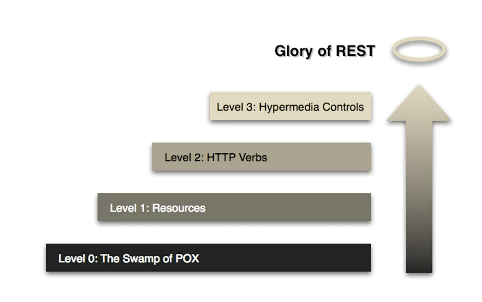

# Richardson Maturity Model

REST Api를 도입할때 확인해야할 REST방식의 주요 요소들을 3단계로 나눈 모델

## LEVEL 0
REST방식으로 API가 고려되었다기 보다는 기존의 웹서비스를 리소스 형태로 제공해서 단순히 URI만 맵핑한 형태

`http://server/getPost`, `http://server/deletePost` 같은 형태

## LEVEL 1
외부에 공개하고자 하는 리소스에 대해서 의미있고 적절한 URI 패턴으로 구성
하지만 아직은 HTTP Method 별로 서비스를 구분해서 사용하지는 않는 단계
`http://server/post`, `http://server/post/10`

## LEVEL 2
`LEVEL 1` + Http Method
동일한 URI에서 `GET`, `POST`, `DELETE`, `PUT`와 같은 형태로 오는 Method에 따라 서비스를 구분한다.

## LEVEL 3
`LEVEL 2` + HATEOAS
응답값에 Next Possible Action 즉 어떤 행위를 할 수 있는지에 대한 URI를 데이터에 포함시켜 응답한다.