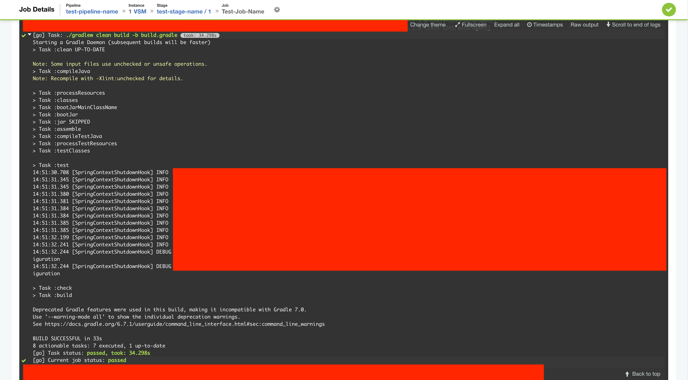

# GOCD

## 지원하는 기능

### Auth

file, LDAP 기반의 로그인 환경 구성이 가능하다.

### History
이벤트 발생한 내역들이 기록되어 볼 수 있음.

회원관련 기능이 아직 적용되어있지 않은 상황이라 `Triggered by annonymous`로 나온다.
클릭하면 저장소 위치, 마지막 커밋된 내역을 볼 수 있다

회원 관리 적용 이후 화면

## Pipeline 구성

### Pipeline Group

파이프라인 그룹 내부에는 여러개의 파이프라인들로 구성이된다.
실제적으로 하나의 프로젝트 배포 단위로 사용이 가능하다.

### Pipeline

- 하나의 파이프라인 안에 여러개의 Stage들이 존재하고 Stage1이 끝나면 Stage2로 체이닝된다.

### Stage

Stage는 여러개의 Job을 가지고 있다
Job들은 Stage내에서 병렬로 실행되지만 하나의 Job이 실패하면 그 Stage는 실패처리된다

### Job

Job은 여러개의 Task를 가지고 있다.
Job 하위의 Task들은 순차적으로 실행된다
이전 task가 실패할 경우 다음 task가 실행되지 않는다
Job 안에 있는 task들은 하나의 agent에서 실행되는 것이 보장된다
Job은 단순한 명령어 뿐만 아니라 플러그인도 사용 가능하다

주의 : Job은 병렬로 실행이된다.

### Task

외부에서는 확인할 수 없지만 Job 설정에 들어가서 확인이 가능

최하위 실행단위로 보통 shell script를 실행
Task에서는 Target Agent를 선택해서 지정이 가능하다.
서버에서는 직접적으로 Task를 수행하지 않기때문에 `Build`만 담당하는 Agent를 구분해서 사용해야 할 필요가 있다.

### build-test

