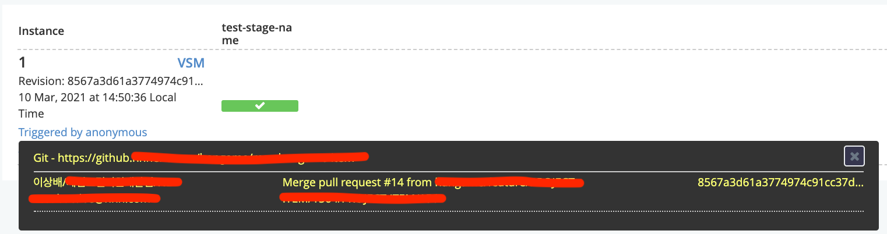

# GOCD

## 지원하는 기능

### Auth

file, LDAP 기반의 로그인 환경 구성이 가능하다.


### History
이벤트 발생한 내역들이 기록되어 볼 수 있음.

회원관련 기능이 아직 적용되어있지 않은 상황이라 `Triggered by annonymous`로 나온다.
클릭하면 저장소 위치, 마지막 커밋된 내역을 볼 수 있다


회원 관리 적용 이후 화면

## Pipeline 구성


### Pipeline Group

파이프라인 그룹 내부에는 여러개의 파이프라인들로 구성이된다.
실제적으로 하나의 프로젝트 배포 단위로 사용이 가능하다.

### Pipeline

- 하나의 파이프라인 안에 여러개의 Stage들이 존재하고 Stage1이 끝나면 Stage2로 체이닝된다.


### Stage

Stage는 여러개의 Job을 가지고 있다
Job들은 Stage내에서 병렬로 실행되지만 하나의 Job이 실패하면 그 Stage는 실패처리된다

### Job


Job은 여러개의 Task를 가지고 있다.
Job 하위의 Task들은 순차적으로 실행된다
이전 task가 실패할 경우 다음 task가 실행되지 않는다
Job 안에 있는 task들은 하나의 agent에서 실행되는 것이 보장된다
Job은 단순한 명령어 뿐만 아니라 플러그인도 사용 가능하다


주의 : Job은 병렬로 실행이된다.

### Task

외부에서는 확인할 수 없지만 Job 설정에 들어가서 확인이 가능

최하위 실행단위로 보통 shell script를 실행
Task에서는 Target Agent를 선택해서 지정이 가능하다.
서버에서는 직접적으로 Task를 수행하지 않기때문에 `Build`만 담당하는 Agent를 구분해서 사용해야 할 필요가 있다.

### build-test


## Install gocd
gocd가 동작하기 위해서는 하나의 Server에 여러 Agent가 붙어서 실행되는 방식이다

### gocd-server
docker에서 실행이 가능하게끔 centos용 image를 따로 제공한다
- https://hub.docker.com/r/gocd/gocd-agent-centos-7
  centos7 환경에서 centos-7전용 image가 아니더라도 linux 공통으로 제공하는 이미지로 실행이 가능하다.
``` yaml
# gocd-server
version: "3.7"
services:
  gocd_server:
    container_name: gocd-server
    restart: always
    ports:
      - 8153:8153
      - 8154:8154
    image: 'gocd/gocd-server:v21.1.0'
    volumes:
      - gocd_server:/godata
volumes:
  gocd_server:
```


#### File Base Auth
gocd에서 사용될 id와 password를 생성
``` bash 
$ sudo htpasswd -B -c ./password.properties goadmin
New password: ***********
Re-type new password: ***********
Adding password for user goadmin

$ cat password.properties
goadmin:$2y$05$L3OB5.8zlu4gj1TLHA7OL.j8HqrHKnQs2dz.wcfyuYHFINXvCxu3i
```

``` bash 
$ docker exec -it gocd-server /bin/bash
$ mkdir /godata/auth
$ vi password.properties
# goadmin:$2y$05$L3OB5.8zlu4gj1TLHA7OL.j8HqrHKnQs2dz.wcfyuYHFINXvCxu3i 입력
```

위와같이 수동으로 작성 또는 도커의 파일복사 기능을 이용해서 copy한다


위와같이 설정해주면 id/password 기반의 로그인 환경이 구성된다
> LDAP 기반의 설정과 같이 설정이 가능


### gocd-agent
https://hub.docker.com/r/gocd/gocd-agent-centos-7
> gocd-server의 버전과 gocd-agent의 image버전을 일치시켜주어야 한다
``` yaml 
version: "3.7"
services:
  gocd_agent:
    container_name: gocd-agent
    restart: always
    image: 'gocd/gocd-agent-centos-7:v21.1.0'
    environment:
      AGENT_AUTO_REGISTER_KEY: 8c65d1a5-159b-47a7-b176-b21d7be30c1b
      AGENT_AUTO_REGISTER_HOSTNAME: agent-wa803
      GO_SERVER_URL: http://10.162.5.33:8153/go
      JAVA_HOME: /gocd-jre
    volumes:
      - gocd_agent_godata:/godata
      - gocd_agent_home:/home/go
volumes:
  gocd_agent_godata:
  gocd_agent_home:
```

다음 항목을 채우면 서버에 자동으로 agent 등록이 된다
https://docs.gocd.org/21.1.0/advanced_usage/agent_auto_register.html

|key|required|description|
|:-|:-:|:-|
|AGENT_AUTO_REGISTER_KEY|Y|서버의 agentAutoRegisterKey 값|
|AGENT_AUTO_REGISTER_RESOURCES|N|agent 태그 목록 (쉼표 구분)|
|AGENT_AUTO_REGISTER_ENVIRONMENTS|N|자동 연결에 필요한 environments list (쉼표 구분)|
|AGENT_AUTO_REGISTER_HOSTNAME|N|server에 등록되는 agent 이름|

`AGENT_AUTO_REGISTER_KEY` 값으로는
`Admin` -> `Config XML` -> 선택영역에 나와있는 `agentAutoRegisterKey` 값을 이용한다.


정상적으로 agent가 올라간 모습.

#### Agent 내부에 Java 설치
Gocd Agent 자체가 jar를 구동 실행시키는 구조이기 때문에 Java가 이미 적용되어있다.
그래서 docker-compose 실행시에 환경변수에 `JAVA_HOME`만 적용시켜주면 gradle 빌드할때 Java 사용이 가능하다.
``` yaml 
version: "3.7"
services:
  gocd_agent:
    environment:
      JAVA_HOME: /gocd-jre
```

JAVA 적용 상태 확인 방법.
``` bash 
[irteam@hgaa-cloud-wa803 gocd-agent]$ docker exec -it gocd-agent /bin/bash
[go@65094646d892 /]$ $JAVA_HOME/bin/java --version
openjdk 15.0.1 2020-10-20
OpenJDK Runtime Environment AdoptOpenJDK (build 15.0.1+9)
OpenJDK 64-Bit Server VM AdoptOpenJDK (build 15.0.1+9, mixed mode, sharing)
```


## Pipeline Dependency 전략

해당 Pipe 진행 순서는 다음과 같다.
1. `Meterial`(저장소)에서 소스 checkout을 한다
2. `UpdateamPipeline의 Stage1` 실행
3. `UpdateamPipeline의 Stage2` 실행
4. `UpstreamPipeline Stage3`, `DownStreamPipeLine Stage1`  병렬로 실행
5. `DownStream PipeLine Stage2` 실행

위와같은 Pipeline을 구성하고 싶다면 아래와 같이 Upstream Pipeline을 선택하고 선택된 Pipeline의 Stage를 선택한다.


## Artifact 저장소

해당 task에 artifacts에 다음과 같이 입력을 하면 결과물을 전달받을 수 있다.
각 Task에서 artifacts의 경로를 작성하면 Agent에서 작업을 완료할때 Source에 적혀있는 작업물을 Server에 업로드 하여준다. (Destination에 적혀있는 위치로)


실제로 위와 같은 환경에서 빌드할 경우에 gocd-server에서는 아래와 같은 위치에 파일이 놓이게된다.

Pipeline 내부에 `Build_and_Test` Stage의 `12`번째 Instance(시도 횟수) 내에 `Gradle_Build` Job의 `1`번째 Instance의  `build_gradle` Task


저장된 Artifact 가져오는 방법은 Task에서 정의가 가능하다.
Task 생성시 `Fetch Artifact` 항목을 이용하여준다.


아티팩트가 설정되어있는 항목들이 자동으로 Select Box에 들어가게되어 쉽게 설정이 가능하다.

### 외부 저장소로 관리
Store를 별도로 관리해야 하지만 현재로써는 Docker, AWS S3 plugin만을 지원중.


## VSM

일련의 작업 과정들을 보여주는 그래프

VSM을 보여줄때 선택한 개채를 중심으로 보여주기 어떤것을 기준으로 보느냐에 따라 결과가 다를 수 있다.

- next_step의 1번 인스턴스 기준으로 봤을때
    - 
- Build_and_Test의 6번 인스턴스 기준으로 봤을 때
    - 

### Fan-in, Fan-out
Dependency의 관점으로 볼 수 있는 개념으로 아래와 같이 설명이 가능


- `Build Pipeline`은 `User Acceptance Pipeline`, `Capacity Testing Pipeline`으로 Fan-out 한다.
- `Production Pipeline`은 `Build Pipeline`, `User Acceptance Pipeline`, `Capacity Testing Pipeline` 으로부터 Fan-in 한다.


## Install GoCD Test Drive
Test 용으로 Local에서 확인하고 싶으면 다음과 같이 간편하게 설치/실행이 가능하게끔 Sample을 제공해주고있다
``` bash
# MAC-OS
$ curl -fsSL 'https://www.gocd.org/test-drive-gocd/try.sh' | bash -s 'https://download.gocd.org/test-drive/installers/21.1.0/12439/gocd-21.1.0-12439-1245-osx.zip'
```


