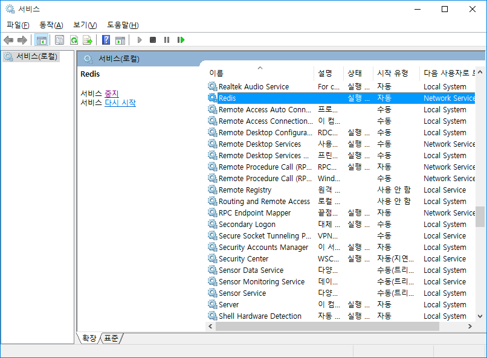

#Redis

```
# windows (관리자 모드로 실행)
# Redis 서버 중지
NET STOP Redis

# Redis 서버 시작
NET START Redis
```
중지 해준 뒤에 `redis-server.exe` 실행

설정파일과 같이 실행시켜줄때는
```
redis-server redis.windows.conf
```

클라이언트 사용
```
redis-cli –h host –p port –p password
```


Redis 서버 서비스로 등록
``` bash
# 서비스 등록
redis-server --service-install redis.windows.conf --loglevel notice

# 시작
redis-server --service-start
# 중지
redis-server --service-stop

# 서비스 등록 해제
redis-server --service-uninstall

# 서비스 이름 변경
redis-server --service-install -service-name MyRedisServer

# 포트 변경
redis-server --service-install -service-name MyRedisServer -port 10001

# 이름을 지정한 서비스를 시작
redis-server –service-start -service-name MyRedisServer
```




## Embeded Redis

``` xml
<!-- Maven -->
<dependency>
	<groupId>it.ozimov</groupId>
	<artifactId>embedded-redis</artifactId>
	<version>0.7.2</version>
</dependency>
```
``` gradle
// gradle
compile group: 'it.ozimov', name: 'embedded-redis', version: '0.7.2'
```


## Jedis

Jedis는 Java의 표준 Redis Client

> Spring Boot 2.0 이후 Lettuce가 기본 클라이언트

```
dependencies {
    compile group: 'it.ozimov', name: 'embedded-redis', version: '0.7.2'

    // jedis
    compile group: 'redis.clients', name: 'jedis'
    compile group: 'org.apache.commons', name: 'commons-pool2', version: '2.6.2'
    compile ('org.springframework.boot:spring-boot-starter-data-redis') {
        exclude group: 'io.lettuce', module: 'lettuce-core'
    }
    implementation 'org.springframework.boot:spring-boot-starter-web'
    testImplementation 'org.springframework.boot:spring-boot-starter-test'
}
```

``` java
// Jedis - Not Use Connection Poll
// TPS 가 낮게 나오지만 CPU 부하율이 낮음
RequiredArgsConstructor
Configuration
@EnableRedisRepositories
public class RedisRepositoryConfig {

    private final RedisProperties redisProperties;

    @Bean
    public RedisConnectionFactory redisConnectionFactory() {
        RedisStandaloneConfiguration config = 
	        new RedisStandaloneConfiguration(
		        redisProperties.getHost(), 
		        redisProperties.getPort()
	        );
        return new JedisConnectionFactory(config);
    }

    @Bean
    public RedisTemplate<?, ?> redisTemplate() {
        RedisTemplate<byte[], byte[]> redisTemplate = new RedisTemplate<>();
        redisTemplate.setConnectionFactory(redisConnectionFactory());
        return redisTemplate;
    }
}
```

```
// Jedis - Use Connection Poll
// TPS 가 높게 나오지만 CPU 부하율이 올라감
@RequiredArgsConstructor
@Configuration
@EnableRedisRepositories
public class RedisRepositoryConfig {

    private final RedisProperties redisProperties;

    @Bean
    public RedisConnectionFactory redisConnectionFactory() {
        RedisStandaloneConfiguration config = 
	        new RedisStandaloneConfiguration(
		        redisProperties.getHost(), 
		        redisProperties.getPort()
	        );
        JedisConnectionFactory jedisConnectionFactory = new JedisConnectionFactory(config);
        jedisConnectionFactory.setPoolConfig(jedisPoolConfig());
        return jedisConnectionFactory;
    }

    private JedisPoolConfig jedisPoolConfig() {
        final JedisPoolConfig poolConfig = new JedisPoolConfig();
        poolConfig.setMaxTotal(128);
        poolConfig.setMaxIdle(128);
        poolConfig.setMinIdle(36);
        poolConfig.setTestOnBorrow(true);
        poolConfig.setTestOnReturn(true);
        poolConfig.setTestWhileIdle(true);
        poolConfig.setMinEvictableIdleTimeMillis(Duration.ofSeconds(60).toMillis());
        poolConfig.setTimeBetweenEvictionRunsMillis(Duration.ofSeconds(30).toMillis());
        poolConfig.setNumTestsPerEvictionRun(3);
        poolConfig.setBlockWhenExhausted(true);
        return poolConfig;
    }
    
    @Bean
    public RedisTemplate<?, ?> redisTemplate() {
        RedisTemplate<byte[], byte[]> redisTemplate = new RedisTemplate<>();
        redisTemplate.setConnectionFactory(redisConnectionFactory());
        return redisTemplate;
    }
}
```

`RedisTemplate`는 Redis Command 를 도와주는 Template 형태이고 `spring-data-redis`는 `RedisTemplate`의 추상화를 제공

## Lettuce
Lettuce는 Netty (비동기 이벤트 기반 고성능 네트워크 프레임워크) 기반의 Redis 클라이언트
비동기로 요청을 처리하기 때문에 고성능을 자랑

Jedis보다 훨씬 빠르고 CPU 부하도 덜하고 더 적은 Connection으로 더 빠른 응답속도를 낸다.


``` gradle
dependencies {
    compile group: 'it.ozimov', name: 'embedded-redis', version: '0.7.2'
    // lettuce
    compile ('org.springframework.boot:spring-boot-starter-data-redis')

    implementation 'org.springframework.boot:spring-boot-starter-actuator'
    implementation 'org.springframework.boot:spring-boot-starter-web'
    testImplementation 'org.springframework.boot:spring-boot-starter-test'
}
```

``` java
@RequiredArgsConstructor
@Configuration
@EnableRedisRepositories
public class RedisRepositoryConfig {
    private final RedisProperties redisProperties;

    @Bean
    public RedisConnectionFactory redisConnectionFactory() {
        return new LettuceConnectionFactory(redisProperties.getHost(), redisProperties.getPort());
    }

    @Bean
    public RedisTemplate<?, ?> redisTemplate() {
        RedisTemplate<byte[], byte[]> redisTemplate = new RedisTemplate<>();
        redisTemplate.setConnectionFactory(redisConnectionFactory());
        return redisTemplate;
    }
}
```