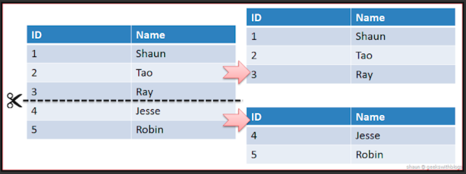
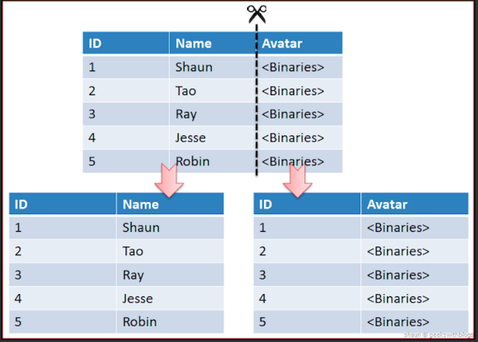

#Database Sharding

<!--[TOC]: # "## Table of Contents"-->

## Table of Contents
- [Sharding Type](#sharding-type)
  - [Modular sharding](#modular-sharding)
  - [Range sharding](#range-sharding)
- [Sharding의 Partitioning 종류](#sharding의-partitioning-종류)
  - [Horizontal Partitioning](#horizontal-partitioning)
  - [Vertibcal Partitioning](#vertibcal-partitioning)
  - [Range Based Partitioning](#range-based-partitioning)
  - [Key / Hash Based Partitioning](#key--hash-based-partitioning)
  - [Directory Based Partitioning](#directory-based-partitioning)
- [Sharding시에 고려해야 할 포인트](#sharding시에-고려해야-할-포인트)
  - [데이터 재분배 (Rebalancing)](#데이터-재분배-rebalancing)
  - [데이터 조인](#데이터-조인)
  - [Partitioning기법](#partitioning기법)
  - [Global Unique Key](#global-unique-key)
  - [Compact Table](#compact-table)

하나의 데이터베이스에서 데이터 용량 또는 커넥션등의 부하가 많아지면 트래픽 분산 목적으로 샤딩을 고려해야 한다.
샤딩을 사용함으로써 얻어지는 장점은 트래픽 분산 이외에 특정 DB의 장애가 전체의 장애로 이어지지 않는 장점도 가지고 갑니다.  (HA 구성으로 Failover 되도록 설계)

샤딩은 DBMS 레벨에서 분할하는것이 아닌

> **HA(high availability)란?**
> 정보기술에서, HA란 바람직한 정도로 긴 시간동안 지속적으로 운영이 가능한 시스템이나 컴포넌트를 가리킨다. 널리 쓰이고 있지만 달성하기 결코 쉽지 않은 시스템 및 제품에 대한 가용성 표준에 흔히 "파이브 나인" (five 9) 이라고 부르는 99.999%의 가용성을 들 수 있다.
> H/W, S/W의 장애를 방지하기 위한 대책이 HA이며
> HA를 위한 방법으로 클러스터링, 이중화, RAID 등의 기술이 있음

> **Failover**
> 서버, 시스템, 네트워크 등에서 이상이 생겼을 때 예비 시스템으로 자동전환되는 기능이며
> **failback**은 failover에 따라 전환된 서버/시스템/네트워크를 장애가 발생하기 전의 상태로 되돌리는 처리를 의미

## Sharding Type
### Modular sharding
 PK를 모듈러로 연산한 값(PK % DB Count)으로 DB를 찾아가는 방식
레인지 샤딩에 비해 데이터가 균일하게 분산되지만 추가 증설하는 과정에서 이미 생성된 데이터들에 대해서 재정렬이 필요하다.

데이터량이 일정 수준에서 유지될 것으로 예상되는 데이터 성격을 가진 곳에 적용할때 어울리는 방식
데이터가 균일하게 분산되어 트래픽을 안정적으로 소화하면서 리소스를 최대한 활용할 수 있는 장점이 있다.

### Range sharding
PK의 범위를 기준으로 DB를 찾아가는 방식.
모듈러 샤딩에 비해 기본적으로 증설비용이 들지 않는 장점이 있지만 일부 DB에만 트래픽이 몰릴 수 있다.
증설작업에 큰 비용이 들지 않아 데이터가 급격하게 증가할 여지가 있을 경우 사용하기 적합
한쪽에만 트래픽이 몰리는 경우 샤딩을 하는 의미가 없어지고 몰리는쪽의 부하가 심해지면 또 다시 분산처리를 위한 DB 재 정렬 작업이 필요함

## Sharding의 Partitioning 종류

### Horizontal Partitioning

Schema가 같은 데이터를 두개 이상의 DB에 나눠 처리하는 방법
가장 간단한 방법의 분할 방법이고 range based 방법을 사용한다면 단순한 구조로 시스템을 구축 가능하다

Row의 갯수가 1/N이 되며 그만큼 Index의 수도 줄어들어 자연스럽게 성능이 향상된다.

단점으로는 여러 DB에 대해서 파티셔닝 적용시 데이터베이스 JOIN 문제나 Consistency, Replication 등 복잡한 문제가 생김.
서버간의 연결과정이 많아지며 데이터를 찾는 과정이 복잡하기 때문에 latency가 증가하게 된다.
그리고 하나의 서버가 장애로 이어질 시 데이터의 무결성이 꺠질 수 있다는 단점이 있어 적용시 가능한 DB에 대해서 단순한 설계가 필요하다.

### Vertibcal Partitioning

테이블의 컬럼을 기준으로 나누게 되는데 이는 테이블 별로 서버를 분할하는 방식으로 볼 수 있다.
자주 사용하는 컬럼등을 분리시켜 성능을 향상시킬 수 있다.
단 서버의 데이터가 점점 거대해지면 추가 샤딩이 필요하므로 초기에 구조를 잘 잡아야 한다.

### Range Based Partitioning
테이블이 점점 커지는 경우 서버를 분리하게 되는 방식으로 범위에 따라 데이터를 나누기 떄문에 단순하지만 데이터를 분할하는 기준이 예측 가능하고 명확해야 한다.

### Key / Hash Based Partitioning
엔티티를 해쉬 함수에 넣어서 나오는 값을 키로 데이터를 샤딩하는 기법

Modular 함수가 주로 사용되며 데이터가 균등하게 분포될 수 있도록 해쉬 함수를 정해야 한다.
Scaleout시에 함수를 변경하는 작업이 매우 비싸다.

### Directory Based Partitioning
DB와 별개로 추상화된 룩업테이블을 만들어 샤드 키에 해당하는 데이터를 Cache해서 찾는 식으로 구현

## Sharding시에 고려해야 할 포인트
### 데이터 재분배 (Rebalancing)
무중단으로 Scale out이 가능한지를 고려해야 한다.

### 데이터 조인
Sharding DB간 조인이 불가능하므로 역정규화를 감안하여 설계해야 한다.
데이터 중복은 대용량 처리에 대한 트레이드오프이다.

### Partitioning기법
어떤식으로 Data를 나눌건지 고민해야 한다.
각 방법과 상황에 맞추어 Scalable한 아키텍처를 위한 중요한 요소이다.

### Global Unique Key
DB간 사용하는 키가 중복되지 않는지 고려해야 한다.

### Compact Table
테이블의 단위를 가능한 작게 유지해야 한다.

> 출처
> https://jins-dev.tistory.com/entry/%EB%8C%80%EC%9A%A9%EB%9F%89-Data-%EC%B2%98%EB%A6%AC%EB%A5%BC-%EC%9C%84%ED%95%9C-%EC%9B%B9-%EC%84%9C%EB%B9%84%EC%8A%A4%EC%9D%98-%EC%83%A4%EB%94%A9Sharding-%EA%B8%B0%EB%B2%95
> https://woowabros.github.io/experience/2020/07/06/db-sharding.html