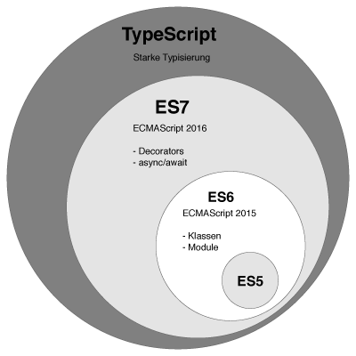

# TypeScript

## TypeScript란?
Javascript + Type = TypeScript

타입스크립트는 자바스크립트의 대체 언어의 하나로서 자바스크립트의 Superset(상위확장)이고,
Microsoft에서 발표한 오픈소스로, 정적 타이핑을 지원하며 ES6의 클래스, 모듈 등과 ES7의 Decorator 등을 지원

느슨한 타입의 언어인 자바스크립트를 사용해 만든 프로젝트에서는 규모가 커질수록 코드가 복잡해지고, 디버그와 테스트 공수가 증가하는 문제가 있어 이런 자바스크립트의 단점을 극복하고자 AltJs(자바스크립트 대체 언어)인 타입스크립트 가 등장했다고 한다.

- 프로그래밍 언어
- Compiled Language
	- 전통적인 Compiled Language와 다름 (Compile, Linking, Binary 과정이 없음)
	- Transpile에 더 가까움
	- 메타프로그래밍 (다른언어로 변환되어 프로세스가 진행되는것)
- Interpreted Language

> **What is difference between compiler and transpiler?**
>
> compile : 한 언어로 작성된 소스 코드를 다른 언어로 변환하는 것을 의미
- `Java` -> `bytecode`
- `c` -> `assembly`

> transpile : 크랜스파일의 경우 한 언어로 작성된 소스 코드를 비슷한 수준의 추상화를 가진 다른 언어로 변환 하는것을 말함
- `es6` -> `es5`
- `c++` -> `c`
- `coffescript` -> `javascript`

> transpile은 source to source compiler 라고도 설명하기도 하며 compiler의 일종으로 transpiler를 설명하고 있어 compile이라는 용어가 더 큰 범주에 속하게 되고, 그 안에 transpile이라는 개념이 있음

### 타입스크립트의 장점
- 정적 타입 - 코딩 단계에서 컴파일 오류 발견 가능
- 도구의 지원 - IDE와 같은 도구에 타입 정보를 제공함으로써 높은 수준의 코드 어시스트, 타입 체크, 리팩토링 등을 지원받을 수 있으며 이러한 도구의 지원은 대규모 프로젝트를 위한 필수 요소이다.
- 강력한 객체지향 프로그래밍 지원 - Java, C# 등의 클래스 기반 객체지향 언어에 익숙한 개발자가 자바스크립트 프로젝트를 수행하는데 진입 장벽을 낮추는 효과가 있다.
- ES6 / ES NEXT 지원 - 현재 ES6를 완전히 지원하지 않고 있는 브라우저를 고려하여 Babel 등의 트랜스파일러를 사용해야 하는 현 상황에서 TypeScript가 새로운 스펙의 유용한 기능을 안전하게 도입하는데 유리하다.

