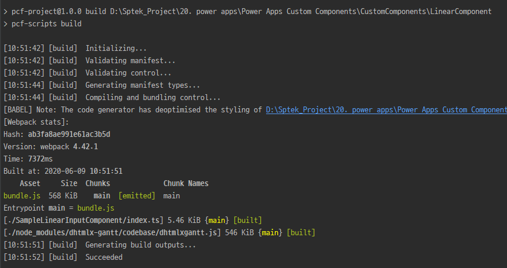

# Power Apps - Canvas App Development

Teams에 탭으로 어플리케이션을 추가하는 방법에는 여러가지 방법이 있지만
Power Apps를 이용하여 Canvas 방식의 어플리케이션을 생성하여 Teams Tab에 모듈 형식으로 등록이 가능하다.

<!--[TOC]: # "## Table of Contents"-->

## Table of Contents
- [01. 샘플 캔버스 애플리케이션 제작](#01-샘플-캔버스-애플리케이션-제작)
- [02. 수식](#02-수식)
- [03. Connector](#03-connector)
- [04. PCF (PowerApps Component Framework)](#04-pcf-powerapps-component-framework)
  - [04-1. Create Sample Demo App](#04-1-create-sample-demo-app)
  - [04-2. Edit Manifest](#04-2-edit-manifest)
  - [04-3. Coding](#04-3-coding)
  - [04-4. Build Custom Component](#04-4-build-custom-component)
  - [04-5. Test And Debuging](#04-5-test-and-debuging)
  - [04-6. Custom Component Packaging](#04-6-custom-component-packaging)
  - [04-7. Power Apps 구성 요소 프레임 워크 기능 사용](#04-7-power-apps-구성-요소-프레임-워크-기능-사용)
- [05. Solution](#05-solution)
- [06. 배포](#06-배포)
- [배포 및 Teams에서 사용](#배포-및-teams에서-사용)


## 01. 샘플 캔버스 애플리케이션 제작
엑셀 데이터를 이용한 [바닥재 견적 확인 애플리케이션](https://docs.microsoft.com/ko-kr/powerapps/maker/canvas-apps/get-started-create-from-data) 제작 방법.


PowerApps 메인 페이지 좌측 탭에서 `만들기` 탭 클릭 후  `Excel 온라인` 클릭


해당 [샘플 파일](https://az787822.vo.msecnd.net/documentation/get-started-from-data/FlooringEstimates.xlsx)을 미리 다운받아 놓습니다.
> PowerApps가 이해할 수 있는 엑셀 형식을 만들기 위해선 `표` 형식으로 지정이 되어야함
> 구조체 인식 기준이 엑셀 내부의 `표` 정보를 이용하여 데이터 컬렉션을 생성
> [테이블 형식지정 방법](https://docs.microsoft.com/ko-kr/powerapps/maker/canvas-apps/how-to-excel-tips)


샘플 파일은 앱 생성전에 미리 OneDrive에 접속하여 등록


앱 생성 화면으로 돌아가서 방금 올려놓았던 `FlooringEstimates.xlsx` 파일을 선택한 후 연결을 클릭하면 `준비중` 이라는 팝업이 생성되고 잠시 후 완료 캔버스 애플리케이션 편집 화면으로 이동


코딩 없이 검색 기능이 가능한 `바닥제 어플리케이션`이 자동으로 생성
데이터 입력, 삭제, 수정, 검색, 파일 업로드, 목록 정렬, 새로 고침 기능이 가능


PowerApps가 엑셀에서 가져온 데이터를 대략 유추하여 알맞는 곳에 필드를 넣어줌


데이터 편집 기능을 이용하여 특정 텍스트 레이블에 원하는 데이터 표시가 가능


다른 추가 작업 없이 데이터 입력 화면에서 파일 및 데이터를 엑셀파일에 추가하여 데이터가 등록


이전에 OneDrive에 업로드하였던 엑셀파일을 확인하면 방금 전 입력한 데이터 추가 확인


## 02. 수식
엑셀에서 함수를 사용하듯 Power apps 내부에서 스크립트를 사용하여 각종 기능을 제어 할 수 있다. [링크](https://docs.microsoft.com/ko-kr/powerapps/maker/canvas-apps/formula-reference)

## 03. Connector
커넥터 기능을 이용하여 다른 MS 프로젝트 및 모듈들과의 연결을 쉽게 설정 할 수 있다. [링크](https://docs.microsoft.com/en-us/connectors/)

> 커넥터 사용하는 방법은 쉽지만 각 커넥터들이 제공하는 Data와 기능들이 너무 한정적이라 기획 이전에 검토가 필수로 필요하다

자주 사용하는 커넥터들은 다음과 같다.
- SharePoint – 파일 공유 ([지원 이슈](https://docs.microsoft.com/ko-kr/powerapps/maker/canvas-apps/connections/connection-sharepoint-online#known-issues)))
- Microsoft Teams – 팀, 채널 데이터, 알림표시
- Office 365 Group – 팀 및 구성원 정보
- Office 365 Users – 팀원 고유 아이디 및 개인정보
- Office 365 Outlook – 메일 전송
- Planner - 프로젝트 일정 확인

## 04. PCF (PowerApps Component Framework)
[PCF](https://docs.microsoft.com/ko-kr/powerapps/developer/component-framework/implementing-controls-using-typescript)는 캔버스 앱에서 커스텀하게 TypeScript를 사용하여 컴포넌트를 생성하여 앱 내에 컴퍼넌트로 삽입이 가능하다.
`NodeJS` 환경 위에서 개발이 이루어지며 사용언어는 `TypeScript`를 사용한다.
`pac`라는 `power apps cli`툴을 이용하여 프로젝트를 생성하고 빌드하여 power apps에 추가하는 방식으로 사용이 가능하다.

> PCF를 사용하기 전에 해당 프로그램을 먼저 설치 하여야 한다. (`*`는 필수 설치요소)
> - `*`[.NET Framework 4.6.2](https://dotnet.microsoft.com/download/dotnet-framework/net462)
> - `*`[Power Apps CLI](https://aka.ms/PowerAppsCLI) (Power Apps CLI는 Windows 10만 지원한다.)
> - `*`[NodeJS](https://nodejs.org/en/download/) (가능한 LTS 최신버전)
> - `*`[VS 2017 msbuild](https://www.sysnet.pe.kr/2/0/11275) (.NET core, Visual C++ build tool 환경 구성)
> - [VS Code](https://code.visualstudio.com/) (TS 개발용. Intelli J, WebStorm 대체 가능)

### 04-1. Create Sample Demo App
```
mkdir LinearComponent
cd LinearComponent
# init component
pac pcf init --namespace <specify your namespace here> --name <Name of the code component> --template <component type>
# example
pac pcf init --namespace SampleNamespace --name SampleLinearInputComponent --template field
npm install
```
`pac pcf init` 명령어로 기본 프로젝트를 생성하여준다


`npm install`을 이용하여 디펜던시들을 설치하여준다.


|properties|description|설명|
|-|-|-|
|`--namespace`|specify namespace|menifast의 control namespace명, _container Root DOM class명|
|`--name`|Name of the code component|코드내부의 컴포넌트 생성자 이름|
|`--template`|component type||

### 04-2. Edit Manifest
``` xml
<manifest>
  <!-- 각 컴퍼넌트에 대한 정보를 나타내며 업데이트시마다 버전을 올려주어야한다. -->
  <control namespace="SampleNamespace" constructor="SampleLinearInputComponent" version="0.0.3" display-name-key="SampleLinearInputComponent" description-key="SampleLinearInputComponent description" control-type="standard">
    <!-- power Apps에서 개발시 컴퍼넌트에 들어오는 파라메터 타입과 명칭을 정의하는 곳 -->
    <property name="jsonString" display-name-key="jsonString_Display_Key" description-key="jsonString_Desc_Key" of-type="SingleLine.Text" usage="bound" required="true" />
	<!-- 
        사용하는 리소스 파일들을 여기에 선언한다. CSS는 여러개. 
        code는 하나만 선언 가능하다. 
	    resx는 언어별 리소스 파일을 연결해주며 1033은 한글 코드로 각 언어별로 여러 등록 가능하다.
	-->
    <resources>
      <code path="index.ts" order="1"/>
      <css path="css/SampleLinearInputComponent.css" order="1" />
      <css path="css/dhtmlxgantt.css" order="1" />
      <resx path="strings/SampleLinearInputComponent.1033.resx" version="1.0.0" /> 
    </resources>
    <!-- 해당 컴퍼넌트에서 사용 할 권한들을 명시해준다. -->
    <feature-usage>
      <uses-feature name="Device.captureAudio" required="true" />
      <uses-feature name="Device.captureImage" required="true" />
      <uses-feature name="Device.captureVideo" required="true" />
      <uses-feature name="WebAPI" required="true" />
    </feature-usage>
  </control>
</manifest>
```

### 04-3. Coding
`index.ts`가 처음 시작하느 index 파일이다.
처음 시작하는 파일은 StandardControl interface를 구현하여야한다.
각 함수별 기능은 다음과 같다.
``` typescript
interface StandardControl<TInputs, TOutputs> {
	// 초기화 해주는 함수 
	init(context: Context<TInputs>, notifyOutputChanged?: () => void, state?: Dictionary, container?: HTMLDivElement): void;
	
	// 컴퍼넌트가 이동하거나 새로 그릴때마다 호출되는 함수
	updateView(context: Context<TInputs>): void;
	
	// 컴퍼넌트가 DOM Tree에서 삭제될 때 호출되는 함수
	destroy(): void;

	// 새로운 데이터를 받고 처리한 후 호출되는 부분으로 특정 값을 내보낼 수 있다.
	getOutputs?(): TOutputs;
}
```

### 04-4. Build Custom Component
```
npm install
npm run build
```


컴퍼넌트 개발에 필요한 디펜던시를 설치(`npm install`) 해준뒤 `npm run build`를 하여 out 폴더에  Asset 들을 생성하여준다. (js Converting & Resource Copy)

### 04-5. Test And Debuging
```
npm start
```

`npm install`로 디펜던시를 설치해주고
`npm start`를 이용하여 프로젝트를 start 시키면 자동으로 브라우저에 테스트 할 수 있는 페이지가 열리게된다.
PowerApps component framework 테스트 환경이 `angular`기반으로 생성되어 직접 실행이 가능하다.

> start 에는 `default`, `skipBuild`, `watch` 옵션이 있다.
> `default`, `watch`는 validate -> manifestTypes -> compile -> output -> start 순으로 진행하고 watch에서는 이후 소스 변경을 감지하여 실시간으로 컴파일을 진행하여준다.
> `skipBuild`는 빌드를 추가적으로 하지 않고 start 만 진행하게된다.

@[debug code components](https://docs.microsoft.com/en-us/powerapps/developer/component-framework/debugging-custom-controls)

### 04-6. Custom Component Packaging
```
mkdir solution
cd solution
# 최초 퍼블리싱
pac solution init --publisher-name developer --publisher-prefix dev 
# 추가적인 퍼블리싱
pac solution add-reference --path c:\users\LinearComponent

msbuild /t:restore
msbuild

# release build
msbuild/property:configuration:Release
```

`msbuild /t:restore`를 이용하여 빌드하기 이전 설정 파일을 생성하거나 변경사항에 대한 설정파일을 다시 조정하여준다.

`msbuild /t:restore` 완료 후 `msbuild` 명령어를 다시 실행하여 바이너리 파일을 생성하여줍니다.


### 04-7. Power Apps 구성 요소 프레임 워크 기능 사용
[빌드한 바이너리를 PowerApps에 업로드하여 사용하는 방법](https://docs.microsoft.com/en-us/powerapps/developer/component-framework/component-framework-for-canvas-apps#add-components-to-a-canvas-app)


## 05. Solution
하나의 프레임워크 처럼 지정하여 여기에 리소스 및 커스텀 컴퍼넌트 및 다른 앱모듈을 등록하여 같은 솔루션 내에 있는 모듈들을 끌어다가 사용 할 수 있게 되어있다.
앱 및 리소스들을 모아놓은 상위개념 이라고 볼 수 있다.

- 관리형 솔루션
  수정할 수 없으며 가져온 후 제거, 솔루션을 제거하면 솔루션의 모든 구성 요소가 삭제
- 비관리형 솔루션
  해당 솔루션의 모든 구성 요소를 사용자 환경에 추가. 솔루션을 제거하여 구성 요소를 삭제할 수 없음
https://docs.microsoft.com/ko-kr/powerapps/maker/common-data-service/use-solution-explorer


[PCF로 생성된 솔루션을 PowerApps에 추가하는 방법](https://docs.microsoft.com/ko-kr/powerapps/maker/common-data-service/import-update-export-solutions)


## 06. 배포
## 배포 및 Teams에서 사용

어플리케이션 개발이 완료되면 `Ctrl` + `S` 키를 이용하여 작업 내용을 저장한 뒤 왼쪽 상단 파일 탭을 클릭한다.


해당 화면에서 왼쪽 저장 탭으로 이동한뒤  게시를 클릭하여주면 임시적인 저장이 완료된다.


Teams 앱으로 돌아와서 상단 탭 추가버튼`+`을 클릭한다.


탭 추가 버튼을 누른뒤에 나오는 팝업에서 PowerApps를 클릭한다.


PowerApps에서 제작한 앱들이 나오는데 여기서 방금 저장했던 Test Planner를 클릭하고 저장을 누르면 Teams 탭에 추가 되는것을 확인 할 수 있다.
