# Managing code review assignment for your team
1. GitHub의 오른쪽 상단에서 프로필 사진을 클릭한 다음 조직을 클릭합니다.
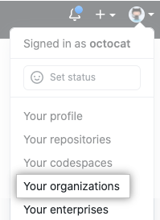
2. 조직 이름을 클릭합니다.
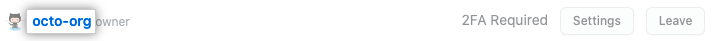
3. 조직 이름 아래에서 팀을 클릭합니다.
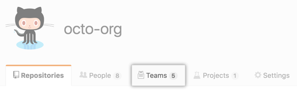
4. 팀 탭에서 팀 이름을 클릭합니다.
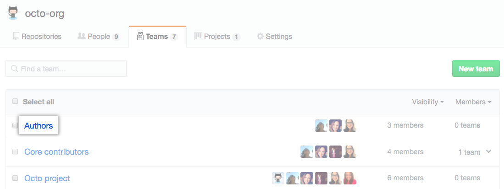
5. 팀 페이지 상단에서 설정을 클릭합니다.
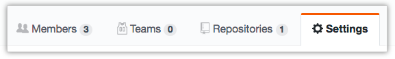
6. 왼쪽 사이드바에서 코드 검토 과제를 클릭합니다.
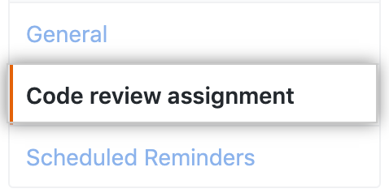
7. 자동 할당 활성화를 선택합니다.
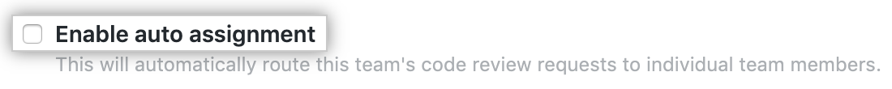
8. `"How many team members should be assigned to review?"`에서 드롭다운 메뉴를 사용하고 각 풀 요청에 할당할 검토자 수를 선택합니다.
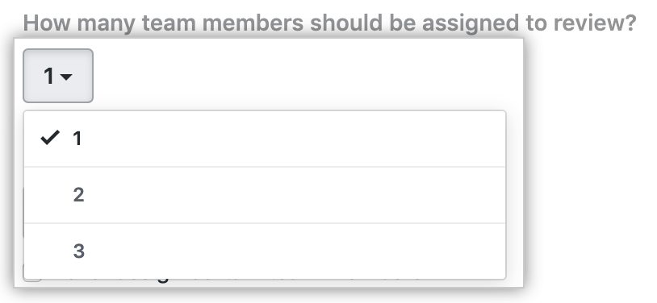
9. `Routing algorithm`에서 드롭다운 메뉴를 사용하여 사용할 알고리즘을 선택합니다. 자세한 내용은 "라우팅 알고리즘"을 참조하십시오.
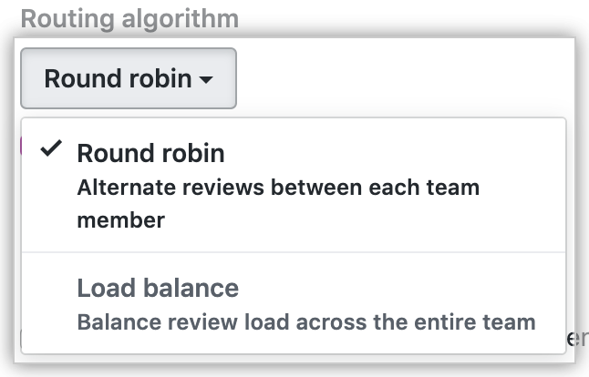
- `Round robin` 알고리즘은 가장 최근에 검토 요청을 받은 사람을 기준으로 검토자를 선택하며 현재 보유하고 있는 미해결 검토 수에 관계없이 팀의 모든 구성원 간에 교대로 초점을 맞춥니다.
- `Load balance` 알고리즘은 각 구성원의 최근 검토 요청 총 수를 기반으로 검토자를 선택하고 각 구성원에 대한 미해결 검토 수를 고려합니다. 로드 밸런싱 알고리즘은 각 팀 구성원이 30일 동안 동일한 수의 pull 요청을 검토하도록 합니다.
10. 선택적으로 팀의 특정 구성원을 항상 건너뛰려면 특정 팀 구성원을 할당하지 않음을 선택합니다. 그런 다음 항상 건너뛰고 싶은 팀원을 한 명 이상 선택합니다.
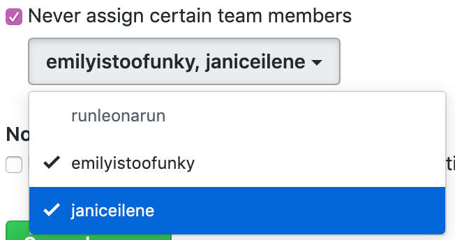
11. 선택적으로 각 풀 검토 요청에 대해 코드 검토 할당으로 선택한 팀 구성원에게만 알리려면 "알림"에서 팀 구성원을 할당하는 경우 전체 팀에 알리지 않음을 선택합니다.
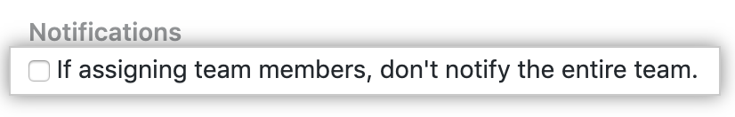
12. `Save changes`를 클릭하여 변경사항에 대해 저장합니다.
