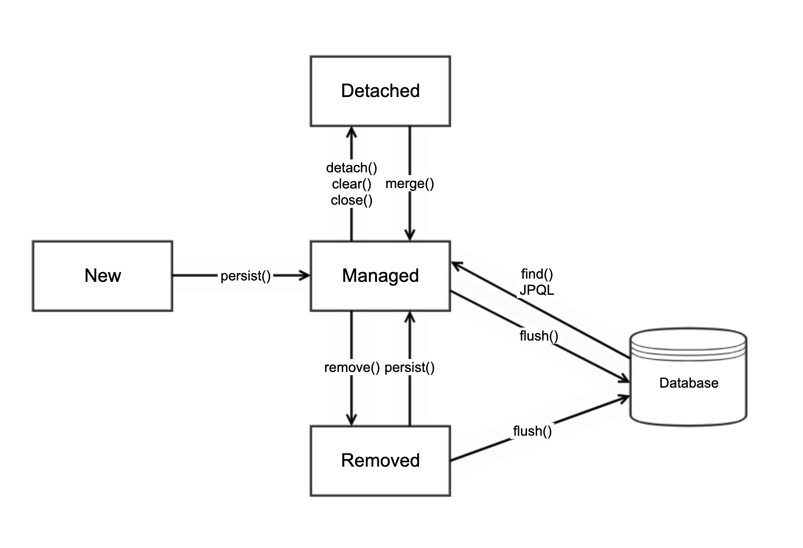

## Table Of Content- [JPA에 대해서](#jpa에-대해서)
  - [Entity Manager](#entity-manager)
  - [Persistance Context (영속성 컨텍스트)](#persistance-context-영속성-컨텍스트)
  - [영속상태](#영속상태)
  - [준영속 상태](#준영속-상태)

## JPA에 대해서

### Entity Manager
`Entity Manager Factory`에서 요청이 올때마다 Entity Manger 를 제공 한다.

### Persistance Context (영속성 컨텍스트)


|상태|State|설명|
|:-|:-|-|
|비영속|new, transient|영속성 컨텍스트와 전혀 관계가 없는 `새로운` 상태|
|영속|managed|영속성 컨텍스트에 `관리`되는 상태|
|준영속|detached|영속성 컨텍스트에 저장되었다가 `분리`된 상태|
|삭제|removed|`삭제`된 상태|

영속성 컨텍스트의 이점
- 1차 캐시
- 동일성(Identity) 보장
- 트랜잭션을 지원하는 쓰기 지연 (transactional write-behind)
- 변경 감지 (Dirty Checking)
- 지연 로딩 (Lazy Loading)

### 영속상태
#### 1차 캐시
트랜잭션 내부에서 저장을 하게되면 JPA는 영속성 컨택스트 내부에 있는 1차 캐시에 미리 저장해둔다. 이때는 DB에 저장이 되어있는 상태가 아니며 트랜잭션이 끝날때까지 1차캐시에 저장해둔다.
트랜잭션이 끝나기전 조회를 할경우에는 1차캐시에서 먼저 탐색 후 관리되고있는 엔티티의 경우 1차캐시에서 바로 반환하여 이전에 저장했던 객체와의 `동일성을 보장`해준다.
> 1차 캐시로 반복 가능한 읽기 (REPEATABLE READ) 등급의 트랜잭션 격리 수준을 데이터베이스가 아닌 어플리케이션 차원에서 제공

만약 조회하려는 항목이 1차 캐시에 없다면 그 즉시 DB에서 조회하여 1차 캐시에 등록 후 캐싱된 객체를 반환하여준다.

 영속성 컨텍스트와 1차캐시는 트랜잭션이 일어나는 순간에만 존재하며 트랜잭션 단위로 생성이 되기때문에 전역으로 사용되지는 못한다.

#### Flush 발생
플러시
- 영속성 컨텍스트를 비우지 않는다.
- 영속성 컨텍스트의 변경내용을 데이터베이스에 동기화 해주는 작업
- 트랜잭션이라는 작업 단위가 중요하다 (커밋 직전에만 동기화 하면됨)

Flush를 발생시키는 방법은 다음과 같다.
- entityManager.flush()
- 트랜잭션 커밋 (자동호출)
- JPQL 쿼리 실행 (자동호출)

flush가 실행될때 트랜잭션 내부에서 변경이 일어난 엔티티에 대해 `Dirty Checking(변경감지)`을 한뒤 한꺼번에 DB에 반영(옵션 변경 가능)을 한다.
 Dirty Checking은 엔티티가 영속 상태로 전환될때의 엔티티 객체를  1차캐시 내부의 스냅샷에 등록하여 현재의 엔티티와 비교하여 변경 여부를 감지한다.

> 영속성 컨텍스트 내부에 엔티티를 저장하거나 업데이트 할때에 `쓰기지연 SQL 저장소`에 SQL문들을 만들어서 저장하여 놓고 트랜잭션이 끝나기 직전 즉 `flush()`할때 한꺼번에 쿼리들을 실행시킨뒤 commit이 발생된다.
>JPA 설정에서  `<property name="hibernate.jdbc.batch_size" value="10" />` 형식으로 버퍼 갯수를 지정할 수 있다.

``` java
EntityManagerFactory emf = Persistance.createEntityManagerFactory();
EntityManager entityManager = emf.createEntityManager();
entityManager.setFlushMode(FlushModeType.COMMIT);
entityManager.setFlushMode(FlushModeType.AUTO); // (default)
```
이런 형식처럼 플러쉬 형태를 지정할 수는 있지만 가급적 AUTO로 사용하길 추천한다.
일반적인 상황에서는 전혀 변경할 필요가 없는 옵션!

### 준영속 상태
영속상태에서 detach 된 상황으로 JPA에서 관리하지 않는 상태로 변환되는것을 말한다.
이 상태에서는 영속성 컨텍스트가 제공하는 기능을 사용할 수가 없다.
준영속 상태로 만드는 방법은 다음과 같다.
- `entityManager.detach()`
- `entityManager.clear()` (영속성 컨텍스트를 초기화 시킨다)
- `entityManager.close()`
