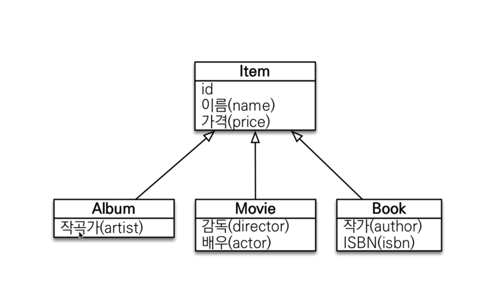

<!--[TOC]: # "## Table of Contents"-->

## Table of Contents
- [타입 표현](#타입-표현)
- [기본 문법](#기본-문법)
- [Fetch Join](#fetch-join)
- [다형성 쿼리](#다형성-쿼리)
- [엔티티 직접 사용](#엔티티-직접-사용)


**Java Persistence Query Language**

JPA가 지원하는 쿼리 언어들
- JPQL
- JPA Criteria
- QueryDSL
- Native SQL
- JDBC Api 직접 사용, MyBatis, StringJdbcTemplate


JPA를 사용하는 목적은 엔티티 객체를 중심으로 개발하기 위함인데 검색쿼리를 직접 작성하게되면 JPA의 취지와 맞지않거나 데이터베이스 내의 모든 엔티티를 객체화 할 수 없어 JPQL을 제공한다.
JPQL이란 SQL을 추상화한 객체 지향 쿼리 언어로 SELECT, FROM, WHERE, GROUP BY, HAVING, JOIN (ANCI 표준)을 지원한다.
SQL은 테이블 대상으로 쿼리하지만 JPQL은 엔티티 객체를 대상으로 쿼리한다.

### 타입 표현
- 문자 : 'HELLO', 'She"s'
- 숫자 : 10L (Long), 10D (Double), 10F (Float)
- Boolean : TRUE, FALSE
- ENUM : com.package.MemberType.Admin (패키지명 포함)
- 엔티티 타입 : TYPE (m) = Member (상속관계에서 사용)

### 기본 문법

``` sql
select m from Member as m where m.age > 18
```
- 엔티티와 속성은 대소문자 구분함
- JPQL 키워드는 대소문자 구분 안함 (SELECT, FROM, where)
- Table 이름 사용을 하지 않고 Entity명으로 쿼리한다.
- 별칭은 필수 (as 키워드는 생략 가능)

#### 기타 표현
- SQL과 문법이 같은 식
- EXIEST, IN
- AND, OR, NOT
- `=`, `>`, `>=`, `<`, `<=`, `<>`
- BETWEEN, LIKE, IS NULL

#### 집합 & 정렬
``` sql
select
	COUNT(m),    -- 회원수
	SUM(m.age),  -- 나이 합
	AVG(m.age),  -- 평균 나이
	MAX(m.age),  -- 최대 나이
	MIN(m.age)   -- 최소 나이
from Memeber as m
```

#### TypeQuery, Query
- TypeQuery :반환타입이 명확할때 사용
- Query : 반환타입이 명확하지 않을 경우 사용
``` kotlin
var typedQuery: TypedQuery<Member> = em.createQuery("select m from Member m", Member::class.java)

var query: Query = em.createQuery("select m from Member m")
```
위에 쿼리로 해당 쿼리를 실행 후 결과물을 받을때도 리스트 혹은 단일 결과를 받을 수 있다.
``` kotlin
query.getResultList()
// 결과가 없으면 빈 리스트 반환
query.getSingleResult()
// 결과가 없으면 : javax.persistence.NoResultException
// 결과가 둘 이상이면 : javax.persistence.NonUniqueResultException
```

#### Parameter Binding
``` kotlin
// 이름기반
var result = em.createQuery("select m from Member m where m.username = :username", Member::class.java)
		.setParameter("username", "member1")
		.getSingleResult();
// 위치기반
var result = em.createQuery("select m from Member m where m.username = ?1", Member::class.java)
		.setParameter(1, "member1")
```
아래처럼 위치기반 파라미터도 지원하지만 왠만해서는 이름 기준으로 사용하는것이 사용성이나 유지보수면이나 좋다.

#### 프로젝션

- SELECT 절에 조회할 대상을 지정하는 것
- 프로젝션 대상 : 엔티티, 임베디드 타입, 스탈라 타입 (숫자, 문자등 기본 데이터 타입)
- DISTINCT로 중복 제거 가능
``` sql
SELECT m FROM Member m -- 엔티티 프로젝션
SELECT m.team FROM Member m -- 엔티티 프로젝션
SELECT t FROM Member m join m.team t -- 위와 같은 join 쿼리로 동작하지만 join한다는걸 명시하야 유지보수에 좋다

SELECT m.address FROM Member m -- 임베디드 타입 프로젝션
SELECT DISTINCT m.username, m.age FROM Member m -- 스칼라 타입 프로젝션
```
> ``` SQL
> SELECT m.team FROM Member m
> SELECT t FROM Member m join m.team t 
> ```
> 위와 아래와 같은 join 쿼리로 동작하지만 join한다는걸 명시하야 유지보수에 좋다


여러가지 필드를 반환하는 스칼리형식의 결과타입을 가져오려면 `new` 키워드를 이용하여 새로운 오브젝트를 반환 시킬 수 있다.
``` kotlin
// 순서와 타입이 일치하는 생성자 필요
data class MemberDTO(
	var username: String,
	var age: Int
)
// 패키지명을 포함한 전체 클래스 명 입력
em.createQuery("select new com.package.MemberDto(m.username, m.age) from Member m", MemberDto::class.java)
```
이외에 Query 타입이나 Object[] 형식으로도 받을 수 있다.

#### Paging
``` kotlin
val query = "select m from Member order by m.name desc"
val resultList = em.createQuery(query, Member::class.java)
		.setFirstResult(10) // 조회 시작 위치 (0 부터 시작)
		.setMaxResults(20)  // 조회할 데이터 수 
		.getResultList()
```

#### Join
엔티티를 중심으로 조인 쿼리가 나가게 된다.
- 내부조인
	- 둘다 공통적인 조회라 회원은 있어도 팀이 없으면 결과가 없음
	- SELECT m FROM Member m [INNER] JOIN m.team t
외부조인
	- 둘중에 하나라도 있어도 결과는 나옴 (없는쪽은 null 값으로 처리됨)
	- SELECT m FROM Member m LEFT [OUTER] JOIN m.team t
세타조인
	- 연관관계가 없는 테이블들을 조인하여 처리한다.
	- select count(m) from Member m, Team t where m.username = t.name


JPA 2.1 이후의 버전에서 ON 을 쓸수 있게 되면서 조인할 대상을 조건에 맞추어 필터링 할 수 있다.
``` sql
// JPQL
SELECT m, t FROM Member m LEFT JOIN m.team t ON t.name = 'A'

// SQL
SELECT m.*, t.* FROM Member m LEFT JOIN Team t ON m.TEAM_ID = t.id and t.name = 'A'
```

하이버네이트 5.1 이후의 버전에서부터 연관관계가 없는 엔티티에 대해 외부 조인이 가능하다.
``` sql
// JPQL
SELECT m, t FROM Member m LEFT JOIN Team t ON m.username = t.name

// SQL
SELECT m.*, t.* FROM Member m LEFT JOIN Team t ON m.username = t.name
```

#### SubQuery
일반 쿼리처럼 서브쿼리를 사용하여 결괴물을 뽑을 수 있다.
- [NOT] **EXISTS** (subquery) : 서브쿼리에 결과가 존재하면 참
	- { **ALL** | **ANY** | **SOME** } (subquery)
	- ALL 모두 만족하면 참
	- **ANY**, **SOME** : 같은 의미, 조건을 하나라도 만족하면 참
- [NOT] **IN** (subquery) : 서브쿼리의 결과 중 하나라도 같은 것이 있으면 참
``` sql
-- 팀 A 소속인 회원
select m from Member m 
where EXISTS (select t from m.team t where t.name = '팀 A')

-- 전테 상품 각각의 재고보다 주문량이 많은 주문들
select o from Order o
where o.orderAmount > ALL (select p.stockAmount from Product p)

-- 어떤 팀이든 팀에 소속된 회원
select m from Member m
where m.team = ANY (select t from Team t)
```

서브쿼리의 한계
- JPA 표준스펙에서는 WHERE, HAVING 절에서만 서브쿼리 사용 가능
- SELECT 절도 가능 (하이버네이트에서 지원)
- **FROM 절의 서브 쿼리는 현재 JPQL에서 불가능**
	- 조인으로 풀 수 있으면 풀어서 해결
	- 쿼리를 두번 나눠서 어플리케이션단에서 해결
	- Native Query (최후의 선택)

#### Case


``` sql
-- 기본 Case식
select 
	case when m.age <= 10 then '학생요금'
	     when m.age >= 60 then '경로요금'
		 else '일반요금'
	end
from Member m

-- 단순 Case식
select 
	case t.name
	     when '팀A' then '인센티브 110%'
	     when '팀B' then '인센티브 120%'
	     else '인센티브 105%'
	end
from Member m

-- 하나씩 조회해서 null이 아니면 반환
select coalesce (m.username, '이름 없는 회원') from Member m

-- 두 값이 같으면 null 반환, 다르면 첫번째 값 반환
select NULLIF (m.username, '관리자') from Member m
```

#### JPQL 기본 표준 함수

|함수명|설명|
|-|-|
|CONCAT|문자열 더하기|`select concat('a', 'b') from Member m`|
|SUBSTRING|문자열 자르기|`select substring(m.username, 2, 3) from Member m`|
|TRIM|문자열 앞 뒤 공백 제거||
|LOWER, UPPER|소문자로 변경, 대문자로 변경|
|LENGTH|문자열 길이 구하기|
|LOCATE|해당 문자열이 시작되는 index 반환|`select locate('de', abcdefg') from Member m`|
|ABS, SQRT, MOD|표준 SQL에서 사용되는 수학함수 가능|
|SIZE|컬렉션의 사이즈를 반환|`select size(t.members) from Team t`|
|INDEX (JPA 용도)|`@OrderColumn` 사용시 위치값 반환|되도록 사용하지 않는게 좋음|

#### 사용자 정의 함수
하이버네이트는 사용자 정의 함수 등록이 가능하다.
사용하는 DB 방언을 상속받고, 사용자 정의 함수를 등록한다음 사용한다
``` sql
select function('group_concat', i.name) from Item i
```

``` java
public class MyH2Dialect extends H2Dialect {
	public MyH2Dialect() {
		registerFunction("group_concat", new StandardSQLFunction("group_concat", StandardBasicTypes.STRING))	
	}
}
```

#### 경로 표현식
- 상태필드 (state field )
	- 단순히 값을 저장하기 위한 필드 (ex: m.username)
	- 경로 탐색의 끝, 추가적인 탐색 X
- 연관필드 (association field) : 연관관계를 위한 필드
	- 단일값 연관필드 : `@ManyToOne`, `@OneToOne`, 대상이 엔티티 (ex: m.team)
		- 묵시적 내부 조인 발생. 추가 탐색 O
	- 컬렉션 값 연관 필드 : `@OneToMany`, `@ManyToMany`, 대상이 컬렉션 (ex: m.orders)
		- FROM 절에서 명시적 조인을 통해 별칭을 얻으면 별칭을 통해 추가 탐색 가능

> 추가적인 탐색이란 `m.team.name` 형식으로 가는것을 말하는것으로 `m.team.members.` 이후로 더이상 엔티티 관련되어 작성할 수 없는 상태를 추가 탐색이 불가능하다고 설명되었다. (`m.team.members.size`는 가능)
> 이를 해결하기 위해서는 **명시적인 JOIN** 을 작성하여 별칭을 통해 추가적인 필드 탐색 가능
> **묵시적인 JOIN**은 편하지만 너무 위험하다 (디버깅 및 튜닝하기 어려움)
> **반드시 무조건 명시적인 JOIN을 사용할것을 권장**
``` sql
select m.username -- 상태 필드
from Member m 
join m.team t -- 단일 값 연관 필드
join m.orders o -- 컬렉션 값 연관 필드
where t.name = '팀A'
```

``` sql
-- 성공
select o member.team from Order o 

select t.members from Team t

select m.username from Team t JOIN t.members m

-- 실패
select t.members.username from Team t
```

### Fetch Join
일반적인 SQL 조인의 종류가 아니며 JPQL의 성능 최적화를 위해 제공하는 기능이다.
연관된 엔티티나 컬렉션을 SQL 한 번에 함께 조회 하는 기능으로 `join fetch`명령어로 사용된다.
`[LEFT [OUTER] | INNER ] JOIN FETCH`

- 일반 패치 조인
``` sql
-- JPQL
select m from Member m join fetch m.team

-- SQL
SELECT M.*, T.* FROM MEMBER M INNER JOIN TEAM T ON M.TEAM_ID = T.ID
```

- 컬렉션 패치 조인
``` sql
-- JPQL
select t from Team t join fetch t.members where t.name='A'

-- SQL
SELECT T.*, M.* FROM TEAM T INNER JOIN TEAM T ON M.TEAM_ID = T.ID WHERE T.NAME='A'
```

> - 모든것을 페치 조인으로 해결할 수는 없음
> - 페치 조인은 객체 그래프를 유지할 떄 사용하면 효과적
> - 여러 테이블을 조인해서 엔티티가 가진 모양이 아닌 전혀 다른 결과를 내야 한다면 페치 조인 보다는 일반 조인을 사용하고 필요한 데이터들만 조회해서 DTO로 반환하는 것이 효과적

#### 컬렉션 조인 패치에서 주의사항
Team의 데이터가 하나고 Member의 데이터가 2개일 경우 두개를 조인하게되면 같은 팀이 중복되어 두개가 있다고 출력이 된다. (객체와 DB 차이점의 한계)
이를 제거하기위해서 `DISTINCT`를 사용한다.

SQL의 DISTINCT는 중복된 결과를 제거하는 명령이지만 JPQL에서의 DISTINCT는 두가지 기능을 제공한다.
1. SQL에 DISTINCT를 추가
2. 애플리케이션에서 엔티티 중복 제거
``` sql
select distinct t from Team t join fetch t.members where t.name='A'
```
SQL에 DISTINCT를 추가하더라도 완벽히 ROW의 데이터들이 완벽히 똑같아야 제거가되는데 JOIN 상대의 ID가 다르면 제거가 되지 않는다.
그래서 JPA는 Application 레벨에 올라오면 컬렉션에서 중복된 데이터를 제거 해준다.

#### 일반 조인과 패치 조인의 차이점
- JPQL은 결과를 반환할 때 연관관계를 고려하지 않는다.
- 단지 SELECT 절에 지정한 엔티티만 조회해준다.
- fetch join을 사용할 때만 연관된 엔티티도 같이 조회한다. (EAGER 처럼 동작)
- fetch join은 객체그래프를 SQL 한번에 조회하는 개념
``` sql
-- 결과물은 팀의 정보만 가져온다.
select t from Team t join t.members m

-- 멤버에 관련된 팀도 같이 가져온다.
select t from Team t join fetch t.members m
```

#### 패치 조인의 특징과 한계
- 패치 조인 대상에는 별칭을 줄 수 없다.
	- 하이버네이트는 가능하지만 가급적 사용하지 말것을 권장
- 둘 이상의 컬렉션은 페치 조인 할 수 없다.
- 컬렉션을 페치 조인하면 페이징 API(setFirstResult, setMaxResults)를 사용할 수 없다.
	- 일대일, 다대일 같은 단일 값 연관 필드들은 패치 조인해도 페이징 가능
	- 하이버네이트는 경고 로그를 남기고 메모리에서 페이징 (매우 위험)
> 페치조인의 목적은 관련된 모든 데이터를 들고오는것이기 때문에 중간에 조건을 넣는건 대단히 위험하다 (전체 목록을 가져와서 거기에서 조건으로 조회할 수 있음)
- 연관된 엔티티들을 SQL 한 번으로 조회 - 성능최적화
- 엔티티에 직접 적용하는 글로벌 로딩 전략보다 우선함 ()


#### 성능 최적화 방법
- 연관된 엔티티들을 SQL 한 번으로 조회 - 성능 최적화
- 엔티티에 직접 적용하는 글로벌 로딩 전략보다 우선함
	- `@OneToMany(fetch = FetchType.LAZY)` // 글로벌 로딩 전략
- 실무에서 글로벌 로딩 전략은 모두 지연로딩
- 최적화가 필요한 곳은 페치 조인 적용
- 여러 테이블을 조인해서 엔티티가 가진 모양이 아닌 전혀 다른 결과를 내야 하면, 페치 조인 보다는 일반 조인을 사용하고 필요한 데이터들만 조회해서 DTO로 반환하는 것이 효과적이다
	1. 엔티티를 페치조인하여 엔티티를 조회하여온다.
	2. 패치조인하여 애플리케이션에서 DTO로 변환
	3. JPQL에서 new DTO하여 가져온다.

일대다 관계를 다대일로 뒤집어서 페이징이 가능하다
(properties에 hibernate.default_batch_fetch_size = 100)

### 다형성 쿼리



위 그림에서 ITEM중에 Book, Movie를 조회하는 조건

``` sql
-- JQPL
select i from ITEM i where type(i) IN (BOOK, MOVIE)

-- SQL
select i from i where i.DTYPE in ('B', 'M')
```

##### TREAT (JPA 2.1)
부모인 Item과 자식 Book이 있을때 타입캐스팅하여 특정 객체만 조회가 가능하다.
``` sql
-- JPQL
select i from item i where treat(i as Book).auther = 'kim'

-- SQL
select i.* from Item i where i.DTYPE = 'B' and i.auther = 'kim'
```

### 엔티티 직접 사용
#### 엔티티 직접 사용 - 기본 키 값
JPQL에서 엔티티를 직접 사용하면 SQL에서 해당 엔티티의 기본 키 값을 사용

``` sql
-- JPQL
select count(m.id) from Member m -- 엔티티의 아이디를 사용
select count(m) from Member m -- 엔티티를 직접 사용

-- JQL (JPQL  둘다 같은 다음 sql을 실행)
select count(m.id) as cnt from Member m
```


``` kotlin
// 엔티티를 파라메터로 전달하는 방법
val jpql = "select m from Member m where m = :member"
val resultList = em.createQuery(jpql)
	.setParameter("member", member)
	.getResultList()

// 식별자를 직접 전달하는 방법
val jpql = "select m from Member m where m.id = :memberId"
val resultList = em.createQuery(jpql)
	.setParameter("memberId", memberId)
	.getResultList()

// 둘다 아래와 같은 쿼리가 나가게 된다.
select m.* from Member m where m.id = ? 
```

#### 엔티티 직접 사용 - 외래 키 값
``` kotlin
// 엔티티를 파라메터로 전달하는 방법
val team = em.fine(Team::class.java, 1L)
val qlString = "select m from Member m where m.team = :team"
val resultList = em.createQuery(qlString)
	.setParameter("team", team)
	.getResultList()

// 식별자를 직접 전달하는 방법
val qlString = "select m from Member m where m.team.id = :teamId"
val resultList = em.createQuery(qlString)
	.setParamtert("teamId", teamId)
	.getResultList()

// 둘다 아래와 같은 쿼리가 나가게 된다.
select m.* from Member m where m.team_id = ?
```