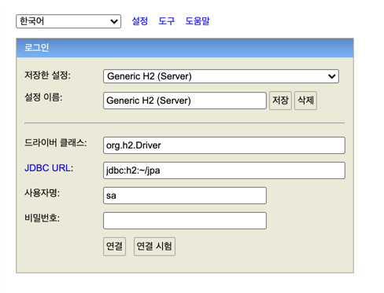
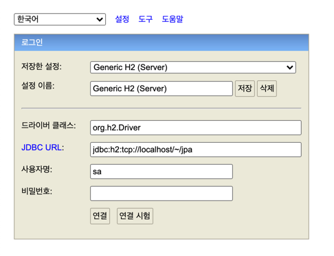

```
# application.yml
spring:
  datasource:
    url: jdbc:h2:tcp://localhost/~/jpa
    username: sa
    password:
    driver-class-name: org.h2.Driver

  jpa:
    hibernate:
      ddl-auto: create
    properties:
      hibernate:
#        show_sql: true
        format_sql: true

  h2:
    console:
      enabled: true


logging:
  level:
    org.hibernate.SQL: debug
    org.hibernate.type: trace
```

최초 h2 db 실행시 `jdbc:h2:~/{filename}` 형식으로 실행을 먼저 해준다음 디비파일을 생성을 먼저 해준 뒤  
`jdbc:h2:tcp://localhost/~/{filename}`형식으로 서버처럼 접근이 가능하다.



