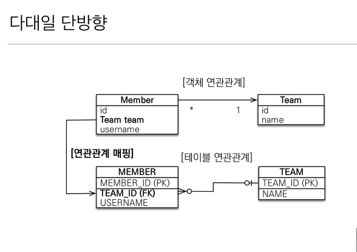
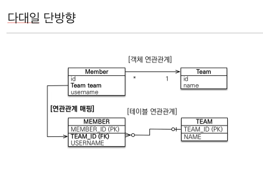
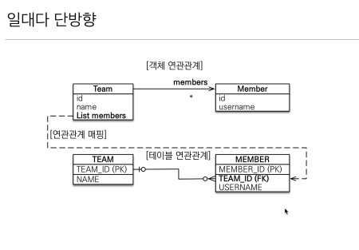
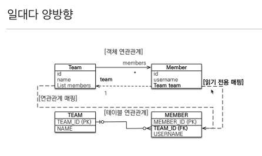
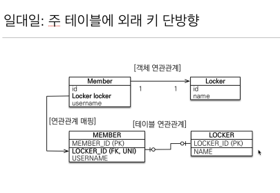
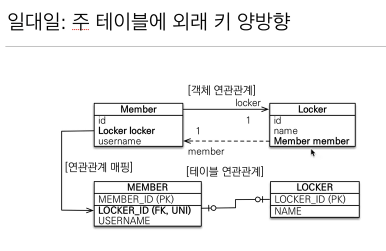

<!--[TOC]: # "## Table of Contents"-->

## Table of Contents
- [연관관계 매핑](#연관관계-매핑)
  - [단방향 연관관계](#단방향-연관관계)
  - [양방향 연관관계](#양방향-연관관계)
  - [다양한 연관관계 매핑](#다양한-연관관계-매핑)

## 연관관계 매핑

객체를 테이블에 맞추어 데이터 중심으로 모델링하면 협력 관계를 만들 수 없다.
- 테이블은 외래 키로 조인을 사용해서 연관된 테이블을 찾는다.
- 객체는 참조를 사용해서 연관된 객체를 찾는다.

> 객체지향 설계의 목표는 자율적인 객체들의 **협력 공동체**를 만드는 것이다.
> 조영호 (객체지향의 사실과 오해)

### 단방향 연관관계

``` kotlin
@Entity
class Member {
    @get:Id
    @get:GeneratedValue
    var id: Long? = null

    var name: String? = null
    
    var age: Int? = null

    @get:ManyToOne
    @get:JoinColumn(name = "TEAM_ID")
    var team: Team? = null
}


@Entity 
class Team {
    @get:Id
    @get:GeneratedValue
    var id: Long? = null
    var name: String? = null
}
```


###  양방향 연관관계

양방향 매핑 규칙
- 객체의 두 관계중 하나를 연관관계의 주인으로 지정
- 연관관계의 주인만이 외래 키를 관리 (등록, 수정)
- 주인이 아닌쪽은 읽기만 가능
- 주인은 mappedBy 속성을 사용하지 않는다.
- 주인이 아니면 mappedBy 속성으로 주인을 지정한다.

> 가능한한 특별한 이유가 없으면 많은쪽이 외래키를 가져간다 (연관관계의 주인).
> 연관관계의 주인은 외래 키의 위치를 기준으로 정해야하며 비즈니스 로직을 기준으로 연관관계의 주인을 선택해선 안된다.
> 연관관계의 주인의 객체만 수정 가능


``` kotlin
@Entity
class Member {
    @get:Id
    @get:GeneratedValue
    var id: Long? = null
    var name: String? = null
    var age: Int? = null

    @get:ManyToOne(fetch = FetchType.EAGER)
    @get:JoinColumn(name = "TEAM_ID")
    var team: Team? = null
}

@Entity
class Team {
    @get:Id
    @get:GeneratedValue
    var id: Long? = null
    var name: String? = null

    @get:OneToMany(mappedBy = "team")
    var members: MutableList<Member> = mutableListOf()
}
```

> 양방향 매핑은 반대 방향으로 조회(객체 그래프 탐색) 기능이 추가된것 뿐  단방향 매핑만으로도 이미 연관관계 매핑은 완료되었다.
> 초반 디비설계시에는 모든 연관관계는 단방향으로만 설계하여야하고 추가로 필요한곳에만 양방향을 넣어준다.  (테이블에 영향을 주지 않음)
> JPQL에서 역방향으로 탐색할 일이 많아 JPA에서는 직접 사용할 일이 많이 없을 수 있다.


#### 객체의 양방향 매핑
- 객체의 양방향 관계는 사실 양방향 관계가 아니라 서로 다른 단방향 관계 2개이다.
- 객체를 양방향으로 참조하려면 단방향 연관관계를 2개 만들어야한다.
	- A -> B ( a,getB() )
	- B -> A ( b.getA() )

#### 테이블의 양방향 매핑
- 테이블은 외래 키 하나로 두 테이블의 연관관계를 관리
- MEMBER.TEAM_ID 외래 키 하나로 양방향 연관관계를 가질 수 있다 (양쪽으로 조인 가능))


### 다양한 연관관계 매핑
#### `@ManyToOne` 다대일 (N:1)



#### `@OneToMany` 일대다 (1:N)

`@JoinColumn`을 넣지 않으면 조인 테이블 방식을 사용함 (중간 테이블이 하나 추가됨)


JPA에서 공식적으로 지원하지 않지만
Many쪽에 `@JoinColumn(insertable=false, updateable=false)` 처럼 읽기전용 필드를 만들어 양방향처럼 사용이 가능
> 절대 이렇게 사용하지 말고 **다대일 양방향**을 사용하도록 하자

#### `@OneToOne` 일대일 (1:1)
주 테이블이나 대상 테이블 둘 중 아무곳에나 외래 키를 넣을 수 있다.
외래 키에 데이터베이스 유니크 제약 조건을 추가하여야 한다. (필수는 아님)
일대일 단방향은 다대일 단방향과 유사하다 (Annotation만 틀림)



주 테이블에 외래 키가 있는 경우
- 주 객체가 대상 객체의 참조를 가지는 것 처럼 주 테이블에 외래 키를 두고 대상 테이블을 찾음
- 객체지향 개발자 선호
- JPA 매핑 관리
- 장점 : 주 테이블만 조회해도 대상 테이블에 데이터가 있는지 확인 가능
- 단점 : 값이 없으면 외래 키에 null 허용

대상 테이블에 외래 키가 있는 경우
- 대상 테이블에 외래 키가 존대
- 전통적인 데이터베이스 개발자 선호
- 장점 : 주 테이블과 대상 테이블을 일대일에서 일대다 관계로 변경할 때 테이블 구조 유지
- 단점 : 프록시 기능의 한계로 지연 로딩으로 설정해도 항상 즉시 로딩됨

#### `@ManyToMany` 다대다 (N:N)
다대다 관계가 편해보이지만 실무에서 사용하면 안됨
관계형 데이터베이스는 정규화된 테이블 2개로 다대다 관계를 표현할 수 없어 중간에 연결 테이블을 추가하여 일대다, 다대일 관계로 풀어내야한다.

``` kotlin
@Entity
class Member {
    @get:Id
    @get:GeneratedValue
    var id: Long? = null
    var name: String? = null
    var age: Int? = null

    @get:ManyToOne
    @get:JoinColumn(name = "teamId")
    var team: Team? = null
}

@Entity
class Team {
    @get:Id
    @get:GeneratedValue
    var id: Long? = null
    var name: String? = null

    @get:OneToMany(mappedBy = "team")
    var members: MutableList<Member> = mutableListOf()
}

@Entity
class Order {
    @get:Id
    @get:GeneratedValue
    var id: Long? = null

    @get:ManyToOne
    @get:JoinColumn(name = "memberId")
    var member: Member? = null

    @get:OneToMany(mappedBy = "order")
    var orderItems: List<OrderItem> = emptyList()

    @get:OneToOne
    @get:JoinColumn(name = "deliveryId")
    var delivery: Delivery

    var orderDate: LocalDateTime

    @get:Enumerated(EnumType.STRING)
    var status: OrderStatus
}

@Entity
class OrderItem {
    @get:Id
    @get:GeneratedValue
    var id: Long? = null

    @get:ManyToOne
    @get:JoinColumn(name = "orderId")
    var order: Order? = null

    @get:ManyToOne
    @get:JoinColumn(name = "itemId")
    var item: Item? = null

    var orderPrice: Int = 0

    var count: Int = 0
}

@Entity
data class Item {
    @get:Id
    @get:GeneratedValue
    var id: Long? = null

    @get:ManyToMany(mappedBy = "items")
    var categorys: List<Category> = emptyList()

    var name: String? = null
    var price: Int = 0
    var stockQuantity: Int = 0
}

@Entity
data class Delivery {
    @get:Id
    @get:GeneratedValue
    var id: Long? = null

    @get:OneToOne(mappedBy = "delivery")
    var order: Order? = null

    var city: String? = null
    var street: String? = null
    var zipcode: String? = null
    var status: DeliveryStatus? = null
}


@Entity
data class Category {
    @get:Id
    @get:GeneratedValue
    var id: Long? = null
    
    @get:ManyToMany
    @get:JoinTable(
        name = "categoryItem",
        joinColumns = [JoinColumn(name = "categoryId")],
        inverseJoinColumns = [JoinColumn(name = "itemId")]
    )
    var items: List<Item> = emptyList()

    @get:ManyToOne
    @get:JoinColumn(name = "parentId")
    var parent: Category? = null

    @get:OneToMany(mappedBy = "parent")
    var child: List<Category> = emptyList()

    var name: String? = null
}

enum class DeliveryStatus
enum class OrderStatus
```
