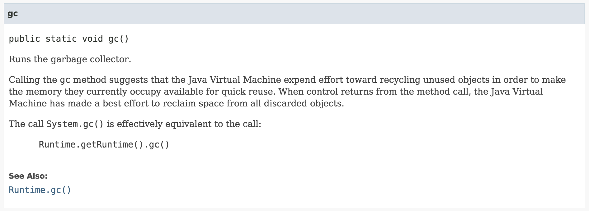
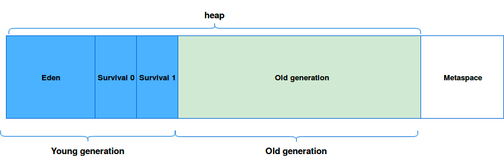
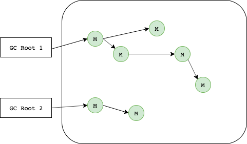
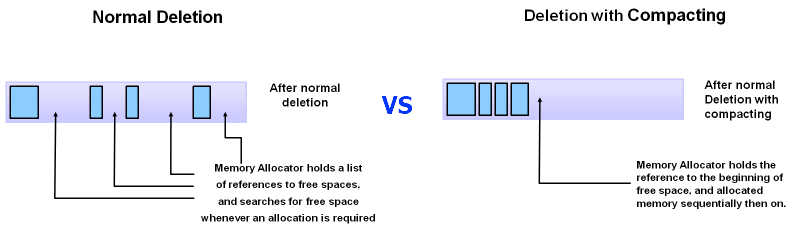
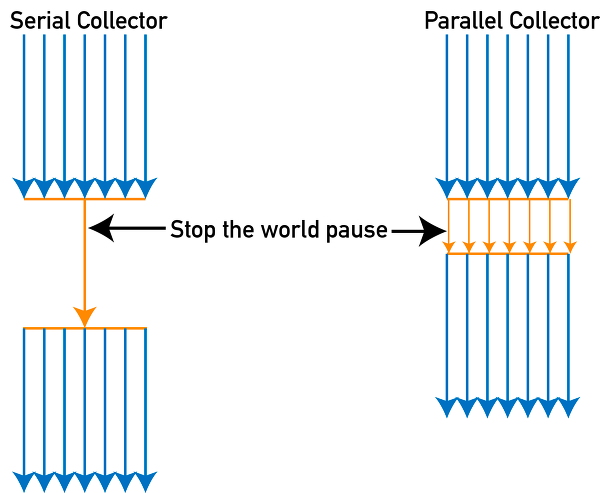
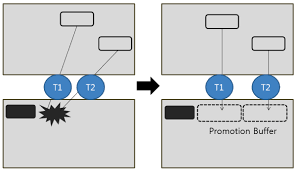
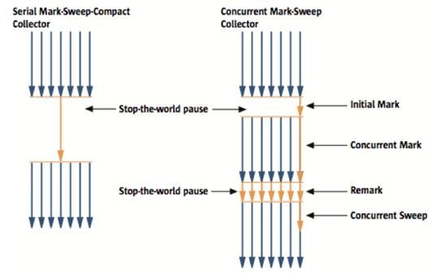
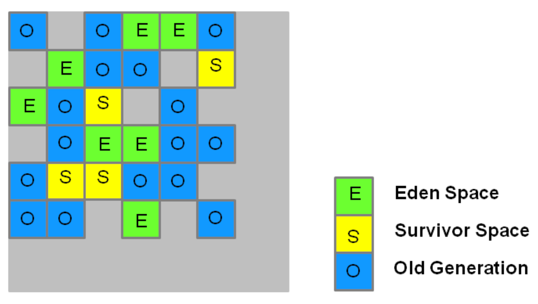

# Garbage Collection

프로그래머는 힙을 사용할 수 있는 만큼 자유롭게 사용하고, 더 이상 사용되지 않는 오브젝트들은 가비지 컬렉션을 담당하는 프로세스가 자동으로 메모리에서 제거하도록 하는 것이 가비지 컬렉션의 기본 개념

> Garbage collection was invented by John McCarthy around 1959 to simplify manual memory management in Lisp. - (Wiki) Garbage collection (computer science)

GC는 다음과 같은 규칙을 준수한다.
> Heap 영역의 오브젝트 중 stack 에서 도달 불가능한 (Unreachable) 오브젝트들은 가비지 컬렉션의 대상이 된다.

JVM 의 Garbage Collector 는 Unreachable Object 를 우선적으로 메모리에서 제거하여 메모리 공간을 확보한다.
Unreachable Object 란 Stack 에서 도달할 수 없는 Heap 영역의 객체를 말하는데  Garbage Collection 이 일어나면 Unreachable 오브젝트들은 메모리에서 제거된다.

> **System.gc()**
> System.gc() 를 호출하여 명시적으로 가비지 컬렉션이 일어나도록 코드를 삽입할 수 있지만, 모든 스레드가 중단되기 때문에 코드단에서 호출하면 위험하다.
> 

<!--[TOC]: # "## Table of Contents"-->

## Table of Contents
- [메모리](#메모리)
  - [Metaspace](#metaspace)
  - [Heap - Old & Young (Eden, Survivor)](#heap---old--young-eden-survivor)
  - [가비지 컬렉션 프로세스](#가비지-컬렉션-프로세스)
- [Mark & Sweep](#mark--sweep)
  - [Mark](#mark)
  - [Sweep](#sweep)
- [가비지 컬렉터 종류](#가비지-컬렉터-종류)
  - [Serial GC](#serial-gc)
  - [Parallel GC](#parallel-gc)
  - [Concurrent Mark Sweep (CMS) Collector](#concurrent-mark-sweep-cms-collector)
  - [G1(Garbage First) Garbage Collector](#g1garbage-first-garbage-collector)
- [Garbage Collection 이 중요한 이유](#garbage-collection-이-중요한-이유)

## 메모리
```
// JAVA 7
<----- Java Heap ----->             <--- Native Memory --->
+------+----+----+-----+-----------+--------+--------------+
| Eden | S0 | S1 | Old | Permanent | C Heap | Thread Stack |
+------+----+----+-----+-----------+--------+--------------+
                        <--------->
                       Permanent Heap
                       
// JAVA 8
<----- Java Heap -----> <--------- Native Memory --------->
+------+----+----+-----+-----------+--------+--------------+
| Eden | S0 | S1 | Old | Metaspace | C Heap | Thread Stack |
+------+----+----+-----+-----------+--------+--------------+

// S0: Survivor 0
// S1: Survivor 1
```
### Metaspace

Metaspace 는 Heap 과는 상관없는 네이티브 메모리 영역이다.
자바 7까지는 Permanent Generation 영역으로 존재하였으나 Java 8이후로 Metaspace로 대체되었다.

> **자바 7과 자바 8의 차이점**
> - Permanent Generation은 힙 메모리 영역중에 하나로 자바 애플리케이션을 실행할때 클래스의 메타데이터를 저장하는 영역이다.(Java 7기준)
> - 아래와 같은 것들이 Java Heap 이나 native heap 영역으로 이동했다.
>     - Symbols -> native heap
>     - Interned String -> Java Heap
>     - Class statics -> Java Heap
> - OutOfMemoryError: PermGen Space error 는 더이상 볼 수 없고 JVM 옵션으로 사용했던 PermSize 와 MaxPermSize는 더이상 사용할 필요가 없다. 이 대신에 MetaspaceSize 및 MaxMetaspaceSize가 새롭게 사용되게 되었다.

기존의 Perm은 JVM에 의해 크기가 강제되던 영역이다.
Java 8 이후 Metaspace는 Native memory 영역으로, OS가 자동으로 크기를 조절하여 메모리 영역을 사용할 수 있게 되었으며 그 이유로 OutOfMemoryError를 보기 힘들어졌다.
> 실행시 옵션으로 Metaspace의 크기를 줄일 수도 있다.

### Heap - Old & Young (Eden, Survivor)


자바의 힙 메모리는 다음과 같이 Metaspace, Old, Eden, S0, S1 총 다섯개 영역으로 나뉘어진다.

### 가비지 컬렉션 프로세스
1. 새로 생성된 오브젝트는 `Eden` 영역에 할당된다. Survivor Space 영역은 비워진 채로 시작된다.
2. `Eden`영역이 가득 차면, **Minor GC** 가 발생한다.
	- `Eden`의 Reachable 오브젝트들은 `S0` 으로 옮겨진다.
	- `Eden`의 Unreachable 오브젝트들은 `Eden` 영역이 클리어 될 때 메모리에서 같이 해제된다.
3. `Eden`영역이 가득 차서 **두번째 Minor GC** 가 발생한다.
	- `Eden`의 Reachable 오브젝트들은 `S1` 으로 옮겨진다.
	- `Eden`의 Unreachable 오브젝트들은 `Eden` 영역이 클리어 될 때 메모리에서 같이 해제된다.
	- `S0`의 Reachable 오브젝트들은 `S1` 으로 옮겨진다. 이때 **age 값이 증가**되어 이동된다.
	- `S0`의 Unreachable 오브젝트들은 `S0` 영역이 클리어 될 때 메모리에서 같이 해제된다.
4. **Minor GC**가 발생함에 따라 위와 같은 상황이 반복되면서 age값을 증가시킨다.
	- Survivor Space 에서 Survivor Space 로의 이동은 이동할때마다 age 값이 증가한다
5. `Young Generation`에서 계속 살아남아 age값이 특정값 이상이 되면 `Old Generation` 으로 옮겨진다.
	- 이 단계를 **Promotion** 이라고 한다.
6. **Promotion** 작업이 계속해서 반복되면서 `Old Generation` 이 가득차게 되면 **MajorGC** 가 발생하게 된다
7. **GC**가 발생될 때 Thread를 잠시 멈추게 되고 Mark and Sweep 작업을 진행한다. (Stop the World)

> **GC 종류**
> MinorGC : Young Generation 에서 발생하는 GC. Major GC에 비해 속도가 빠르다.
> MajorGC : Old Generation (Tenured Space) 에서 발생하는 GC. Minor GC에 비해 속도가 느리다.
> FullGC : Heap 전체를 clear 하는 작업 (Young/Old 공간 모두)

## Mark & Sweep
Garbage Collection 과정은 `Mark and Sweep` 이라고도 한다.

### Mark


가비지 컬렉터에는 GC Root라는 것이 있다. GC Root들은 힙 외부에서 접근할 수 있는 변수나 오브젝트를 뜻한다.
GC Root는 말그대로 가비지 컬렉션의 Root라는 뜻이다. GC Root에서 시작해 이 Root가 참조하는 모든 오브젝트, 또 그 오브젝트들이 참조하는 다른 오브젝트들을 탐색해 내려가며 마크(Mark)한다. 이게 바로 가비지 컬렉션의 첫번째 단계인 Mark단계이다.

첫번째 단계인 marking 작업을 위해 모든 스레드는 중단되는데 이를 `stop the world` 라고 부르기도 한다.

> GC Root가 될 수 있는 것들은 다음과 같다.
> 1. 실행중인 쓰레드 (Active Thread)
> 2. 정적 변수 (Static Variable)
> 3. 로컬 변수 (Local Variable)
> 4. JNI 레퍼런스 (JNI Reference)

### Sweep

mark 되어있지 않은 모든 오브젝트들을 힙에서 제거하는 과정이 `Sweep` 이다.

Garbage Collection 이라고 하면 garbage 들을 수집할 것 같지만 실제로는 garbage 를 수집하여 제거하는 것이 아니라, garbage 가 아닌 것을 따로 mark 하고 그 외의 것은 모두 지우는 것이다. 만약 힙에 garbage 만 가득하다면 제거 과정은 즉각적으로 이루어진다.

Unreachable Object들이 모두 즉각적으로 해제될수도 있고 다른곳으로 메모리가 옮겨질 수도 있다.


## 가비지 컬렉터 종류

Collector 알고리즘

|Garbage Collector|Option|YG 알고리즘|OG 알고리즘|
|-|-|-|-|
|Serial Collector|-XX:+UseSerialGC|Serial|Serial Mark-Sweep-Compact|
|Parallel Collector|-XX:+UseParallelGC|Parallel Scavenge|Serial Mark-Sweep-Compact|
|Parallel Compacting Collector|-XX:+UseParallelOldGC|Parallel Scavenge|Parallel Mark-Sweep-Compact|
|CMS Collector|-XX:+UseConcMarkSweepGC|Parallel|Concurrent Mark-Sweep|
|G1 Collector|-XX:+UseG1GC|Young GC(Evacuation Pause)<br>Concurrent Mark - Marking<br>Current Mark - Remarking|Old Region Reclaim - Remarking<br>Old Region Reclaim - Evacuation Pause<br>Compaction Phase|


### Serial GC

Serial GC 는 Java SE 5, 6 에서 사용되는 디폴트 가비지 컬렉터이다.
```
-XX:+UseSerialGC
```
MinorGC, MajorGC 모두 순차적으로 시행된다.
Mark-Compact collection method 를 사용


> **Mark-Compact collection method 란**
> 새로운 메모리 할당을 빠르게 하기 위해서 기존의 메모리에 있던 오브젝트들을 힙의 시작위치로 옮겨 놓는 방법
> 창고에서 필요없는 물건들을 버린 후, 창고에 물건을 차곡차곡 쌓기위해 창고안을 정리하는 것이라 생각할 수 있다.

### Parallel GC

Parallel 가비지 컬렉터는 young generation 에 대한 가비지 컬렉션 수행시 멀티스레드를 사용한다.
멀티스레딩을 할 수 있는 ParallelGC 를 사용하도록 옵션을 주었더라도, 호스트 머신이 싱글 CPU 라면 디폴트 가비지 컬렉터(Serial GC)가 사용된다.
하지만, 호스트의 CPU 가 두개 이상이라면 young generation 의 가비지 컬렉션 시간을 줄일 수 있다.

가비지 컬렉터 스레드 개수는 디폴트로 CPU 개수만큼이 할당되는데 `-XX:ParallelGCThread=<N>` 옵션으로 조절가능하다. 또한, `-XX:+UseParallelOldGC` 옵션을 사용한다면, old generation 의 가비지 컬렉션에서도 멀티스레딩을 활용할 수 있다.
```
-XX:+UseParallelGC # ParallelGC 사용
-XX:ParallelGCThread=<N> # 가비지 컬렉터 스레드 갯수 (default : Cpu 갯수)
-XX:+UseParallelOldGC # old generation에도 멀티스레딩 사용
```
Old Generation으로 Promotion 작업을 두 개의 스레드가 동시에 수행하여 충돌이 나는 상황이 발생을 해결하기 위해 Minor GC를 수행하는 스레드마다 Old Generation의 일정부분을 `PLAB`이라는 버퍼를 할당하여 충돌상황을 피하고 있다.


> **PLAB(Parallel Allocation Buffer)** 단점
>PLAB 때문에 어쩔 수 없이 Old Generation에 메모리 단편화가 생기곤 한다.

### Concurrent Mark Sweep (CMS) Collector

Concurrent Low Pause Collector 라고도 불리는 CMS 컬렉터는 대부분의 가비지 컬렉션 작업을 애플리케이션 스레드와 동시에 수행함으로써 가비지 컬렉션으로 인한 `stop-the-world` 시간을 최소화하는 GC이다.

CMS 컬렉터는 young generation 에 대한 가비지 컬렉션시 Parallel GC 와 같은 알고리즘을 사용하는데, `-XX:ParallelCMSThreads=<N>` 옵션으로 스레드 개수를 설정할 수 있다.

일반적으로 CMS 컬렉터는 살아있는 오브젝트들에 대한 compact 작업을 수행하지 않으므로, 메모리의 파편화(Fragmentation) 가 문제가 된다면 더 큰 힙사이즈를 할당해야 한다.
```
-XX:+UseConcMarkSweepGC # CMS Collector 사용
-XX:ParallelCMSThreads=<N> # 스레드 개수를 설정
```

### G1(Garbage First) Garbage Collector


Garbage First 라는 의미의 G1 가비지 컬렉터는 Java 7 부터 사용가능하며, 장기적으로 CMS 컬렉터를 대체하기 위해 만들어졌다.
G1은 큰 메모리를 가진 멀티 프로세서 시스템에서 사용하기 위해 개발된 GC이며 쓰레기로 가득찬 heap 영역을 집중적으로 수집한다.
GC 일시 정지 시간을 최소화하면서, 따로 설정을 하지 않아도 가능한 한 처리량(throughput)도 확보하는 것이 G1GC의 목표이다.
G1은 실시간(real time) GC가 아니다. 일시 정지 시간을 최소화하긴 하지만 완전히 없애지는 못한다.
통계를 계산해가면서 GC 작업량을 조절한다.

Oracle문서에 따르면 heap size가 6GB보다 클 경우 GC의 latency를 0.5sec이하로 낮출수 있다고 한다.(
```
// G1GC는 Java 9부터 디폴트이므로 보통은 따로 옵션을 써서 활성화할 필요가 없다.
-XX:+UseG1GC
-XX:ParallelGCThreads # 스레드 갯수 조절 
```

G1GC는 전체 heap을 체스판처럼 여러 영역(region)으로 나누어 관리한다.

따라서 G1은 영역의 참조를 관리할 목적으로 remember set를 만들어 사용한다.
remember set은 total heap의 5% 미만 크기.

- 비어 있는 영역에만 새로운 객체가 들어간다.
- 쓰레기가 쌓여 꽉 찬 영역을 우선적으로 청소한다.
- 꽉 찬 영역에서 라이브 객체를 다른 영역으로 옮기고, 꽉 찬 영역은 깨끗하게 비운다.
- 이렇게 옮기는 과정이 조각 모음의 역할도 한다.

> **Oracle에서 G1 GC를 사용을 권하는(Recommend) 기준**
> Full GC durations are too long or too frequent.
> The rate of object allocation rate or promotion varies significantly.
> Undesired long garbage collection or compaction pauses (longer than 0.5 to 1 second)


## Garbage Collection 이 중요한 이유
Garbage Collection이 시스템에 큰 영향을 끼치는 이유는 위에 설명 했듯이 GC를 수행하는 Thread를 제외한 모든 Thread의 작업이 멈추기 때문
실시간으로 통신이 필요한 어플리케이션의 경우 Full GC가 일어나 수 초 동안 어플리케이션의 멈춘다면 장애로 이어진다.
웹 어플리케이션의 경우도 같은 상황이 일어난다면 GC가 완료된 이후 Thread가 복구 된다 하더라고 이미 대기하고 있던 수많은 요청으로 인해 시스템이 한꺼번에 많은 부하가 걸린다.

각 서비스마다 모두가 같을 수가 없고 객체의 크기와 생존 주기가 다 달라 GC에 대한 옵션을 계속 다르게 설정하고 꾸준하게 모니터링하여  최적의 값을 찾아내어 튜닝을 하여야 한다.
