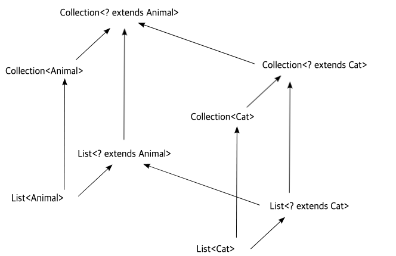

# Generic


## Kotlin
### Star Projection
1. *와 Any?는 다르다.
왜냐면, MutableList<T>는 T에 대해 무공변이기 때문.

MutableList<Any?>는 모든 타입의 원소를 담을 수 있음을 의미하는 반면,

MutableList<*>은 어떤 타입이라도 들어올 수 있으나, 구체적인 타입이 결정되는 과정이 진행되고, 일단 타입이 결정되면 그 타입(과 하위 타입)의 원소만 담을 수 있다. 즉, 구체적인 타입이 결정된다는 점이 중요하다.

2. *와 자바의 ?는 다르다.
``` kotlin
MutableList<*>  == MutableList<?>
```
bounded wildcard는 사실 in/out에 대응되기 때문에, unbounded만 표현한다고 볼 수 있다.
```
interface Function(in T, out U> {
    . . .
}
fun foo(bar: Function<*, *>) {
    // == bar: Function<in Nothing, out Any?>
}
```
in으로 정의되어 있는 인자를 *로 받으면 in Nothing인 것으로 간주한다.
out으로 정의되어 있는 인자를 *로 받으면 out Any?인 것으로 간주한다.
그래서 *를 사용하더라도 함수 내부에서 T, U의 위치에 따라 메소드 호출이 제한될 수 있다.

``` kotlin
class VarianceTest<in T, out U>(conT: T, conU: U) {
//    val propT: T = conT
//    type parameter T is declared as 'in' but occurs in 'out' position in type T
    val propU: U = conU

//    fun printAll(t: T, u: U)
//    type parameter U is declared as 'out' but occurs in 'in' position in type U
    fun printAll(t: T) {
        print(t)
    }
}

fun starTestFunc(v: VarianceTest<*, *>) {
//    v.printAll(1)
//    Out-projected type 'VarianceTest<*, *>' prohibits the use of 'public final fun printAll(t: T): Unit defined in VarianceTest'
//    type hinting도 아예 v.printAll(t: Nothing)으로 *잡힌다*.
    print(v.propU)    // out은 out Any?가 되니까 Any?에 있는 메소드를 호출하거나 하는건 잘 된다.
}
```


## Java
### Type Variance and Wildcard

자바에서 ?와 T를 모두 사용할 수 있을 때 인자들과 리턴타입이 서로 관계를 맺고 있으면 T, 아니면 ?를 사용해야 조금 더 의도가 명확해지는 코드가 된다

내부에서 타입을 이용한 작업을 할 때는 T를 사용하고 그렇지 않으면 ?를 사용하여야 한다
예를들어 다음과 같이 list의 기능만을 사용하고 list내부의 원소를 사용하지 않는 경우에는 와일드카드가 더 나은 방법이다
``` java
// bad
public <T> boolean isEmpty(List<T> list) {
    return list.size() == 0;
}

// good
public boolean isEmpty(List<?> list) {
    return list.size() == 0;
}
````


https://medium.com/@joongwon/java-java%EC%9D%98-generics-604b562530b3