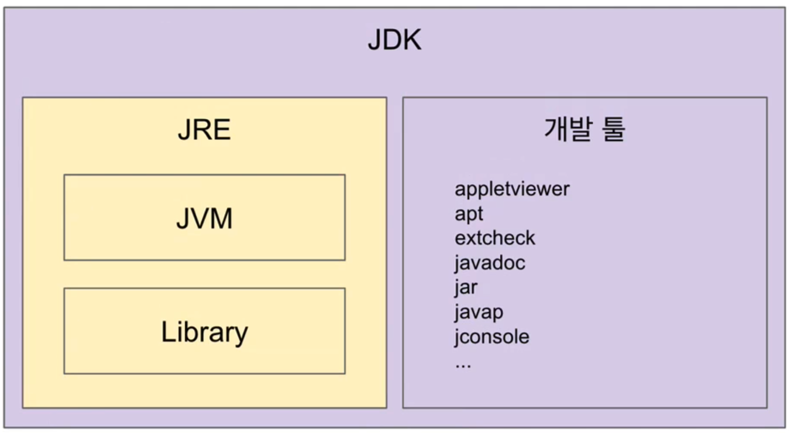
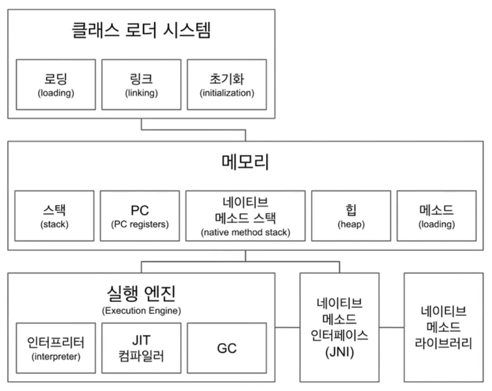
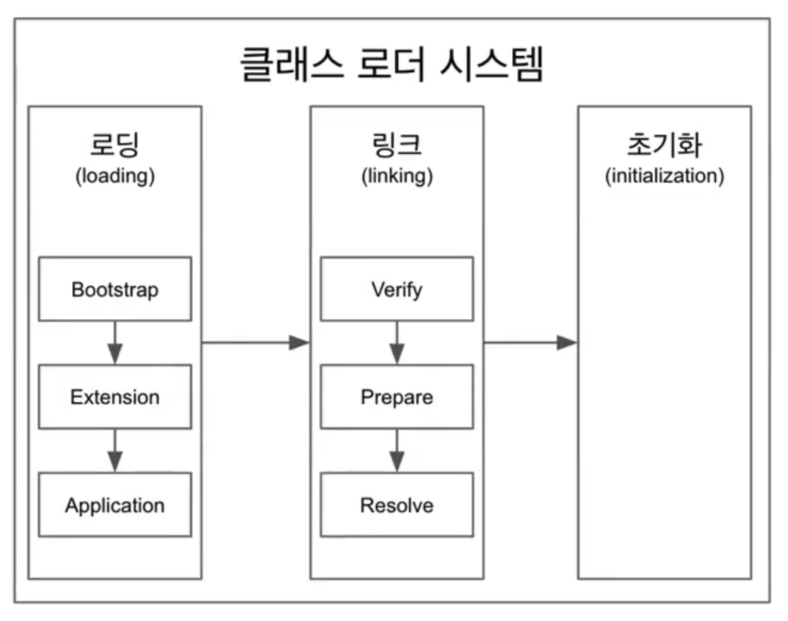

# JVM 구조

<!--[TOC]: # "## Table of Contents"-->

## Table of Contents
- [JVM](#jvm)
- [JRE](#jre)
- [JDK](#jdk)
- [JAVA](#java)
- [JVM 구조](#jvm-구조)
  - [클래스 로더 시스템](#클래스-로더-시스템)
    - [Class Loader의 특징](#class-loader의-특징)
    - [Class Loader의 종류](#class-loader의-종류)
      - [부트 스트랩 클래스 로더 (BootStrap Class loader)](#부트-스트랩-클래스-로더-bootstrap-class-loader)
      - [플랫폼 클래스로더 (Platform Class loader)](#플랫폼-클래스로더-platform-class-loader)
      - [애플리케이션 클래스로더 (Application Class loader)](#애플리케이션-클래스로더-application-class-loader)
  - [메모리](#메모리)
  - [실행 엔진](#실행-엔진)
  - [JNI(Java Native Interface)](#jnijava-native-interface)
  - [네이티브 메소드 라이브러리](#네이티브-메소드-라이브러리)



### JVM
`Java Virtual Machine`
- 자바 가상 머신
- 자바 바이트 코드(.class)를 OS의 특화된 코드로 변환 (인터프리터, JIT 컴파일러)하여 실행
- 바이트 코드를 실행하는 표준 (JVM 자체가 표준)이자 구현체 (특정 밴더가 구현한 JVM)
- 특정 플랫폼에 종속적

`java` 파일을 `javac` 하여 만든 `class` 파일 안에 있는것이 바이트 코드이다.
바이트 코드를 실행하는게 인터프리터와 JIT 컴파일러를 사용하여 네이티브 OS에 맞게 머신코드로 변경하여 실행하게된다.

### JRE
`Java Runtime Environment`
- 자바 애플리케이션을 **실행**할 수 있도록 구성된 배포판.
- JVM과 핵심 라이브러리 및 자바 런타임 환경에서 사용하는 프로퍼티 세팅이나 리소스 파일을 가지고 있다
- JVM + Library(`rt.jar` ...)

클래스 파일을 실행할 수 있도록 구성된 배포판
실행만을 위한 배포판이라 `javac`명령어가 없다.

### JDK
`Java Development Kit`
- JRE + 개발에 필요할 툴
- 소스 코드를 작성할 때 사용하는 자바 언어는 플랫폼에 독립적
- 오라클은 자바 11부터 JDK만 제공하여 JRE를 따로 제공하지 않는다.
	- 자바 9 부터는 모듈시스템이 들어가있어 jlnk 모듈 서브셋을 만들어서 JRE를 커스텀하게 만들 수 있다.

### JAVA
- 프로그래밍 언어
- JDK에 들어있는 자바 컴파일러 (`javac`)를 사용하여 바이트코드로 컴파일 할 수 있다.

JAVA와 JVM은 직접적인 관련이 없어서 Kotlin, Groovy, Scala같은 다른 언어를 사용하더라도 java 혹은 class 파일로만 컴파일 해준다면 구동이 가능하다.


## JVM 구조



### 클래스 로더 시스템

 자바 바이트 코드를 읽어 각 메모리에 적절하게 배치 되며 로딩, 링크, 초기화 순으로 진행

- 로딩
	- 클래스 로더가 `.class` 파일을 읽고 그 내용에 따라 적절한 바이너리 데이터를 만들고 **메소드 영역에 저장**
	- 메소드 영역에 저장하는 데이터
		- FQCN
		- Class, Interface, Enum
		- Method, Variable
	- 로딩이 끝나면 해당 클래스 타입의 Class 객체를 생성하여 Heap 메모리에 저장
- 링크
	- `Verify`, `Prepare`, `Resolve`(optional) 세 단계로 나눠져 있다.
		- Verify (검증) :  `.class` 파일 형식이 유효한지 체크
		- Preparation : 클래스 변수(static 변수)와 기본값에 필요한 메모리
		- Resolve(optional) : 심볼릭 메모리 레퍼런스를 메소드 영역에 있는 실제 레퍼런스로 교체
			- 심볼릭 링크로만 존재하던 논리적 연결을 Heap 메모리에 있는 레퍼런스와 연결해준다.
- 초기화
	- static 변수의 값을 할당한다 (static 블럭이 있다면 이때 실행된다.)
#### Class Loader의 특징
- 계층적
	- 상위 클래스 로더에서 하위 클래스 로더를 갖는 방식
	- 최상위 클래스 로더는 부트스트랩 클래스 로더
	- 클래스 로딩을 위임
- 가시적인 규약
	- 클래스 로딩할 때 가능한 범위
	 - 자식 클래스 로더는 클래스 로딩 요청 위임을 통해 부모 클래스 로더가 로딩한 클래스를 찾을 수 있음
	- 부모 클래스는 자식 클래스 로더가 로딩한 클래스를 알 수 없음
- 클래스 언로딩 불가능
	- 가비지 컬렉터가 동작하거나 WAS가 재시작할 때 초기화


#### Class Loader의 종류

``` java
public class ClassLoaderTest {
    public static void main(String[] args) {
        Class<ClassLoaderTest> classLoaderTestClass = ClassLoaderTest.class;
        
        System.out.println(classLoaderTestClass.getClassLoader());
        System.out.println(classLoaderTestClass.getClassLoader().getParent());
        System.out.println(classLoaderTestClass.getClassLoader().getParent().getParent());
    }
}

// Console 
// jdk.internal.loader.ClassLoaders$AppClassLoader@2c13da15
// jdk.internal.loader.ClassLoaders$PlatformClassLoader@2133c8f8
// null 
// 부트 스트랩 클래스 로더로 실제로는 존재하지만 네이티브코드로 구현이 되어 보이지 않음
```


##### 부트 스트랩 클래스 로더 (BootStrap Class loader)
- `JAVA_HOME\lib`에 있는 코어 자바 API를 제공한다.
- 최상위 우선순위를 가진 클래스 로더
- JVM 런타임 실행을 위해 기반이 되는 파일들을 로드
- rt.jar 파일과 연관이 있음
- 부트 스트랩 로더의 로드가 끝나면 확장 클래스 로더가 로딩


##### 플랫폼 클래스로더 (Platform Class loader)
과거에 확장 클래스 로더 (Extensions Class loader) 라고 불리었었음
`JAVA_HOME\lib\ext` 폴더 또는 `java.ext.dirs` 시스템 변수에 해당하는 위치에 있는 클래스를 읽는다.
- 자바의 최상위 객체인 Object를 포함한 자바 API를 로드 (자바 홈 폴더 하위의 ext폴더 하위에 있는 jar 파일들과 연관이 있음)
- 플랫폼 클래스 로더의 로드가 끝나면 시스템 애플리케이션 클래스 로더를 로드

##### 애플리케이션 클래스로더 (Application Class loader)
애플리케이션 클래스패스(애플리케이션 실행할 때 주는 `-classpath` 옵션 또는 `java.class.path` 환경 변수의 값에 해당하는 위치)에서 클래스를 읽는다.
- 클래스패스에 포함된 클래스를 로드
- 사용자는 시스템 클래스 로더가 로드하는 클래스 패스 영역에만 접근할 수 있다.


### 메모리
메모리
- 메소드 영역에는 클래스 수준의 정보 (클래스 이름, 부모 클래스 이름, 메소드, 변수) 저장. (공유 자원)
- 힙 영역에는 객체를 저장. 공유 자원
- 스택영역에는 쓰레드마다 런타임 스택을 만들고, 그안에 메소드 호출을 스택 프레임이라 부르는 블럭으로 쌓는다. 쓰레드 종료하면 런타임 스택도 사라진다.
- PC(Program Counter) 레지스터: 쓰레드 마다 쓰레드 내 현재 실행할 스택 프레임을 가리키는 포인터가 생성된다.
- 네이티브 메소드 스택

### 실행 엔진
class파일의 내용을 인터프리터를 이용하여 한줄 한줄씩 실행
인터프리터의 효율을 높이기 위해 인터프리터가 반복되는 코드를 발견하면 JIT 컴파일러로 반복되는 코드를 모두 네이티브 코드로 변경해둬서 인터프리터는 네이티브 코드로 컴파일 된 코드를 바로 사용한다.
- JIT 컴파일러 : Just In Time
- JIT 컴파일러는 바이트 코드를 네이티브 OS 코드로 변환하는 컴파일러
- GC : Garbage Collector
- GC: 더이상 참조되지 않는 객체를 모아서 정리한다.

### JNI(Java Native Interface)
- 자바 애플리케이션에서 C, C++, 어셈블리로 작성된 함수를 사용할 수 있는 방법 제공
- Native 키워드를 사용한 메소드 호출

### 네이티브 메소드 라이브러리
- C, C++로 작성 된 라이브러리

