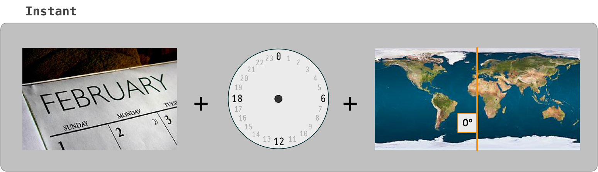
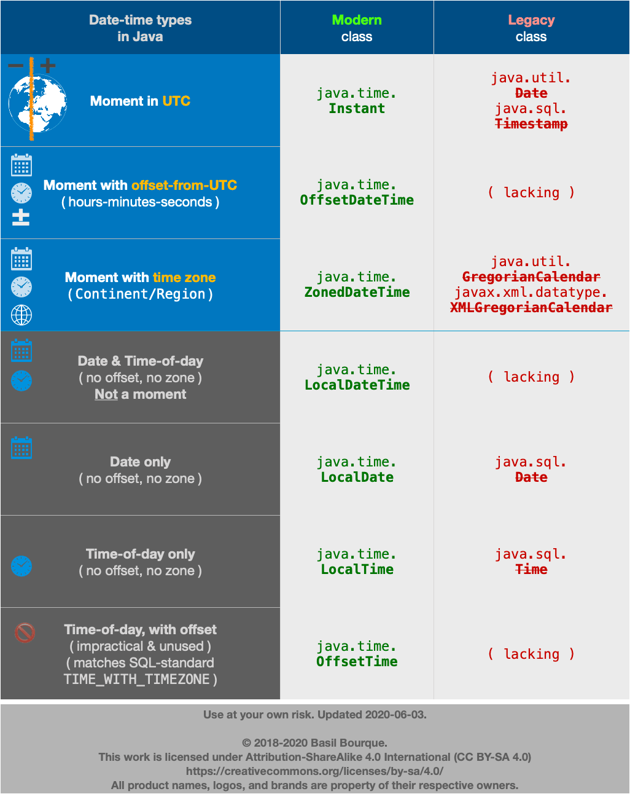
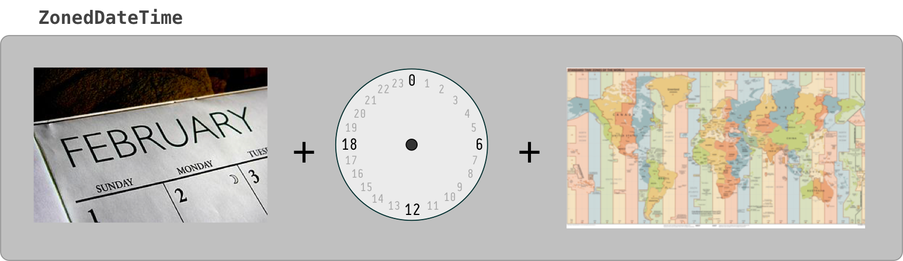
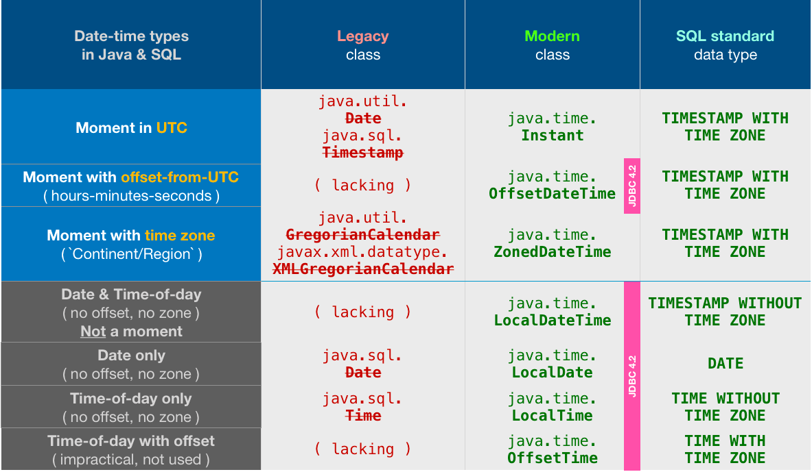

# JAVA Instant와 LocalDateTime의 다른점

Java 8 이상되면서 무의식적으로 Date, Time, Timestamp등이 레거시가 되어버리고
`LocalDateTime`, `ZonedDateTime`, `LocalTime` 등을 Database Entity에서 사용하는것을 많이 봐왔습니다.
그러던중 Instant라는 객체를 발견하면서부터 의구심이 들었습니다.

LocalDateTime.. 너 정말 좋은놈이니?

<!--[TOC]: # "## Table of Contents"-->

## Table of Contents
- [Instant](#instant)
- [LocalDate, LocalTime, LocalDateTime](#localdate-localtime-localdatetime)
- [OffsetDateTime](#offsetdatetime)
- [ZonedDateTime](#zoneddatetime)
- [JDBC에서 변경되는 형태](#jdbc에서-변경되는-형태)

## Instant

많은 사람들이 long형 Unix Timestamp(POSIX Time, Epoch Time)을 쓰는 이유는 간단합니다.
integer, long type을 이용한 정렬 / 연산등에서 다른 타입들보다는 빠른 속도를 자랑합니다.
하지만 Unix Timestamp는 [Year 2038 problem](https://en.wikipedia.org/wiki/Year_2038_problem)을 가지고 있기 때문에 지금이라도 다른 타입을 사용하는게 좋습니다.
그래서 나온것이 Java의 `Instant`입니다.

Instant는 자바 1.8 java.time package에 들어가있으며 UTC의 타임 라인에있는 순간으로,
1970년 1월 1일 UTC의 첫 번째 순간 이후의 현재 시간까지의 나노초를 나타낸 값 입니다.
부분의 비즈니스 로직, 데이터 저장 및 데이터 변경은 UTC로 이루어져야하므로 자주 사용하기에 편리한 클래스입니다.

## LocalDate, LocalTime, LocalDateTime

Java Time에서 `Local`이 들어간다는것은 시간대(Zone Offset/Zone Region)에 대한 정보가 없다는 의미입니다.
보통 이런날을 사용하는것은 그 날이 의미하는 즉, 생일 이나 기념일에 많이 사용하게 됩니다.

다른나라에서 하는 이벤트 시간을 맞추기 위해서는 반드시 `OffsetDateTime`, `ZonedDateTime`을 사용해야 합니다.

## OffsetDateTime

`LocalDateTime` + `ZoneOffset`의 개념으로
`OffsetDateTime`는 UTC보다 몇 **시간/분/초** **앞** 또는 **뒤**의 컨텍스트를 사용하여 순간을 날짜 및 시간으로 나타냅니다.
Offset의 크기(**시간/분/초**)는 `ZoneOffset` 클래스로 표시됩니다.
**시간/분/초**가 0이면 `OffsetDateTime`은 `Instant` 동일한 UTC의 순간을 나타냅니다.

## ZonedDateTime

`OffsetDateTime` + `ZoneRegion`에 대한 정보까지 포함한 객체입니다.
`OffsetDateTime`과의 차이점은 `DST`(Daylight Saving Time)와 같은 Time Transition Rule을 포함하는 `ZoneRegion`의 유무차이 입니다.
DST에는 CET(겨울), CEST(여름) 형태가 있는데 Time Zone(CET)로 통일하고 Time Transition Rule을 가지는 `ZoneRules`를 통해 알아서 내부적으로 계산해줍니다.

## JDBC에서 변경되는 형태

> 참고
> https://stackoverflow.com/questions/32437550/whats-the-difference-between-instant-and-localdatetime
> https://perfectacle.github.io/2018/09/26/java8-date-time/
