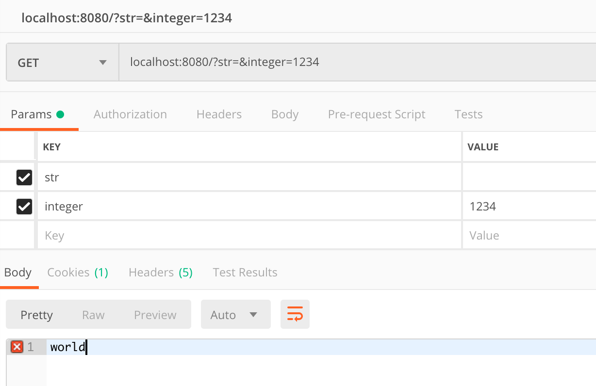

Java에서는 Bean 객체의 값들을 효율적으로 검증하기 위한 표준이 있습니다.
`JSR-303`, `JSR-349`, `JSR-380`이 있는데 이들의 구현체로 `Hibernate Validator`가 있습니다.

> **JSR-303** : Bean Validation 1.0
> **JSR-349** : Bean Validation 1.1
> **JSR-380** : Bean Validation 2.0

Spring을 사용하다보면 Controller에서 매우 자주 사용되는 Annotation인 `@Valid`가 있을건데 이상하게 코틀린에서 사용하다보면 동작하지 않는것을 확인할 수 있습니다.

## 오류 재현
다음은 기본적인 예제입니다.

``` kotlin
// Jsr380Controller.kr
@RestController
class Jsr380Controller {

    @GetMapping
    fun hello(@Valid dto: Jsr380DTo): String {
        println("dto = $dto")
        return "world"
    }
}

// Jsr380Dto.kt
class Jsr380Dto(

    @NotEmpty
    var str: String? = null,

    @Negative
    var integer: Int? = null

) {
    override fun toString(): String {
        return "Jsr380DTo(str='$str', int=$integer)"
    }
}
```
간단하게 위 예제를 설명하자면 `str`의 값은 `null` 또는 값이 비어잇는 `""` 의 형태가 되어선 안되며 `integer`의 경우는 `Negative` 즉 0 보다 작은 `음수`의 숫자만 들어올 수 있게 만들어주었고 이를 검증하기 위해 Controller의 hello 함수의 파라메터에 `@Valid`를 선언하였습니다.

예상하는 대로라면 `localhost:8080/str=&integer=123`이라는 요청을 보낼시에 `str`, `integer` 두개의 경우 다 정합성에 어긋나게되어 요청한곳에서 `world`라는 응답을 볼 수 없게 됩니다.


**???**
정상적으로 요청이 됩니다.

Java를 코틀린으로 변환하였을때 동작이 다르다면 무조건 `Kotlin ByteCode`를 `Decompile`하는 작업이 필수입니다.

변환된 파일은 간단한 퀴즈와 함께 공개해보겠습니다.


## 간단 퀴즈
여기서 한번 생각해봐야할 문제가 있습니다.

두개의 예제를 드릴테니 한번 각각 어떻게 동작할건지 예상을 해보시고 다음을 봐주시기 바랍니다.
``` kotlin
// 1번 예제
class Jsr380Dto {

    @NotEmpty
    var str: String? = null

    @Negative
    var integer: Int? = null
}

// 2번 예제
class Jsr380Dto(

    @NotEmpty
    var str: String? = null,

    @Negative
    var integer: Int? = null
)

```
1번 예제는 일반 Java와 같이 필드에 변수를 할당하였고.
2번 예제는 생성자에 객체를 선언해주었습니다.

1번과 2번을 자바로 변환해보면 각각 선언한 `@NotEmpty`, `@Negative` Annotation들이 어디에 붙어있을까요? 

> .
> .
> .
> .
> .
> .
> .
> .

정답부터 말씀드리자면 1번 Field 2번은 생성자에 붙어있습니다.

그래서 한번 Java로 어떻게 컴파일 되어있나 확인해봤습니다.

``` java 
// 1번 예제
public final class Jsr380Dto {
   @NotEmpty
   @Nullable
   private String str;
   @Negative
   @Nullable
   private Integer integer;

   @Nullable
   public final String getStr() {
      return this.str;
   }

   @Nullable
   public final Integer getInteger() {
      return this.integer;
   }
   
   ...
}


// 2번 예제 
public final class Jsr380Dto {

   @Nullable
   private String str;
   
   @Nullable
   private Integer integer;

   ... 

   @Nullable
   public final String getStr() {
      return this.str;
   }

   @Nullable
   public final Integer getInteger() {
      return this.integer;
   }

   public Jsr380Dto(@NotEmpty @Nullable String str, @Negative @Nullable Integer integer) {
      this.str = str;
      this.integer = integer;
   }
   
   ...
}
```
간단하게 생각해보면 1번 예제는 너무나도 당연합니다.
Kotlin의 필드에 Annotation이 붙었으니 Java도 필드에 Annotation이 붙은겁니다.

하지만 2번 예제는 좀 예상하기가 힘들겁니다.
2번처럼 생성자에 변수를 같이 선언하는 경우에 자동으로 생성되는 코드들은 다음과 같습니다..
- NoArgumentsConstructor
- AllArgumentsConstructor
- Getter
- Field

그럼 코틀린은 과연 어디에 붙여야 옳게 붙였다고 판단을 해야할까요?

코틀린은 [Annotation use-site target](https://kotlinlang.org/docs/reference/annotations.html#annotation-use-site-targets)을 지정하지 않은 경우 다음과 같은 순서로 `@Annotation`의 `@Target`의 가능여부를 조사하여 가능한 첫번쨰의 `@Target`을 선택합니다.

1. param
2. property
3. field


``` java 
@Documented
@Constraint(validatedBy = { })
@Target({ METHOD, FIELD, ANNOTATION_TYPE, CONSTRUCTOR, PARAMETER, TYPE_USE })
@Retention(RUNTIME)
@Repeatable(List.class)
public @interface NotEmpty
```
이러한 메커니즘으로인해 예제2번은 생성자에 Annotation이 붙어있게 되는것입니다.

## 해결방법
처음으로 돌아가서 
```
class Jsr380Dto(

    @NotEmpty
    var str: String? = null,

    @Negative
    var integer: Int? = null
)
```
이 상태에서의 해결방법은 우리가 원하는곳에 Annotation이 붙도록 [Annotation use-site target](https://kotlinlang.org/docs/reference/annotations.html#annotation-use-site-targets)를 명시하여 Annotation을 선언하는것입니다.

``` kotlin 
// Field 변수에 Annotation 생성
class Jsr380Dto(

    @field:NotEmpty
    var str: String? = null,

    @field:Negative
    var integer: Int? = null
)

// Getter에 Annotation 생성
class Jsr380Dto(

    @get:NotEmpty
    var str: String? = null,

    @get:Negative
    var integer: Int? = null
)
```
Spring에서 `@Valid`는 Field, Getter 둘다 검사하기때문에 어디에 붙여도 원하는대로 정상적으로 동작이 됩니다. 

그래서 위의 1번 예제는 정상적으로 동작합니다.

