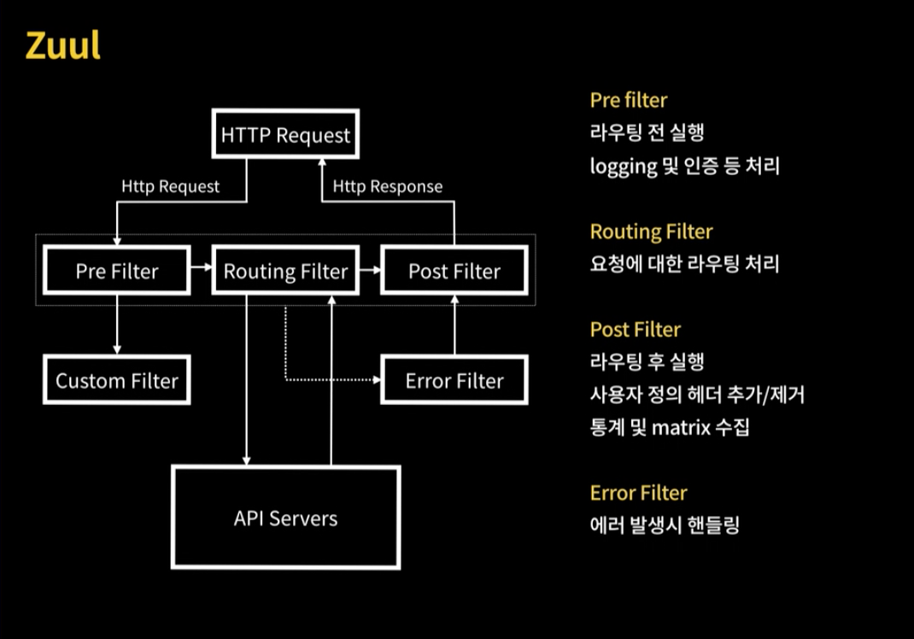
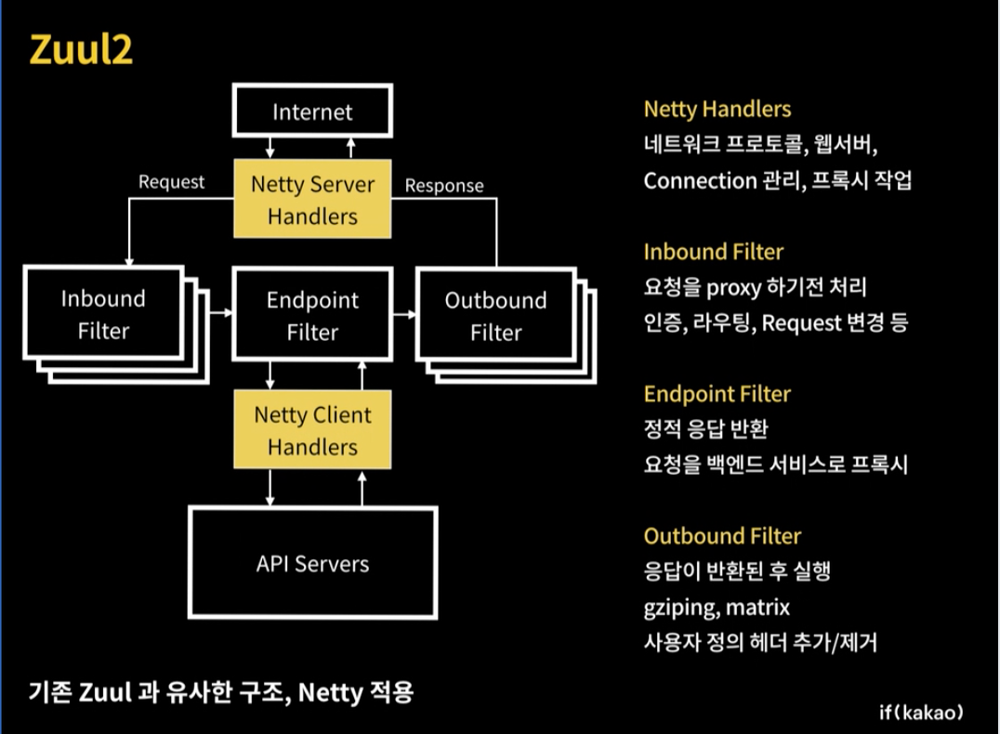
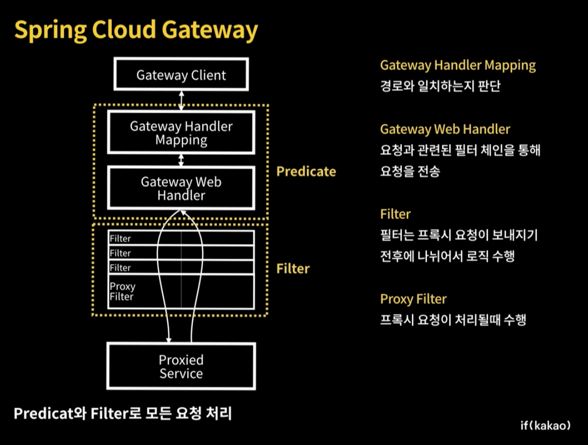
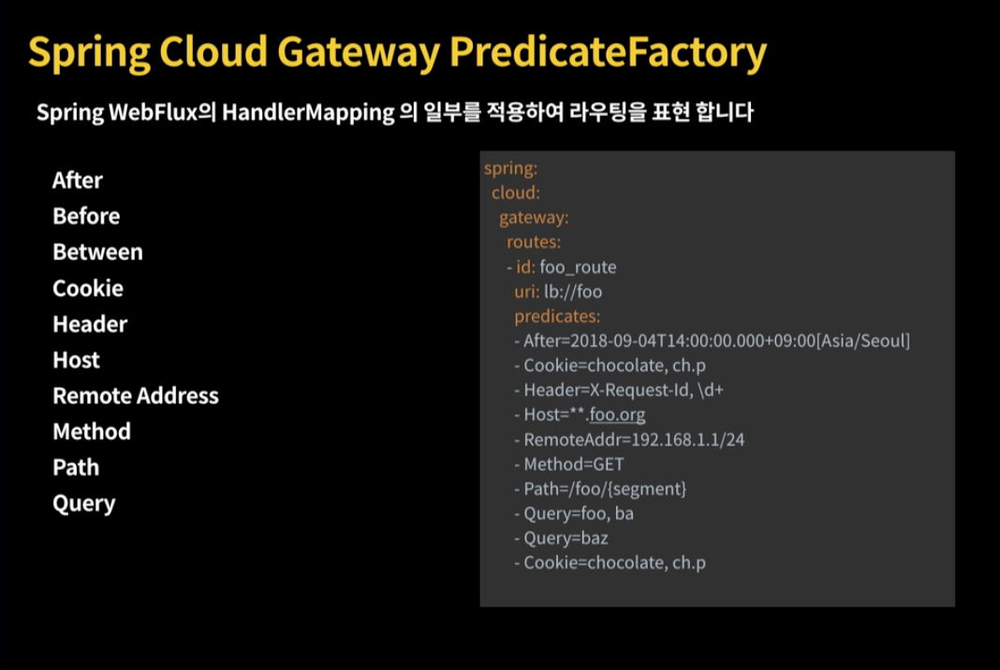
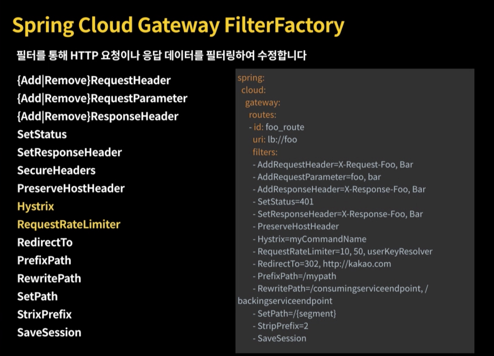

# API Gateway

<!--[TOC levels=6]-->

## Table of Contents
- [Netflix OSS](#netflix-oss)
  - [EUREKA](#eureka)
  - [RIBBON](#ribbon)
  - [HYSTRIX](#hystrix)
  - [ZUUL](#zuul)
    - [ZUUL 1](#zuul-1)
    - [ZUUL 2](#zuul-2)
    - [Spring Cloud Gateway](#spring-cloud-gateway)
- [Authentication / Authorizer](#authentication--authorizer)
  - [인증 및 권한 부여 방법](#인증-및-권한-부여-방법)
    - [고정 세션 관리 (Sticky Session)](#고정-세션-관리-sticky-session)
    - [세션 복제 (Session Replication)](#세션-복제-session-replication)
    - [중앙 집중식 세션 (Centralized Session Storage)](#중앙-집중식-세션-centralized-session-storage)
    - [클라이언트 토큰](#클라이언트-토큰)
    - [SSO](#sso)
    - [API Gateway를 통한 클라이언트 토큰](#api-gateway를-통한-클라이언트-토큰)
      - [Gateway의 인가](#gateway의-인가)
  - [JWT](#jwt)
    - [Header](#header)
    - [Body](#body)
    - [Signature](#signature)

## Api Gateway의 역할과 목적
- API Routing
- Authorize, Authentication 처리 담당
- 과도한 요청으로 부터 보호 및 제한
- Logging
- Statistic (통계)
- 응답 데이터를 변환하여 사용자와 서비스간 중계역할

## Netflix OSS
### EUREKA
 다른 많은 서비스를 등록하고 관리
 유레카 아이디만 던지면 서버 목록을 받을 수 있음

### RIBBON
로드밸런싱 역할을 하는 모듈
기본값으로 라운드 로빈 방식을 사용
서비스 아이디로 서버를 등록하고 서비스 아이디를 줄에 연결하는 방식

로드밸런서에서 서버목록을 가지고 있는데 두가지 타이머가 있다.
- 서버목록을 주기적으로 갱신
	- 유레카를 사용하면 interval마다 갱신
	- 유레카를 사용하지 않으면 listOfService에 있는 목록을 갱신 (서버목록이 바뀌지 않는다면 체크하지 않음))
- 핑
	- 서버가 살아있는지 주기적으로 날리는 역할
	- Default로 설정되어있는건 Dummy Ping으로 설정되어 무조건 살아있다고 전달해줌.
	- AvailabilityFilteringRule로 변경 필요 (Round Robin 방식과 같지만 서버 목록을 갱신하면서 )

Default가 더미ping

### HYSTRIX
Circuit Break
장애로 부터격리시킬 수 있음
격리 방식은 세마포어, 스레드 방식이 있음


타임아웃을 설정할때는 리본의 다음과 같은 타임아웃의 합보다 커야한다.
(읽기시간 + 커넥션시간) * 재시도 횟수 * 재시도 서버 수
- ConnectionTimeout
- ReadTimeout

서킷브레이크 오픈되는 조건
- 감시시간 (default : 10)
- 감시사간내의 요청 수 (default : 20)
- 요청대비 오류율 (default : 50)


### ZUUL
게이트웨이를 담당

#### ZUUL 1


- Blocking API
- Servlet 2.5
- Websocket not Support

#### ZUUL 2


- Netty Server
- Http/2
- Protection
- Limit Rate
- Websocker Support
- Origin Concurrency

#### Spring Cloud Gateway

- Filter
- Redicate
- Spring Flux
- Limit Rate
- ping Cloud
- Non-Blocking
- Websocket Support
- Spring Framework 5

```
redis-rate-limiter.replenishRate: drop 없이 사용자당 처리 가능한 초당 요청수
redis-rate-limiter.burstCapacity: 사용자당 허용된 초당 요청 수 (0이면 모두 탈락)
```

Token_Bucket



## Authentication / Authorizer
가장 크게 두개로 나뉨 세션관리(서버에 저장)와 토큰관리 (사용자 브라우저에 저장)

### 인증 및 권한 부여 방법
#### 고정 세션 관리 (Sticky Session)
특정 사용자의 모든 요청이 동일한 서버로 계속 전송되게 하는방식
로드밸런서에 의해 강제 리로드시 모든 사용자의 세션 아이디가 손실

#### 세션 복제 (Session Replication)
각 인스턴스가 모든 세션 데이터를 저장하고 네트워크를 통해 동기화 됨
인스턴스가 증가할 수록 많은 대역폭이 필요

#### 중앙 집중식 세션 (Centralized Session Storage)
공유 세션 저장소에서 사용자 데이터를 엑세스
가용성과 확장성이 좋은편이지만 세션 저장소에 대한 보안 메커니즘이 필요

#### 클라이언트 토큰
정보 인증을 사용자 브라우저에 저장
보통 쿠키 형태로 저장됨
위, 변조가 불가하도록 암호화  필요
시스템마다 인증 처리 필요

#### SSO
SSO 인증서버에 한번 로그인 하면 여러 시스템에서 추가 인증 프로세스 없이 접근 가능
유저가 접근시마다 SSO 서버와 상호 작용 필요
인증을 위한 반복적인 네트워크 트래픽을 사용

#### API Gateway를 통한 클라이언트 토큰
게이트웨이에서 인증정보 처리
위, 변조가 불가하도록 암호화 필요

##### Gateway의 인가
Spring Security에 전부 맵핑하여 사용
Gateway의 목록이 많아졌을대는 따로 처리하는 방법 고민 필요


### JWT
`Header`, `Body`, `Signature` 부분으로 나뉘어져있고
이를 각 `.`으로 구분지어 Base64로 인코딩하여 놓는다.
알고리즘으로 암호화하여 클라이언트 변조 막고
특정 아이피 주소로 JWT 방행 브라우저 핑거프린트 등을 이용하여 토큰 탈취 방어를 강화 할 수 있음
쿠키처럼 특정 도메인에서만 사용할 수 있는 단점을 해소
토큰 자체에 만료시간이 기술 되어있음

> **Refresh Token**
> - Access Token을 재발급 하는데 필요한 정보를 포함
> - 만료될 수 있으며 일반적으로 오랜기간 사용됨
> - 누출되지 않도록 엄격한 관리가 필요
> - 발급된 IP 기준으로 제한을 두거나 브라우저 핑거프린터 정보등을 통해 유효성 확인 필요

> **Access Token**
> - 자원에 직업  Access 하는데 필요한 정보를 포함
> - 클라이언트의 권한 부여 여부를 판단
> - 만료날짜가 있으며 토큰 수명이 짧음

#### Header
암호화 방식을 저장

#### Body
토큰을 통해서 전달하고자 하는 정보
누구나 열어볼 수 있어 민감한 정보는 안넣는게 좋다
만료시간도  Body에 넣는다.

#### Signature
secrey 키는 서버에 저장되어있어 위,변조를 확인 가능


> 참고
> https://tv.kakao.com/channel/3150758/cliplink/391419714