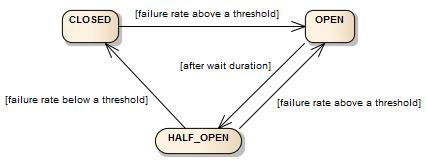

# Resilience4J

> Resilience4j is a lightweight, easy-to-use fault tolerance library inspired by Netflix Hystrix.

`Hystrix`로부터 영감을 받아 만들어진 `fault tolerance library`이며 Maintenance Mode 로 들어간 `Hystrix`이후 주목을 받는 대체제이다.

> `Hystrix` Github 에서도 `Resilience4j`를 사용하기를 권장하고있다.

Resilience4j에는 다음과 같은 구현체들이 존재한다.
- Circuit Breaker
- Rate Limier
- Bulkhead
- Time Limiter
- Retry
- Cache

## CircuitBreaker



CircuitBreaker는 `CLOSED`, `OPEN` 및 `HALF_OPEN`의 세 가지 정상 상태와 `DISABLED` 및 `FORCED_OPEN`의 두 가지 특수 상태가있는 유한 State Machine을 통해 구현되어
바운더리 이외의 서비스에서 장애가 발생하더라도 해당 서비스에까지 장애가 전파되지않도록 막아주는 역할을 하는 기능을 수행하게 된다.

CircuitBreaker는는 슬라이딩 윈도우를 사용하여 호출 결과를 저장하고 집계하는 방식으로 크게 두가지의 방식이 있다.
- 카운트 기반 슬라이딩 윈도우 : 마지막 N 개 호출의 결과를 집계
  - fixed Size circular array
- 시간 기반 슬라이딩 윈도우 : 마지막 N 초의 호출 결과를 집계
  - N partial aggregations (buckets)
  - 각 버킷에서 발생하는 결과를 시간별(Epoch)로 집계
  - 새로운 버킷이 들어올때마다 마지막 버킷은 삭제되는 방식


||Histrix|Resilience4j는|
|:--|:--|:--|
|사용|외부 API를 호출할때마다 일일이 HystrixCommand로 감싸서 사용|higher-order functions(decorator)를 제공|
|half-open|단 하나의 요청으로 판단|threshold 조건 설정이 가능|
|RxJava operators|미지원|지원|

### CircuitBreaker Config
||Description|Default|
|:--|:--|:-:|
|failureRateThreshold|CirucitBreaker를 열지 결정하는 failure rate threshold percentage|50(%)|
|slowCallRateThreshold|`slowCallDurationThreshold`에 설정된 조건에 걸리는 failure rate threshold percentage|100(%)|
|slowCallDurationThreshold|요청에 대한 임계값 시간을 지정|60000(ms)|
|permittedNumberOfCallsInHalfOpenState|CircuitBreaker가 반쯤 열려있을 때 허용되는 호출 수|10|
|maxWaitDurationInHalfOpenState|HALF-OPEN 상태를 유지하는 기간<br/> 0은 무한을 의미|0|
|slideWindowType|CircuitBreak가 걸리는 조건의 타입을 의미 COUNT_BASED, TIME_BASED|COUNT_BASED|
|minimumNumberOfCalls|CircuitBreaker가 OPEN 상태를 판단해야 하는 최소한의 요청 수 <br/> 10으로 설정되어있으면 9개가 실패여도 OPEN으로 변경되지 않음|100|
|waitDurationInOpenState|CircuitBreaker가 OPEN에서 HALF-OPEN으로 전환되는데 걸리는 시간|60000(ms)|
|automaticTransitionFromOpenToHalfOpenEnabled|true: waitDurationInOpenState 시간 이후에 바로 HALF_OPEN 으로 전환 <br/> false: waitDurationInOpenState 시간 이후에 추가적인 호출이 성공적인 상태여야 OPEN으로 전환이된다. |false|
|recordExceptions|failure count를 증가시켜야하는 exception list||
|ignoreExceptions|failure count를 증가시키지 않고 무시하는 exception list||
|recordException|Failure Count를 증가시키는 Predicate를 정의<br/>true를 return할 경우, failure count를 증가|throwable-> true|
|ignoreException|Failure Count를 무시하 Predicate를 정의<br/>true를 리턴하는경우 무시|throwable-> false|

`recordExceptions`와 `ignoreExceptions`가 동시에 등록되었을때는 `ignoreExceptions`가 우선시된다. [link](https://github.com/resilience4j/resilience4j/blob/master/resilience4j-circuitbreaker/src/main/java/io/github/resilience4j/circuitbreaker/internal/CircuitBreakerStateMachine.java#L226)
`recordExceptions`와 `ignoreExceptions` 선언된것들도 나중에는 전부 predicate 형태로 컨버팅되어 관리된다.


### ThreadSafe
- CircuitBreaker의 상태는 AtomicReference에 저장됩니다.
- CircuitBreaker는 원자 연산을 사용하여 부작용없는 기능으로 상태를 업데이트합니다.
- Sliding Window에서 Recording calls 및 Snapshot 읽기가 동기화됩니다.

하지만 CircuitBreaker는 함수 호출을 동기화하지 않아 순간적인 병목현상이 발생할 수 있는 여지가 있다.
Sliding Window 갯수가 설정되어있다고 그 설정값만큼 호출가능한 스레드 수 보장해 주지 않는다.
동시 스레드 수를 제한하려면 벌크 헤드를 사용하십시오. 벌크 헤드와 CircuitBreaker를 결합 할 수 있습니다.


### 사용방법
#### 일반적인 사용 방법
``` java
// Create a custom configuration for a CircuitBreaker
CircuitBreakerConfig circuitBreakerConfig = CircuitBreakerConfig.custom()
  .failureRateThreshold(50)
  .slowCallRateThreshold(50)
  .waitDurationInOpenState(Duration.ofMillis(1000))
  .slowCallDurationThreshold(Duration.ofSeconds(2))
  .permittedNumberOfCallsInHalfOpenState(3)
  .minimumNumberOfCalls(10)
  .slidingWindowType(SlidingWindowType.TIME_BASED)
  .slidingWindowSize(5)
  .recordException(e -> INTERNAL_SERVER_ERROR
                 .equals(getResponse().getStatus()))
  .recordExceptions(IOException.class, TimeoutException.class)
  .ignoreExceptions(BusinessException.class, OtherBusinessException.class)
  .build();

// Create a CircuitBreakerRegistry with a custom global configuration
CircuitBreakerRegistry circuitBreakerRegistry = 
  CircuitBreakerRegistry.of(circuitBreakerConfig);

// Get or create a CircuitBreaker from the CircuitBreakerRegistry 
// with the global default configuration
CircuitBreaker circuitBreakerWithDefaultConfig = 
  circuitBreakerRegistry.circuitBreaker("name1");

// Get or create a CircuitBreaker from the CircuitBreakerRegistry 
// with a custom configuration
CircuitBreaker circuitBreakerWithCustomConfig = circuitBreakerRegistry
  .circuitBreaker("name2", circuitBreakerConfig);

```
##### instance별 CircuitBreaker 설정 지정
``` java
CircuitBreakerConfig circuitBreakerConfig = CircuitBreakerConfig.custom()
  .failureRateThreshold(70)
  .build();

circuitBreakerRegistry.addConfiguration("someSharedConfig", config);

CircuitBreaker circuitBreaker = circuitBreakerRegistry
  .circuitBreaker("name", "someSharedConfig");

```
##### CircuitBreaker 설정 확장
``` java
CircuitBreakerConfig defaultConfig = circuitBreakerRegistry
   .getDefaultConfig();

CircuitBreakerConfig overwrittenConfig = CircuitBreakerConfig
  .from(defaultConfig)
  .waitDurationInOpenState(Duration.ofSeconds(20))
  .build();
```
##### instance별 허용하는 Exception을 달리하고싶은 경우
``` java
// Create a custom configuration for a CircuitBreaker
CircuitBreakerConfig circuitBreakerConfig = CircuitBreakerConfig.custom()
  .recordExceptions(IOException.class, TimeoutException.class)
  .ignoreExceptions(BusinessException.class, OtherBusinessException.class)
  .build();

CircuitBreaker customCircuitBreaker = CircuitBreaker
  .of("testName", circuitBreakerConfig);
```


### Decorator 등록
``` java
// Given
CircuitBreaker circuitBreaker = CircuitBreaker.ofDefaults("testName");

// When I decorate my function
CheckedFunction0<String> decoratedSupplier = CircuitBreaker
        .decorateCheckedSupplier(circuitBreaker, () -> "This can be any method which returns: 'Hello");

// and chain an other function with map
Try<String> result = Try.of(decoratedSupplier)
                .map(value -> value + " world'");

// Then the Try Monad returns a Success<String>, if all functions ran successfully.
assertThat(result.isSuccess()).isTrue();
assertThat(result.get()).isEqualTo("This can be any method which returns: 'Hello world'");
```

### EventPublisher 등록 및 Log 사용법
``` java
CircuitBreakerRegistry circuitBreakerRegistry = CircuitBreakerRegistry.ofDefaults();
circuitBreakerRegistry.getEventPublisher()
  .onEntryAdded(entryAddedEvent -> {
    CircuitBreaker addedCircuitBreaker = entryAddedEvent.getAddedEntry();
    LOG.info("CircuitBreaker {} added", addedCircuitBreaker.getName());
  })
  .onEntryRemoved(entryRemovedEvent -> {
    CircuitBreaker removedCircuitBreaker = entryRemovedEvent.getRemovedEntry();
    LOG.info("CircuitBreaker {} removed", removedCircuitBreaker.getName());
  });
```
``` java
circuitBreaker.getEventPublisher()
    .onSuccess(event -> logger.info(...))
    .onError(event -> logger.info(...))
    .onIgnoredError(event -> logger.info(...))
    .onReset(event -> logger.info(...))
    .onStateTransition(event -> logger.info(...));
// Or if you want to register a consumer listening
// to all events, you can do:
circuitBreaker.getEventPublisher()
    .onEvent(event -> logger.info(...));
```
