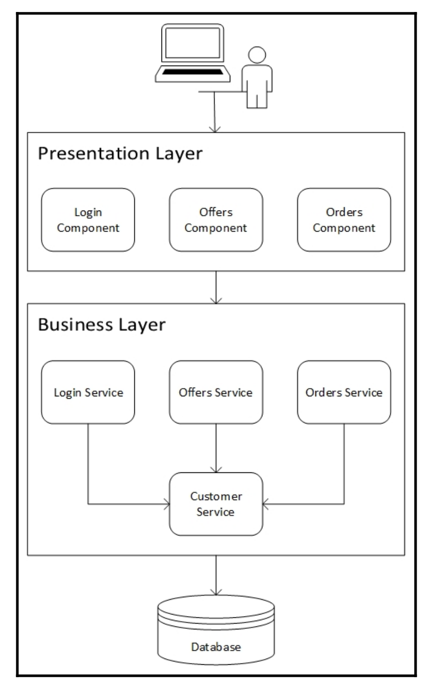
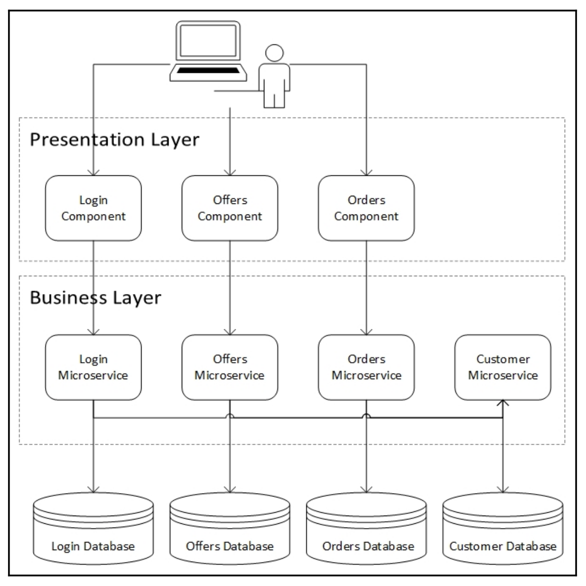
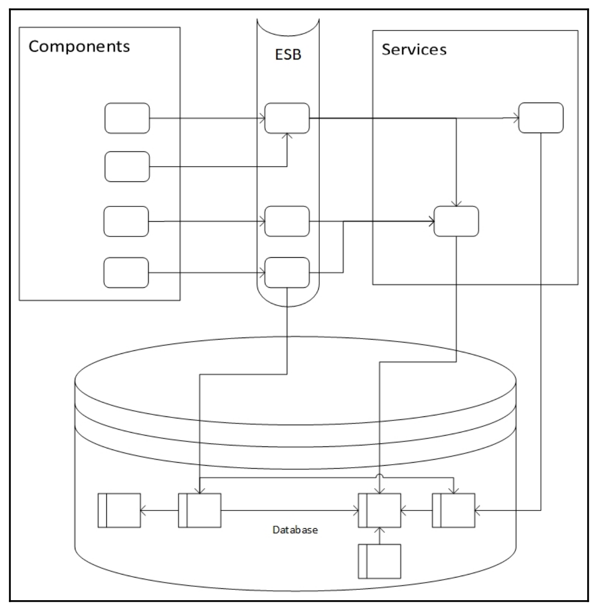
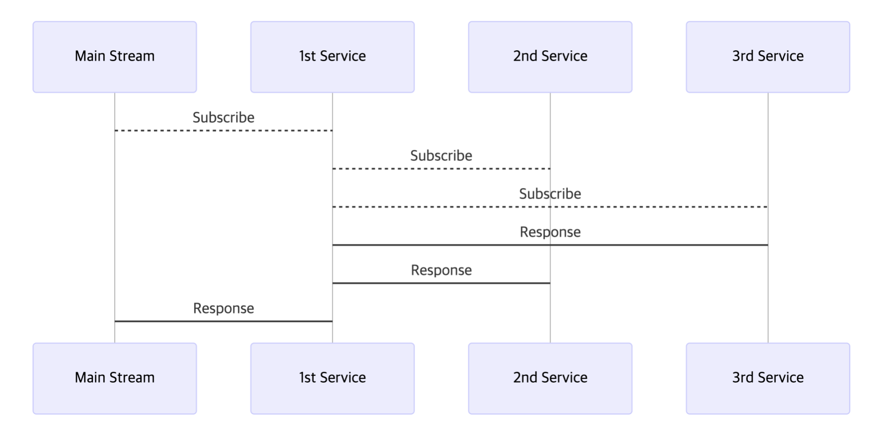

# 마이크로 서비스의 이해
마이크로 서비스에는 정해진 아키텍쳐가 없음

<!--[TOC]: # "## Table of Contents"-->

## Table of Contents
- [1. 마이크로 서비스란](#1-마이크로-서비스란)
  - [1.1 SoA](#11-soa)
    - [1.1.1 SoA의 서비스 속성](#111-soa의-서비스-속성)
    - [1.1.2 SoA와 마이크로서비스의 차이점](#112-soa와-마이크로서비스의-차이점)
  - [1.2 일체형에서 마이크로서비스로](#12-일체형에서-마이크로서비스로)
    - [1.2.1 관심사의 분리 SoC](#121-관심사의-분리-soc)
    - [1.2.2 엔터프라이즈 서비스 버스](#122-엔터프라이즈-서비스-버스)
- [2 마이크로 서비스의 원칙](#2-마이크로-서비스의-원칙)
  - [2.1 설계 원칙 정의](#21-설계-원칙-정의)
- [3 DDD](#3-ddd)
  - [3.1 DDD란?](#31-ddd란)
  - [3.2 DDD 사용하기](#32-ddd-사용하기)
    - [유비쿼터스 언어 (Ubiquitous Language)](#유비쿼터스-언어-ubiquitous-language)
    - [경계된 컨텍스트 (Bounded Context)](#경계된-컨텍스트-bounded-context)
    - [컨텍스트 맵핑 (Context Mapping)](#컨텍스트-맵핑-context-mapping)
    - [컨텍스트 모델 (Context Model)](#컨텍스트-모델-context-model)
- [4 리액티브 마이크로서비스](#4-리액티브-마이크로서비스)
  - [4.1 리액티브 선언문](#41-리액티브-선언문)
  - [4.2 Reactive Framework](#42-reactive-framework)
- [5. 클라우드](#5-클라우드)
  - [5.1 Service Model](#51-service-model)
    - [IaaS (Infrastructure as a Service)](#iaas-infrastructure-as-a-service)
    - [PaaS (Platform as a Service)](#paas-platform-as-a-service)
    - [SaaS (Software as a Service)](#saas-software-as-a-service)

## 1. 마이크로 서비스란
마이크로 서비스는 모듈 방식으로 세분화된 기능을 제공하는 느슨하게 결합된 서비스
관심사항을 물리적으로 분리해 독립적으로 설계, 개발, 테스트, 배포 할 수 있다
이런 모듈화 특성으로 인해, 마이크로서비스는 애자일 방법론과 데브옵스 문화를 수요하는 소규모의 **교차기능(cross-functional)**팀에서 만들 수 있으며, **지속적인 배포(Continuous Delivery)**와 **배포(Deployment)**의 이상적인 후보가 된다.
> `DevOps`는 소프트웨어 개발 및 배포 프로세스로 제품 관리, 소프트웨어 개발, 운영 전문가 간의 커뮤니케이션고 협업을 강조한다.

독립적으로 확장, 모니터링, 제어할 수 있기 때문에 클라우드 아키텍처에 최대한 활용 가능

### 1.1 SoA
서비스 지향 아키텍쳐 (Service Oriented Architechure)
애플리케이션 컴포넌트 기반으로 만들어지며 이 컴포넌트는 원격에서 엑세스할 수 있는 개별 기능을 가지는 일련의 서비스들로 이뤄진다.
서비스는 SoA의 토대가 되며, 마이크로서비스의 경우도 마찬가지

#### 1.1.1 SoA의 서비스 속성

- 논리적으로 특정 결과를 갖는 비즈니스 활동을 상징한다.
- 자기완비적이다 (Self-contained)
- 서비스 사용자에게는 블랙박스다.
- 다른 기본 서비스를 활용해 구성할 수 있다.

전형적인 n-티어 아키텍처에서 어플리케이션은 3개의 레이어로 나뉜다.
- 프레젠테이션 레이어 : 사용자를 위한 UI
- 비즈니스 레이어 : 비즈니스 기능을 위한 도메인 로직을 구현한 서비스
- 데이터 레이어 : 도메인 모델을 관리

SoA의 이점
- 표준화된 서비스 계약 : 컴포넌트로 쉽게 통합할 수 있다.
- 재사용성 : 서비스가 서로에게 책임을 위임할 수 있게 한다.
- 비즈니스 가치 : 비즈니스 기능을 구현한다.
- 복잡성 은닉 : 데이터베이스를 변경해야 하는 경우 클라이언트는 영향을 받지 않는다.
- 자율성 : 각 레이어는 분리가 가능하며 원격에서 엑서스할 수 있다.

#### 1.1.2 SoA와 마이크로서비스의 차이점

마이크로 서비스는 SoA로 부터 진화했지만 다르점이 있다.
위 아키텍처에서는  논리적으로는 완전히 분리 되어있고 서로 묶이지 않는다.
UI 컴포넌트 조차 완전히 별도의 배포 가능한 모듈이 될 수 있다.
각각의 컴포넌트별로 데이터를 소유하면서 서로 영향을 주지 않으면서 변경할 수 있다. 이는 애플리케이션의 다른 부분에 영향을 미치지 않으면서 테스트와 파이프라인에 데이터를제공할 수 있기 때문에 지속적인 통합과 전달이 필요할 때 두드러지는 기능이다.
 마이크로서비스를 구축하는 개발언어, 플랫폼, 기술의 범위를 다양화 할 수 있다.
  완전히 독립적이기 떄문에 각 비즈니스 요구에 따라 다른 데이터베이스를 사용하거나 특정 요구 사항을 보다 쉽게 적응하는데 필요한 기술을 사용할 수 있다.
  또 마이크로 서비스는 모듈 방식이므로 독립적으로 배포할 수 있고 각 모듈의 출시 주기가 다를 수 있다.

- 컴포넌트별로 논리적으로 분리되어있음
- 각각의 컴포넌트별로 데이터를 소유하면서 서로에게 영향을 주지 않으면서 변경 할 수 있다.
- 각 컴포넌트를 구축하는 개발언어, 플랫폼, 기술의 범위를 자유롭게 할 수 있다. (각 특성별 언어,  DB, 환경 구성 가능)
- 모듈 방식으로 독립적으로 배포 가능 하며 각 모듈의 출시 주기가 다르다.
- Scale-Up Scale-Out의 성격에 다른 컴퍼넌트 분리화가 가능하다.

### 1.2 일체형에서 마이크로서비스로
SoA에서 MSA로 진화하게 된 이유는 일체형(Monolith)이 가지는 문제 때문이다.
어플리케이션이 작음으로써 생기는 프레젠테이션 로직과 비즈니스 로직이 결합되어 도메인 모델이 복잡해지고 이로인해 많은 소프트웨어 패턴도 생겨났다.

#### 1.2.1 관심사의 분리 SoC
Separation of Concerns
소프트웨어를 고유 영역으로 분리해서 각 영역이 단 하나의 관심사만 처리하도록 하는 설계 원칙
그러나 소프트웨어 뿐만 아니라 아키텍쳐도 분리해야 한다. SoA가 이와 같은 문제를 해결할 목적으로 설계 되었고 복잡성을 블랙박스 뒤에 숨겨서 아키텍처를 모듈화하고 복잡성을 해결 하였다.

#### 1.2.2 엔터프라이즈 서비스 버스
상세한 비즈니스 규칙을 기반으로 하거나 심층 스키마, 복잡한 저장 프로시저, 뷰, 관계 (Relationship)가 있는 강력한 데이터베이스를 기반으로 메인 프레임에 복잡한 데이터 저장소를 만들 수 있다.
ESB는 서비스의 조정, 매핑, 라우팅을 담당하는 소프트웨어 컴포넌트다.
ESB의 전반적인 사상은 메시지를 쉽게 조정할 수 있는 강력한 컴포넌트를 갖추는 것
복잡한 애플리케이션은 대부분의 요소를 사용해 서비스를 설계하기 때문에 복잡한 관계가 만들어진다.

특정 서비스 또는 스키마의 테이블 하나를 변경하려면 많은 사이트 이펙트가 발생하기에 이러한 종속적인 관계를 변경해야 하는것은 쉬운 작업이 아니기 떄문에 출시 주기가 길어진다.

## 2 마이크로 서비스의 원칙

### 2.1 설계 원칙 정의
- 비즈니스 역량 중심 모델
- 느슨한 결합
- 단일 책임
- 구현 은닉
- 격리
- 독립적인 배포 가능
- 실패를 위한 빌드
	- 업스트림
		- 서비스를 사용하는 소비자에게 어떻게 오류를 알릴 것인지 또는 알리지 않을것인지에 대한것
		- 항상 커플링은 피할것
	- 다운스트림
	- 
		- 우리가 사용하는 다른 서비스나 데이터베이스 같은 시스템이 장애를 일으킬 때 어떻게 대응하느냐 하는 것
	- 로깅
		- 장애를 기록하는 방법으로 로그를 남기는 빈도와 정보의 양 그리고 액세스 방법을 고려해야 한다.
		- 민감한 정보와 성능 영향에 대해 각별히 주의해야 한다.
	- 모니터링
		- 모니터링은 신중하게 설계해야 한다. 모니터링 시스템에 올바른 정보 없이 장애를 처리하는 것은 문제가 심각한 상황
		- 어플리케이션의 어떤 요소가 의미 있는 정보인지 고려
	- 경고
		- 무언가 잘못되고 있음을 알리는 신호로 모니터링에 대한 링크와 로깅에 대한 이해를 돕는 것이지만애플리케이션을 잘 설계하려면 이상한 것을 경고하는 것만으로는 충분하지 않다. 이상 신호에 대한 더 싶은 연관 분석이 요구된다.
	- 복구
		- 장애가 발생했을시 어떻게 정상 상태로 되도릴ㄹ 것인지를 설계하는 것
		- 자동복구를 목표로 하지만 자동 복구가 실패할 수 있기 때문 수동 복구도 고려해야 한다.
	- 폴백
		- 아키텍쳐 내부의 문제가 다른곳에 영향 끼치지 않게 방지하기 위한 일반적인 패턴
		- 장애가 있더라도 기본적인 응답은 할 수 있도록 설계
- 확장성
	- 독립적으로 확장 가능하게 설계
	- SoA는 각 서비스들이 모여있는 레이어의 단위로 확장 가능하지만 MSA는 컴포넌트 단위로 확장 가능
- 자동화
	- 구축, 서비스, 배피, 모니터링에 이르기까지 자동화를 염두에 두고 설계해야 한다.
	- 자동화에 드는 비용은 낮아야 하며 이점은 높아야한다.
	- 지속적인통합, 지속적인 전달 (CI/CD)은 아키텍쳐 초기 단계부터 설계 되어야 한다.

## 3 DDD
도메인 주도 설계 Domain Driven Design

### 3.1 DDD란?
도메인으로 경계지어진 진화하는 복잡한 모델을 다루는 소프트웨어 개발 방안.
모델이 적용되는 컨텍스트를 정의
팀 조직, 어플리케이션의 특정부분, 코드베이스와 데이터베이스 스키마 같은 물리적인 측면에서 명시적인 경계를 설정하고 이 경계 안에서 모델을 엄격히 일관되게 유지

### 3.2 DDD 사용하기

#### 유비쿼터스 언어 (Ubiquitous Language)
도메인 모델뿐만 아니라 도메인 로직, 아키텍처에도 유비쿼터스 언어가 사용돼야 한다.
유비쿼터스 언어를 사용하지 않을시
- 각자의 언어로 얘기를 하기 때문에 토론이 되지 않는다.
- 용어와 코드의 정보가 단절된다.
- 번역은 의사소통을 무디게 하고 지식탐구를 빈약하게 만든다.

#### 경계된 컨텍스트 (Bounded Context)
하나 이상의 경계된 컨텍스트를 포함하는 마이크로서비스를 만들지 말아야 한다.
전체 컨텍스트를 하나의 마이크로 서비스에 매핑할 수 있으면 좋다.
이는 컨텍스트가 실제로 경계되어 있음을 나타내는 것이다.

#### 컨텍스트 맵핑 (Context Mapping)
마이크로 서비스의 의존성과 결합을 이해하기 위해 전체 시스템의 컨텍스트 매핑을 검토

#### 컨텍스트 모델 (Context Model)
마이크로서비스가 사용하는 모델은 경계된 컨텍스트 내에서 정의되어야 하며 유비쿼터스 언어를 사용해야 한다.

> 마이크로서비스는 비즈니스 역량을 중심으로 모델링되며, 컨텍스트 매핑에서 보여주는 바와 같이 컨텍스트 도메인은 느슨하게 연결되며, 경계된 컨텍스트로서 단일 책임을 갖게 된다.
> 경계된 컨텍스트를 구현한 마이크로서비스는 구현을 쉽게 은닉할 수 있으며, 자연히 격리되므로 독립적으로 배포할 수 있다. 이런 원칙이 적용하면 쉽게 장애에 대비한 확장성과 자동화 기능을 구현할 수 있다.

## 4 리액티브 마이크로서비스
스프링 프레임워크 5.0 에서 새로 나온 새로운 패러다임
요청이 많아지면 그만큼 스레드가 늘어나는데 그 한계에 대비하여 나온 비동기 프로그래밍

### 4.1 리액티브 선언문
- 응답성 (Responsive)
	- 응답성 있는 시스템은 신속하고 일관성 있는 응답 시간을 제공
	- 신뢰할 수 있는 상한선을 설정하여 일관된 서비스 품질을 제공
	- 이러한 일관된 동작은 오류 처리를 단순화하고, 일반 사용자에게 신뢰를 조성하고, 새로운 상호작용을 촉진
- 복원성 (Resilient)
	- 복원성이 없는 시스템은 장애가 발생할 경우 응답성을 잃게 됩니다. 탄력성은 복제, 봉쇄, 격리, 위임에 의해 실현
	- 시스템이 부분적으로 고장이 나더라도, 전체 시스템을 위험하게 하지 않고 복구 할 수 있도록 보장
	- 각 구성 요소의 복구 프로세스는 다른(외부의) 구성 요소에 위임되며 필요한 경우 복제를 통해 고가용성이 보장

- 탄력성 (Elastic)
	- 다양한 워크로드 상황에도 응답성을 오지하기 위해서 확장성 원칙을 효고적으로 적용 할 수 있지만 내부적으로 시스템 자체가 할당하는 리소스를 늘리거나 줄일 수 있어야함
	- 리액티브 시스템에서는 서비스가 필용에 따라 더 많은 리소스를 동적으로 가져오거나 필요하지 않을때 리소스를 반환할 수 있다.
- 메시지 기반 (Message Driven)
	- 한 서비스는 정보를 얻기 위해 다른 서비스를 구독하고 두 번째 서비스는 몇 가지 추가 서비스를 구독해서 데이터를 결합하고 이를 원래 서비스로 반환하도록 만들 수 있다.

### 4.2 Reactive Framework
- Reactive Extensions (ReactiveX or Rx)
	- 옵저버 패턴을 이용해 넌블록킹 작업을 수행한다.
- Project Reactor
	- 리액티브 스트림 사양을 따르는 JVM 리액티브 라이브러리로 리액티브 애플리케이션을 쉽게 만들 수 있는 고수준 라이브러리를 제공
	- 스프링 프레임워크 5.0은 프로젝트 리액터를 광범위하게 사용
- Java Reactive Streams
	- 자바 9 부터 플랫폼에서 리액티브 스트림을 구현하고 있으며 일부 프로젝트에서는 기존 Rx 코드를 자바 9 라이브러리로 마이그레이션 진행 중이다.
- Akka
	- 스칼라를 사용하여 만들었으며 JVM상에서 동시성과 분산 어플리케이션을 만드는 툴킷.
	- 액터 기반 모델을 강조하며 확장성이 뛰어난 분산 어플리케이션을 지원하는것이 입증되었다.

## 5. 클라우드
### 5.1 Service Model
#### IaaS (Infrastructure as a Service)
네트워킹, 데이터 파티션, 확장, 보안, 배겁 같은 저수준의 세부 사항을 관리 할 수 있는 고급 API 또는 FrontEnd를 제공
- Amazon Web Service
- Google Compute Engine
- Microsoft Azure Virtual Machines
- Red Hat OpenStack
#### PaaS (Platform as a Service)
어플리케이션 유형, 프레임워크, 프로그래밍 언어의 표준 템플릿 제공
- Google APp Engine
- Bluemix
- Microsoft Azure Cloud Service
- Pivotal Cloud Paundry
- Red Hat OpenShift
#### SaaS (Software as a Service)
- Google G Suite
- Microsoft Office 365
- Salesforce

