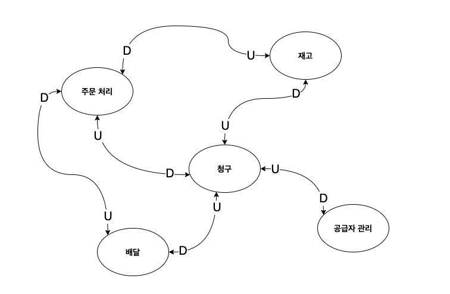
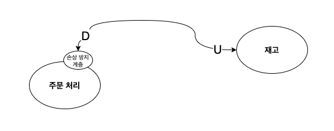
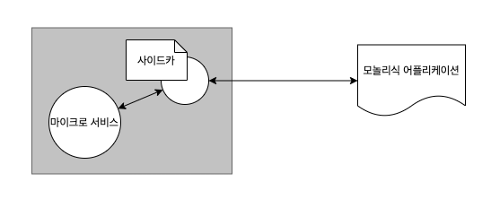
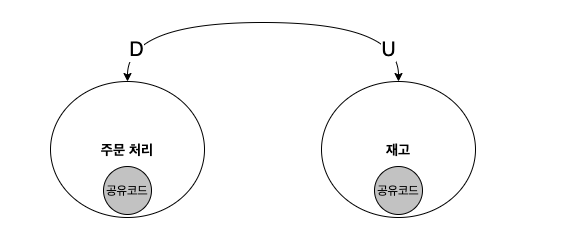
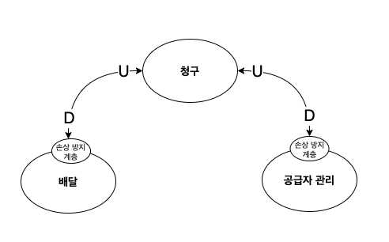
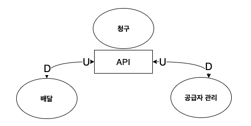

# 03. 마이크로 서비스 디자인
도메인 주도 디자인 DDD 방식으로 MSA 적용하는것이 매우 중요

DDD의 핵심 원리 중 하나는 분할 및 정복 (divide and conquer)

## Event Driven 
이벤트를 사용한 서비스 간 통신은 서비스 간 통신에서 일반적으로 사용되는 패턴 중 하나.

Event Driven 은 종종 분산 처리 시스템과 연결되어 언급

분산 처리 시스템에 Event Driven을 엮어 느슨한 결합을 지원하고 유연성, 탄력성, 확장성 있는 시스템을 구현

### EDM (Event Driven MicroService)
- Event Driven MicroService(EDM)에서는 발생된 이벤트는 반드시 보관되어야함
- 보관된 이벤트는 데이터의 현재 상태를 구성하는 근간이 됨
- 또한, 보관된 이벤트를 바탕으로 장애 발생 또는 특정 요구사항에 따라 지정된 시점으로 복원을 수행
- 이벤트 로그를 보관하는 장소를 이벤트 스토어라 칭함 (ex. Kafka)

> https://medium.com/dtevangelist/event-driven-microservice-%EB%9E%80-54b4eaf7cc4a

## 유비쿼터스 언어
유비쿼터스 언어는 도메인 전문가와 개발자가 서로 공유하는 공유 팀 언어

유비쿼터스는 대화에서 코드까지 어느곳에나 사용되어야함. (실제로는 바운디드 컨택스트 내부에 한해서 사용)

그 이유는 도메인 전문가와 개발자 간의 의사 소통에서 갭을 메워주고 같은 해석을 하게끔 도와줌

소프트웨어 디자인에서 도메인 전문가가 관여하는 단계는 요구 사항 수집 단계에서만 관여한다.

비즈니스 분석가(BA business analyst)는 기술 요구 사항을 포함한 사양으로 변환하여 도메인 전문가와 개발자가 모두 충분히 이해할 수 있는 도메인 모델을 구축

## 바운디드 컨텍스트
MSA에서 가장 중요한것은 서비스의 범위를 지정하는 것
SOA에서는 각각의 도메인을 별도의 서비스로 생각하지 않고 하나의 시스템으로 취급
그렇게 모놀리틱 어플리케이션이 생겨나게되어 관리가 힘들어진다.

MSA를 각각의 마이크로서비스로 범위를 나누는데는 바운디드 컨텍스트로 나뉜다.

바운디드 컨텍스트는 마이크로서비스 디자인의 핵심 요소.

각각의 바운디드 컨텍스트는 다른 컨텍스트와 어떤 모델을 공유 할지 정의하는 명시적인 인터페이스를 가진다.

하나의 도메인이라고 하나의 마이크로 서비스를 가지는건 아니고 여러개의 서비스가 존재 가능

도메인 전문가와 긴밀하게 협업하여 기업 내에서 도메인이 어떻게 동작하는지 정확하게 이해해야한다.

### 역할별 예시
- 주문 처리 
    - 주문 처리 기능 캡슐화
    - 재고 목록의 주문 잠금, 고객 주문에 대한 기록
- 재고
    - 공급 업체로부터 물품을 수령하고 배송을 위해 출하할 때 재고를 업데이트
- 공급자 관리 
    - 공급자 관리 관련 기능을 캡슐화
    - 배송품목을 release 할때 재고 보유량이 충분한지 확인
    - 재고가 충분하지 않을 경우 해당 공급 업체에 통보
    
#### 처리 순서
1. 주문 
    1. `주문`에서 `재고`를 업데이트 
    2. `주문`에서 주문 항목을 잠금
    3. 주문을 배송 준비중으로 변경 
    4. `주문`에서 `ORDER_PROCESSING_COMPLETED` 이벤트 발생
2. 청구
    1. `ORDER_PROCESSING_COMPLETED` 이벤트 수신
    2. 지불 처리 실행
    3. `PAYMENT_PROCESSING_COMPLETED` 이벤트 발생
3. 공급업체관리 
    1. `PAYMENT_PROCESSING_COMPLETED` 이벤트 수신
    2. 재고 항목 수가 최소 임계값을 초과하는지 확인
    3. 부족한 경우 공급 업체에 통지
4. 배달 
    1. `PAYMENT_PROCESSING_COMPLETED` 이벤트 수신
    2. 항목들을 그룹화 하여 주문을 작성 후 배달 준비
    3. `ORDER_DISPATCHED` 이벤트 발생
5. 주문 
    1. `ORDER_DISPATCHED` 이벤트 수신
    2. 주문 상태 배송중으로 업데이트
    
위에 단계처럼 잘 정의된 인터페이스 뒤에 비즈니스 로직이 캡슐화 되면 새로운 변경이 전체 시스템에 영향을 미치지 않음.

마이크로 서비스 간 통신하는 이벤트를 `도메인 이벤트` 라고 명칭

## 컨텍스트 맵
바운디드 컨텍스트가 많아질수록 연결관계가 복잡해지는데
컨텍스트 맵은 그 관계를 시각화하여 나타내는 맵.
콘웨이의 법칙 때문이라도 컨텍스트 맵을 만들어야 하며 서로 어떤 부서와 의사 소통을 해야하는지 보여준다.

아래는 위에 바운디드 컨텍스트에서 설명된 처리순서를 기반으로 작성된 컨텍스트 맵이다.

[comment]: <> (%3CmxGraphModel%3E%3Croot%3E%3CmxCell%20id%3D%220%22%2F%3E%3CmxCell%20id%3D%221%22%20parent%3D%220%22%2F%3E%3CmxCell%20id%3D%222%22%20value%3D%22%EC%A3%BC%EB%AC%B8%20%EC%B2%98%EB%A6%AC%22%20style%3D%22ellipse%3BwhiteSpace%3Dwrap%3Bhtml%3D1%3BfontSize%3D14%3BfontStyle%3D1%22%20vertex%3D%221%22%20parent%3D%221%22%3E%3CmxGeometry%20x%3D%22140%22%20y%3D%22180%22%20width%3D%22120%22%20height%3D%2280%22%20as%3D%22geometry%22%2F%3E%3C%2FmxCell%3E%3CmxCell%20id%3D%223%22%20value%3D%22%EC%9E%AC%EA%B3%A0%22%20style%3D%22ellipse%3BwhiteSpace%3Dwrap%3Bhtml%3D1%3BfontSize%3D14%3BfontStyle%3D1%22%20vertex%3D%221%22%20parent%3D%221%22%3E%3CmxGeometry%20x%3D%22490%22%20y%3D%22120%22%20width%3D%22120%22%20height%3D%2280%22%20as%3D%22geometry%22%2F%3E%3C%2FmxCell%3E%3CmxCell%20id%3D%224%22%20value%3D%22%EC%B2%AD%EA%B5%AC%22%20style%3D%22ellipse%3BwhiteSpace%3Dwrap%3Bhtml%3D1%3BfontSize%3D14%3BfontStyle%3D1%22%20vertex%3D%221%22%20parent%3D%221%22%3E%3CmxGeometry%20x%3D%22354%22%20y%3D%22310%22%20width%3D%22120%22%20height%3D%2280%22%20as%3D%22geometry%22%2F%3E%3C%2FmxCell%3E%3CmxCell%20id%3D%225%22%20value%3D%22%EB%B0%B0%EB%8B%AC%22%20style%3D%22ellipse%3BwhiteSpace%3Dwrap%3Bhtml%3D1%3BfontSize%3D14%3BfontStyle%3D1%22%20vertex%3D%221%22%20parent%3D%221%22%3E%3CmxGeometry%20x%3D%22200%22%20y%3D%22450%22%20width%3D%22120%22%20height%3D%2280%22%20as%3D%22geometry%22%2F%3E%3C%2FmxCell%3E%3CmxCell%20id%3D%226%22%20value%3D%22%EA%B3%B5%EA%B8%89%EC%9E%90%20%EA%B4%80%EB%A6%AC%22%20style%3D%22ellipse%3BwhiteSpace%3Dwrap%3Bhtml%3D1%3BfontSize%3D14%3BfontStyle%3D1%22%20vertex%3D%221%22%20parent%3D%221%22%3E%3CmxGeometry%20x%3D%22570%22%20y%3D%22410%22%20width%3D%22120%22%20height%3D%2280%22%20as%3D%22geometry%22%2F%3E%3C%2FmxCell%3E%3CmxCell%20id%3D%227%22%20value%3D%22%22%20style%3D%22endArrow%3Dclassic%3BstartArrow%3Dclassic%3Bhtml%3D1%3BedgeStyle%3DorthogonalEdgeStyle%3Bcurved%3D1%3B%22%20edge%3D%221%22%20source%3D%226%22%20target%3D%224%22%20parent%3D%221%22%3E%3CmxGeometry%20width%3D%2250%22%20height%3D%2250%22%20relative%3D%221%22%20as%3D%22geometry%22%3E%3CmxPoint%20x%3D%22390%22%20y%3D%22430%22%20as%3D%22sourcePoint%22%2F%3E%3CmxPoint%20x%3D%22440%22%20y%3D%22380%22%20as%3D%22targetPoint%22%2F%3E%3CArray%20as%3D%22points%22%3E%3CmxPoint%20x%3D%22580%22%20y%3D%22350%22%2F%3E%3C%2FArray%3E%3C%2FmxGeometry%3E%3C%2FmxCell%3E%3CmxCell%20id%3D%228%22%20value%3D%22U%22%20style%3D%22edgeLabel%3Bhtml%3D1%3Balign%3Dcenter%3BverticalAlign%3Dmiddle%3Bresizable%3D0%3Bpoints%3D%5B%5D%3BfontSize%3D20%3B%22%20vertex%3D%221%22%20connectable%3D%220%22%20parent%3D%227%22%3E%3CmxGeometry%20x%3D%220.7281%22%20relative%3D%221%22%20as%3D%22geometry%22%3E%3CmxPoint%20as%3D%22offset%22%2F%3E%3C%2FmxGeometry%3E%3C%2FmxCell%3E%3CmxCell%20id%3D%229%22%20value%3D%22D%22%20style%3D%22edgeLabel%3Bhtml%3D1%3Balign%3Dcenter%3BverticalAlign%3Dmiddle%3Bresizable%3D0%3Bpoints%3D%5B%5D%3BfontSize%3D20%3B%22%20vertex%3D%221%22%20connectable%3D%220%22%20parent%3D%227%22%3E%3CmxGeometry%20x%3D%22-0.7402%22%20y%3D%22-1%22%20relative%3D%221%22%20as%3D%22geometry%22%3E%3CmxPoint%20x%3D%22-2%22%20y%3D%22-3.89%22%20as%3D%22offset%22%2F%3E%3C%2FmxGeometry%3E%3C%2FmxCell%3E%3CmxCell%20id%3D%2210%22%20value%3D%22%22%20style%3D%22endArrow%3Dclassic%3BstartArrow%3Dclassic%3Bhtml%3D1%3BedgeStyle%3DorthogonalEdgeStyle%3Bcurved%3D1%3B%22%20edge%3D%221%22%20source%3D%225%22%20target%3D%224%22%20parent%3D%221%22%3E%3CmxGeometry%20width%3D%2250%22%20height%3D%2250%22%20relative%3D%221%22%20as%3D%22geometry%22%3E%3CmxPoint%20x%3D%22590%22%20y%3D%22437.88916806429734%22%20as%3D%22sourcePoint%22%2F%3E%3CmxPoint%20x%3D%22484%22%20y%3D%22360%22%20as%3D%22targetPoint%22%2F%3E%3CArray%20as%3D%22points%22%3E%3CmxPoint%20x%3D%22400%22%20y%3D%22490%22%2F%3E%3C%2FArray%3E%3C%2FmxGeometry%3E%3C%2FmxCell%3E%3CmxCell%20id%3D%2211%22%20value%3D%22U%22%20style%3D%22edgeLabel%3Bhtml%3D1%3Balign%3Dcenter%3BverticalAlign%3Dmiddle%3Bresizable%3D0%3Bpoints%3D%5B%5D%3BfontSize%3D20%3B%22%20vertex%3D%221%22%20connectable%3D%220%22%20parent%3D%2210%22%3E%3CmxGeometry%20x%3D%220.7281%22%20relative%3D%221%22%20as%3D%22geometry%22%3E%3CmxPoint%20as%3D%22offset%22%2F%3E%3C%2FmxGeometry%3E%3C%2FmxCell%3E%3CmxCell%20id%3D%2212%22%20value%3D%22D%22%20style%3D%22edgeLabel%3Bhtml%3D1%3Balign%3Dcenter%3BverticalAlign%3Dmiddle%3Bresizable%3D0%3Bpoints%3D%5B%5D%3BfontSize%3D20%3B%22%20vertex%3D%221%22%20connectable%3D%220%22%20parent%3D%2210%22%3E%3CmxGeometry%20x%3D%22-0.7402%22%20y%3D%22-1%22%20relative%3D%221%22%20as%3D%22geometry%22%3E%3CmxPoint%20x%3D%22-1%22%20y%3D%22-3.89%22%20as%3D%22offset%22%2F%3E%3C%2FmxGeometry%3E%3C%2FmxCell%3E%3CmxCell%20id%3D%2213%22%20value%3D%22%22%20style%3D%22endArrow%3Dclassic%3BstartArrow%3Dclassic%3Bhtml%3D1%3BedgeStyle%3DorthogonalEdgeStyle%3Bcurved%3D1%3BentryX%3D0%3BentryY%3D0%3BentryDx%3D0%3BentryDy%3D0%3B%22%20edge%3D%221%22%20source%3D%222%22%20target%3D%225%22%20parent%3D%221%22%3E%3CmxGeometry%20width%3D%2250%22%20height%3D%2250%22%20relative%3D%221%22%20as%3D%22geometry%22%3E%3CmxPoint%20x%3D%22590%22%20y%3D%22437.88916806429734%22%20as%3D%22sourcePoint%22%2F%3E%3CmxPoint%20x%3D%22484%22%20y%3D%22360%22%20as%3D%22targetPoint%22%2F%3E%3CArray%20as%3D%22points%22%3E%3CmxPoint%20x%3D%22100%22%20y%3D%22220%22%2F%3E%3CmxPoint%20x%3D%22100%22%20y%3D%22360%22%2F%3E%3CmxPoint%20x%3D%22218%22%20y%3D%22360%22%2F%3E%3C%2FArray%3E%3C%2FmxGeometry%3E%3C%2FmxCell%3E%3CmxCell%20id%3D%2214%22%20value%3D%22U%22%20style%3D%22edgeLabel%3Bhtml%3D1%3Balign%3Dcenter%3BverticalAlign%3Dmiddle%3Bresizable%3D0%3Bpoints%3D%5B%5D%3BfontSize%3D20%3B%22%20vertex%3D%221%22%20connectable%3D%220%22%20parent%3D%2213%22%3E%3CmxGeometry%20x%3D%220.7281%22%20relative%3D%221%22%20as%3D%22geometry%22%3E%3CmxPoint%20y%3D%2222.6%22%20as%3D%22offset%22%2F%3E%3C%2FmxGeometry%3E%3C%2FmxCell%3E%3CmxCell%20id%3D%2215%22%20value%3D%22D%22%20style%3D%22edgeLabel%3Bhtml%3D1%3Balign%3Dcenter%3BverticalAlign%3Dmiddle%3Bresizable%3D0%3Bpoints%3D%5B%5D%3BfontSize%3D20%3B%22%20vertex%3D%221%22%20connectable%3D%220%22%20parent%3D%2213%22%3E%3CmxGeometry%20x%3D%22-0.7402%22%20y%3D%22-1%22%20relative%3D%221%22%20as%3D%22geometry%22%3E%3CmxPoint%20x%3D%2211%22%20y%3D%22-2%22%20as%3D%22offset%22%2F%3E%3C%2FmxGeometry%3E%3C%2FmxCell%3E%3CmxCell%20id%3D%2216%22%20value%3D%22%22%20style%3D%22endArrow%3Dclassic%3BstartArrow%3Dclassic%3Bhtml%3D1%3BedgeStyle%3DorthogonalEdgeStyle%3Bcurved%3D1%3B%22%20edge%3D%221%22%20source%3D%224%22%20target%3D%222%22%20parent%3D%221%22%3E%3CmxGeometry%20width%3D%2250%22%20height%3D%2250%22%20relative%3D%221%22%20as%3D%22geometry%22%3E%3CmxPoint%20x%3D%22590%22%20y%3D%22437.88916806429734%22%20as%3D%22sourcePoint%22%2F%3E%3CmxPoint%20x%3D%22484%22%20y%3D%22360%22%20as%3D%22targetPoint%22%2F%3E%3CArray%20as%3D%22points%22%3E%3CmxPoint%20x%3D%22200%22%20y%3D%22360%22%2F%3E%3C%2FArray%3E%3C%2FmxGeometry%3E%3C%2FmxCell%3E%3CmxCell%20id%3D%2217%22%20value%3D%22U%22%20style%3D%22edgeLabel%3Bhtml%3D1%3Balign%3Dcenter%3BverticalAlign%3Dmiddle%3Bresizable%3D0%3Bpoints%3D%5B%5D%3BfontSize%3D20%3B%22%20vertex%3D%221%22%20connectable%3D%220%22%20parent%3D%2216%22%3E%3CmxGeometry%20x%3D%220.7281%22%20relative%3D%221%22%20as%3D%22geometry%22%3E%3CmxPoint%20as%3D%22offset%22%2F%3E%3C%2FmxGeometry%3E%3C%2FmxCell%3E%3CmxCell%20id%3D%2218%22%20value%3D%22D%22%20style%3D%22edgeLabel%3Bhtml%3D1%3Balign%3Dcenter%3BverticalAlign%3Dmiddle%3Bresizable%3D0%3Bpoints%3D%5B%5D%3BfontSize%3D20%3B%22%20vertex%3D%221%22%20connectable%3D%220%22%20parent%3D%2216%22%3E%3CmxGeometry%20x%3D%22-0.7402%22%20y%3D%22-1%22%20relative%3D%221%22%20as%3D%22geometry%22%3E%3CmxPoint%20x%3D%22-1%22%20y%3D%22-1.8900000000000001%22%20as%3D%22offset%22%2F%3E%3C%2FmxGeometry%3E%3C%2FmxCell%3E%3CmxCell%20id%3D%2219%22%20value%3D%22%22%20style%3D%22endArrow%3Dclassic%3BstartArrow%3Dclassic%3Bhtml%3D1%3BedgeStyle%3DorthogonalEdgeStyle%3Bcurved%3D1%3BexitX%3D1%3BexitY%3D0%3BexitDx%3D0%3BexitDy%3D0%3B%22%20edge%3D%221%22%20source%3D%222%22%20target%3D%223%22%20parent%3D%221%22%3E%3CmxGeometry%20width%3D%2250%22%20height%3D%2250%22%20relative%3D%221%22%20as%3D%22geometry%22%3E%3CmxPoint%20x%3D%22242.42640687119274%22%20y%3D%22191.71572875253833%22%20as%3D%22sourcePoint%22%2F%3E%3CmxPoint%20x%3D%22490%22%20y%3D%22160%22%20as%3D%22targetPoint%22%2F%3E%3CArray%20as%3D%22points%22%3E%3CmxPoint%20x%3D%22242%22%20y%3D%22110%22%2F%3E%3CmxPoint%20x%3D%22420%22%20y%3D%22110%22%2F%3E%3CmxPoint%20x%3D%22420%22%20y%3D%22160%22%2F%3E%3C%2FArray%3E%3C%2FmxGeometry%3E%3C%2FmxCell%3E%3CmxCell%20id%3D%2220%22%20value%3D%22U%22%20style%3D%22edgeLabel%3Bhtml%3D1%3Balign%3Dcenter%3BverticalAlign%3Dmiddle%3Bresizable%3D0%3Bpoints%3D%5B%5D%3BfontSize%3D20%3B%22%20vertex%3D%221%22%20connectable%3D%220%22%20parent%3D%2219%22%3E%3CmxGeometry%20x%3D%220.7281%22%20relative%3D%221%22%20as%3D%22geometry%22%3E%3CmxPoint%20x%3D%2218.32%22%20y%3D%22-1%22%20as%3D%22offset%22%2F%3E%3C%2FmxGeometry%3E%3C%2FmxCell%3E%3CmxCell%20id%3D%2221%22%20value%3D%22D%22%20style%3D%22edgeLabel%3Bhtml%3D1%3Balign%3Dcenter%3BverticalAlign%3Dmiddle%3Bresizable%3D0%3Bpoints%3D%5B%5D%3BfontSize%3D20%3B%22%20vertex%3D%221%22%20connectable%3D%220%22%20parent%3D%2219%22%3E%3CmxGeometry%20x%3D%22-0.7402%22%20y%3D%22-1%22%20relative%3D%221%22%20as%3D%22geometry%22%3E%3CmxPoint%20x%3D%225.59%22%20y%3D%229.28%22%20as%3D%22offset%22%2F%3E%3C%2FmxGeometry%3E%3C%2FmxCell%3E%3CmxCell%20id%3D%2222%22%20value%3D%22%22%20style%3D%22endArrow%3Dclassic%3BstartArrow%3Dclassic%3Bhtml%3D1%3BedgeStyle%3DorthogonalEdgeStyle%3Bcurved%3D1%3BexitX%3D0.5%3BexitY%3D1%3BexitDx%3D0%3BexitDy%3D0%3B%22%20edge%3D%221%22%20source%3D%223%22%20target%3D%224%22%20parent%3D%221%22%3E%3CmxGeometry%20width%3D%2250%22%20height%3D%2250%22%20relative%3D%221%22%20as%3D%22geometry%22%3E%3CmxPoint%20x%3D%22496%22%20y%3D%22309.99916806429735%22%20as%3D%22sourcePoint%22%2F%3E%3CmxPoint%20x%3D%22390%22%20y%3D%22232.11%22%20as%3D%22targetPoint%22%2F%3E%3CArray%20as%3D%22points%22%3E%3CmxPoint%20x%3D%22550%22%20y%3D%22232%22%2F%3E%3CmxPoint%20x%3D%22414%22%20y%3D%22232%22%2F%3E%3C%2FArray%3E%3C%2FmxGeometry%3E%3C%2FmxCell%3E%3CmxCell%20id%3D%2223%22%20value%3D%22U%22%20style%3D%22edgeLabel%3Bhtml%3D1%3Balign%3Dcenter%3BverticalAlign%3Dmiddle%3Bresizable%3D0%3Bpoints%3D%5B%5D%3BfontSize%3D20%3B%22%20vertex%3D%221%22%20connectable%3D%220%22%20parent%3D%2222%22%3E%3CmxGeometry%20x%3D%220.7281%22%20relative%3D%221%22%20as%3D%22geometry%22%3E%3CmxPoint%20as%3D%22offset%22%2F%3E%3C%2FmxGeometry%3E%3C%2FmxCell%3E%3CmxCell%20id%3D%2224%22%20value%3D%22D%22%20style%3D%22edgeLabel%3Bhtml%3D1%3Balign%3Dcenter%3BverticalAlign%3Dmiddle%3Bresizable%3D0%3Bpoints%3D%5B%5D%3BfontSize%3D20%3B%22%20vertex%3D%221%22%20connectable%3D%220%22%20parent%3D%2222%22%3E%3CmxGeometry%20x%3D%22-0.7402%22%20y%3D%22-1%22%20relative%3D%221%22%20as%3D%22geometry%22%3E%3CmxPoint%20x%3D%22-17%22%20y%3D%22-8%22%20as%3D%22offset%22%2F%3E%3C%2FmxGeometry%3E%3C%2FmxCell%3E%3C%2Froot%3E%3C%2FmxGraphModel%3E)

`U`는 Upstream Context, `D`는 DownStream Context을 나타낸다.

각 스크림간의 특성은 다음과 같다.
- `U`는 `D`에 대해 많은 제어권을 가진다.
- `U`는 두 컨텍스트 간에 전달되는 도메인 모델을 정의한다.
- `D`는 `U`에서 생기는 변경 사항을 잘 알아야 한다.
- 각 컨텍스트간의 통신은 이벤트를 통해 발생한다.

## 관계형 패턴
DDD에서는 여러 바운디드 컨텍스트 간 통신을 용이하게 하는 여러 패턴을 유도한다.

### 손상 방지 계층 (ACL - anti-corruption layer)

[comment]: <> (%3CmxGraphModel%3E%3Croot%3E%3CmxCell%20id%3D%220%22%2F%3E%3CmxCell%20id%3D%221%22%20parent%3D%220%22%2F%3E%3CmxCell%20id%3D%222%22%20value%3D%22%EC%A3%BC%EB%AC%B8%20%EC%B2%98%EB%A6%AC%22%20style%3D%22ellipse%3BwhiteSpace%3Dwrap%3Bhtml%3D1%3BfontSize%3D14%3BfontStyle%3D1%22%20vertex%3D%221%22%20parent%3D%221%22%3E%3CmxGeometry%20x%3D%22180%22%20y%3D%22706%22%20width%3D%22120%22%20height%3D%2280%22%20as%3D%22geometry%22%2F%3E%3C%2FmxCell%3E%3CmxCell%20id%3D%223%22%20value%3D%22%EC%9E%AC%EA%B3%A0%22%20style%3D%22ellipse%3BwhiteSpace%3Dwrap%3Bhtml%3D1%3BfontSize%3D14%3BfontStyle%3D1%22%20vertex%3D%221%22%20parent%3D%221%22%3E%3CmxGeometry%20x%3D%22530%22%20y%3D%22646%22%20width%3D%22120%22%20height%3D%2280%22%20as%3D%22geometry%22%2F%3E%3C%2FmxCell%3E%3CmxCell%20id%3D%224%22%20value%3D%22%22%20style%3D%22endArrow%3Dclassic%3BstartArrow%3Dclassic%3Bhtml%3D1%3BedgeStyle%3DorthogonalEdgeStyle%3Bcurved%3D1%3BexitX%3D0.5%3BexitY%3D0%3BexitDx%3D0%3BexitDy%3D0%3B%22%20edge%3D%221%22%20source%3D%227%22%20target%3D%223%22%20parent%3D%221%22%3E%3CmxGeometry%20width%3D%2250%22%20height%3D%2250%22%20relative%3D%221%22%20as%3D%22geometry%22%3E%3CmxPoint%20x%3D%22282%22%20y%3D%22678%22%20as%3D%22sourcePoint%22%2F%3E%3CmxPoint%20x%3D%22530%22%20y%3D%22686%22%20as%3D%22targetPoint%22%2F%3E%3CArray%20as%3D%22points%22%3E%3CmxPoint%20x%3D%22263%22%20y%3D%22669%22%2F%3E%3CmxPoint%20x%3D%22282%22%20y%3D%22669%22%2F%3E%3CmxPoint%20x%3D%22282%22%20y%3D%22636%22%2F%3E%3CmxPoint%20x%3D%22460%22%20y%3D%22636%22%2F%3E%3CmxPoint%20x%3D%22460%22%20y%3D%22686%22%2F%3E%3C%2FArray%3E%3C%2FmxGeometry%3E%3C%2FmxCell%3E%3CmxCell%20id%3D%225%22%20value%3D%22U%22%20style%3D%22edgeLabel%3Bhtml%3D1%3Balign%3Dcenter%3BverticalAlign%3Dmiddle%3Bresizable%3D0%3Bpoints%3D%5B%5D%3BfontSize%3D20%3B%22%20vertex%3D%221%22%20connectable%3D%220%22%20parent%3D%224%22%3E%3CmxGeometry%20x%3D%220.7281%22%20relative%3D%221%22%20as%3D%22geometry%22%3E%3CmxPoint%20x%3D%2218.32%22%20y%3D%22-1%22%20as%3D%22offset%22%2F%3E%3C%2FmxGeometry%3E%3C%2FmxCell%3E%3CmxCell%20id%3D%226%22%20value%3D%22D%22%20style%3D%22edgeLabel%3Bhtml%3D1%3Balign%3Dcenter%3BverticalAlign%3Dmiddle%3Bresizable%3D0%3Bpoints%3D%5B%5D%3BfontSize%3D20%3B%22%20vertex%3D%221%22%20connectable%3D%220%22%20parent%3D%224%22%3E%3CmxGeometry%20x%3D%22-0.7402%22%20y%3D%22-1%22%20relative%3D%221%22%20as%3D%22geometry%22%3E%3CmxPoint%20x%3D%22-9%22%20y%3D%222.5%22%20as%3D%22offset%22%2F%3E%3C%2FmxGeometry%3E%3C%2FmxCell%3E%3CmxCell%20id%3D%227%22%20value%3D%22%26lt%3Bfont%20style%3D%26quot%3Bfont-size%3A%2010px%3B%26quot%3B%26gt%3B%EC%86%90%EC%83%81%20%EB%B0%A9%EC%A7%80%20%EA%B3%84%EC%B8%B5%26lt%3B%2Ffont%26gt%3B%22%20style%3D%22ellipse%3BwhiteSpace%3Dwrap%3Bhtml%3D1%3BfontSize%3D10%3BverticalAlign%3Dmiddle%3B%22%20vertex%3D%221%22%20parent%3D%221%22%3E%3CmxGeometry%20x%3D%22238%22%20y%3D%22688%22%20width%3D%2249%22%20height%3D%2231%22%20as%3D%22geometry%22%2F%3E%3C%2FmxCell%3E%3C%2Froot%3E%3C%2FmxGraphModel%3E)

업스트림에서 다운스트림으로 데이터가 오고 갈 때 
업스트림의 도메인 모델을 다운스트림에서 이해가 가능하도록 컨버팅 하는 작업이 필요
그것을 `ACL`(Anti-Corruption Layer) 이라고 명칭

구축 방법
- 마이크로서비스 자체에 변환 계층을 구축
    - 이 방법은 단점이 많다.
    - 개발자가 ACL 계층 구현에 대한 오너십을 가져야 하는 단점
        - 모놀리식 App 측면에서 변경되는 모든 변화에 고려해야 한다.
        - 이 변환을 다른 마이크로서비스로 구현하면 구현 및 소유권을 다른 팀에 위임이 가능
        - 그 팀은 변환만 이해하면 되며 다른 것은 필요치가 않다.
        - 이러한 패턴을 사이드카 패턴이라고 함

#### 사이드카 패턴 (sidecar pattern)

[comment]: <> (%3CmxGraphModel%3E%3Croot%3E%3CmxCell%20id%3D%220%22%2F%3E%3CmxCell%20id%3D%221%22%20parent%3D%220%22%2F%3E%3CmxCell%20id%3D%222%22%20value%3D%22%EB%AA%A8%EB%86%80%EB%A6%AC%EC%8B%9D%20%EC%96%B4%ED%94%8C%EB%A6%AC%EC%BC%80%EC%9D%B4%EC%85%98%22%20style%3D%22shape%3Ddocument%3BwhiteSpace%3Dwrap%3Bhtml%3D1%3BboundedLbl%3D1%3BfontSize%3D12%3B%22%20vertex%3D%221%22%20parent%3D%221%22%3E%3CmxGeometry%20x%3D%22419%22%20y%3D%22922.5%22%20width%3D%22120%22%20height%3D%2280%22%20as%3D%22geometry%22%2F%3E%3C%2FmxCell%3E%3CmxCell%20id%3D%223%22%20value%3D%22%22%20style%3D%22rounded%3D0%3BwhiteSpace%3Dwrap%3Bhtml%3D1%3BfontSize%3D12%3BfontColor%3D%23333333%3BstrokeColor%3D%23666666%3BfillColor%3D%23C2C2C2%3B%22%20vertex%3D%221%22%20parent%3D%221%22%3E%3CmxGeometry%20x%3D%2256%22%20y%3D%22903.5%22%20width%3D%22223%22%20height%3D%22163%22%20as%3D%22geometry%22%2F%3E%3C%2FmxCell%3E%3CmxCell%20id%3D%224%22%20value%3D%22%EB%A7%88%EC%9D%B4%ED%81%AC%EB%A1%9C%20%EC%84%9C%EB%B9%84%EC%8A%A4%22%20style%3D%22ellipse%3BwhiteSpace%3Dwrap%3Bhtml%3D1%3Baspect%3Dfixed%3BfontSize%3D12%3B%22%20vertex%3D%221%22%20parent%3D%221%22%3E%3CmxGeometry%20x%3D%2275%22%20y%3D%22969%22%20width%3D%2280%22%20height%3D%2280%22%20as%3D%22geometry%22%2F%3E%3C%2FmxCell%3E%3CmxCell%20id%3D%225%22%20value%3D%22%22%20style%3D%22ellipse%3BwhiteSpace%3Dwrap%3Bhtml%3D1%3Baspect%3Dfixed%3BfontSize%3D12%3B%22%20vertex%3D%221%22%20parent%3D%221%22%3E%3CmxGeometry%20x%3D%22200%22%20y%3D%22936%22%20width%3D%2253%22%20height%3D%2253%22%20as%3D%22geometry%22%2F%3E%3C%2FmxCell%3E%3CmxCell%20id%3D%226%22%20value%3D%22%EC%82%AC%EC%9D%B4%EB%93%9C%EC%B9%B4%22%20style%3D%22shape%3Dnote%3BwhiteSpace%3Dwrap%3Bhtml%3D1%3BbackgroundOutline%3D1%3BdarkOpacity%3D0.05%3BfontSize%3D12%3Bsize%3D14%3B%22%20vertex%3D%221%22%20parent%3D%221%22%3E%3CmxGeometry%20x%3D%22161%22%20y%3D%22917%22%20width%3D%2268%22%20height%3D%2245%22%20as%3D%22geometry%22%2F%3E%3C%2FmxCell%3E%3CmxCell%20id%3D%227%22%20value%3D%22%22%20style%3D%22endArrow%3Dclassic%3BstartArrow%3Dclassic%3Bhtml%3D1%3BfontSize%3D12%3B%22%20edge%3D%221%22%20source%3D%224%22%20target%3D%225%22%20parent%3D%221%22%3E%3CmxGeometry%20width%3D%2250%22%20height%3D%2250%22%20relative%3D%221%22%20as%3D%22geometry%22%3E%3CmxPoint%20x%3D%22387%22%20y%3D%221041%22%20as%3D%22sourcePoint%22%2F%3E%3CmxPoint%20x%3D%22437%22%20y%3D%22991%22%20as%3D%22targetPoint%22%2F%3E%3C%2FmxGeometry%3E%3C%2FmxCell%3E%3CmxCell%20id%3D%228%22%20value%3D%22%22%20style%3D%22endArrow%3Dclassic%3BstartArrow%3Dclassic%3Bhtml%3D1%3BfontSize%3D12%3B%22%20edge%3D%221%22%20source%3D%225%22%20target%3D%222%22%20parent%3D%221%22%3E%3CmxGeometry%20width%3D%2250%22%20height%3D%2250%22%20relative%3D%221%22%20as%3D%22geometry%22%3E%3CmxPoint%20x%3D%22161.96067329687344%22%20y%3D%221003.7059282909488%22%20as%3D%22sourcePoint%22%2F%3E%3CmxPoint%20x%3D%22212.0189311959059%22%20y%3D%22982.6453077926876%22%20as%3D%22targetPoint%22%2F%3E%3C%2FmxGeometry%3E%3C%2FmxCell%3E%3C%2Froot%3E%3C%2FmxGraphModel%3E)

오토바이와 사이드카 간의 인터페이스를 변경하지 않고도 부착이 가능
Application 변경사항이 많이 발생할 경우 사이드카 구현만 변경이 되고 도메인은 변환작업 없이 처리가 가능. 

마이크로 서비스와 사이드카 간의 통신은 네트워크를 통하지만 마이크로 서비스와 사이드카가 같은 호스트에 배치되므로 네트워크를 통해 라우트 되지 않음.

### 공유 커널 (shared kernel)
바운디드 컨텍스트간 명확한 경계를 유지하는것과는 반대로
도메인 모델을 공유하는 경우에 사용

공통점을 가지는 두개의 바운디드 컨텍스트가 존재하고 서로 다른 바운디드 컨텍스트에서 개별적으로 모델을 유지하는데 오버헤드가 클 경우에 사용되는 패턴

공유커널에는 공유 코드에 대한 종속성(라이브러리 형태)이 있기 때문에 사용하는 모든 팀이 서로 잘 협업해야 함

[comment]: <> (%3CmxGraphModel%3E%3Croot%3E%3CmxCell%20id%3D%220%22%2F%3E%3CmxCell%20id%3D%221%22%20parent%3D%220%22%2F%3E%3CmxCell%20id%3D%222%22%20value%3D%22%EC%A3%BC%EB%AC%B8%20%EC%B2%98%EB%A6%AC%22%20style%3D%22ellipse%3BwhiteSpace%3Dwrap%3Bhtml%3D1%3BfontSize%3D14%3BfontStyle%3D1%22%20vertex%3D%221%22%20parent%3D%221%22%3E%3CmxGeometry%20x%3D%2299%22%20y%3D%22-185%22%20width%3D%22154%22%20height%3D%22136%22%20as%3D%22geometry%22%2F%3E%3C%2FmxCell%3E%3CmxCell%20id%3D%223%22%20value%3D%22%EC%9E%AC%EA%B3%A0%22%20style%3D%22ellipse%3BwhiteSpace%3Dwrap%3Bhtml%3D1%3BfontSize%3D14%3BfontStyle%3D1%22%20vertex%3D%221%22%20parent%3D%221%22%3E%3CmxGeometry%20x%3D%22370%22%20y%3D%22-185%22%20width%3D%22154%22%20height%3D%22136%22%20as%3D%22geometry%22%2F%3E%3C%2FmxCell%3E%3CmxCell%20id%3D%224%22%20value%3D%22%22%20style%3D%22endArrow%3Dclassic%3BstartArrow%3Dclassic%3Bhtml%3D1%3BfontSize%3D12%3BfontColor%3D%23CCCCCC%3BexitX%3D0.5%3BexitY%3D0%3BexitDx%3D0%3BexitDy%3D0%3BentryX%3D0.5%3BentryY%3D0%3BentryDx%3D0%3BentryDy%3D0%3BedgeStyle%3DorthogonalEdgeStyle%3Bcurved%3D1%3B%22%20edge%3D%221%22%20source%3D%222%22%20target%3D%223%22%20parent%3D%221%22%3E%3CmxGeometry%20width%3D%2250%22%20height%3D%2250%22%20relative%3D%221%22%20as%3D%22geometry%22%3E%3CmxPoint%20x%3D%22310%22%20y%3D%22-207%22%20as%3D%22sourcePoint%22%2F%3E%3CmxPoint%20x%3D%22360%22%20y%3D%22-257%22%20as%3D%22targetPoint%22%2F%3E%3CArray%20as%3D%22points%22%3E%3CmxPoint%20x%3D%22176%22%20y%3D%22-244%22%2F%3E%3CmxPoint%20x%3D%22447%22%20y%3D%22-244%22%2F%3E%3C%2FArray%3E%3C%2FmxGeometry%3E%3C%2FmxCell%3E%3CmxCell%20id%3D%225%22%20value%3D%22%EA%B3%B5%EC%9C%A0%EC%BD%94%EB%93%9C%22%20style%3D%22ellipse%3BwhiteSpace%3Dwrap%3Bhtml%3D1%3Baspect%3Dfixed%3BfillColor%3D%23C2C2C2%3BfontSize%3D12%3B%22%20vertex%3D%221%22%20parent%3D%221%22%3E%3CmxGeometry%20x%3D%22152%22%20y%3D%22-100%22%20width%3D%2248%22%20height%3D%2248%22%20as%3D%22geometry%22%2F%3E%3C%2FmxCell%3E%3CmxCell%20id%3D%226%22%20value%3D%22%EA%B3%B5%EC%9C%A0%EC%BD%94%EB%93%9C%22%20style%3D%22ellipse%3BwhiteSpace%3Dwrap%3Bhtml%3D1%3Baspect%3Dfixed%3BfillColor%3D%23C2C2C2%3BfontSize%3D12%3B%22%20vertex%3D%221%22%20parent%3D%221%22%3E%3CmxGeometry%20x%3D%22423%22%20y%3D%22-100%22%20width%3D%2248%22%20height%3D%2248%22%20as%3D%22geometry%22%2F%3E%3C%2FmxCell%3E%3C%2Froot%3E%3C%2FmxGraphModel%3E)

### 순응자 (conformist)
업스트림 컨텍스트는 두 컨텍스트간에 전달되는 도메인을 정의하고
다운스트림 컨텍스트는 업스트림 컨텍스트에서 발생하는 모든 변경 사항을 잘 알고 있어야 한다.
순응자(conformist) 패턴은 다운스트림 컨텍스트가 업스트림 컨텍스트에 의해 정의된 계약을 준수 해야 한다고 명시

공유 커널과 유사하게 공유 도메인 모델이 있지만 의사 결정과 개발 프로세스에 차이가 있음
- 공유 커널은 협조가 잘 이뤄지는 두 팀간의 협업에 따른 결과
- 순응자 패턴은 협업에 관심이 없는 팀과의 통합 (외부 API같은 통제 불가능한 서비스)

페이팔 같은 API를 사용자에 맞게 변경해서 제공해야 하며
그렇지 않을 경우 바운디드 컨텍스트가 이를 준수해야 한다.
이런 통합된 도메인 모델을 사용하지 않는다면 ACL을 도입해 한곳에서만 발생하도록 격리가 가능하다.

### 고객/공급자 (customer / supplier)
업스트림/다운스트림 모델에서는 다운스트림 입장에서 아무것도 반영할 수 없는 자체적인 단점이 있다.
업스트림/다운스트림 바운디드 컨텍스트를 작업하는 팀간에는 협력이 없다.
고객/공급자 패턴은 두 팀 간 원활한 의사 소통을 구축하고 협업을 통해 인터페이스를 구축 가능한 방법을 찾는 방법

다운스트림은 고객, 업스트림은 공급자 개념이다.

고객은 공급자가 하는일에는 완전히 간섭하지 못한다.
공급자는 고객 피드백을 무시할 수 없다.

이 고객/공급자 패턴을 적용하는 협업은 다운 스트림에서 두 컨텍스트 간 인터페이스 변경을 제안하고 요청하는데 도움이 된다.
여기에서 업스트림이 처리하는 다양한 다운스트림 처리에 지장이 없도록 주의해야 한다.

### 파트너쉽 (partnership)
MSA를 구축하는 팀이 여러팀인 경우 파트너십 패턴은 협업을 구축하는 이상적인 방법.
기술 인터페이스, 출시 일정, 공통관심사에 대한 의사결정을 위해 협력한다.
파트너쉽은 공유 커널 패턴을 사용하는 모든 팀에도 적용할 수 있다.
파트너쉽의 결과는 항상 공유 커널일 필요는 없다.

### 공표된 언어 (published language pattern)
공표된 언어 패턴을 따르는 마이크로서비스나 바운디드 컨텍스트는 서로 의사 소통하기 위해 공표된 언어에 서로 동의해야 한다.
이것은 마이크로서비스 도메인에 해당하는 XML, JSON 또는 기타 언어들이 있다.

[comment]: <> (%3CmxGraphModel%3E%3Croot%3E%3CmxCell%20id%3D%220%22%2F%3E%3CmxCell%20id%3D%221%22%20parent%3D%220%22%2F%3E%3CmxCell%20id%3D%222%22%20value%3D%22%EC%A3%BC%EB%AC%B8%20%EC%B2%98%EB%A6%AC%22%20style%3D%22ellipse%3BwhiteSpace%3Dwrap%3Bhtml%3D1%3BfontSize%3D14%3BfontStyle%3D1%22%20vertex%3D%221%22%20parent%3D%221%22%3E%3CmxGeometry%20x%3D%2269%22%20y%3D%22-445%22%20width%3D%22154%22%20height%3D%22101%22%20as%3D%22geometry%22%2F%3E%3C%2FmxCell%3E%3CmxCell%20id%3D%223%22%20value%3D%22%EC%9E%AC%EA%B3%A0%22%20style%3D%22ellipse%3BwhiteSpace%3Dwrap%3Bhtml%3D1%3BfontSize%3D14%3BfontStyle%3D1%22%20vertex%3D%221%22%20parent%3D%221%22%3E%3CmxGeometry%20x%3D%22340%22%20y%3D%22-445%22%20width%3D%22154%22%20height%3D%22101%22%20as%3D%22geometry%22%2F%3E%3C%2FmxCell%3E%3CmxCell%20id%3D%224%22%20value%3D%22%22%20style%3D%22endArrow%3Dclassic%3BstartArrow%3Dclassic%3Bhtml%3D1%3BfontSize%3D12%3BfontColor%3D%23CCCCCC%3BedgeStyle%3DorthogonalEdgeStyle%3Bcurved%3D1%3B%22%20edge%3D%221%22%20source%3D%226%22%20target%3D%227%22%20parent%3D%221%22%3E%3CmxGeometry%20width%3D%2250%22%20height%3D%2250%22%20relative%3D%221%22%20as%3D%22geometry%22%3E%3CmxPoint%20x%3D%22280%22%20y%3D%22-467%22%20as%3D%22sourcePoint%22%2F%3E%3CmxPoint%20x%3D%22330%22%20y%3D%22-517%22%20as%3D%22targetPoint%22%2F%3E%3CArray%20as%3D%22points%22%3E%3CmxPoint%20x%3D%22146%22%20y%3D%22-517%22%2F%3E%3CmxPoint%20x%3D%22417%22%20y%3D%22-517%22%2F%3E%3C%2FArray%3E%3C%2FmxGeometry%3E%3C%2FmxCell%3E%3CmxCell%20id%3D%225%22%20value%3D%22%5B%20JSON%20%5D%22%20style%3D%22edgeLabel%3Bhtml%3D1%3Balign%3Dcenter%3BverticalAlign%3Dmiddle%3Bresizable%3D0%3Bpoints%3D%5B%5D%3BfontSize%3D17%3BfontColor%3D%23000000%3B%22%20vertex%3D%221%22%20connectable%3D%220%22%20parent%3D%224%22%3E%3CmxGeometry%20x%3D%22-0.0358%22%20y%3D%22-2%22%20relative%3D%221%22%20as%3D%22geometry%22%3E%3CmxPoint%20x%3D%224.08%22%20y%3D%22-5%22%20as%3D%22offset%22%2F%3E%3C%2FmxGeometry%3E%3C%2FmxCell%3E%3CmxCell%20id%3D%226%22%20value%3D%22%EA%B3%B5%EC%9C%A0%EC%BD%94%EB%93%9C%22%20style%3D%22ellipse%3BwhiteSpace%3Dwrap%3Bhtml%3D1%3Baspect%3Dfixed%3BfillColor%3D%23C2C2C2%3BfontSize%3D12%3B%22%20vertex%3D%221%22%20parent%3D%221%22%3E%3CmxGeometry%20x%3D%22124%22%20y%3D%22-472%22%20width%3D%2248%22%20height%3D%2248%22%20as%3D%22geometry%22%2F%3E%3C%2FmxCell%3E%3CmxCell%20id%3D%227%22%20value%3D%22%EA%B3%B5%EC%9C%A0%EC%BD%94%EB%93%9C%22%20style%3D%22ellipse%3BwhiteSpace%3Dwrap%3Bhtml%3D1%3Baspect%3Dfixed%3BfillColor%3D%23C2C2C2%3BfontSize%3D12%3B%22%20vertex%3D%221%22%20parent%3D%221%22%3E%3CmxGeometry%20x%3D%22393%22%20y%3D%22-472%22%20width%3D%2248%22%20height%3D%2248%22%20as%3D%22geometry%22%2F%3E%3C%2FmxCell%3E%3CmxCell%20id%3D%228%22%20value%3D%22Java%20-%26amp%3Bgt%3B%20JSON%22%20style%3D%22shape%3Dnote%3BwhiteSpace%3Dwrap%3Bhtml%3D1%3BbackgroundOutline%3D1%3BdarkOpacity%3D0.05%3BfontSize%3D12%3BfontColor%3D%23000000%3Bsize%3D15%3BfillColor%3D%23FFFFFF%3B%22%20vertex%3D%221%22%20parent%3D%221%22%3E%3CmxGeometry%20x%3D%2242%22%20y%3D%22-511%22%20width%3D%2294%22%20height%3D%2245%22%20as%3D%22geometry%22%2F%3E%3C%2FmxCell%3E%3CmxCell%20id%3D%229%22%20value%3D%22JSON%20-%26amp%3Bgt%3B%20C%23%22%20style%3D%22shape%3Dnote%3BwhiteSpace%3Dwrap%3Bhtml%3D1%3BbackgroundOutline%3D1%3BdarkOpacity%3D0.05%3BfontSize%3D12%3BfontColor%3D%23000000%3Bsize%3D15%3BfillColor%3D%23FFFFFF%3B%22%20vertex%3D%221%22%20parent%3D%221%22%3E%3CmxGeometry%20x%3D%22427%22%20y%3D%22-511%22%20width%3D%2294%22%20height%3D%2245%22%20as%3D%22geometry%22%2F%3E%3C%2FmxCell%3E%3C%2Froot%3E%3C%2FmxGraphModel%3E)

### 개방형 호스트 서비스 (open host service)
하나의 업스트림 컨텍스트에서 여러개의 다운스트림 컨텍스트를 가지고 있는 경우
응답받은 모델을 각각의 다운스트림 컨텍스트에서 자체 도메인 모델로 변환해야 한다.
이러한 동일한 변환은 다운스트림 컨텍스트의 갯수만큼 중복되어 일어난다.

개방형 호스트 서비스(open host service) 패턴은 이를 극복하기 위한 접근 방식을 제시한다.

[comment]: <> (%3CmxGraphModel%3E%3Croot%3E%3CmxCell%20id%3D%220%22%2F%3E%3CmxCell%20id%3D%221%22%20parent%3D%220%22%2F%3E%3CmxCell%20id%3D%222%22%20value%3D%22%EC%B2%AD%EA%B5%AC%22%20style%3D%22ellipse%3BwhiteSpace%3Dwrap%3Bhtml%3D1%3BfontSize%3D14%3BfontStyle%3D1%22%20vertex%3D%221%22%20parent%3D%221%22%3E%3CmxGeometry%20x%3D%22184%22%20y%3D%22-910%22%20width%3D%22120%22%20height%3D%2280%22%20as%3D%22geometry%22%2F%3E%3C%2FmxCell%3E%3CmxCell%20id%3D%223%22%20value%3D%22%EB%B0%B0%EB%8B%AC%22%20style%3D%22ellipse%3BwhiteSpace%3Dwrap%3Bhtml%3D1%3BfontSize%3D14%3BfontStyle%3D1%22%20vertex%3D%221%22%20parent%3D%221%22%3E%3CmxGeometry%20x%3D%2230%22%20y%3D%22-770%22%20width%3D%22120%22%20height%3D%2280%22%20as%3D%22geometry%22%2F%3E%3C%2FmxCell%3E%3CmxCell%20id%3D%224%22%20value%3D%22%EA%B3%B5%EA%B8%89%EC%9E%90%20%EA%B4%80%EB%A6%AC%22%20style%3D%22ellipse%3BwhiteSpace%3Dwrap%3Bhtml%3D1%3BfontSize%3D14%3BfontStyle%3D1%22%20vertex%3D%221%22%20parent%3D%221%22%3E%3CmxGeometry%20x%3D%22335%22%20y%3D%22-772%22%20width%3D%22120%22%20height%3D%2280%22%20as%3D%22geometry%22%2F%3E%3C%2FmxCell%3E%3CmxCell%20id%3D%225%22%20value%3D%22%22%20style%3D%22endArrow%3Dclassic%3BstartArrow%3Dclassic%3Bhtml%3D1%3BedgeStyle%3DorthogonalEdgeStyle%3Bcurved%3D1%3B%22%20edge%3D%221%22%20source%3D%2212%22%20target%3D%222%22%20parent%3D%221%22%3E%3CmxGeometry%20width%3D%2250%22%20height%3D%2250%22%20relative%3D%221%22%20as%3D%22geometry%22%3E%3CmxPoint%20x%3D%22220%22%20y%3D%22-790%22%20as%3D%22sourcePoint%22%2F%3E%3CmxPoint%20x%3D%22270%22%20y%3D%22-840%22%20as%3D%22targetPoint%22%2F%3E%3CArray%20as%3D%22points%22%3E%3CmxPoint%20x%3D%22395%22%20y%3D%22-870%22%2F%3E%3C%2FArray%3E%3C%2FmxGeometry%3E%3C%2FmxCell%3E%3CmxCell%20id%3D%226%22%20value%3D%22U%22%20style%3D%22edgeLabel%3Bhtml%3D1%3Balign%3Dcenter%3BverticalAlign%3Dmiddle%3Bresizable%3D0%3Bpoints%3D%5B%5D%3BfontSize%3D20%3B%22%20vertex%3D%221%22%20connectable%3D%220%22%20parent%3D%225%22%3E%3CmxGeometry%20x%3D%220.7281%22%20relative%3D%221%22%20as%3D%22geometry%22%3E%3CmxPoint%20as%3D%22offset%22%2F%3E%3C%2FmxGeometry%3E%3C%2FmxCell%3E%3CmxCell%20id%3D%227%22%20value%3D%22D%22%20style%3D%22edgeLabel%3Bhtml%3D1%3Balign%3Dcenter%3BverticalAlign%3Dmiddle%3Bresizable%3D0%3Bpoints%3D%5B%5D%3BfontSize%3D20%3B%22%20vertex%3D%221%22%20connectable%3D%220%22%20parent%3D%225%22%3E%3CmxGeometry%20x%3D%22-0.7402%22%20y%3D%22-1%22%20relative%3D%221%22%20as%3D%22geometry%22%3E%3CmxPoint%20x%3D%22-2%22%20y%3D%22-3.89%22%20as%3D%22offset%22%2F%3E%3C%2FmxGeometry%3E%3C%2FmxCell%3E%3CmxCell%20id%3D%228%22%20value%3D%22%22%20style%3D%22endArrow%3Dclassic%3BstartArrow%3Dclassic%3Bhtml%3D1%3BedgeStyle%3DorthogonalEdgeStyle%3Bcurved%3D1%3B%22%20edge%3D%221%22%20source%3D%2211%22%20target%3D%222%22%20parent%3D%221%22%3E%3CmxGeometry%20width%3D%2250%22%20height%3D%2250%22%20relative%3D%221%22%20as%3D%22geometry%22%3E%3CmxPoint%20x%3D%22420%22%20y%3D%22-782.1108319357027%22%20as%3D%22sourcePoint%22%2F%3E%3CmxPoint%20x%3D%22314%22%20y%3D%22-860%22%20as%3D%22targetPoint%22%2F%3E%3CArray%20as%3D%22points%22%3E%3CmxPoint%20x%3D%2290%22%20y%3D%22-870%22%2F%3E%3C%2FArray%3E%3C%2FmxGeometry%3E%3C%2FmxCell%3E%3CmxCell%20id%3D%229%22%20value%3D%22U%22%20style%3D%22edgeLabel%3Bhtml%3D1%3Balign%3Dcenter%3BverticalAlign%3Dmiddle%3Bresizable%3D0%3Bpoints%3D%5B%5D%3BfontSize%3D20%3B%22%20vertex%3D%221%22%20connectable%3D%220%22%20parent%3D%228%22%3E%3CmxGeometry%20x%3D%220.7281%22%20relative%3D%221%22%20as%3D%22geometry%22%3E%3CmxPoint%20as%3D%22offset%22%2F%3E%3C%2FmxGeometry%3E%3C%2FmxCell%3E%3CmxCell%20id%3D%2210%22%20value%3D%22D%22%20style%3D%22edgeLabel%3Bhtml%3D1%3Balign%3Dcenter%3BverticalAlign%3Dmiddle%3Bresizable%3D0%3Bpoints%3D%5B%5D%3BfontSize%3D20%3B%22%20vertex%3D%221%22%20connectable%3D%220%22%20parent%3D%228%22%3E%3CmxGeometry%20x%3D%22-0.7402%22%20y%3D%22-1%22%20relative%3D%221%22%20as%3D%22geometry%22%3E%3CmxPoint%20x%3D%22-1%22%20y%3D%22-3.89%22%20as%3D%22offset%22%2F%3E%3C%2FmxGeometry%3E%3C%2FmxCell%3E%3CmxCell%20id%3D%2211%22%20value%3D%22%26lt%3Bfont%20style%3D%26quot%3Bfont-size%3A%2010px%3B%26quot%3B%26gt%3B%EC%86%90%EC%83%81%20%EB%B0%A9%EC%A7%80%20%EA%B3%84%EC%B8%B5%26lt%3B%2Ffont%26gt%3B%22%20style%3D%22ellipse%3BwhiteSpace%3Dwrap%3Bhtml%3D1%3BfontSize%3D10%3BverticalAlign%3Dmiddle%3B%22%20vertex%3D%221%22%20parent%3D%221%22%3E%3CmxGeometry%20x%3D%2269%22%20y%3D%22-784%22%20width%3D%2249%22%20height%3D%2231%22%20as%3D%22geometry%22%2F%3E%3C%2FmxCell%3E%3CmxCell%20id%3D%2212%22%20value%3D%22%26lt%3Bfont%20style%3D%26quot%3Bfont-size%3A%2010px%3B%26quot%3B%26gt%3B%EC%86%90%EC%83%81%20%EB%B0%A9%EC%A7%80%20%EA%B3%84%EC%B8%B5%26lt%3B%2Ffont%26gt%3B%22%20style%3D%22ellipse%3BwhiteSpace%3Dwrap%3Bhtml%3D1%3BfontSize%3D10%3BverticalAlign%3Dmiddle%3B%22%20vertex%3D%221%22%20parent%3D%221%22%3E%3CmxGeometry%20x%3D%22370.5%22%20y%3D%22-787%22%20width%3D%2249%22%20height%3D%2231%22%20as%3D%22geometry%22%2F%3E%3C%2FmxCell%3E%3C%2Froot%3E%3C%2FmxGraphModel%3E)

API를 통해 업스트림 마이크로 서비스 기능을 노출한 후 API가 이를 변환하는 역할을 수행.
동일한 도메인 모델을 공유하는 모든 다운스트림 마이크로서비스가 업스트림 마이크로 서비스가 아닌 API와 통신하고 순응자 또는 고객/공급자 패턴을 따를 수 있다.

[comment]: <> (%3CmxGraphModel%3E%3Croot%3E%3CmxCell%20id%3D%220%22%2F%3E%3CmxCell%20id%3D%221%22%20parent%3D%220%22%2F%3E%3CmxCell%20id%3D%222%22%20value%3D%22%EC%B2%AD%EA%B5%AC%22%20style%3D%22ellipse%3BwhiteSpace%3Dwrap%3Bhtml%3D1%3BfontSize%3D14%3BfontStyle%3D1%22%20vertex%3D%221%22%20parent%3D%221%22%3E%3CmxGeometry%20x%3D%22193.5%22%20y%3D%22-1425%22%20width%3D%22120%22%20height%3D%2280%22%20as%3D%22geometry%22%2F%3E%3C%2FmxCell%3E%3CmxCell%20id%3D%223%22%20value%3D%22%EB%B0%B0%EB%8B%AC%22%20style%3D%22ellipse%3BwhiteSpace%3Dwrap%3Bhtml%3D1%3BfontSize%3D14%3BfontStyle%3D1%22%20vertex%3D%221%22%20parent%3D%221%22%3E%3CmxGeometry%20x%3D%2242%22%20y%3D%22-1286%22%20width%3D%22120%22%20height%3D%2280%22%20as%3D%22geometry%22%2F%3E%3C%2FmxCell%3E%3CmxCell%20id%3D%224%22%20value%3D%22%EA%B3%B5%EA%B8%89%EC%9E%90%20%EA%B4%80%EB%A6%AC%22%20style%3D%22ellipse%3BwhiteSpace%3Dwrap%3Bhtml%3D1%3BfontSize%3D14%3BfontStyle%3D1%22%20vertex%3D%221%22%20parent%3D%221%22%3E%3CmxGeometry%20x%3D%22347%22%20y%3D%22-1288%22%20width%3D%22120%22%20height%3D%2280%22%20as%3D%22geometry%22%2F%3E%3C%2FmxCell%3E%3CmxCell%20id%3D%225%22%20value%3D%22%22%20style%3D%22endArrow%3Dclassic%3BstartArrow%3Dclassic%3Bhtml%3D1%3BedgeStyle%3DorthogonalEdgeStyle%3Bcurved%3D1%3B%22%20edge%3D%221%22%20source%3D%224%22%20target%3D%2211%22%20parent%3D%221%22%3E%3CmxGeometry%20width%3D%2250%22%20height%3D%2250%22%20relative%3D%221%22%20as%3D%22geometry%22%3E%3CmxPoint%20x%3D%22232%22%20y%3D%22-1306%22%20as%3D%22sourcePoint%22%2F%3E%3CmxPoint%20x%3D%22282%22%20y%3D%22-1356%22%20as%3D%22targetPoint%22%2F%3E%3CArray%20as%3D%22points%22%3E%3CmxPoint%20x%3D%22422%22%20y%3D%22-1319%22%2F%3E%3C%2FArray%3E%3C%2FmxGeometry%3E%3C%2FmxCell%3E%3CmxCell%20id%3D%226%22%20value%3D%22U%22%20style%3D%22edgeLabel%3Bhtml%3D1%3Balign%3Dcenter%3BverticalAlign%3Dmiddle%3Bresizable%3D0%3Bpoints%3D%5B%5D%3BfontSize%3D20%3B%22%20vertex%3D%221%22%20connectable%3D%220%22%20parent%3D%225%22%3E%3CmxGeometry%20x%3D%220.7281%22%20relative%3D%221%22%20as%3D%22geometry%22%3E%3CmxPoint%20as%3D%22offset%22%2F%3E%3C%2FmxGeometry%3E%3C%2FmxCell%3E%3CmxCell%20id%3D%227%22%20value%3D%22D%22%20style%3D%22edgeLabel%3Bhtml%3D1%3Balign%3Dcenter%3BverticalAlign%3Dmiddle%3Bresizable%3D0%3Bpoints%3D%5B%5D%3BfontSize%3D20%3B%22%20vertex%3D%221%22%20connectable%3D%220%22%20parent%3D%225%22%3E%3CmxGeometry%20x%3D%22-0.7402%22%20y%3D%22-1%22%20relative%3D%221%22%20as%3D%22geometry%22%3E%3CmxPoint%20x%3D%22-2%22%20y%3D%22-3.89%22%20as%3D%22offset%22%2F%3E%3C%2FmxGeometry%3E%3C%2FmxCell%3E%3CmxCell%20id%3D%228%22%20value%3D%22%22%20style%3D%22endArrow%3Dclassic%3BstartArrow%3Dclassic%3Bhtml%3D1%3BedgeStyle%3DorthogonalEdgeStyle%3Bcurved%3D1%3B%22%20edge%3D%221%22%20source%3D%223%22%20target%3D%2211%22%20parent%3D%221%22%3E%3CmxGeometry%20width%3D%2250%22%20height%3D%2250%22%20relative%3D%221%22%20as%3D%22geometry%22%3E%3CmxPoint%20x%3D%22432%22%20y%3D%22-1298.1108319357027%22%20as%3D%22sourcePoint%22%2F%3E%3CmxPoint%20x%3D%22326%22%20y%3D%22-1376%22%20as%3D%22targetPoint%22%2F%3E%3CArray%20as%3D%22points%22%3E%3CmxPoint%20x%3D%22102%22%20y%3D%22-1319%22%2F%3E%3C%2FArray%3E%3C%2FmxGeometry%3E%3C%2FmxCell%3E%3CmxCell%20id%3D%229%22%20value%3D%22U%22%20style%3D%22edgeLabel%3Bhtml%3D1%3Balign%3Dcenter%3BverticalAlign%3Dmiddle%3Bresizable%3D0%3Bpoints%3D%5B%5D%3BfontSize%3D20%3B%22%20vertex%3D%221%22%20connectable%3D%220%22%20parent%3D%228%22%3E%3CmxGeometry%20x%3D%220.7281%22%20relative%3D%221%22%20as%3D%22geometry%22%3E%3CmxPoint%20as%3D%22offset%22%2F%3E%3C%2FmxGeometry%3E%3C%2FmxCell%3E%3CmxCell%20id%3D%2210%22%20value%3D%22D%22%20style%3D%22edgeLabel%3Bhtml%3D1%3Balign%3Dcenter%3BverticalAlign%3Dmiddle%3Bresizable%3D0%3Bpoints%3D%5B%5D%3BfontSize%3D20%3B%22%20vertex%3D%221%22%20connectable%3D%220%22%20parent%3D%228%22%3E%3CmxGeometry%20x%3D%22-0.7402%22%20y%3D%22-1%22%20relative%3D%221%22%20as%3D%22geometry%22%3E%3CmxPoint%20x%3D%22-1%22%20y%3D%22-3.89%22%20as%3D%22offset%22%2F%3E%3C%2FmxGeometry%3E%3C%2FmxCell%3E%3CmxCell%20id%3D%2211%22%20value%3D%22API%22%20style%3D%22rounded%3D0%3BwhiteSpace%3Dwrap%3Bhtml%3D1%3BfillColor%3D%23FFFFFF%3BfontSize%3D17%3BfontColor%3D%23000000%3B%22%20vertex%3D%221%22%20parent%3D%221%22%3E%3CmxGeometry%20x%3D%22196%22%20y%3D%22-1342%22%20width%3D%22115%22%20height%3D%2246%22%20as%3D%22geometry%22%2F%3E%3C%2FmxCell%3E%3C%2Froot%3E%3C%2FmxGraphModel%3E)

### 서로다른 길
클라이언트가 하나의 화면에서 주문내역과 프로필의 정보 둘다 필요한 경우가 있을때
이것을 하나의 API에서 처리하기 위해선 하나의 마이크로 서비스가 다른 도메인의 데이터까지 통합하여 큰 데이터로 변환하는 과정이 필요하다.
이런 통합은 비용이 많이 들고 도메인간의 경계가 모호해지는 상황이 생긴다.
서로다른 길 패턴은 특정 시나리오에서 주물, 고객 마이크로 서비스간 통합을 피하고 각각의 서비스를 조회할 수 있는 주문고객 기록 포털의 링크를 제공해 주문 처리 마이크로서비스와 직접 통신하도록 할 수 있다.

### 진흙투성이 큰 공 (big ball of mud)
명확한 경계와 깨끗한 도메인 모델이 없는 시스템을 진흙투성이 큰 공(big ball of mud) 이라고 표현한다.
이러한 컨텍스트에 정교한 모델링을 적용해서는 안되며 API 또는 일종의 서비스 인터페이스를 통해 통합하고 다운스트림 서비스쪽에서 손상방지 패턴을 적용할 방법을 찾아야 한다.
