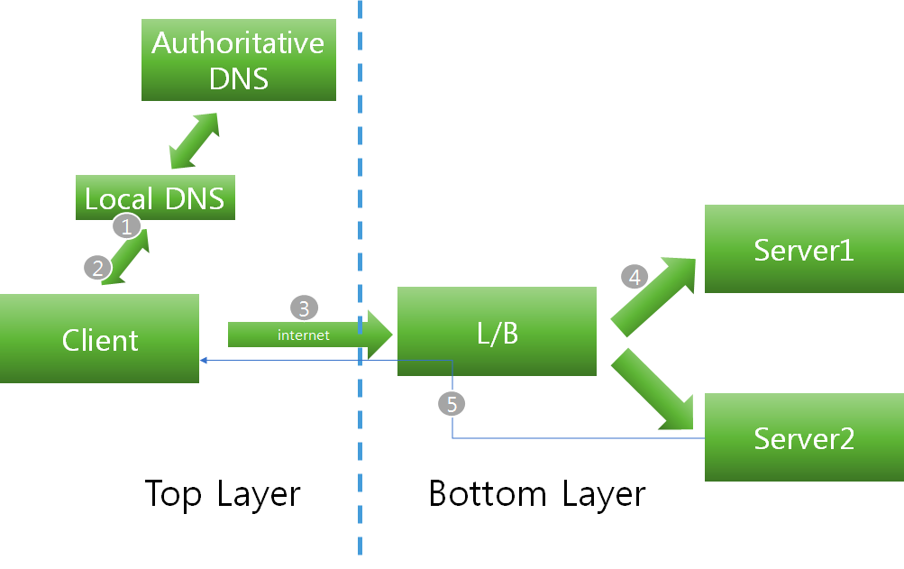
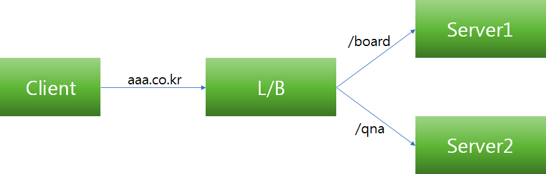
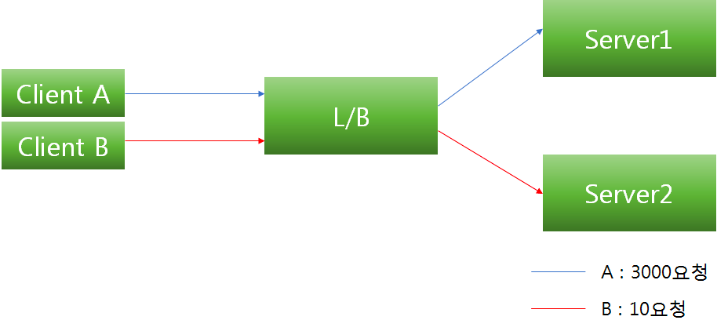
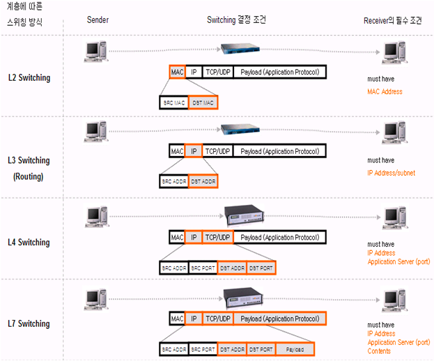
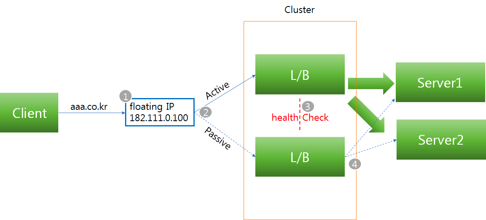

#OSI 7 Layer

<!--[TOC]: # "## Table of Contents"-->

## Table of Contents
- [Network Load Balancer](#network-load-balancer)
  - [L2(Data Link Layer)](#l2data-link-layer)
  - [L3(Network Layer)](#l3network-layer)
  - [L4(Transport Layer)](#l4transport-layer)
  - [L7(Application Layer)](#l7application-layer)
- [L4 & L7](#l4--l7)
  - [L4](#l4)
  - [L7](#l7)
  - [L4 vs L7](#l4-vs-l7)
- [로드밸런싱](#로드밸런싱)
  - [로드밸런싱 Failover](#로드밸런싱-failover)
  - [로드밸런서 주요 기술](#로드밸런서-주요-기술)
  - [로드밸런서 알고리즘 종류](#로드밸런서-알고리즘-종류)
  - [성능평가](#성능평가)

## Network Load Balancer
### L2(Data Link Layer)
- Mac Address Load Balancing
- 예시 : Mac > 80–00–20–30–1C-47
- 브릿지, 허브 등
- 장점 : 구조가 간단, 신뢰성이 높다, 가격저렴, 성능이 좋다.
- 단점 : Broadcast 패킷에 의해 성능저하 발생, 라우팅 등 상위레이어 프로토콜 기반 스위칭 불가
### L3(Network Layer)
- IP Address Load Balancing
- 예시 : IP > 213.12.32.123
- L2 + Routing
- Router, ICMP 프로토콜, IP
- 장점: Broadcast 트래픽으로 전체 성능 저하 방지, 트레픽체크
- 단점: 특정 프로토콜을 이용해야 스위칭 가능
### L4(Transport Layer)
- Transport Layer(IP+Port) Load Balancing
- 예시: IP+Port > 213.12.32.123:80, 213.12.32.123:1024
- TCP, UDP Protocol
- 장점 : Port기반 스위칭 지원, VIP를 이용하여 여러대를 한대로 묶어 부하분산
- 주로 Round Robin 방식 사용
### L7(Application Layer)
- Application Layer(사용자 Request) Load Balancing
- 예시 : IP+Port+패킷 내용 >
213.12.32.123:80, 213.12.32.123:1024 + GET/ img/aaa.jpg
- HTTP, FTP, SMTP Protocol

## L4 & L7

### L4

1. 브라우저에서 aaa.co.kr 이라고 입력
2. PC에 설정된 Local DNS 서버로 DNS Query
3. Local DNS 서버는 aaa.co.kr을 관리하는 DNS서버(Authoritative DNS서버)에 DNS Query, L4의 VIP주소 획득
4. Local DNS는 획득한 VIP 주소를 전송
5. 획득한 DNS를 기반으로 L4 VIP로 http 요청
6. L/B장비는 최적의 서비스 서버를 내부 알고리즘(라운드로빈 등)을 통하여 선별, 요청을 전송
7. 그 후 서버 작업 결과를 L/B장비 전송
8. 전달받은 http결과를 L/B장비를 통해 Client에 전송함으로 요청 처리를 끝낸다.

### L7

1. aaa.co.kr로 접속을 하게 될 경우 L4의 경우 서비스 종류(포트별 구분 HTTP, FTP 등)별로 처리

L7 Layer만 다루지 않고 L2, L3기능을 포함하고 부분적인 L4 스위치 기능을 지원
콘텐츠(HTTP, FTP, Telnet, Email 등)를 인지하여 원하는 포트로 전달하는 스위치(콘텐츠 기반 스위칭)
L5 ~ L7(Session, Presentation, Application) packet payload를 분석하여 스위칭 하는 장비
* payload — 흥미, 관심있는 데이터로 해석
URL-based
TCP/UDP port(0–65535)에 대한 인지
쿠키(Cookie) 기반 연결지속성
- 클라이언트 IP가 공인 IP 치환되어 전송(X-Forwarded-For에 client ip기록)
패킷 분석을 통한 바이러스 감염 패킷 필터링

### L4 vs L7

#### L4 & L7 공통점
- 들어온 packet을 적절한 목적지로 전달(스위치) 역할 수행, 적절한 알고리즘을 통해 로드밸런서로서의 역할 수행
- 스위치 및 서버별 Health Check
#### L4 & L7 차이점
- L4는 L/B에서 알고리즘을 통해 server1 또는 server2로 데이터를 전송할지 결정을 하고 Client와 3way handshake 실시, 하나의 TCP세션을 갖게 된다. (L/B는 중계)그 후 application 층에서 클라이언트의 요청정보(HTTP, FTP 등)를 전달받는다.
- L7는 L/B에서 콘텐츠 기반 스위칭을 위해 3way handshake를 보류한다. L/B와 client 간 3way handshake를 실시하여 따로 TCP 세션을 형성, L7과 server서버는 또 다른 TCP 세션을 형성하고 데이터를 중계한다.
- L7 Dos/SYN Attack에 대한 방어
- L7 패킷 분석을 통한 바이러스 감염 패킷 필터링
- 자원 독점 방지 등을 통한 시스템 보안 강화
- L7은 L4의 서비스 단위 로드밸런싱을 극복하기 위한 포트 + 페이로드 패턴을 이용하여 패킷스위칭
- L4는 TCP/UDP 패킷 정보를 분석하고 해당 패킷이 사용하는 서비스 종류별(HTTP, FTP 등)로 처리.(L4 Mega Proxy 문제 발생)

> **Mega Proxy**
> IP기반 분리는 요청 양의 불균형이 일어날 수 있다.

## 로드밸런싱
### 로드밸런싱 Failover
로드밸런서도 장애가 날 수 있으므로 이중화 구성을 한다.

vip로 접속을하고 active된 로드벨런서로 연결
장애가 났을경우 standby중인 로드밸런서로 연결
이중화된 로드밸런서에서 Health Check
장애로 여분 로드밸런서가 동작 할 경우 이를 통해 서버에 접근

### 로드밸런서 주요 기술
#### NAT(Network Address Translation)
- 사설 ip주소를 공인 IP주소로 변경, 주소변경의 역할
#### DSR(Dynamic Source Routing protocol)
- 서버에서 클라이언트로 되돌아가는 경우 목적지 주소를 스위치의 IP 주소가 아닌 클라이언트의 IP 주소로 전달해서 네트워크 스위치를 거치지 않고 바로 클라이언트를 찾아가는 개념
#### Tunneling
- 인터넷상에서 눈에 보이지 않는 통로를 만들어 통신할 수 있게 하는 개념
- 데이터를 캡슐화해서 연결된 상호 간에만 캡슐화된 패킷을 구별해 캡슐화를 해제

### 로드밸런서 알고리즘 종류
#### Round Robin(순차방식)
- 요청을 순서대로 각 서버에 균등하게 분배하는 방식
- 서버 커넥션 수나 응답시간에 상관없이 모든 서버를 동일하게 처리
- 다른 알고리즘에 비해서 가장 빠르다
#### Least Connection(최소접속방식)
- 서버에 연결되어 있는 Connection 개수만 갖고 단순비교하여 가장 적은곳에 연결
#### Weighted Least Connections(가중치 최소접속방식)
- 서버에 부여된 Weight 값을 기반으로 Connection 수의 개수와 같이 고려하여 할당
#### Fastest Response Time(응답시간방식)
- 가장 빨리 응답하는 서버에 이용자 요구를 연결하는 방법. 응답시간은 각 서버가 패킷 형태의 요구를 송수신하는데 걸리는 시간을 측정한 것이다.
#### Adaptive(최소대기방식)
- Open또는 Pending(계류중인) 커넥션을 적게 가지고 있는 서버로 네트웍 커넥션 방향을 지정한다. Pending 커넥션은 Full TCP Handshake를 완성하지 않은 것으로, 이것은 초당 클라이언트 Thread의 수가 증가할 때 더욱 잘 수행된다.
#### Hash(Source IP)
- 한번 연결되었던 서버는 계속 그 서버에 접속한다.
- 어느 정도 접속 사용자가 늘어나면 거의 공평한 로드 밸런싱이 가능하게 된다.
- 새로운 사용자가 들어오면 사용자 IP (혹은 +Port) 기반으로 key 값을 생성한다.

#### 그 외
- Fixed
- Bandwith
- Random
- URL-based
- Cookie
- 기타 여러 알고리즘 존재

> 단순하게 한가지 알고리즘만 선택하지 않고 Least Connection 알고리즘 선택 후 동등한 수의 Connection일 경우 Round Robin을 선택하는 방식으로 결합하여 사용

### 성능평가
> L2, L3와 같은 국제 표준에 의해 정해진 기능이나 지표가 없다.
#### 초당 연결수(Connections per second)
- 하나의 TCP 연결은 클라이언트와 서버간의 쓰리-웨이 핸드쉐이크(three-way handshake) 동작(하나의 SYN과 두 개의 ACK 패킷)으로 정의
- TCP 세션을 열고(opening) 닫는(closing) 작업은 L4 레벨의 기본 세션 관리의 가장 핵심적인 동작, L4의 포워딩 엔진 부분에 가장 많은 작업량을 요구하는 작업이므로, 이 지표는 L4의 네트워크 프로세서 디바이스나 커널의 성능에 따라 좌우
#### 동시 연결수(Concurrent connections)
- TCP 세션을 유지 할 수 있는 수치.
- TCP 세션이 열리면 바로 닫히는 것이 아니라 사용자는 세션을 유지함. 이를 얼마나 관리하고 유지 할 수 있느냐가 관건.
- 많은 세션을 관리해야되므로 메모리에 의존적.
- 시중에 수천에서 무제한까지 제공하는 state-less 로드밸런싱(해싱알고리즘) 장비도 있음. 다른 네트워크 장벽이나 서버에서 제한 될 수 있음.
#### 처리용량(Throughput)
- 스위칭 용량 이 수십Gbps라 적혀있어도 L2레벨의 패킷처리 용량. L4는 한가지 지표로 표현할 수 없음
- 업링크(Uplink) 포트의 인터페이스 규격(패스트 이더넷(100Mbps~1Gbps), 기가바이트 이더넷) 에 따라 제한이 된다.
- bps(bit per second) or pps(packet per second)로 나눠 계산 할 수 있다.
#### 임계치(Threshold)
- 내부 알고리즘 혹은 처리 방식(url 파싱, 쿠키기반처리(cookie-based persistence) 등)에 따라서 많은 임계치는 각각 다르게 설정 될 수 있다.

> 참고
> [https://medium.com/@pakss328/로드밸런서란-l4-l7-501fd904cf05](https://medium.com/@pakss328/%EB%A1%9C%EB%93%9C%EB%B0%B8%EB%9F%B0%EC%84%9C%EB%9E%80-l4-l7-501fd904cf05)
> https://sarc.io/index.php/miscellaneous/758-osi-7-l4-l7