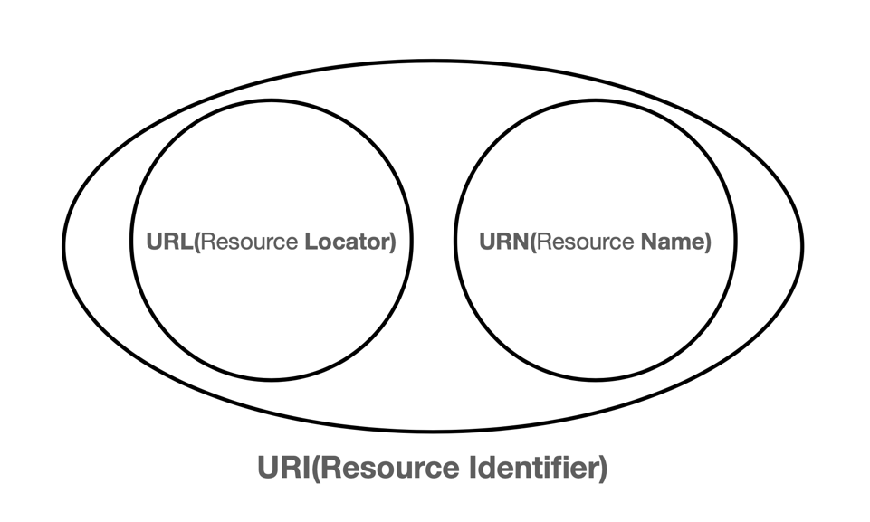
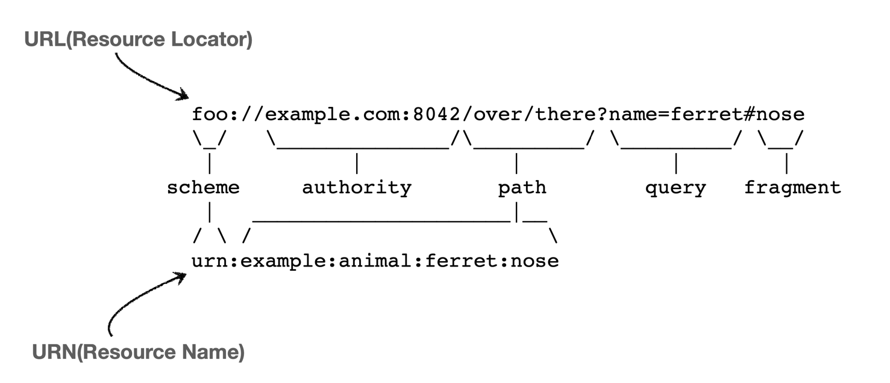

# URI URL URN

## URI
**U**niform **R**esource **I**dentifier
- Uniform: 리소스 식별하는 통일된 방식
- Resource: 자원, URI로 식별할 수 있는 모든 것(제한 없음)
- Identifier: 다른 항목과 구분하는데 필요한 정보

URL, URN을 포함한 범위

### 문법

`scheme://[userinfo@]host[:port][/path][?query][#fragment]`

`https://www.google.com:443/search?q=hello&hl=ko`

- 프로토콜 - `https`, `http`, `ftp` ...
- 호스트명 - `www.google.com`
- 포트 번호 - `443`
  - http는 80 포트, https는 443 포트를 주로 사용, 포트는 생략 가능
- 패스 - `/search`
- 쿼리 파라미터 - `q=hello&hl=ko`
  - key=value 형태
  - ?로 시작
  - &로 추가 가능 `?keyA=valueA&keyB=valueB`
  - query parameter, query string 등으로 불림
- fragment
  - url 맨뒤에 # 이후에 표시
  - html 내부 북마크 등에 사용, 해당 id의 dom이 있는경우 그곳으로 바로 이동한다,
  - 서버에 전송하는 정보 아님

#### 유저 정보
- git://lsb156@www.github.com/
- 호스트명 앞에 `[userinfo@]` 형식으로 사용자의 정보를 담을 수 있다.
- Git이나 ftp ssh 등에 자주 사용된다.

## URL
**U**niform **R**esource **L**ocator
리소스가 있는 위치를 지정
- 리소스의 위치는 변할 수 있다.

## URN
**U**niform **R**esource **N**ame
리소스에 이름을 부여
- 리소스의 위치는 변해도 이름은 변하지 않는다.
- 이름만으로 실제 리소스를 찾을 수 있는 방법이 보편화 되지 않음

