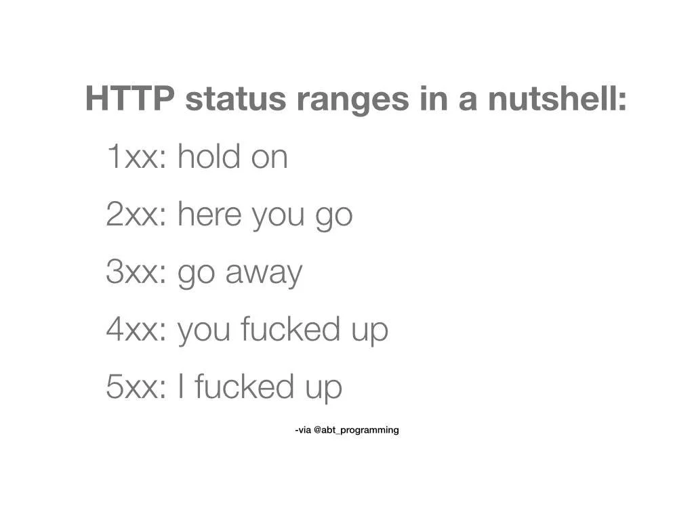

# Http Status Code

클라이언트가 보낸 요청의 처리 상태를 응답에서 알려주는 기능
- 1xx (Informational): 요청이 수신되어 처리중
- 2xx (Successful): 요청 정상 처리
- 3xx (Redirection): 요청을 완료하려면 추가 행동이 필요
- 4xx (Client Error): 클라이언트 오류, 잘못된 문법등으로 서버가 요청을 수행할 수 없음
- 5xx (Server Error): 서버 오류, 서버가 정상 요청을 처리하지 못함

## Status
### 1xx (Informational)
요청이 수신되어 처리중 상태
잘 사용하지 않는 상태

### 2xx (Successful)
클라이언트의 요청을 성공적으로 처리
- 200 OK
  - 요청성공
- 201 Created
  - 요청 성공해서 새로운 리소스가 생성됨
- 202 Accepted
  - 요청이 접수되었으나 처리가 완료되지 않았음 (배치 처리 같은 곳에서 사용)
- 204 No Content
  - 서버가 요청을 성공적으로 수행했지만, 응답 페이로드 본문에 보낼 데이터가 없음
  - save 버튼의 결과로 아무 내용이 없어도 된다.
  -  save 버튼을 눌러도 같은 화면을 유지해야 한다

### 3xx (Redirection)
요청을 완료하기 위해 유저 에이전트의 추가 조치 필요

> 웹 브라우저는 3xx 응답의 결과에 Location 헤더가 있으면, Location 위치로 자동 이동 (리다이렉트)

- 300 Multiple Choices
- 301 Moved Permanently (영구 리다이렉션)
  - 리다이렉트시 요청 메서드가 GET으로 변하고, 본문이 제거될 수 있음(MAY)
- 302 Found (일시적인 리다이렉션)
  - 리다이렉트시 요청 메서드가 GET으로 변하고, 본문이 제거될 수 있음(MAY)
- 303 See Other (일시적인 리다이렉션)
  - 302와 기능은 같음
  - 리다이렉트시 요청 메서드가 GET으로 변경
- 304 Not Modified
  - 클라이언트에게 리소스가 수정되지 않았음을 알려준다. 따라서 클라이언트는 로컬PC에 저장된 캐시를 재사용한다.
  - 304 응답은 응답에 메시지 바디를 포함하면 안된다
  - 캐시를 목적으로 사용
- 307 Temporary Redirect (일시적인 리다이렉션)
  - 302와 기능은 같음
  - 리다이렉트시 요청 메서드와 본문 유지(요청 메서드를 변경하면 안된다. MUST NOT)
- 308 Permanent Redirect (영구 리다이렉션)
  - 301과 기능은 같음
  - 리다이렉트시 요청 메서드와 본문 유지(처음 POST를 보내면 리다이렉트도 POST 유지)
