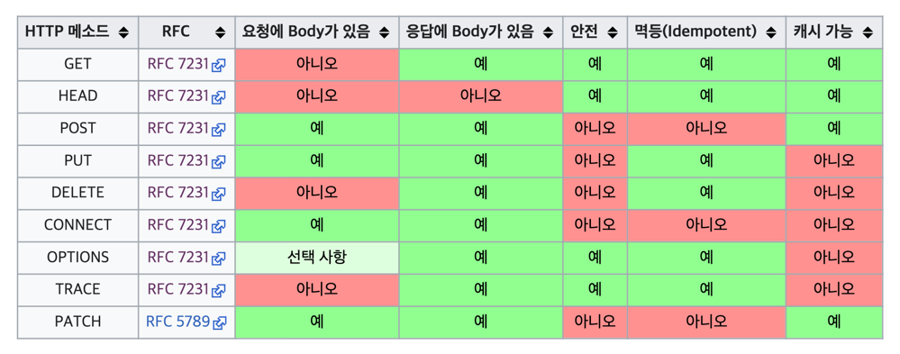

# Http Method

## Http Method 종류
Get: resource 조회
Post: 요청 데이터 처리
Put: 리소스를 대체하고 없으면 생성
Fetch: 리소스 부분 변경
Delete: 리소스 삭제

### 잘 사용되지 않는 메서드들
HEAD: GET과 동일하지만 메시지 부분을 제외하고, 상태 줄과 헤더만 반환  
OPTIONS: 대상 리소스에 대한 통신 가능 옵션(메서드)을 설명(주로 CORS에서 사용)  
CONNECT: 대상 자원으로 식별되는 서버에 대한 터널을 설정
TRACE: 대상 리소스에 대한 경로를 따라 메시지 루프백 테스트를 수행

## Get
- 리소스 조회용도로 사용
- 요청할떄 같이 보내는 데이터 형태는 query param 형식으로 전송

```
GET /search?q=hello&hl=ko 
HTTP/1.1 Host: www.google.com
```

## Post
- 주로 리소스 생성용도로 사용됨
- 액션을 수행하는 용도로 모든 요청에 사용가능
- 전달 데이터는 body에 넣어서 전달

```
POST /members HTTP/1.1 
Content-Type: application/json
{
    "username": "hello", 
    "age": 20
}
```


## Put
- 기존에 할당된 리소스를 대체한다,
- 리소스가 없으면 생성 (덮어쓰기)
- Post와 다른점은 Put은 리소스를 클라이언트에서 지정을 한다.

## Patch
- 리소스의 부분만 변경을 원할시에 적용
```
PATCH /members/100 HTTP/1.1 
Content-Type: application/json
{ "age": 50 }
```


## 정리
- 안전(Safe Methods)
  - 호출해도 리소스가 변경되지 않는다.
- 멱등(Idempotent Methods)
  - 자동 복구 메커니즘
  - 서버가 TIMEOUT 등으로 정상 응답을 못주었을 때, 클라이언트가 같은 요청을 다시 해 도 되는가? 판단 근거
- 캐시가능(Cacheable Methods)
  - 응답 결과 리소스를 캐시해서 사용해도 되는가?
  - GET, HEAD, POST, PATCH 캐시가능
  - 실제로는 GET, HEAD 정도만 캐시로 사용
    - POST, PATCH는 본문 내용까지 캐시 키로 고려해야 하는데, 구현이 쉽지 않음




## HTTP API 설계 예시


- HTTP API - 컬렉션
  - POST 기반 등록
  - 예) 회원 관리 API 제공
- HTTP API - 스토어
  - PUT 기반 등록
  - 예) 정적 컨텐츠 관리, 원격 파일 관리 HTML FORM 사용
- HTML FORM 사용
  - 웹 페이지 회원 관리
  - GET, POST만 지원

### 회원관리
Post 기반 등록
- 회원 목록 /members -> GET
- 회원 등록 /members -> POST
- 회원 조회 /members/{id} -> GET
- 회원 수정 /members/{id} -> PATCH, PUT, POST
- 회원 삭제 /members/{id} -> DELETE


### 파일 관리 시스템 API 설계
PUT 기반 등록
- 파일 목록 /files -> GET
- 파일 조회 /files/{filename} -> GET
- 파일 등록 /files/{filename} -> PUT
- 파일 삭제 /files/{filename} -> DELETE
- 파일 대량 등록 /files -> POST

### HTML FORM 사용
- 회원 목록  /members -> GET
- 회원 등록  폼 /members/new -> GET
- 회원 등록  /members/new, /members -> POST
- 회원 조회  /members/{id} -> GET
- 회원 수정  폼 /members/{id}/edit -> GET
- 회원 수정  /members/{id}/edit, /members/{id} -> POST
- 회원 삭제  /members/{id}/delete -> POST


## 참고하면 좋은 URI 설계 개념
- 문서(document)
    - 단일 개념(파일 하나, 객체 인스턴스, 데이터베이스 row)
    - 예) /members/100, /files/star.jpg
- 컬렉션(collection)
  - 서버가 관리하는 리소스
  - 디렉터리 서버가 리소스의 URI를 생성하고 관리
  - 예) /members
- 스토어(store)
  - 클라이언트가 관리하는 자원 저장소
  - 클라이언트가 리소스의 URI를 알고 관리
  - 예) /files
- 컨트롤러(controller), 컨트롤 URI
  - 문서, 컬렉션, 스토어로 해결하기 어려운 추가 프로세스 실행
  - 동사를 직접 사용
  - 예) /members/{id}/delete


