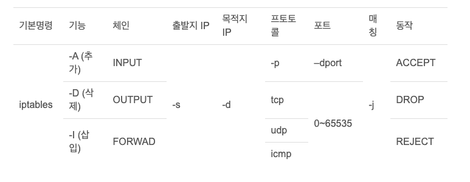

# iptables

## 테이블(tables)

iptables에는 테이블이라는 범주가 있다.

테이블은 아래와 같이 4가지로 나뉜다.
- filter: 기본 테이블로 방화벽 관련 작업이 이루어짐
- nat: 새로운 연결을 생성하는 패킷이있을 때 참조 됨(포트 포워딩) 
- mangle: TTL, TOS(Type of Service, 패킷 우선 순위) 변경 같은 특수 규칙을 적용하기 위해 사용
- raw: 연결 추적(Connection Tracking) 기능을 자세히 설정이나 연결 추적 제외시 사용

## 체인(chain)

iptables에는 filter 테이블에 미리 정의된 세가지의 체인이 존재

- INPUT : 호스트 컴퓨터를 향한 모든 패킷
- OUTPUT : 호스트 컴퓨터에서 발생하는 모든 패킷
- FORWARD : 호스트 컴퓨터가 목적지가 아닌 모든 패킷, 즉 라우터로 사용되는 호스트 컴퓨터를 통과하는 패킷
  
- PREROUTING: 라우팅 전
- POSTROUTING: 라우팅 후


체인은 네트워크 트래픽(IP 패킷)에 대하여 정해진 규칙들을 수행한다.

가령 들어오는 패킷(INPUT)에 대하여 허용(ACCEPT)할 것인지, 거부(REJECT)할 것인지, 버릴(DROP)것인지를 결정한다.

## 설정방법 


### 출력
```shell
$ iptables -L                  # 기본 출력
$ iptables -nL                 # 상세한 네트워크 정보까지 모두 출력
$ iptables -nL --line-numbers   # 룰셋의 적용 순서 까지 확인
$ iptables -L -v               # 적용된 룰셋을 통한 인입 패킷 및 bytes 출력
```

```shell
# 192.168.10.10:22 로 나가는 모든 패킷 DROP 등록
$ iptables -A OUTPUT -d 192.168.10.10 -p tcp --dport 22 -j DROP

# 192.168.10.10:22 로 나가는 패킷 DROP 해제
$ iptables -D OUTPUT -d 192.168.10.10 -p tcp --dport 22 -j DROP

# 외부로 나가는 패킷중 프로토콜이 tcp이고 SYN flag가 set, FIN,SYN,RST,ACK가 unset인 패킷이 아닌 것만 허용
$ iptables -A OUTPUT -p tcp ! --tcp-flags FIN,SYN,RST,ACK SYN -j ACCEPT

# Connection Tracking 하지 않음
$ iptables -A PREROUTING -j NOTRACK
```
