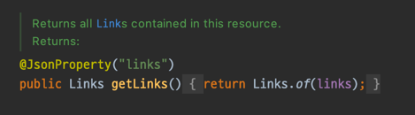

# HATEOAS HMC 등록

HATEOAS는 기본적으로 `links` 아래 link들을 만들어준다.

`RepresentationModel`를 살펴보면 getLinks() 상단에 `@JsonProperty("links")`로 되어있어 기본은 `_links`가 아닌 `link`로 리턴해준다.



하지만 Spring HATEOAS 는 HATEOAS Link 표준을 `application/hal+json`로 사용하고있다.


이걸 자동으로 등록해주는것이 바로 `HateoasConfiguration.java` 파일이다.
``` java
    // HateoasConfiguration.java
    @Bean
    WebConverters hypermediaWebMvcConverters(ObjectProvider<ObjectMapper> mapper,
            List<HypermediaMappingInformation> information) {
        return WebConverters.of(mapper.getIfUnique(ObjectMapper::new), information);
    }
```
해당 `Bean`을 등록하는데 이 과정에서 `Jackson2HalModule`을 `ObjectMapper`에 등록하게된다.

그래서 controller를 mockking 하여 테스트를 돌려보면 `_links`가 아닌 `links`로 리턴하게 되는것을 볼 수 있다.

> Hal+json 메시지 컨버터는 Spring Hateoas뿐만 아니라 Spring Cloud OpenFeign에서도 등록한다.
