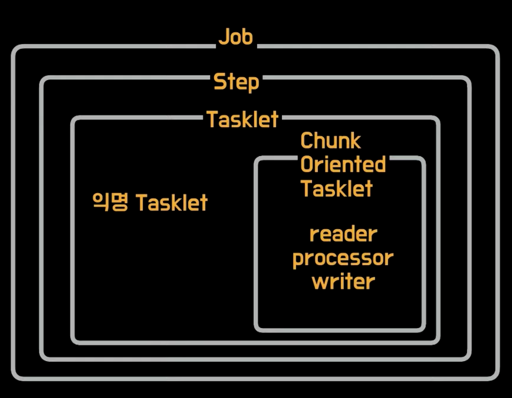
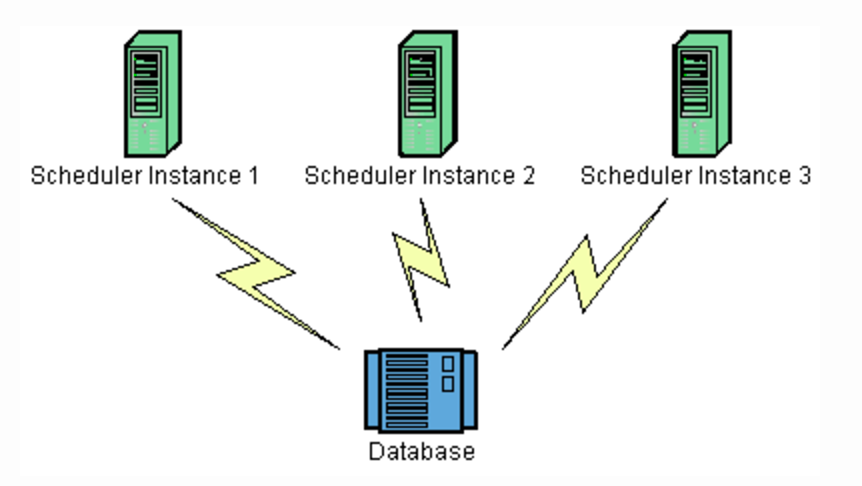
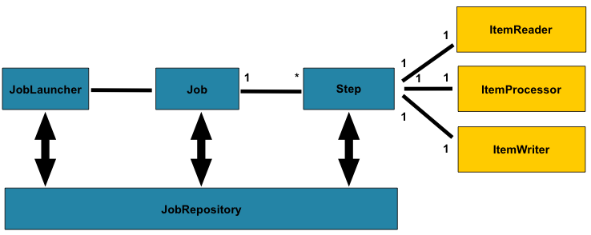
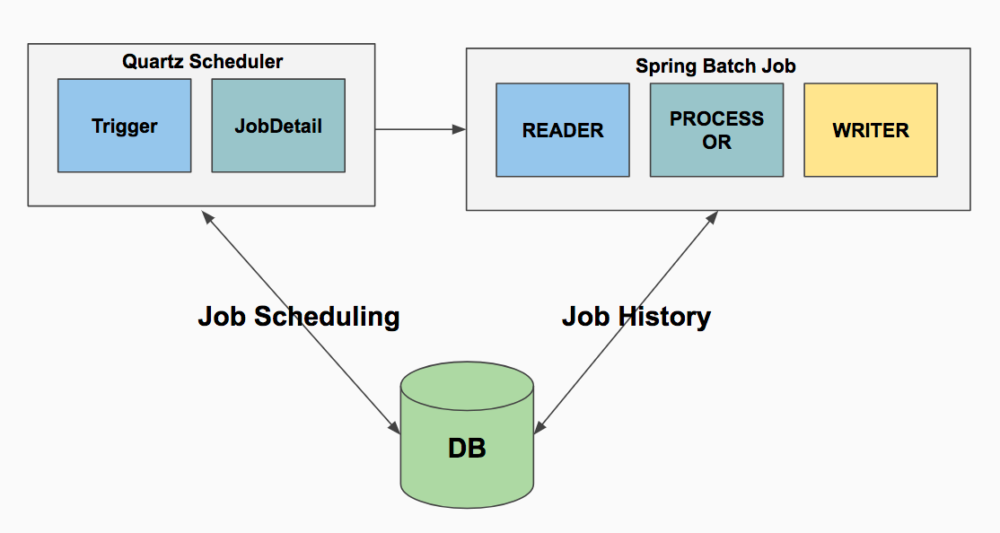
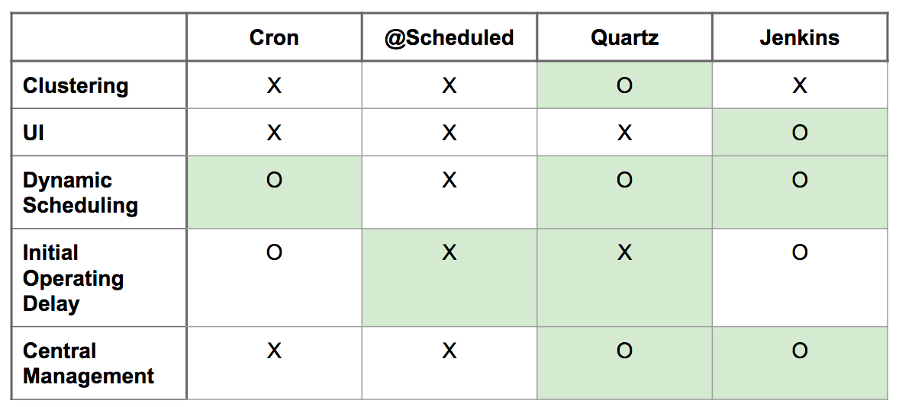

# Spring Batch

Batch Application이란 컴퓨터에서 사람과의 상호 작용 없이 이어지는 프로그램(작업)들의 실행.

일반 어플레케이션은 사람과의 상호작용 (인터렉션)을 통해 응답과 요청이 있지만
배치성 어플리케이션은 한번 요청하면 알아서 처리되는 구조를 갖는다.


## Batch
배치 어플리케이션을 사용해야 할때
- 일정 주기로 실행되어야 할때
- 실시간이 처리가 어려운 대량의 데이터를 처리해야 할때

비지니스 로직만 신경쓰면 되게끔 대용량 처리에 대한 다른것들이 모두 프레임워크에 추상화 되어있다.
모든 데이터를 메모리에 쌓지않는 조회 방식이 기본.

> **Quartz**
> Job Scheduler로써 스케쥴링 프레임워크이다.
> ex) 매주 화요일 12시에 시작
> 배치와는 다르게 그냥 일정 주기로 실행만 시켜준다.,

### Job & Step & Tasklet


- Step : Job 안에서 프로세서처럼 돌아가는 단위


### JobParameter
외부에서 파라미터를 주입받아 배치 컴포넌트를  실행시키는것
``` java
@Value('#{jobParameter[파라메터명]}') 타입 이름
```

Job -> Step 실행시 Step에 `@JobScope`가 있어야 하고
Step -> Tasklet 실행시에 Tasklet에 `@StepScope`

`@JobParameter`, `@StepParameter`는 실행되는 시점에 생성이되어 @Bean이 Lazy 하게 생성된다.
이 성질을 이용해서 reader processor writer를 동적으로 생성 가능하다.


## Quartz


Quartz 는 Database 기반으로 Scheduler Key 와 Trigger Key 를 통해 Schedule 을 Clustering 한다
즉, Database 를 기반으로 모든 Schedule에 대한 제어가 가능

- Scheduler : 스케줄러와 상호 작용하기위한 주요 API.
- Trigger : 주어진 작업이 실행될 일정을 정의하는 구성 요소
- JobDetail : 작업의 인스턴스를 정의하는 데 사용

## Quartz + Spring Batch

`Job` -> `Step` -> `Reader` -> `Process` -> `Writer`

스케쥴링에 최적화 되어있는 `Quartz`와 대용량 배치성 작업에 최적화 되어있는 `Spring Batch` 서로의 장점을 잘 섞어서 사용하면 좋은 구조가 될 수 있음




### Quartz vs Jenkins


#### Quartz 장점
Database 를 기반으로 Schedule 인스턴스들 간의 Clustering 이 가능
Application 이 구동된 상태를 유지하기 때문에, 비교적 정확한 시간에 Job 수행이 가능

#### Quartz 단점
UI Admin 제공되지 않음
알람 기능, Schedule Control 기능 등을 직접 구현하거나, 안써야 함
