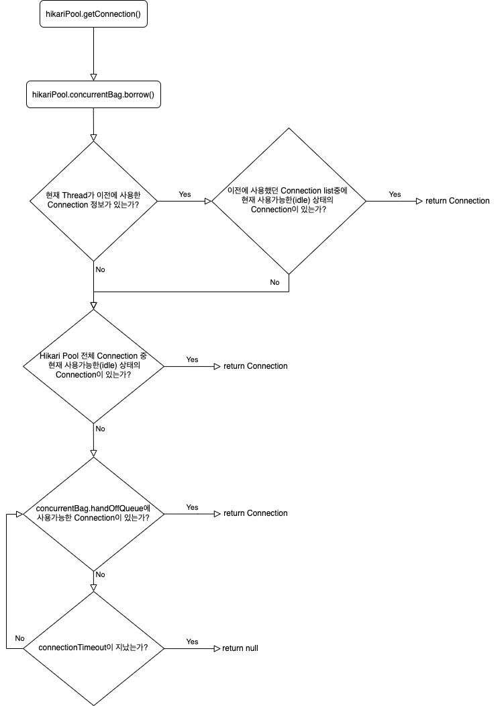
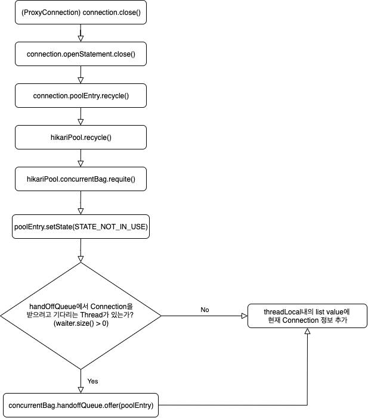

# Hikari CP

SpringBoot 2 이상부터 HikariCP가 기본 JDBC Connection Pool로 사용
HikariCP는 다른 Connection Pool에 비해 성능이 압도적

HikariPool에서는 Connection 객체를 한번 wrapping한 PoolEntry라는 Type으로 내부적으로 Connection을 관리

## HikariCP에서 Connection 발급과 반납

HikariCP에서는 내부적으로 ConcurrentBag이라는 구조체를 이용해 Connection을 관리

### 발급


### 반납



## HikariCP에서 Dead lock이 발생하는 Case
Message Queue의 consumer thread 갯수보다 HikariCP의 maximum pool size를 충분하게 설정하지 못해 Dead lock이 발생

JPA에서 `@GeneratedValue(strategy = GenerationType.AUTO)`를 적용하면 SequenceStyleGenerator를 사용하여 시퀀스를 생성하는데 MySQL은 Sequence를 지원하지 않아  hibernate_sequence라는 테이블에 단일 Row를 사용하여 ID값을 생성하기 때문에 hibernate_sequence 테이블을 조회, update를 하면서 Sub Transaction을 생성하여 실행하게 됨

Spring 2.0이상부터 hibernate.id.new_generator_mappings 속성값이 true가 기본으로 설정되어 Dialect가 sequence를 지원하면 SequenceStructure를 사용하고 지원하지 않는다면 TableStructure를 사용한다.


### 처리법
Github: https://github.com/brettwooldridge/HikariCP
issue: https://github.com/brettwooldridge/HikariCP/issues/442#issuecomment-146096704
wiki: https://github.com/brettwooldridge/HikariCP/wiki/About-Pool-Sizing
```
# HikariCP에서 권장하는 트랜젝션 구하는 공식

pool size = Tn x (Cm - 1) + 1

# Tn : 전체 Thread 갯수
# Cm : 하나의 Task에서 동시에 필요한 Connection 수
```


## Dead lock 발생 가능성 체크방법
1. HikariCP의 Maximum Pool Size을 1로 설정한 다음 1건씩 Query를 실행
	- Timeout 발생시에는 Deadlock 발생 가능성이 큼
2. Nested Transaction을 사용하지 않으면 dead lock을 유발할 수 있음.

