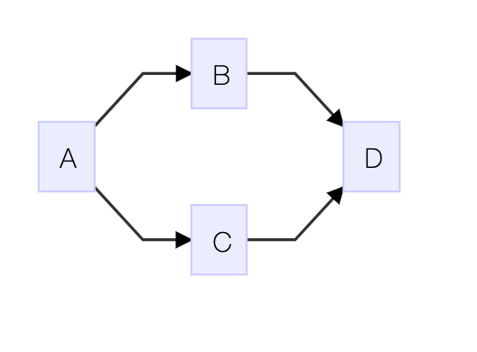

# 스프링 부트로 배우는 자바 웹 개발

<!--[TOC]: # "## Table of Contents"-->

## Table of Contents
- [class loader](#class-loader)
  - [클래스 로더의 특징](#클래스-로더의-특징)
  - [WAR 파일의 특성](#war-파일의-특성)
- [2. Servlet](#2-servlet)
  - [생명주기](#생명주기)
  - [2.1 GET / POST / Multipart](#21-get--post--multipart)
    - [2.1.1 Filter](#211-filter)
    - [2.1.2 Cookie](#212-cookie)
    - [2.1.3 Session](#213-session)
  - [2.2 디자인 패턴 활용](#22-디자인-패턴-활용)
    - [2.2.1 JavaEE 패턴](#221-javaee-패턴)
      - [2.2.1.1 Intercepting Filter](#2211-intercepting-filter)
      - [2.2.1.2 Front Controller](#2212-front-controller)
        - [2.2.1.2.1 sendRedirect](#22121-sendredirect)
        - [2.2.1.2.2 forward](#22122-forward)
      - [2.2.1.3 Command Pattern](#2213-command-pattern)
- [3. Spring](#3-spring)
  - [3.1 IoC 패턴 활용 (Inversion of Control)](#31-ioc-패턴-활용-inversion-of-control)
    - [3.1.1 의존관계의 원칙](#311-의존관계의-원칙)
    - [3.1.2 인터페이스와 스프링](#312-인터페이스와-스프링)
      - [3.1.2.1 Annotation Life Cycle](#3121-annotation-life-cycle)
  - [3.2 Spring MVC](#32-spring-mvc)
    - [3.2.1 Dispatcher Servler 등록 방법](#321-dispatcher-servler-등록-방법)
    - [3.2.2 Interceptor](#322-interceptor)
- [4. Spring Boot](#4-spring-boot)
  - [4.1 Spring boot Start](#41-spring-boot-start)
    - [4.1.1 @SpringBootSpplication 역할](#411-springbootspplication-역할)
  - [4.2 정적 자원 관리](#42-정적-자원-관리)
    - [4.2.1 스프링 부트 폴더 규약](#421-스프링-부트-폴더-규약)
    - [4.2.2 웹 리소스 폴더 변경](#422-웹-리소스-폴더-변경)
    - [4.2.3 리소스 주소에 MD5 값 설정](#423-리소스-주소에-md5-값-설정)
    - [4.2.4 Resource Url Provider](#424-resource-url-provider)
    - [4.2.5 WebJar를 이용한 외부 프론트엔드 라이브러리 관리](#425-webjar를-이용한-외부-프론트엔드-라이브러리-관리)
  - [4.3 Template](#43-template)
    - [4.3.1 Thymeleaf](#431-thymeleaf)
- [5. REST API](#5-rest-api)
  - [5.1 REST 특성](#51-rest-특성)
  - [5.2 Resource](#52-resource)
  - [5.3 REST API methods](#53-rest-api-methods)
  - [5.4 HATEOAS - self descriptive message](#54-hateoas---self-descriptive-message)
  - [5.5 RestTemplate](#55-resttemplate)
    - [5.5.1 RestTemplate 네트워트 속성 설정](#551-resttemplate-네트워트-속성-설정)
    - [5.5.2 UriComponentsBuilder 활용](#552-uricomponentsbuilder-활용)
- [6. DATABASE](#6-database)
  - [6.1 SQL DDL, DML, DCL?](#61-sql-ddl-dml-dcl)
  - [6.2 ORM](#62-orm)
  - [6.3 JPA](#63-jpa)
    - [6.3.1 JpaRepository Class Diagram](#631-jparepository-class-diagram)
    - [6.3.2 데이터베이스와 객체 맵핑](#632-데이터베이스와-객체-맵핑)
      - [6.3.2.1 Entity](#6321-entity)
      - [6.3.2.2 N:1](#6322-n1)
      - [6.3.2.3 1:N](#6323-1n)
  - [6.4 QueryDSL](#64-querydsl)
  - [6.5 MyBatis](#65-mybatis)
  - [6.6 Connection pool](#66-connection-pool)
- [7. Custom](#7-custom)
  - [7.1 Annotation](#71-annotation)
- [8. Exception 처리](#8-exception-처리)
  - [8.1 throw, throws 차이](#81-throw-throws-차이)
    - [8.1.1 throw 활용](#811-throw-활용)
    - [8.1.2 throws 활용](#812-throws-활용)
  - [8.2 ControllerAdvice](#82-controlleradvice)
  - [8.3 Database의 예외 처리](#83-database의-예외-처리)
    - [8.3.1 Transaction](#831-transaction)
    - [8.3.2 JDBC 와 트랜잭션](#832-jdbc-와-트랜잭션)
    - [8.3.3 PlatformTransactionManager](#833-platformtransactionmanager)
    - [8.3.4 Spring Transaction과 Service 레이어](#834-spring-transaction과-service-레이어)
    - [8.3.5 @Transactional](#835-transactional)
  - [JUnit Test](#junit-test)
- [9. cache](#9-cache)
  - [9.1 캐시 유형](#91-캐시-유형)
    - [9.1.1 위치에 따른 캐시 구분](#911-위치에-따른-캐시-구분)
      - [9.1.1.1 영역별 기술 요소](#9111-영역별-기술-요소)
    - [9.1.2  영역에 따른 캐시 구분](#912--영역에-따른-캐시-구분)
      - [9.1.2.1 데이터 저장 방식에 다른 캐시 유형](#9121-데이터-저장-방식에-다른-캐시-유형)
    - [9.1.3 캐시 데이터 저장 방식](#913-캐시-데이터-저장-방식)
  - [9.2 Spring Cache](#92-spring-cache)


### class loader


#### 클래스 로더의 특징
-	계층적
	-	상위 클래스 로더에서 하위 클래스 로더를 갖는 방식
	-	최상위 클래스 로더는 부트스트랩 클래스 로더
-	클래스 로딩을 위임
-	가시적인 규약
	- 클래스 로딩할 때 가능한 범위
	- 자식 클래스 로더는 클래스 로딩 요청 위임을 통해 부모 클래스 로더가 로딩한 클래스를 찾을 수 있음
	- 부모 클래스는 자식 클래스 로더가 로딩한 클래스를 알 수 없음
-	클래스 언로딩 불가능
	-	가비지 컬렉터가 동작하거나 WAS가 재시작할 때 초기화

- 부트스트랩 클래스 로더 (BootStrap Class loader)
	- JVM 런타임 실행을 위해 기반이 되는 파일들을 로드
	- rt.jar 파일과 연관이 있음
	- 부트 스트랩 로더의 로드가 끝나면 확장 클래스 로더가 로딩
- 확장 클래스 로더 (Extensions Class loader)
	- 자바의 최상위 객체인 Object를 포함한 자바 API를 로드
	(자바 홈 폴더 하위의 ext폴더 하위에 있는 jar 파일들과 연관이 있음)
	- 확장 클래스 로더의 로드가 끝나면 시스템 클래스 로더를 로드
- 시스템 클래스 로더 (System Class loader)
	- 클래스패스에 포함된 클래스를 로드
	- 사용자는 시스템 클래스 로더가 로드하는 클래스 패스 영역에만 접근할 수 있다.

> 보통 독립적인 영역이 필요한 WAS의 경우 시스템 클래스 로더 하위에 사용자 정의 로더를 만들어서 사용
대부분의 개발 환경 설정 관련 문서에서 톰캣 설치 위치를  `CATALINA_HOME`으로 지정하는 것은 WAS에서 생성한 클래스 로더를 기준으로 동작하기 위함

#### WAR 파일의 특성
**Web Application Archive**의 약자 (*Web Application Resource)
libs 폴더에 있는 JAR 라이브러리들은 사용자 정의 클래스로더. 웹 어플리케이션 컨테이너의 로더를 통해 클래스 패스에 추가된다.
```
	- [Web Archive]
		- [content directory] (Html, js, css)
			- [WEB-INF] (web.xml)
				- [classes] (.class)
				- [libs] (jar)
```

웹 어플리케이션 클래스 로더는 클래스로더의 유형 중에서 시스템 클래스 로더 하위에 사용자가 정의한 클래스 로더에 해당
웹 어플리케이션 컨테이너는 웹 어플리케이션 자체 API를 제공하기 위해 컨테이너를 로드하는 클래스 로더와 사용자가 추가한 JSP, WAR 파일들을 다루기 위한 `ServletCotext Loader`를 사용.
컨테이너가 시작되고 Context가 초기화 되면 서블릿 스펙 권장에 따라 `WEB-INF/classes` 파일을 먼저 검색해서 로딩하고, 그 후에 `WEB-INF/libs` 에 있는 JAR 파일들을 로드한다.

## 2. Servlet
### 생명주기


On Destory


서블릿의 생명주기는 초기화, 서비스, 소멸의 3단계로 구성되어 있다.

- 초기화 (Initialize)
	- 로드한 서블릿의 인스턴스를 생성
	- 리소스 로드
	- 클래스 생성자의 초기화 작업
	- 서버 구동 후 최초 요청에서만 호출됨 (단 1회))
- 서비스 (Service)
	- 클라이언트의 요청에 따라서 호출할 메서드를 결정
- 소멸 (Destory)
	- 서블릿 언로드

```xml
<!-- 기존의 Servlet  맵핑 방법 -->
<servlet>
	<servlet-name> Init <servlet-name>
	<servlet-class> InitServlet </servlet-class>
</servlet>
<servlet-mapping>
	<servlet-name> Init </servlet-name>
	<url-pattern> /init </url-pattern>
</servlet-mapping>
```
```java
WebServlet(name="Init", urlPatterns={"/init"})
public class UnitServlet extends httpServlet {}
```
### 2.1 GET / POST / Multipart
- **Get** : 데이터를 쿼리 스트링 형태로 전송
- **POST** : Application/x-www-form-unlencoded
	데이터를 스트림 형태로 인코딩하여 전달할 때 사용되는 전송 방식
- **Multipart/form-data** : 파일 업로드 시 사용되는 전송 방식
	전송 Form에 `enctype="multipart/form-data"` 추가

> 자바에서는 파일 쓰기 시에 먼저 임시 디렉터리에 파일을 저장한다.
기본 임시 디렉터리는 자바의 시스템 프로퍼티로 `java.io.tmpdir`로 지정 되어 있고
실제 저장 위치는 `System.getProperty("java.io.tmpdir");`로 확인 가능

#### 2.1.1 Filter
웹 클라이언트의 요청에 대해서 사전 작업이 있을 경우에 필터를 사용

필터는 필터 인터페이스를 상속받아 만들 수 있다.
필터는 서블릿의 생명주기처럼 init과 destory 메서드를 가지고 있고 필터 기능 사용을 위한 doFilter가 있다.
필터가 서블릿 보다 먼저 실행된다.

#### 2.1.2 Cookie
사용자가 사이트를 방문했을 때, 사용자의 컴퓨터에 저장되는 정보
- 이름 : 각각의 쿠카의 값을 식별하기 위한 키
- 값 : 특정 이름으로 쿠키에 지정된 값
- 유효시간 : 쿠키의 유지 시간
- 도메인 : 쿠키를 전송할 도메인
- 경로 : 쿠키를 전송할 요청 경로

쿠키는 HTTP 헤더에 포함되어 전달된다
쿠키는 javax.servlet.http 패키지에 포함
> 생성된 쿠키는 삭제를 할 수 없어 유효시간을 0으로 만들어서 무효화 시킨다.
#### 2.1.3 Session
서버와 클라이언트의 유효한 커넥션을 식별하는 정보.
서버는 클라이언트가 요청을 보내면 요청을 식별할 수 있는 ID를 부여하는데 이것이 SessionID.
SessionID는 JSESSIONID라는 이름으로 쿠키에 저장되고, 클라이언트가 재접속할 때 해당 쿠키를 이용해 세션 ID 값을 서버에 전달
Servlet에서는 Session이 `javax.servlet.http` 패키지에 `HttpSession` 인터페이스로 저장 되어 있다.

- getId : 세션의 고유 아이디를 얻을 수 있는 메서드
- getCreationTime : 세션이 생성된 시간을 얻을 수 있는 메서드
- getLastAccessTime : 웹 브라우저가 가장 마지막에 세션에 접근한 시간을 얻을 수 있는 메서드

### 2.2 디자인 패턴 활용
#### 2.2.1 JavaEE 패턴
|패턴이름|개요|
|:--|:--|
|Intercepting Filter|**요청에 대한 전처리 및 후처리** <br> 요구 사항에 대해서 전처리와 후처리에 대한 솔루션을 제공하고 이를 통해 유동적인 아키텍쳐를 가능하게 한다.|
|Front Controller   |**요청에 대한 처리를 관리하는 중앙 컨트롤러** <br> 프레젠테이션 레이어에 일어나는 일들의 창구로 facade 패턴의 역할과 MVC 패턴에서 controller의 역할을 함으로써 보안, 뷰 관리, 탐색들을 관리한다.|
|View helper        |**뷰의 표현을 위해 비즈니스 로직을 가지고 있는 개념상의 Helper** <br> 비즈니스 로직과 페레젠테이션 로직의 결합도를 낮추가 위해 사용|
|Composite View     |**레고 블럭 같은 작은 뷰들을 조합해서 만드는 전체의 뷰** <br> 복잡한 뷰를 만들기 위해서 기본적인 뷰 레이어를 융통성 있게 하고, 개인화 영역과 커스터마이징을 보다 수월하게 한다.|
|Service to worker  |**Front Controller와 View Helper Pattern을 이용해 dispatcher 컴포넌트를 구성** <br> 대규모 애플리케이션에서 이용되는 기법으로 뷰에 대한 처리 이전에 동작한다.|
|Dispatcher View    |Service to Worker와 동일하며 차이점은 뷰에 대한 처리 중에 수행되어야 하고, 작은 시스템에서 더 안정적이다.|

##### 2.2.1.1 Intercepting Filter
servlet에서 Filter 를 상속받아 구현하는 형태가 `Intercepting Filter pattern`의 구현체이다.

##### 2.2.1.2 Front Controller
컨트롤러가 공통 요청을 먼저 수행하고 뷰를 호출 하는 패턴
```flow
client=>start: Client
controller=>condition: Service (isJSP?)
servlet=>end: ServletView
jsp=>end: JspView

client->controller
controller(yes)->jsp
controller(no)->servlet
```
여러 다른 화면 요청에 대해서 화면에 바로 전달하지 않고 컨트롤러를 통해 전달하는 것

전달방법
- Response 객체의 sendRedirect
- RequestDispatcher 객체의 forward 메서드

###### 2.2.1.2.1 sendRedirect
서버에서 클라이언트로 응답을 던지는 것으로 속성을 저장 할 수 없고 다른 로직을 추가할 수 없다.
```java
response.sendRedirect("경로");
```
###### 2.2.1.2.2 forward
`requestDispatcher` 객체를 생성해야한다.
`requestDispatcher` 사용시 경로는 절대 경로로 지정해야 하며 상대경로를 사용할 수 없다.
`sendRedirect`와는 다르게 servletcontext와 session에 숙성을 저장하고 포워딩한 곳에서 사용할 수 있다.
```java
RequestDispatcher rd = request.getRequestDispatcher("경로");
rd.forward(ServletRequest request, ServletResponse response);
```
컨트롤러에서 직접적으로 forward 메서드를 사용하게 될 경우에는 URL이 변경 되거나 뷰가 변경 될 때마다 컨트롤러를 변경하게 되어 추후에 유지보수가 어려워진다.
이럴때 `Command Pattern` 을 이용해서 컨트롤러 클래스의 복잡도를 낮출 수 있다,

##### 2.2.1.3 Command Pattern
로직을 객체 안에 캡슐화해서 저장함으로써 컨트롤러와 같은 클래스를 수정하지 않고 재사용할 수 있게 하는 패턴

## 3. Spring
### 3.1 IoC 패턴 활용 (Inversion of Control)
#### 3.1.1 의존관계의 원칙
- 하이레벨 모듈은 로우레벨 모듈에 의존해서는 안 되고 모두 인터페이스에 의존해야 한다.
- 추상화는 세부 사항에 의존해서는 안 된다.  (세부 사항이 추상화에 의존해야 함)
인터페이스를 활용함으로서 결합도를 낮춰야함

인터페이스를 사용 하더라도 결국 인스턴스화하기 위해서 반드시 객체 생성에 필요한 코드가 수반되므로 결합도를 완전히 분리해 낼 수 없다.
결국 프로그램이 온전이 동작하기 위해서는 인스턴스화할 수 있는 코드에 대한 의존성을 갖게 된다.
이를 대신 해결해 주는것이 바로 의존성 주입 DI (Dependency Injection) 이다.

#### 3.1.2 인터페이스와 스프링
스프링에서 의존성을 주입할 때 기본적으로 타입을 기반으로 함(@Autowired)
스프링 컨테이너에 클래스를 등록하면 스프링이 클래스의 인스텅스를 관리해준다.
`XML`로 설정하는 방법과 `Annotation`으로 관리하는 방법 도 있다.
`@Configuration` 어노테이션을 상단에 추가해서 이 클래스가 `Bean` 설정 정보가 포함된 클래스임을 명시
같은 Type의 Bean을 두개 이상 등록 할 시에는 method 명으로 `context.getBean("methodName")` 을 활용하여 꺼낼 수 있다. ( context = `AnnotationConrifApplicationContext` )
##### 3.1.2.1 Annotation Life Cycle
- `@PostConstruct` - 빈이 초기화 될 때 호출
- `@PreDestory` - 빈이 소멸되기 직전에 호출

### 3.2 Spring MVC
`Front Controller pattern`에 DI를 이용해서 컴포넌트들의 생명주기를 관리할 수 있는 컨트롤러 중심의 웹 MVC 프레임워크
Spring MVC는 `DispatcherServlet`, `View Resolver`, `Interceptor`, `Handler`, `View` 등으로 구성


1. DispatcherServlet이 요청을 받으면 그 요청을 처리할 수 있는 Handler의 이름을 HandlerMapping에게 문의
2. HandlerMapping은 요청 URL을 보고 Handler를 판단하고 Handler 실행 전에 전처리, 후처리로 실행해야 할 인터셉터 목록을 결정한다.
3. DispatcherServlet이 제어권을 Handler로 전달
4. Handler는 응답에 필요한 서비스를 호출 하고 응답에서 렌더링 해야 하는 View Name을 판단해서 DispatcherServlet에 전송
5. DispatcherServlet은 논리적인 View Name을 ViewResolver에 전달해서 응답에 필요한 View를 생성할 수 있도록 한다.
6. View에 Model과 컨트롤러를 전달해서 응답을 생성 받는다
7. 이렇게 생성된 응답을 클라이언트에 반환

> **Interceptor vs Filter**
> DispatcherServlet이 HandlerMapping에게 문의하여 받아온 Handler의 전처리, 후처리를 하는것이 Interceptor이고 DispatcherServlet 이전의 전처리를 하는것이 Filter의 역할이다.
> - *Interceptor* : preHandle, postHandle, afterCompletion
> - *Filter* : doFilter

#### 3.2.1 Dispatcher Servler 등록 방법
- XML을 이용하여 등록하는 방법
```xml
<!-- web.xml -->
<servlet>
	<servlet-name> dispatcher <servlet-name>
	<servlet-class> org.springframework.web.servlet.DispatcherServlet </servlet-class>
	<load-on-startup> 1 </load-on-startup>
</servlet>
<servlet-mapping>
	<servlet-name> dispatcher </servlet-name>
	<url-pattern> / </url-pattern>
</servlet-mapping>

<!-- dispatcher-servlet.xml -->
<beans>
	<context:component-scan base-package="{packageName}" />
</beans>

<bean id="viewResolver" 
	  class="org.springframework.web.servlet.view.UrlBasedViewResolver">
	<properties name="viewClass" 
				value="org.springframework.web.servlet.view.JstView" />
	<properties name="prefix" value="/WEB-INF/views/" />
	<properties name="suffix" value=".jsp" />
</bean> 
```
- Annotation으로 등록하는 방법
```java
@Controller
public class IndexController {
	@RequestMapping("/")
	public ModelAndView home() {
		ModelAndView mv = new ModelAndView("home");
		mv.addObject("title");
		return mv; // home.jsp 를 반환
	}
}
```

#### 3.2.2 Interceptor
Controller가 요청을 처리 하기 전(pre) 후(post)에 대해 로직을 추가할 수 있다.
특정 URL에 대해 공통 로직 적용이 필요할 경우에 많이 사용됨
`HandlerInterceptorAdaptor` 클래스를 상속받아 구현
`HandlerInterceptorAdaptor` Class는 `AsyncHandlerInterceptor` 인터페이스를 상속받은 클래스
`AsyncHandlerInterceptor`는 Spring 3.2에 비동기 관련해서 추가된 인터페이스

## 4. Spring Boot
Spring Project 초반에 많은 설정 시간을 사용하는 문제점을 개선하기 위해 만든 프로젝트
커맨드 도구를 제공하여주며 Tomcat, Jetty 같은 웹 어플리케이션 서버를 내장해서 실행을 간소화


### 4.1 Spring boot Start
스프링 부트는 기본적으로 WAR가 아닌 JAR 형태로 동작하여 main 메서드를 이용해서 실행한다.
main 메서드가 실행되면 내장된 톰캣이 실행되서 웹을 통해 접근할 수 있다. 스프링 부트에서는 설정들에 소모되는 시간을 단축하기 위해서 `EnableAutoConfiguration`을 제공한다.
이는 `DispatcherServlet` 같은 설정을 어노테이션을 이용해 대신할 수 있도록 해준다.

#### 4.1.1 @SpringBootSpplication 역할
`@SpringBootSpplication`은 다음 3가지 Annotation을 묶어서 관리한다.
- `@SpringBootConfiguration`
	- `@Configuration`
- `@EnableAutoConfiguration`
	- `@AutoConfigurationPackage`
- `@ComponentScan`


### 4.2 정적 자원 관리
기본 루트
```
// WebMvcAutoConfigurationAdapter.java 내부의 ResourceProperties.java
private static final String[] CLASSPATH_RESOURCE_LOCATIONS = {
		"classpath:/META-INF/resources/", "classpath:/resources/",
		"classpath:/static/", "classpath:/public/" };
```

#### 4.2.1 스프링 부트 폴더 규약
|Web Resources       | Path |
|--------------------|------|
|static Resource File| src/main/resources/static <br> src/main/public |
|Favicon             | src/main/resources/favicon.ico |
|Templete            | srv/main/resources/templates <br> html - Thymeleaf <br> tpl - Groovy <br> ftl - Freemaker <br> vm - velocity|
#### 4.2.2 웹 리소스 폴더 변경
``` java
public class WebMvcConfig implements WebMvcConfigurer {
    @Override
    public void addResourceHandlers(ResourceHandlerRegistry registry) {
        registry.addResourceHandler("/assets/**")
                .addResourceLocations("classpath:/assets/", "/assets/");
    }
}
```
#### 4.2.3 리소스 주소에 MD5 값 설정
브라우저에 내장된 캐시는 파일 내용과는 상관없이 요청한 Request 파일명이 같으면 동작한다.
브라우저의 캐시 제어와는 상관 없이 애플리케이션에서 웹 리소스에 대한 캐시 관리가 가능
스프링에서 제공하는 콘텐츠 버전 정책을 사용하면 URL 주소에 해시값이 추가되고 캐시 주기도 별도로 설정 할 수 있다.
```
public class WebMvcConfig implements WebMvcConfigurer {
    @Override
    public void addResourceHandlers(ResourceHandlerRegistry registry) {
        registry.addResourceHandler("/**")
                .addResourceLocations("classpath:/static/")
                .setCachePeriod(60 * 60 * 24 * 365) // 1 Year to Seconds
                .resourceChain(true)
                .addResolver(new VersionResourceResolver()
                                 .addContentVersionStrategy("/**"));
    }
}
```
`setCachePeriod`는 캐시 만료일을 설정하는 메서드이다.
스프링에서 별도의 설정ㅇ이 없으면 `PathResourceResolver`가 동작하는데 `resourceChain`을 `true`로 설정하면 `VersionResourceResolver`와 같은 추가 설정들을 적용할 수 있다.
`VersionResourceResolver`에 `addContentVersionStrategy`는 웹브라우저에서 웹 리소스 파일들을 로드시에
`/main-{md5 hash code}.css` 와 같이 적용되게 해준다.

#### 4.2.4 Resource Url Provider
`VersionResourceResolver`를 통해 웹 리소스 파일을 호출하려면 ResourceUrlProvider를 이용해서 로드하는것이 좋다.
ResourceUrlProvider는 정적 자원들을 우리가 설정한 리졸버에 맞춰서 로드할 수 있게 해준다.
```java
// ResourceAdvice.java
@ControllerAdvice
public class ResourceAdvice {

    private ResourceUrlProvider resourceUrlProvider;
    
    @Autowired
    public ResourceAdvice(ResourceUrlProvider resourceUrlProvider) {
        this.resourceUrlProvider = resourceUrlProvider;
    }
    
    @ModelAttribute("versionResourceResolver")
    public ResourceUrlProvider versionResourceResolver() {
        return this.resourceUrlProvider;
    }
}
```

```
<!-- test.html -->
<html xmlns:th="http://www.thymeleaf.org">
<head>
    <link 
	    rel="stylesheet" 
		th:href="${versionResourceResolver.getForLookupPath('/css/test.css')}"/>
    <title>thymeleaf</title>
</head>
</html>
```
#### 4.2.5 WebJar를 이용한 외부 프론트엔드 라이브러리 관리
Webpage 구성할 때 `bootstrap`, `jQuery`, `AngularJS` 등 많은 라이브러리를 사용
JS 라이브러리들은 웹 페이지상에 추가해서 사용하므로 일괄적으로 관리하기 어려운데 이를 webJar를 이용하여 JAR 형태로 Maven이나 Gradle을 사용해서 관리할 수 있다.
https://mvnrepository.com
http://www.webjars.org/


### 4.3 Template
#### 4.3.1 Thymeleaf

## 5. REST API
Representational State Transfer
분산 네트워크 프로그래밍의 아키텍처 스타일
### 5.1 REST 특성
- **클라이언트/서버 ( Client/Server )**
	클라이언트와 서버가 서로 독립적으로 구분되어야 하고 서버 또는 클라이언트 증설 시에 서로간의 의존성 때문에 확장에 문제가 되는 일이 없어야 한다.
- **상태 없음 ( Stateless )**
	클라이언트와 서버 간의 통신 시에 상태가 없어야 한다. 서버는 클라이언트의 상태를 기억 할 필요가 없다
- **레이어드 아키텍처 ( Layered Architecture )**
	서버와 클라이언트 사이에 게이트웨이, 방화벽, 프록시가 있는 것처럼 다계층 형태로 레이어를 추가하거나 수정하거나 제거할 수 있고 확장성이 있어야 한다.
- **캐시 ( Cache )**
	서버의 응답들을 캐시를 가지고 있거나 없거나 둘 중의 하나인데, 캐시를 가지고 있을 경우에는 클라이언트가 캐시를 통해서 응답을 재사용할 수 있고, 이를 통해서 서버의 부하를 낮추어서 서버의 성능이 향상될 수 있다.
- **코드 온 디멘드 ( Code On Demand )**
	요청이 오면 코드를 준다는 의미로 특정 시점에 서버가 특정 기능을 수행하는 스크립트 또는 플러그인을 클라이언트에 전달해서 해당 기능을 동작하도록 하는 것이다. 코드 온 디멘드의 예로는 애플릿, 자바스크립트, 플래시가 있다.
- **통합 인터페이스 **
	서버와 클라이언트 간의 상호 작용은 일관된 인터페이스들 위에서 이뤄져야 한다. 일관된 인터페이스는 다음과 같은 사항들로 유지된다
	- **리소스 식별**
		웹 안에서 서로 구분할 수 있는 개념으로 URI와 같은 고유 식별자를 통해 표현할 수 있다.
	- **표현을 통한 리소스 처리**
		JSON, XML, HTML 등 데이터의 컨텐츠 유형
	- **자기 묘사 메시지**
		Http header에 메타 데이터를 추가하여 실제 데이터와느 ㄴ관련 없지만 데이터에 대한 설명을 나타내는 정보를 담을 수 있다.
	- **어플리케이션 상태에 대한 하이퍼미디어 (HATEOAS)**
		Hypermedia As The Engine Of Application
		REST API 데이터 이외에 링크 정보까지 포함하여 전달

> 위에서 설명한 요건들에 적합한 경우 **RESTful** 하다고 말하며 이러한 API를 **REST API**라 부른다.


### 5.2 Resource
|URI|URI설명|
|--|--|
|http://test.com/posts                 | 포스트 리소스의 집합을 나타낸다 |
|http://test.com/posts/1               | 포스트 리소스의 집합 중 첫 번째 요소를 나타낸다. |
|http://test.com/posts/1/comments      | 포스트 리소스의 집합 중 첫 번째 요소와 연관있는 코멘트를 나타낸다. |
|http://test.com/posts/1/comments/345  | 코멘트 집합의 345 번째 요소를 타나낸다. |

### 5.3 REST API methods
| Method | 특징   |RFC|요청에 Body 유무|응답에 Body 유무|안전|멱등|캐싱|
|--------|-------|:-:|:-:|:-:|:-:|:-:|:-:|
|GET     |조회    |RFC7231|NO |YES|YES|YES|YES|
|POST    |생성    |RFC7231|YES|YES|NO |NO |YES|
|PUT     |업데이트 |RFC7231|YES|YES|NO |YES|NO |
|DELETE  |삭제    |RFC7231|NO |YES|NO |YES|NO |
|PATCH   |일부수정 |RFC5789|YES|YES|NO |NO |YES|

>-  대부분의 REST API 에서는 JSON 포멧으로 응답한다.
> 내부적으로 `Contents negotiation` 이란 과정을 거치는데  header에 `Accept` 정보를 읽어서 JSON 또는 XML 로 표출하는 것이다.
> Accept : `text/xml`, `application/xml`, `application/json`
>
> - **@RestController** 에 관련하여
> Spring 4.1부터 추가된 어노테이션으로 `@Controller`에 `@ResponseBody` 어노테이션을 추가한 것으로 `@ResponseBody` 를 사용하지 않고 REST API를 만들 수 있다.
> `@ResponseBody` 어노테이션이 하는 역할은 View를 거치지 않고 Http Response Body에 직접 입력 된다.
> 이렇게 바로 응답에 실행 결과를 작성하게 된 상태에서 `MappingJacsonHttpMessageConverter`를 통해 JSON 형태로 표현이 된다.
> 스프링 3.1부터 JSON에 대한 별도의 메시지 컨버팅 설정을 하지 않아도 JAXB2와 Jackson 라이브러리만 클래스패스에 추가되어 있으면 JSON으로 자동 변환이 되었는데 스프링 부트에는 해당 라이브러리들을 이미 포함 하고 있어 자동으로 변환하여 준다.

### 5.4 HATEOAS - self descriptive message
스프링에서는 HATEOAS를 이용하여 해당 결과를 얻을 수 있는 전체 URI를 반환하는 정보를 제공할 수 있다.
클라이언트는 해당 정보를 통해서 해당 결과와 관련된 이후 행동에 대한 URI정보를 알 수 있기 때문에 REST API를 좀 더 올바르게 사용 할 수 있다.
`Resource<T>`를 상속받는  Resource 모델을 만든뒤 `linkTo` 메서드를 이용하여 링크 생성
### 5.5 RestTemplate
스프링 MVC 라이브러리에 포함된 클래스로 스프링 3.2이상이면 사용할 수 있다.
Get, Post 형태의 HTTP 메서드에 대응되는 기능을 제공하여주고 JSON 형태의 응답을 Map 또는 Model 형태로 제공하여 준다.
> RestTemplate는 Apache httpClient에 대한 의종성을 가지고 있어 다음과 같은 의존성을 추가하여 주어야 한다.
> ```compile group: 'org.apache.httpcomponents', name: 'httpclient', version: '4.5.2'```

#### 5.5.1 RestTemplate 네트워트 속성 설정

```java
    private int timeout = 5000; // 단위는 밀리세컨드
	// 직접적인 설정 방법
    private ClientHttpRequestFactory getClientHttpRequestFactory() {
        HttpComponentsClientHttpRequestFactory factory = 
			        new HttpComponentsClientHttpRequestFactory();
        factory.setConnectionRequestTimeout(timeout);
        factory.setReadTimeout(timeout);
        return factory;
    }
    
	// RequestConfig (동작은 위 방법 동일하다.)
    private ClientHttpRequestFactory clientHttpRequestFactory() {
        RequestConfig config = RequestConfig.custom()
                .setConnectTimeout(timeout)
                .setConnectionRequestTimeout(timeout)
                .setSocketTimeout(timeout)
                .build();

        CloseableHttpClient httpClient = HttpClientBuilder
                .create()
                .setDefaultRequestConfig(config)
                .build();

        return new HttpComponentsClientHttpRequestFactory(httpClient);
    }
```
#### 5.5.2 UriComponentsBuilder 활용
URI를 만드는 데 필요한 정보들을 메서드를 이용해 만들 수 있고, 인코딩도 가능하다.
ReseTemplate를 이용해서 POST 방식으로 데이터를 요청할 때에는 MultiValueMap을 사용해서 데이터를 전달해야 한다.
UriComponentsBuilder를 이용하면 파라메터들을 MultiValueMap 타입으로 변환한다
```java
	UriComponentsBuilder.newInstance().scheme("http")
	        .host("movie.naver.com")
	        .port(80)
	        .path("/movie/{bookId}")
	        .queryParam("code", 12345)
	        .build().expand("bookId")
	        .encode()
	        .toUri();
```

## 6. DATABASE
여러 DB에서 공통적으로 사용할 수 있도록 자바에서는 JDBC라는 공통된 스펙을 제공

### 6.1 SQL DDL, DML, DCL?
- **데이터 정의 언어** - ( **DDL** : Data Definition Language )
	테이블이나 관계의 구조를 생성
	- CREATE - 새로운 데이터베이스 관계 (테이블) View, 인덱스 , 저장 프로시저 만들기.
	- DROP - 이미 존재하는 데이터베이스 관계 ( 테이블 ) , 뷰 , 인덱스 , 저장 프로시저를 삭제한다.
	- ALTER - 이미 존재하는 데이터베이스 개체에 대한 변경 , RENAME의 역할을 한다.
	- TRUNCATE - 관계 ( 테이블 )에서 데이터를 제거한다. ( 한번 삭제시 돌이킬 수 없음.)
- **데이터 조작 언어** - ( **DML** : Data Manipulation Language )
	테이블에 데이터 검색, 삽입, 수정, 삭제하는 데 사용
	- SELECT - 검색(질의)
	- INSERT - 삽입(등록)
	- UPDATE - 업데이트(수정)
	- DELETE - 삭제
- **데이터 제어 언어** - ( **DCL** : Data Control Language)
	 데이터의 사용 권한을 관리하는 데 사용하며 GRANT, REVOKE 문 등이 있다.
	- GRANT - 특정 데이터베이스 사용자에게 특정 작업에 대한 수행 권한을 부여한다.
	- REVOKE - 특정 데이터베이스 사용자에게 특정 작업에 대한 수행 권한을 박탈 or 회수 한다.

- 데이터베이스 사용자에게 GRANT 및 REVOKE로 설정 할 수 있는 권한.
	- SELECT - 데이터베이스에서 데이터를 검색할 수 있는 권한
	- INSERT - 데이터베이스에서 데이터를 등록(삽입)할 수 있는 권한
	- UPDATE - 데이터베이스의 데이터를 업데이트 할 수 있는 권한
	- DELETE - 데이터베이스의 데이터를 삭제할 수 있는 권한.
	- USAGE - 스키마 또는 함수와 같은 데이터베이스 개체를 사용할 수 있는 권한

> **DELETE, TRUNCATE, DROP의 차이**
> -  DELETE : 데이터는 지워지지만 테이블 용량은 줄어 들지 않는다. 원하는 데이터만 지울 수 있다. 잘못 삭제 한 경우 삭제한것을 되돌릴 수 있다.
> - TRUNCATE : 삭제후 용량이 줄어들고 인덱스 등도 모두 삭제된다. 테이블이 삭제 되지는 않으나 데이터만 삭제한다. 선택해서 지울 수 없다. 삭제 후 절대 되돌릴 수 없다
> - DROP : 테이블 전체를 삭제, 공간, 객체를 삭제한다, 삭제 후 절대로 되돌릴 수 없다.
### 6.2 ORM
Object와 Relation 간의 불일치 문제를 해결하기 위한 도구
코드의 반복을 줄이고 객체 중심의 설계에 집중해서 개발을 진행할 수 있다.
### 6.3 JPA
자바 진영에서 자주 쓰이는 ORM은 JPA와 Hibernate가 있다.
JPA를 만들당시 NOSQL이 나오지 않아서 RDBMS에만 한정적으로 사용이 가능

#### 6.3.1 JpaRepository Class Diagram
- **Repository**
- **CrudRepository** extends Repository
	- findOne()
	- findAll()
	- delete()
	- Exists()
	- save()
- **PagingAndSortingRepository** extends CrudRepository
	- findAll(Sort sort)
	- operation(Pageable pageable)
- **JpaRepository** extends PagingAndSortingRepository
	- flush()
	- saveAndFlush()
	- deleteInBatch()
	- getOne()

#### 6.3.2 데이터베이스와 객체 맵핑
##### 6.3.2.1 Entity
>자바 제너릭에서 Type 표기 약어의 의미
- E - Element (요소를 의미)
- K - Key (키를 의미)
- N - Number (숫자를 의미)
- T - Type (타입을 의미)
- V - Value (값을 의미)

##### 6.3.2.2 N:1
Association 관계는 하나 이상의 객체가 연결되어 있는 상태를 나타낸다.
이떄 연결은 하나의 객체가 다른 객체를 소유하거나 참조하는 상태가 된다.

```java
@Entity
public class School {
	@id @Column("SCHOOL_ID")
	private Long id;
	private String name;
	private String address;
	private String telnumber;
}

@Entity
public class Student {
	@Id @Column("STUDENT_ID")
	private Long id;
	private String userName;
	private String grade;
	@ManyToOne(fetch = FetchType.LAZY)
	@JoinCoulmn(name = "SCHOOL_ID")
	private School school
}
```
> `FetchType.LAZY` 로딩을 사용하면 JPA는 한 번에 모든 데이터를 다 로딩하지 않고 proxy를 이용해서 처리한다.
두 개 이상의 Entity들을 제어하는 메서드들을 사용할 때는 해당 메서드들을 `SchoolService`의 `findStudentInfo` 메서드와 같이 `@Transactional` 어노테이션을 사용해서 하나의 트랜잭션 안에서 실행되도록 해야 한다.

##### 6.3.2.3 1:N
```java
@Entity
public class School {
	@id @GeneratedValue
	@Column("SCHOOL_ID")
	private Long id;
	private String name;
	private String address;
	private String telnumber;
	
	@OneToMany(mappedBy = "school")
	private Set<Student> students;
	
	public void registerStudent(Student s){
		if (students == null) {
			students = new HashMap<Student>();
		}
		students.add(s);
	}
}

@Entity
public class Student {
	@Id @Column("STUDENT_ID")
	private Long id;
	private String userName;
	private String grade;
	@ManyToOne(fetch = FetchType.LAZY)
	@JoinCoulmn(name = "SCHOOL_ID")
	private School school
}
```

### 6.4 QueryDSL
`QueryDSL`은 일종의 표현식으로 기존 언어의 메서드를 사용하여 데이터베이스에 질의를 할 수 있다.
maven, gradle 설정으로 `QClass` 를 Entity로부터 자동으로 생성해준다.

Spring Data JPA 에서는 queryDSL을 같이 사용할 수 있는 기반 클래스를 제공 하는데 그 클래스가 `QueryDslRepositorySupport` 이다.
JPA 사용할떄의 기존 Repository에 기능을 추가하는 형태로 개발 진행이 가능하다.
`QueryDslRepositorySupport`는 추상 클래스이므로 구현체를 만들어야 하는데 절차가 필요하다.
1. `QClass` 생성 (Build Tool 설정)
2. `Custom Repository Interface` 생성 (JPA에서 지원하지 않는 쿼리에 대한 Interface 생성)
3. `QueryDslRepositorySupport` 구현체 작성
4. `Custom Repository` 생성

```java
public interface UserRepositoryCustom {
	List findAllLike(String keyword);
}

public class UserRepositoryImpl extends QuerydslRepositorySupport implements UserRepositoryCustom {
    public UserRepositoryImpl() {
        super(UserEntity.class);
    }
    @Override
    @Autowired
    public void setEntityManager(EntityManager entityManager) {
        super.setEntityManager(entityManager);
    }
    @Override
    public List findAllLike(String keyword) {
        QUserEntity qUserEntity = QUserEntity.userEntity;
        JPQLQuery<UserEntity> query = from(qUserEntity);
        List<UserEntity> resultList = 
		        query.where(qUserEntity.username.like(keyword)).fetch();
        return resultList;
    }
}
```
> `QueryDslRepositorySupport`는 Entity Class에 대한 의존성이 강해서 생성시에 전달받지 못하면 인스턴스가 생성되어도 사용할 수 없으며 다른방법으로 Entity를 주입 할 수 없게 되어있다. (setEntity 없음)

### 6.5 MyBatis
MyBatis에서는 쿼리 매핑 구문을 실행하기 위해 sqlSession	객체를 사용하고 `sqlSession` 객체를 생성하기 위해서 `SqlSessionFactory`를 사용한다. 스프링과 같이 사용할 때는 `SqlSessionTemplate`을 쓴다.
 그 이유는 스프링 사용시에 sqlSession을 대체하여주고 예외 처리를 Mybatis가 아니라 Spring의 `DataAccessException`으로 치환 시켜준다.

Mybatis에서는 Root Resource 폴더에 DDL, DML 파일을 두고 실행되게 할 수 있다.
application.properties 파일에 지정 가능한 옵션은 5가지이댜
- **Spring.database.platform** : 데이터 베이스 유형
- **Spring.datasource.schema** : 스키마를 정의하는 SQL파일
- **Spring.datasource.data** : 데이터를 입력하는 SQL 파일
- **Spring.datasource.separator** : SQL 구분자
- **Spring.datasource.sql-script-encoding** : SQL 인코딩 옵션


### 6.6 Connection pool
Tomcat 7 버전까지는 DBCP1 - 싱글 스레드로 서버에 부하가 많이 몰릴 경우에 대기열이 생기는 문제가 많음


## 7. Custom
### 7.1 Annotation

- `@Target`
	어노테이션이 적용되는 대상을 의미

|Element Type  |Target|
|--------------|------|
|TYPE          |클래스 및 인터페이스|
|FIELD         |클래스의 멤버 변수|
|METHOD        |메서드|
|PARAMETER     |파라메터|
|CONSTRUCTOR   |생성자|
|LOCAL_VARIABLE|지역변수|
|ANNOTAION_TYPE|어노테이션 타입|
|PACKAGE       |패키지|
|TYPE_PARAMTER |타입 파라미터|
|TYPE_USE      |타입 사용|
- `@Retention`
  어노테이션이 적용될 범위를 결정하는 데 세 가지 유형이 있다.
  - **Class** :  어노테이션 작성 시 기본값으로 클래스 파일에 포함되지만 JVM이 로드하지 않는다.
  - **Runtime** : 클래스 파일에 포함되고 JVM이 로드해서 리플렉션 API로 참조 가능하다.
  - **Source** : 컴파일 때만 사용되고, 클래스 파일에 포함되지 않는다.

## 8. Exception 처리


자바에서 오류는 시스템 에러와 익셉션 으로 구분
시스템 에러는 개발자가 제어할 수 없는 시스템 에러
익셉션은 개발자가 제어할 수도 있는 예외상황

- **Checked Exception** : 컴파일 단계에서 발생 ex) SQLEXception, FileNotFoundException
- **Unchecked exception** : 런타임에서 발생 ex) NullpointException, IndexOutOfBoundsException

### 8.1 throw, throws 차이
#### 8.1.1 throw 활용
메서드 내부에서 예외를 발생시킬 때 사용된다.
```java
public class ThrowExample{
	void test(int age) {
		if (age < 19) {
			throw new ArithmeticException("소주를 구매할 수 없습니다.");
		} else {
			System.out.println("소주를 구매할 수 있습니다.");
		}
	}
}
```
#### 8.1.2 throws 활용
```java
public class ThrowsExample {
	int division(int a, int b) throws ArithmeticException {
		int t = a/b;
		...
	}
	...
}
```
### 8.2 ControllerAdvice
스프링 3.2부터는 @ControllerAdvice 어노테이션을 제공
`@ControllerAdvice`를 사용하려면 `@EnableWebMvc` 어노테이션 선언이 필요하다.
예외 처리를 위해서는 ExceptionHandlerExceptionResolver가 필요한데 그걸 `@EnableWebMvc`에서 해주기 때문

`@EnableWebMvc` 어노테이션이 등록해주는 설정은 다음과 같다.,
- RequestMappingHandlerMapping
- RequestMappingHandlerAdapter
- ExceptionHandlerExceptionResolver
위와 같은 설정들을 등록해 주는 역할을 하는데
`@ExceptionHandler` 어노테이션을 사용하는 메서드 작성시에 `HttpMessageConverter`가 `@RequestBody` 메서드 파라미터와 `@RequestBody` 메서드 반환값을 지원할 수 있도록 해주기 떄문

### 8.3 Database의 예외 처리
#### 8.3.1 Transaction
하나의 논리적인 작업 단위를 구성하는 일련의 연산들의 집합을 말한다.
트랜젝션의 네가지 성질은 다음과 같다.
- 원자성
	- All or Nothing 계좌 이체시의 예시처럼 과정 중 하나라도 실패하면 롤백되어야 하고 본인 계좌에서의 출금, 타인 계좌로의 손금 두 작업이 모두 정상적으로 수행 완료되어야 '계좌 이체' 라는 하나의 작업이 정상적으로 완료된다.
- 일관성
	- 트랜잭션의 수행 유무와 상관없이 데이터베이스의 일관성이 유지되어야 한다.
	- 트랜잭션이 발생하기 전이나 발생 후에 계좌의 총합이 같아야 한다.
- 독립성
	- 동시에 다수의 트랜잭션이 실행되어도 각각의 트랜잭션은 다른 트랜잭션에 영향을 받지 않고 독립적으로 수행되어야 한다.
	- 트랜잭션 제어 레벨에 따라서 다를 수 있는데 insert, update와 같은 작업이 진행 중일 떄 다른 요청이 select문을 수행하는 경우 작업이 진행 중으로 insert, update 되기 이전의 결과를 보여준다.
- 지속성
	- 한번 완료된 트랜잭션 작업에 대해서는 지속적으로 결과가 보존되어야 한다.

#### 8.3.2 JDBC 와 트랜잭션
JDBC는 Java Database Connection의 약자로 데이터베이스 서버에 접속할 수 있도록 하는 스펙이자 API

#### 8.3.3 PlatformTransactionManager
웹로직 트랜잭션 매니저, 하이버네이트 트랜잭션 매니저 등 데이터 베이스 트랜잭션과 관련해서 다양한 기술이 있다.
Spring Framework에서는 PlatformTransactionManager으로 추상화 해서 트랜잭션에 관련된 특정 기술에 대한 종속성을 낮춰 준다.
`AbstractPlatformTransactionManager` 를 상속받아 트랜젝션 매니저를 만들어준다.
기본 데이터 베이스 설정에서 TransactionManager를 변경하려면
`TransactionManagementConfigurer` 를 implement 받아 `annotationDrivenTransactionManager` 메소드에서 Bean으로 등록한 다른 매니저를 return하여 준다.
각각의 `ConnectionPoll`(ex HikariCP)이 사용하는 매니저가 있으니 잘 찾아서 연동시켜준다.

#### 8.3.4 Spring Transaction과 Service 레이어
Repository, Service 같은 계층을 나눠서 개발을 진행 하는 이유가 Repository 레이어에서는 하나의 데이터베이스 테이블을 대상으로 데이터를 입력하거나, 조회하거나, 갱신하는 등의 기능을 가진 Method 들이 필요하고 Service 레이어에서는 이런 메서드들을 모아서 한 번의 요청 안에서 여러 테이블들을 조회하거나 갱신할 필요가 있기 때문에 트랜잭션에 대한 롤백 설정은 Service 레이어에서 처리한다.

#### 8.3.5 @Transactional
스프링의 트랜잭션 속성
|Attribute|Function|Example|
|-----------|-|-|
|isolation  |격리수준을 의미<br>기본값으로 데이터베이스 설정에 따름|Default 설정은 READ_COMMITTED와 동일하고 가장 많이 사용하는 설정으로 다른 트랜잭션이 커밋하지 않은 정보는 읽을 수 없다. 어떤 트랜잭션이 읽은 열(ROW)을 다른 트랜잭션이 수정할 수 있다.|
|propagation|전파 규칙을 정의하는 속성|Propagation.REQUIRED가 기본값으로 미리 시작된 속성이 있으면 참여하고 없으면 새로 시작하는 속성<br> REQUIRED 속성으로 Service 레이어의 메서드 안에서 여러 개의 Repository 내 insert, update 메서드 들을 묶어서 사용한다.|
|readOnly   |트랜잭션을 읽기 전용으로 설정|기본값은 false로 특정 메서드나 클래스를 readOnly로 동작하게 하려면 @Transactional(readOnly=true)와 같이 설정|
|rollbackFor|정의된 Exception에 대해 rollback을 수행|기본적으로 트랜잭션에 대한 롤백은 런타임 익셉션에 대해서만 이루어지므로 Exception 까지 포함하고 싶다면 rollbackFor=Exception과 같이 선언하면 된다. 콤마(,)로 여러개의 익셉션을 나열할 수 있다.|
|no-rollback-for|rollbackFor와는 반대로 Exception이 발생해도 롤백을 적용하지 않으려는 설정|no-rollback-for=MyException과 같이 선언하면 된다. 콤마(,)로 여러개의 익셉션을 나열할 수 있다.|
|timeout|지정된 시간 내에 메서드 수행이 완료되지 않으면 롤백하는 설정|기본값은 -1로 시간 제한이 없음|


### JUnit Test
의존성 추가시 testCompiler를 사용하면 테스트 시에만 의존성이 추가된다
`spring-boot-starter-test` 라이브러리에는 junit, mockito 같은  test 프레임워크 들을 포함하고있다.



## 9. cache
한 번 읽은 데이터를 일정 공간에 저장해 두었다가 같은 데이터를 또다시 요청할 때 바로 보내주는 기술
버터도 캐시처럼 데이터를 임시로 저장해 두는 역할을 하는데 두 구성 요소 간의 차이는 투명성이다.
투명하게 저장한다는 것은 클라이언트에서 데이터에 이르기까지 한눈에 보이는 것을 말한다.
버퍼의 경우 클라이언트가 원하는 데이터를 읽기 전에 버퍼를 읽고 난 후 실제 데이터를 읽게 되므로 버퍼 자체로 클라이언트가 원하는 데이터를 온전히 전달할 수 없다.
반면 캐시의 경우 클라이언트가 요청한 데이터가 이전에 요청된 값과 같은 내용이거나 이미 계산된 값이라면 캐시를 통해 데이터를 전달할 수 있다.
요청한 내용과 캐시에 저장된 내용이 같은 경우를 캐시 히트(cache hit) 라 하는데 캐시 히트가 많을수록 시스템 선능을 향상시킬 수 있다.

### 9.1 캐시 유형
#### 9.1.1 위치에 따른 캐시 구분
 레이어드 아키텍쳐에서 도메인, 퍼시스턴스, 컨트롤러 레이어 등과 같이 레이어를 구분하는 것처럼 캐시를 두는 위치에 따라서 구분할 수 있다.
##### 9.1.1.1 영역별 기술 요소
- 웹 영역
	- Varnish, Nginx object Storage, Squid
- 데이터 영역
	- Memcached, Ehcache, Redis, Infinispan, Hazelcase
- 사용자 PC 영역
	- 웹브라우저, off Heap(direct buffer)

#### 9.1.2  영역에 따른 캐시 구분
##### 9.1.2.1 데이터 저장 방식에 다른 캐시 유형
|저장 공간|기술|
|-|-|
|로컬 캐시|Ehcache, OSCache, HashMap|
|분산 캐시|Redis, Memcached, Infinispan, Hazelcast, Gemfire|

- 로컬 캐시
	- 별도의 서버 설치 없이 사용 가능
	- 기술 : Ehcache, OSCache, HashMap
	- 데이터 양이 많지 않은 경우에는 분산캐시에 비해서 로컬 캐시가 성능이 더 좋을 수도 있다
- 분산 캐시
	- 서버를 설치해야 사용 가능
	- 기술 : Redis, Memcached, Infinispan, Hazelcast, Gemfire

#### 9.1.3 캐시 데이터 저장 방식
하나의 JVM 내부에 하나의 캐시가 저장 되는 형태
- 로컬 캐시 저장 구조
	- 캐시 데이터가 별도의 메모리 공간을 사용하지 않고 JVM 안에 함께 저장되어 힙 메모리가 기하급수적으로 증가
힙 메모리가 커지면 가비지 컬렉터가 청소하는 시간이 함께 늘어나게 되므로 결국 느려지게 된다.
- 분산 캐시 저장 구조
	- JVM 외부 별도의 공간에 캐시가 저장되므로 로컬 캐시를 클러스터링 하는 것보다 네트워크를 통해 분산 캐시를 사용하는 것이 효율적이다
### 9.2 Spring Cache
```java
@Bean
pbulic CacheManager cacheManager() {
	SimpleCacheManager cacheManager = new SimpleCacheManager();
	Cache myCache = new ConcurrentMapCache("cacheName");
	cacheManager.setCaches(Arrays.asList(myCache);
	
}
```
CacheManager Bean

Configuration에 `@EnableCaching`를 선언하게 되면 `CachingConfigurationSelector` 클래스를 임포트 하게 되어 캐시를 사용할 수 있게 해준다.

```java
@Cacheable(cacheNAmes="cacheName", key="#name") // key 속성을 생략해도 무방
public Car getByName(String name) {
	return repository.getByName(name);
}
```


