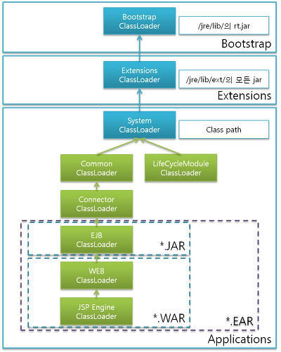
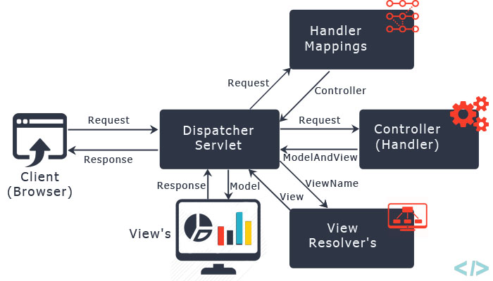

# 스프링 부트로 배우는 자바 웹 개발

<!--[TOC]: # "## Table of Contents"-->

## Table of Contents
- [class loader](#class-loader)
  - [클래스 로더의 특징](#클래스-로더의-특징)
  - [WAR 파일의 특성](#war-파일의-특성)
- [2. Servlet](#2-servlet)
  - [생명주기](#생명주기)
  - [2.1 GET / POST / Multipart](#21-get--post--multipart)
    - [2.1.1 Filter](#211-filter)
    - [2.1.2 Cookie](#212-cookie)
    - [2.1.3 Session](#213-session)
  - [2.2 디자인 패턴 활용](#22-디자인-패턴-활용)
    - [2.2.1 JavaEE 패턴](#221-javaee-패턴)
      - [2.2.1.1 Intercepting Filter](#2211-intercepting-filter)
      - [2.2.1.2 Front Controller](#2212-front-controller)
        - [2.2.1.2.1 sendRedirect](#22121-sendredirect)
        - [2.2.1.2.2 forward](#22122-forward)
      - [2.2.1.3 Command Pattern](#2213-command-pattern)
- [3. Spring](#3-spring)
  - [3.1 IoC 패턴 활용 (Inversion of Control)](#31-ioc-패턴-활용-inversion-of-control)
    - [3.1.1 의존관계의 원칙](#311-의존관계의-원칙)
    - [3.1.2 인터페이스와 스프링](#312-인터페이스와-스프링)
      - [3.1.2.1 Annotation Life Cycle](#3121-annotation-life-cycle)
  - [3.2 Spring MVC](#32-spring-mvc)
    - [3.2.1 Dispatcher Servler 등록 방법](#321-dispatcher-servler-등록-방법)
    - [3.2.2 Interceptor](#322-interceptor)
- [4. Spring Boot](#4-spring-boot)
  - [4.1 Spring boot Start](#41-spring-boot-start)
    - [4.1.1 @SpringBootSpplication 역할](#411-springbootspplication-역할)
  - [4.2 정적 자원 관리](#42-정적-자원-관리)
    - [4.2.1 스프링 부트 폴더 규약](#421-스프링-부트-폴더-규약)
    - [4.2.2 웹 리소스 폴더 변경](#422-웹-리소스-폴더-변경)
    - [4.2.3 리소스 주소에 MD5 값 설정](#423-리소스-주소에-md5-값-설정)
    - [4.2.4 Resource Url Provider](#424-resource-url-provider)
    - [4.2.5 WebJar를 이용한 외부 프론트엔드 라이브러리 관리](#425-webjar를-이용한-외부-프론트엔드-라이브러리-관리)
  - [4.3 Template](#43-template)
    - [4.3.1 Thymeleaf](#431-thymeleaf)
- [5. REST API](#5-rest-api)
  - [5.1 REST 특성](#51-rest-특성)
  - [5.2 Resource](#52-resource)
  - [5.3 REST API methods](#53-rest-api-methods)
  - [5.4 HATEOAS - self descriptive message](#54-hateoas---self-descriptive-message)
  - [5.5 RestTemplate](#55-resttemplate)
    - [5.5.1 RestTemplate 네트워트 속성 설정](#551-resttemplate-네트워트-속성-설정)
    - [5.5.2 UriComponentsBuilder 활용](#552-uricomponentsbuilder-활용)
- [6. DATABASE](#6-database)
  - [6.1 SQL DDL, DML, DCL?](#61-sql-ddl-dml-dcl)
  - [6.2 ORM](#62-orm)
  - [6.3 JPA](#63-jpa)
    - [6.3.1 JpaRepository Class Diagram](#631-jparepository-class-diagram)
    - [6.3.2 데이터베이스와 객체 맵핑](#632-데이터베이스와-객체-맵핑)
      - [6.3.2.1 Entity](#6321-entity)
      - [6.3.2.2 N:1](#6322-n1)
      - [6.3.2.3 1:N](#6323-1n)
  - [6.4 QueryDSL](#64-querydsl)
  - [6.5 MyBatis](#65-mybatis)
  - [6.6 Connection pool](#66-connection-pool)
- [7. Custom](#7-custom)
  - [7.1 Annotation](#71-annotation)
- [8. Exception 처리](#8-exception-처리)
  - [8.1 throw, throws 차이](#81-throw-throws-차이)
    - [8.1.1 throw 활용](#811-throw-활용)
    - [8.1.2 throws 활용](#812-throws-활용)
  - [8.2 ControllerAdvice](#82-controlleradvice)
  - [8.3 Database의 예외 처리](#83-database의-예외-처리)
    - [8.3.1 Transaction](#831-transaction)
    - [8.3.2 JDBC 와 트랜잭션](#832-jdbc-와-트랜잭션)
    - [8.3.3 PlatformTransactionManager](#833-platformtransactionmanager)
    - [8.3.4 Spring Transaction과 Service 레이어](#834-spring-transaction과-service-레이어)
    - [8.3.5 @Transactional](#835-transactional)
  - [JUnit Test](#junit-test)
- [9. cache](#9-cache)
  - [9.1 캐시 유형](#91-캐시-유형)
    - [9.1.1 위치에 따른 캐시 구분](#911-위치에-따른-캐시-구분)
      - [9.1.1.1 영역별 기술 요소](#9111-영역별-기술-요소)
    - [9.1.2  영역에 따른 캐시 구분](#912--영역에-따른-캐시-구분)
      - [9.1.2.1 데이터 저장 방식에 다른 캐시 유형](#9121-데이터-저장-방식에-다른-캐시-유형)
    - [9.1.3 캐시 데이터 저장 방식](#913-캐시-데이터-저장-방식)
  - [9.2 Spring Cache](#92-spring-cache)


### class loader



#### 클래스 로더의 특징
-	계층적
	-	상위 클래스 로더에서 하위 클래스 로더를 갖는 방식
	-	최상위 클래스 로더는 부트스트랩 클래스 로더
-	클래스 로딩을 위임
-	가시적인 규약
	- 클래스 로딩할 때 가능한 범위
	- 자식 클래스 로더는 클래스 로딩 요청 위임을 통해 부모 클래스 로더가 로딩한 클래스를 찾을 수 있음
	- 부모 클래스는 자식 클래스 로더가 로딩한 클래스를 알 수 없음
-	클래스 언로딩 불가능
	-	가비지 컬렉터가 동작하거나 WAS가 재시작할 때 초기화

- 부트스트랩 클래스 로더 (BootStrap Class loader)
	- JVM 런타임 실행을 위해 기반이 되는 파일들을 로드
	- rt.jar 파일과 연관이 있음
	- 부트 스트랩 로더의 로드가 끝나면 확장 클래스 로더가 로딩
- 확장 클래스 로더 (Extensions Class loader)
	- 자바의 최상위 객체인 Object를 포함한 자바 API를 로드
	(자바 홈 폴더 하위의 ext폴더 하위에 있는 jar 파일들과 연관이 있음)
	- 확장 클래스 로더의 로드가 끝나면 시스템 클래스 로더를 로드
- 시스템 클래스 로더 (System Class loader)
	- 클래스패스에 포함된 클래스를 로드
	- 사용자는 시스템 클래스 로더가 로드하는 클래스 패스 영역에만 접근할 수 있다.

> 보통 독립적인 영역이 필요한 WAS의 경우 시스템 클래스 로더 하위에 사용자 정의 로더를 만들어서 사용
대부분의 개발 환경 설정 관련 문서에서 톰캣 설치 위치를  `CATALINA_HOME`으로 지정하는 것은 WAS에서 생성한 클래스 로더를 기준으로 동작하기 위함

#### WAR 파일의 특성
**Web Application Archive**의 약자 (*Web Application Resource)
libs 폴더에 있는 JAR 라이브러리들은 사용자 정의 클래스로더. 웹 어플리케이션 컨테이너의 로더를 통해 클래스 패스에 추가된다.
```
	- [Web Archive]
		- [content directory] (Html, js, css)
			- [WEB-INF] (web.xml)
				- [classes] (.class)
				- [libs] (jar)
```

웹 어플리케이션 클래스 로더는 클래스로더의 유형 중에서 시스템 클래스 로더 하위에 사용자가 정의한 클래스 로더에 해당
웹 어플리케이션 컨테이너는 웹 어플리케이션 자체 API를 제공하기 위해 컨테이너를 로드하는 클래스 로더와 사용자가 추가한 JSP, WAR 파일들을 다루기 위한 `ServletCotext Loader`를 사용.
컨테이너가 시작되고 Context가 초기화 되면 서블릿 스펙 권장에 따라 `WEB-INF/classes` 파일을 먼저 검색해서 로딩하고, 그 후에 `WEB-INF/libs` 에 있는 JAR 파일들을 로드한다.

## 2. Servlet
### 생명주기


On Destory


서블릿의 생명주기는 초기화, 서비스, 소멸의 3단계로 구성되어 있다.

- 초기화 (Initialize)
	- 로드한 서블릿의 인스턴스를 생성
	- 리소스 로드
	- 클래스 생성자의 초기화 작업
	- 서버 구동 후 최초 요청에서만 호출됨 (단 1회))
- 서비스 (Service)
	- 클라이언트의 요청에 따라서 호출할 메서드를 결정
- 소멸 (Destory)
	- 서블릿 언로드

```xml
<!-- 기존의 Servlet  맵핑 방법 -->
<servlet>
	<servlet-name> Init <servlet-name>
	<servlet-class> InitServlet </servlet-class>
</servlet>
<servlet-mapping>
	<servlet-name> Init </servlet-name>
	<url-pattern> /init </url-pattern>
</servlet-mapping>
```
```java
WebServlet(name="Init", urlPatterns={"/init"})
public class UnitServlet extends httpServlet {}
```
### 2.1 GET / POST / Multipart
- **Get** : 데이터를 쿼리 스트링 형태로 전송
- **POST** : Application/x-www-form-unlencoded
	데이터를 스트림 형태로 인코딩하여 전달할 때 사용되는 전송 방식
- **Multipart/form-data** : 파일 업로드 시 사용되는 전송 방식
	전송 Form에 `enctype="multipart/form-data"` 추가

> 자바에서는 파일 쓰기 시에 먼저 임시 디렉터리에 파일을 저장한다.
기본 임시 디렉터리는 자바의 시스템 프로퍼티로 `java.io.tmpdir`로 지정 되어 있고
실제 저장 위치는 `System.getProperty("java.io.tmpdir");`로 확인 가능

#### 2.1.1 Filter
웹 클라이언트의 요청에 대해서 사전 작업이 있을 경우에 필터를 사용

필터는 필터 인터페이스를 상속받아 만들 수 있다.
필터는 서블릿의 생명주기처럼 init과 destory 메서드를 가지고 있고 필터 기능 사용을 위한 doFilter가 있다.
필터가 서블릿 보다 먼저 실행된다.

#### 2.1.2 Cookie
사용자가 사이트를 방문했을 때, 사용자의 컴퓨터에 저장되는 정보
- 이름 : 각각의 쿠카의 값을 식별하기 위한 키
- 값 : 특정 이름으로 쿠키에 지정된 값
- 유효시간 : 쿠키의 유지 시간
- 도메인 : 쿠키를 전송할 도메인
- 경로 : 쿠키를 전송할 요청 경로

쿠키는 HTTP 헤더에 포함되어 전달된다
쿠키는 javax.servlet.http 패키지에 포함
> 생성된 쿠키는 삭제를 할 수 없어 유효시간을 0으로 만들어서 무효화 시킨다.
#### 2.1.3 Session
서버와 클라이언트의 유효한 커넥션을 식별하는 정보.
서버는 클라이언트가 요청을 보내면 요청을 식별할 수 있는 ID를 부여하는데 이것이 SessionID.
SessionID는 JSESSIONID라는 이름으로 쿠키에 저장되고, 클라이언트가 재접속할 때 해당 쿠키를 이용해 세션 ID 값을 서버에 전달
Servlet에서는 Session이 `javax.servlet.http` 패키지에 `HttpSession` 인터페이스로 저장 되어 있다.

- getId : 세션의 고유 아이디를 얻을 수 있는 메서드
- getCreationTime : 세션이 생성된 시간을 얻을 수 있는 메서드
- getLastAccessTime : 웹 브라우저가 가장 마지막에 세션에 접근한 시간을 얻을 수 있는 메서드

### 2.2 디자인 패턴 활용
#### 2.2.1 JavaEE 패턴
|패턴이름|개요|
|:--|:--|
|Intercepting Filter|**요청에 대한 전처리 및 후처리** <br> 요구 사항에 대해서 전처리와 후처리에 대한 솔루션을 제공하고 이를 통해 유동적인 아키텍쳐를 가능하게 한다.|
|Front Controller   |**요청에 대한 처리를 관리하는 중앙 컨트롤러** <br> 프레젠테이션 레이어에 일어나는 일들의 창구로 facade 패턴의 역할과 MVC 패턴에서 controller의 역할을 함으로써 보안, 뷰 관리, 탐색들을 관리한다.|
|View helper        |**뷰의 표현을 위해 비즈니스 로직을 가지고 있는 개념상의 Helper** <br> 비즈니스 로직과 페레젠테이션 로직의 결합도를 낮추가 위해 사용|
|Composite View     |**레고 블럭 같은 작은 뷰들을 조합해서 만드는 전체의 뷰** <br> 복잡한 뷰를 만들기 위해서 기본적인 뷰 레이어를 융통성 있게 하고, 개인화 영역과 커스터마이징을 보다 수월하게 한다.|
|Service to worker  |**Front Controller와 View Helper Pattern을 이용해 dispatcher 컴포넌트를 구성** <br> 대규모 애플리케이션에서 이용되는 기법으로 뷰에 대한 처리 이전에 동작한다.|
|Dispatcher View    |Service to Worker와 동일하며 차이점은 뷰에 대한 처리 중에 수행되어야 하고, 작은 시스템에서 더 안정적이다.|

##### 2.2.1.1 Intercepting Filter
servlet에서 Filter 를 상속받아 구현하는 형태가 `Intercepting Filter pattern`의 구현체이다.

##### 2.2.1.2 Front Controller
컨트롤러가 공통 요청을 먼저 수행하고 뷰를 호출 하는 패턴
```flow
client=>start: Client
controller=>condition: Service (isJSP?)
servlet=>end: ServletView
jsp=>end: JspView

client->controller
controller(yes)->jsp
controller(no)->servlet
```
여러 다른 화면 요청에 대해서 화면에 바로 전달하지 않고 컨트롤러를 통해 전달하는 것

전달방법
- Response 객체의 sendRedirect
- RequestDispatcher 객체의 forward 메서드

###### 2.2.1.2.1 sendRedirect
서버에서 클라이언트로 응답을 던지는 것으로 속성을 저장 할 수 없고 다른 로직을 추가할 수 없다.
```java
response.sendRedirect("경로");
```
###### 2.2.1.2.2 forward
`requestDispatcher` 객체를 생성해야한다.
`requestDispatcher` 사용시 경로는 절대 경로로 지정해야 하며 상대경로를 사용할 수 없다.
`sendRedirect`와는 다르게 servletcontext와 session에 숙성을 저장하고 포워딩한 곳에서 사용할 수 있다.
```java
RequestDispatcher rd = request.getRequestDispatcher("경로");
rd.forward(ServletRequest request, ServletResponse response);
```
컨트롤러에서 직접적으로 forward 메서드를 사용하게 될 경우에는 URL이 변경 되거나 뷰가 변경 될 때마다 컨트롤러를 변경하게 되어 추후에 유지보수가 어려워진다.
이럴때 `Command Pattern` 을 이용해서 컨트롤러 클래스의 복잡도를 낮출 수 있다,

##### 2.2.1.3 Command Pattern
로직을 객체 안에 캡슐화해서 저장함으로써 컨트롤러와 같은 클래스를 수정하지 않고 재사용할 수 있게 하는 패턴

## 3. Spring
### 3.1 IoC 패턴 활용 (Inversion of Control)
#### 3.1.1 의존관계의 원칙
- 하이레벨 모듈은 로우레벨 모듈에 의존해서는 안 되고 모두 인터페이스에 의존해야 한다.
- 추상화는 세부 사항에 의존해서는 안 된다.  (세부 사항이 추상화에 의존해야 함)
인터페이스를 활용함으로서 결합도를 낮춰야함

인터페이스를 사용 하더라도 결국 인스턴스화하기 위해서 반드시 객체 생성에 필요한 코드가 수반되므로 결합도를 완전히 분리해 낼 수 없다.
결국 프로그램이 온전이 동작하기 위해서는 인스턴스화할 수 있는 코드에 대한 의존성을 갖게 된다.
이를 대신 해결해 주는것이 바로 의존성 주입 DI (Dependency Injection) 이다.

#### 3.1.2 인터페이스와 스프링
스프링에서 의존성을 주입할 때 기본적으로 타입을 기반으로 함(@Autowired)
스프링 컨테이너에 클래스를 등록하면 스프링이 클래스의 인스텅스를 관리해준다.
`XML`로 설정하는 방법과 `Annotation`으로 관리하는 방법 도 있다.
`@Configuration` 어노테이션을 상단에 추가해서 이 클래스가 `Bean` 설정 정보가 포함된 클래스임을 명시
같은 Type의 Bean을 두개 이상 등록 할 시에는 method 명으로 `context.getBean("methodName")` 을 활용하여 꺼낼 수 있다. ( context = `AnnotationConrifApplicationContext` )
##### 3.1.2.1 Annotation Life Cycle
- `@PostConstruct` - 빈이 초기화 될 때 호출
- `@PreDestory` - 빈이 소멸되기 직전에 호출

### 3.2 Spring MVC
`Front Controller pattern`에 DI를 이용해서 컴포넌트들의 생명주기를 관리할 수 있는 컨트롤러 중심의 웹 MVC 프레임워크
Spring MVC는 `DispatcherServlet`, `View Resolver`, `Interceptor`, `Handler`, `View` 등으로 구성



1. DispatcherServlet이 요청을 받으면 그 요청을 처리할 수 있는 Handler의 이름을 HandlerMapping에게 문의
2. HandlerMapping은 요청 URL을 보고 Handler를 판단하고 Handler 실행 전에 전처리, 후처리로 실행해야 할 인터셉터 목록을 결정한다.
3. DispatcherServlet이 제어권을 Handler로 전달
4. Handler는 응답에 필요한 서비스를 호출 하고 응답에서 렌더링 해야 하는 View Name을 판단해서 DispatcherServlet에 전송
5. DispatcherServlet은 논리적인 View Name을 ViewResolver에 전달해서 응답에 필요한 View를 생성할 수 있도록 한다.
6. View에 Model과 컨트롤러를 전달해서 응답을 생성 받는다
7. 이렇게 생성된 응답을 클라이언트에 반환

> **Interceptor vs Filter**
> DispatcherServlet이 HandlerMapping에게 문의하여 받아온 Handler의 전처리, 후처리를 하는것이 Interceptor이고 DispatcherServlet 이전의 전처리를 하는것이 Filter의 역할이다.
> - *Interceptor* : preHandle, postHandle, afterCompletion
> - *Filter* : doFilter

#### 3.2.1 Dispatcher Servler 등록 방법
- XML을 이용하여 등록하는 방법
```xml
<!-- web.xml -->
<servlet>
	<servlet-name> dispatcher <servlet-name>
	<servlet-class> org.springframework.web.servlet.DispatcherServlet </servlet-class>
	<load-on-startup> 1 </load-on-startup>
</servlet>
<servlet-mapping>
	<servlet-name> dispatcher </servlet-name>
	<url-pattern> / </url-pattern>
</servlet-mapping>

<!-- dispatcher-servlet.xml -->
<beans>
	<context:component-scan base-package="{packageName}" />
</beans>

<bean id="viewResolver" 
	  class="org.springframework.web.servlet.view.UrlBasedViewResolver">
	<properties name="viewClass" 
				value="org.springframework.web.servlet.view.JstView" />
	<properties name="prefix" value="/WEB-INF/views/" />
	<properties name="suffix" value=".jsp" />
</bean> 
```
- Annotation으로 등록하는 방법
```java
@Controller
public class IndexController {
	@RequestMapping("/")
	public ModelAndView home() {
		ModelAndView mv = new ModelAndView("home");
		mv.addObject("title");
		return mv; // home.jsp 를 반환
	}
}
```

#### 3.2.2 Interceptor
Controller가 요청을 처리 하기 전(pre) 후(post)에 대해 로직을 추가할 수 있다.
특정 URL에 대해 공통 로직 적용이 필요할 경우에 많이 사용됨
`HandlerInterceptorAdaptor` 클래스를 상속받아 구현
`HandlerInterceptorAdaptor` Class는 `AsyncHandlerInterceptor` 인터페이스를 상속받은 클래스
`AsyncHandlerInterceptor`는 Spring 3.2에 비동기 관련해서 추가된 인터페이스

