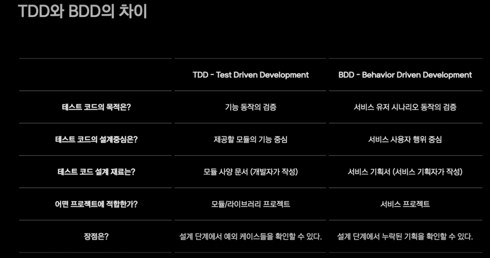

# BDD
behavior driven development

- TDD에서 파생된 개발 방법론
- 개발자와 비개발자간의 협ㅇ넙 과정을 녹여낸 방법
- 사용자의 행위를 작성하고 결과 검증을 진행
- BDD로 테스트 코드를 작성함에 따라 설계 역시 행위의 중심이 되는 도메인 기반 설계가 됨

TDD에서는 TestCase 작성 시나리오를 만드는데 큰 어려움이 있다면
BDD는 기획서를 보고 행위에 따른 TestCase를 작성함으로 더 쉬워진다.

기획서 변경이나 누락된 기획으로 인한 변경이 있을 경우 설계가 테스트코드들이 크게 변경이 되는데  
BDD는 기획서를 꼼꼼히 살펴보고 테스트케이스를 작성하는 와중에 기획서에 누락된것을 발경할 수 있어 상호 보완이 가능하고 더불어 누더기 코드가 되는것을 방지 할 수 있다.

## TDD, BDD 차이
1+1 을 검증을 한다면
TDD는 `add(1, 1)`의 결과가 2인지 확인
BDD는 사용자가 `=`를 눌렀을때 1+1의 값 2가 화면에 표시되는지 확인

##  BDD Lifecycle
BDD는 크게 3가지 구분으로 이루어진다.
Given - 사용자가 주어진 환경
When - 사용자의 행위
Then - 행위에 따른 기대결과

> 출처 : [kotest가 있다면 TDD 묻고 BDD로 가!](https://if.kakao.com/session/106)

