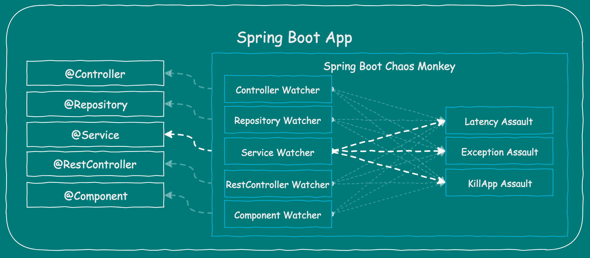

# Chaos Monkey for Spring Boot

카오스 엔지니어링(Chaos Engineering)이란 프로덕션 서비스의 각종 장애 조건을 견딜 수 있는 시스템의 신뢰성을 확보하기 위해 분산 시스템을 실험 하고 배우는 분야
실제 프로덕션 상황에서 임의의 장애, 지연, 서버다운을 일으켜, 전체 MSA 시스템이 탄력있게 반응하는지 확인하는 Fault Injection Test(FIT) 에서 유래



[Chaos Monkey란](https://codecentric.github.io/chaos-monkey-spring-boot/) `Annotaion`으로 찾아가 장애를 발생시키며, `Spring Boot Actuator`를 이용하여 설정이 가능 (장애 발생조건 및 활성 비활성)

## Setting
Spring Boot Actuator를 추가해주고 ChaosMonkey Spring Boot도 추가하여준다
``` gradle
implementation("org.springframework.boot:spring-boot-starter-actuator")
implementation("de.codecentric:chaos-monkey-spring-boot:2.1.1")
```

``` properties
spring.profiles.active=chaos-monkey

management.endpoint.chaosmonkey.enabled=true
management.endpoints.web.exposure.include=health,info,chaosmonkey
```
actuator를 통해서 chaos monkey를 사용하려면 endpoint를 활성화해주고 exposure를 추가 해주어야한다.

|옵션|설정|
|:--|:--|
|Repository Watcher 활성화|chaos.monkey.watcher.repository=true|
|Enable|http post localhost:8080/actuator/chaosmonkey/enable|
|Enable Check|http localhost:8080/actuator/chaosmonkey/status|
|Watcher 확인|http localhost:8080/actuator/chaosmonkey/watchers|
|latency 공격 설정|http POST localhost:8080/actuator/chaosmonkey/assaults level=3 latencyRangeStart=2000 latencyRangeEnd=5000 latencyActive=true|
|latency 공격 설정 확인|http localhost:8080/actuator/chaosmonkey/assaults|
|예외 발생|http POST localhost:8080/actuator/chaosmonkey/assaults level=3 exceptionsActive=true exception.type=java.lang.RuntimeException|

> `http POST localhost:8080/actuator/chaosmonkey/assaults level=3 latencyRangeStart=2000 latencyRangeEnd=5000 latencyActive=true`
> **level=3** : 3번 요청중에 1번 적용
> **latencyActive=true** : 지연 활성화
> **latencyRangeStart=2000 latencyRangeEnd=5000** : 지연이 적용되었을때 2초에서 5초내로 지연요청

## Chaos Monkey properties

chaos monkey를 사용하려면 active된 profile이 있어야 하므로 자동적으로 `application-chaos-monkey.yml` 파일을 찾아서 로드를 하게된다.
따라서 초기 설정을 아래와 같이 파일 하나에 몰아서 설정이 가능하다.
``` yaml
chaos:
  monkey:
    enabled: true
    assaults:
      level: 5
      latencyRangeStart: 1000
      latencyRangeEnd: 10000
      exceptionsActive: true
      killApplicationActive: true
      watchedCustomServices: ["sample.chaospilot.fake.FakeRemoteService.getNameAndLength"]
    watcher:
      controller: false
      restController: true
      repository: false
      service: false
      component: false
```
