# JMeter

Thread Group를 생성하여 테스트를 진행 환경 생성
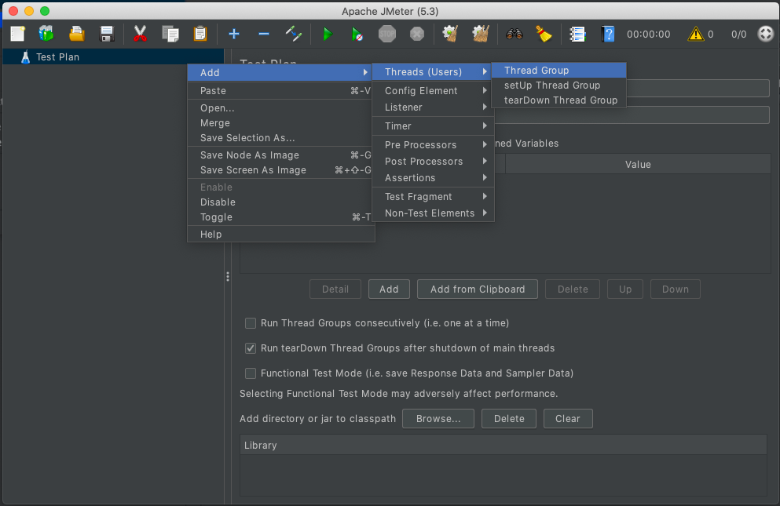

## Thread-group
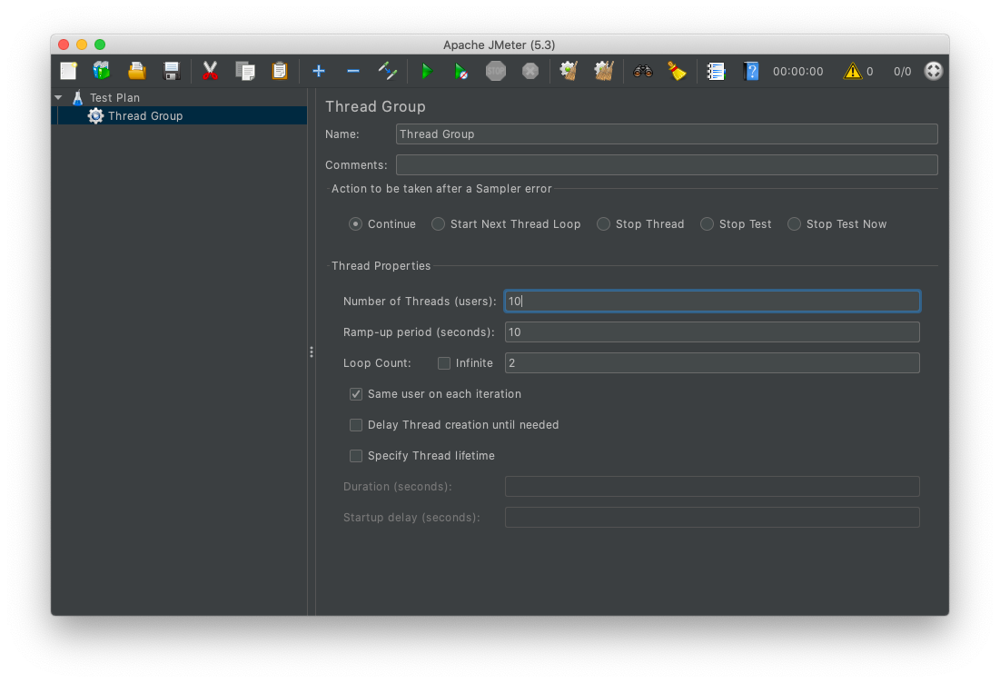
- Number of Threads : 요청을 보낼 Thread의 갯수를 지정 (유저의 숫자)
- Ramp-up period : 몇초만에 상단에 적은 Thread를 모두 생성할건지
- Loop Count : 총 몇번을 반복할건지 Count
- Action to taken after a Sampler error : 에러가 났을 경우에 대한 행동 정의

## Regist Sampler
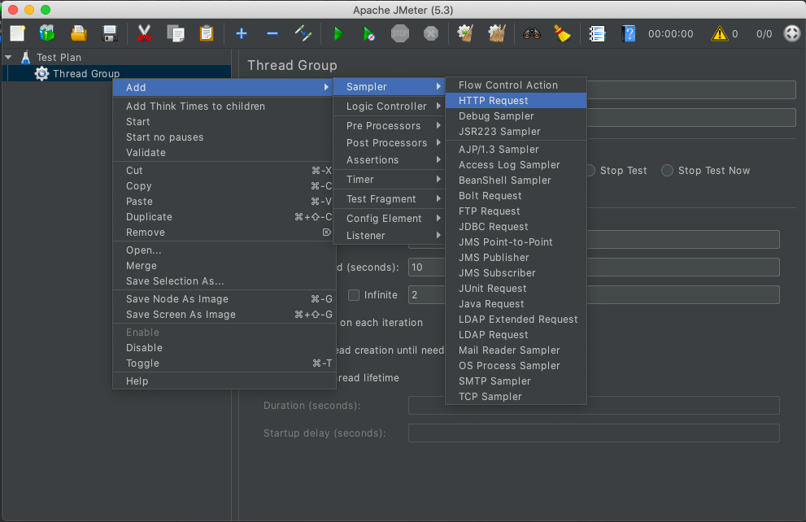
테스트를 진행 할 Http 요청을 정의
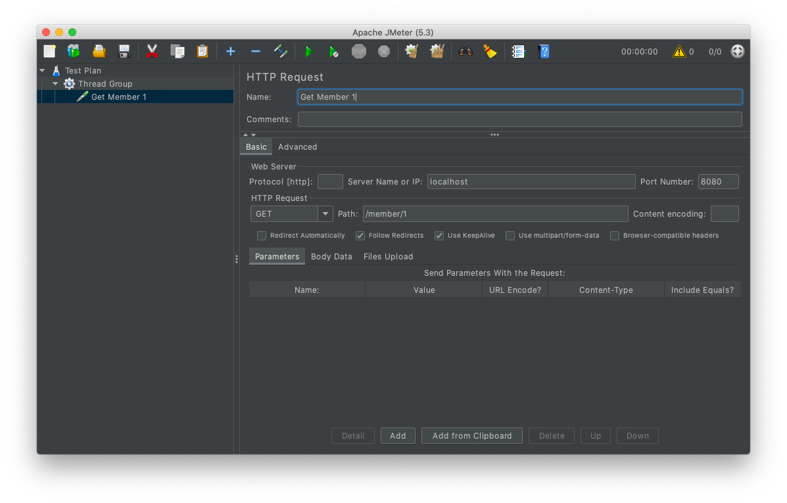
테스트를 진행할 IP와 Port, Http Request Method와 Path를 적는다.

## Listener
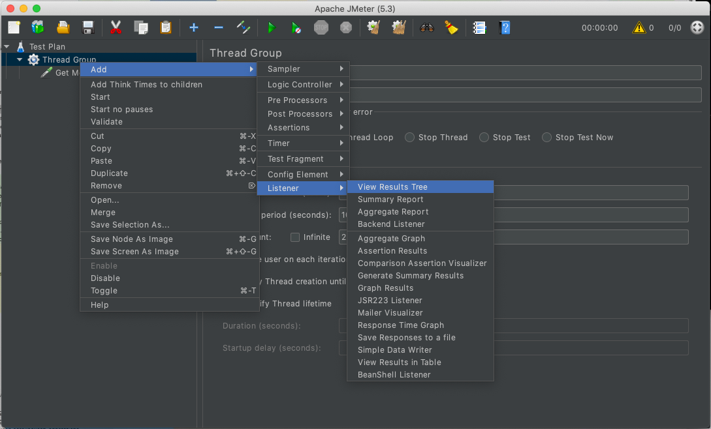
보낸 요청에 대해서 리스너를 등록하여 어떻게 요청을 했고 무슨 응답이 왔는지 시각화하여 볼 수 있다.
- View Result Tree
  - 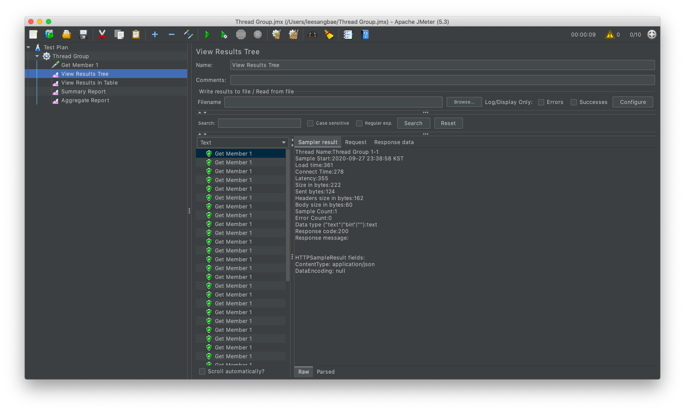
- View Result in Table
  - 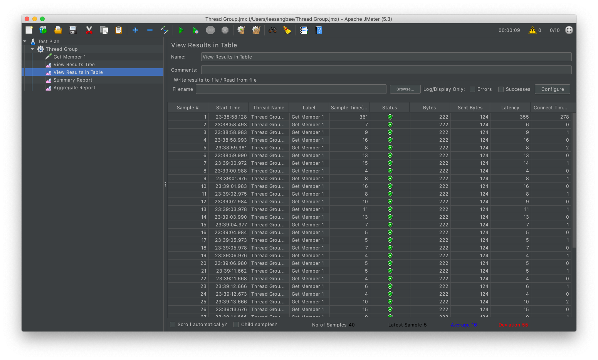
- Summary Report
  - 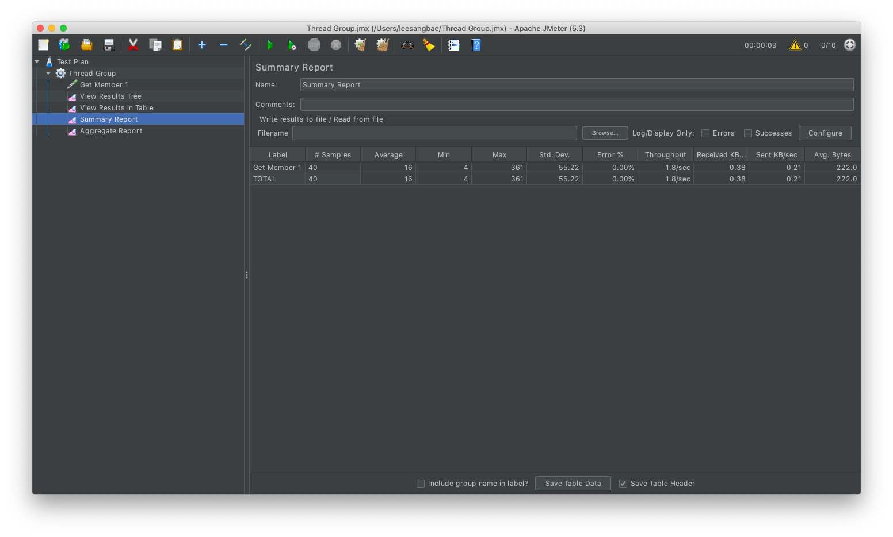
- Aggregate
  - 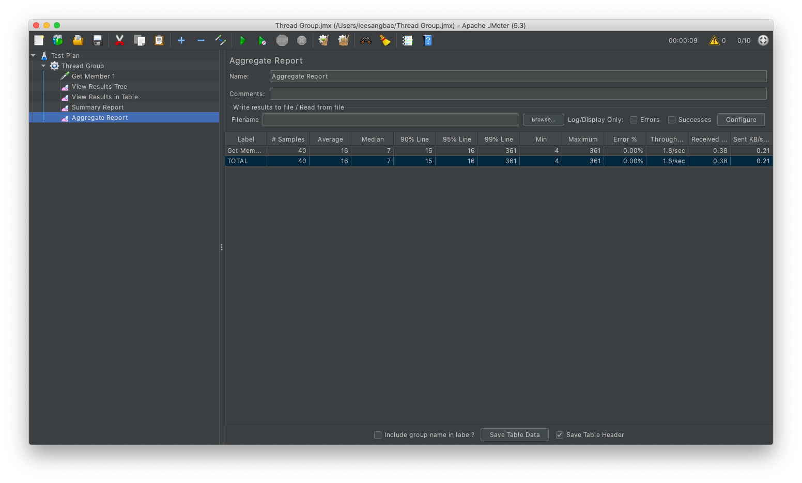
- Response Time Graph
  - 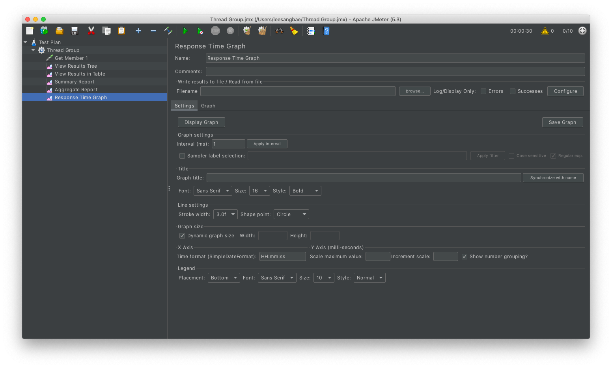
  - 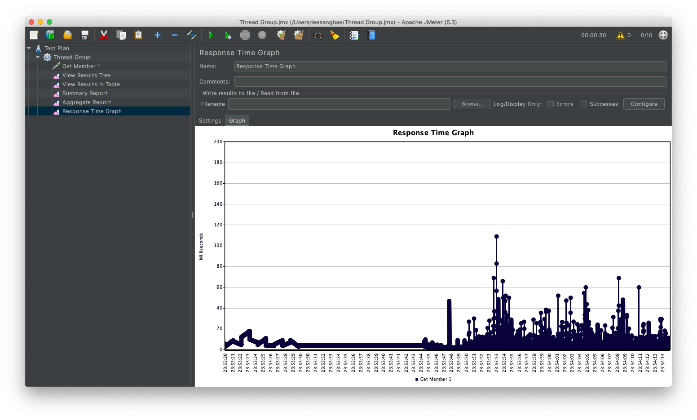

## Assertion
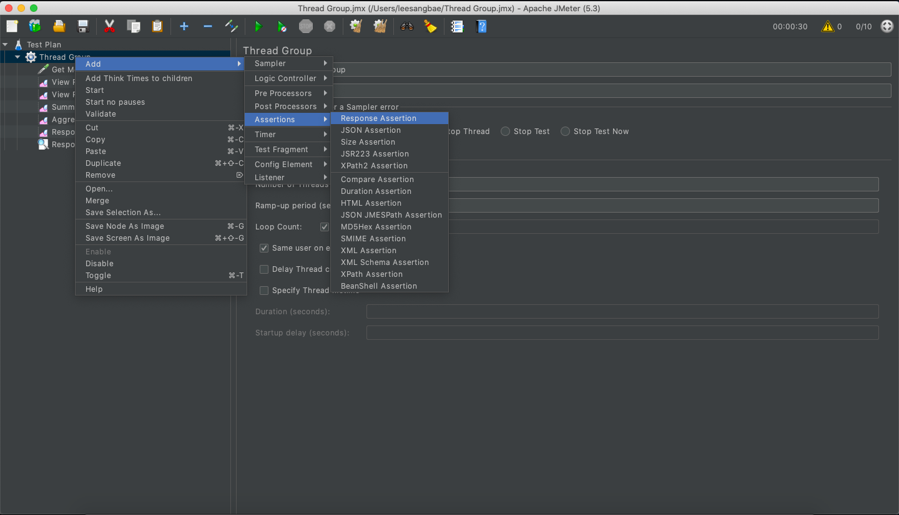
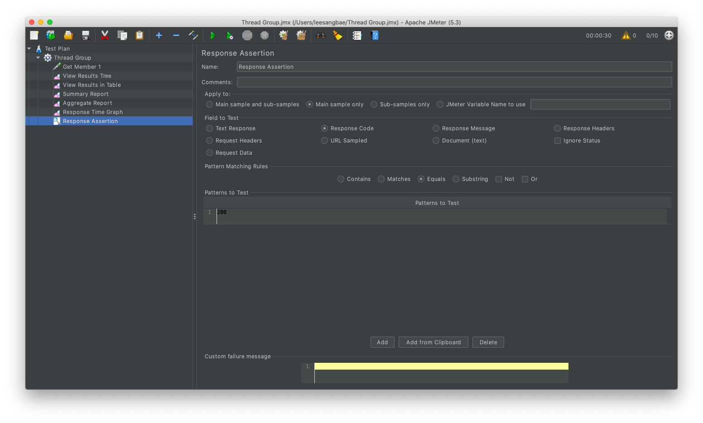
Response의 Code가 200인것만 허용하는 설정을 추가

## 레포트
`jmeter/bin/jmeter -n -t ./jmeter-thread-group.jmx`
- `-n` : UI 없이 실행
- `-t` : 설정파일 기반으로 바로 실행

