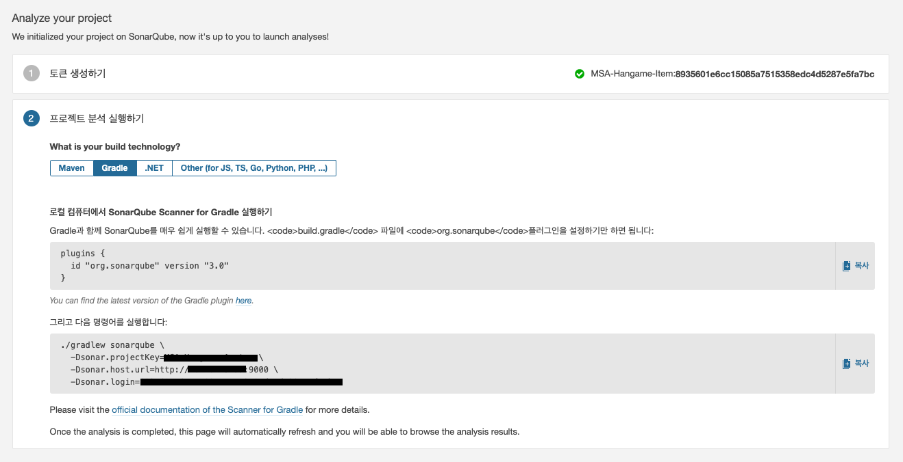

# Sonarqube

## Docker-Compose
``` yaml
version: "2"

services:
  sonarqube:
    image: sonarqube:8.6-community
    container_name: sonarqube
    depends_on:
      - postgres
    ports:
      - "9000:9000"
    networks:
      - qp
    environment:
      SONAR_JDBC_URL: jdbc:postgresql://postgres:5432/sonar
      SONAR_JDBC_USERNAME: ${DB_USER}
      SONAR_JDBC_PASSWORD: ${DB_PASSWD}
    volumes:
      - ${PWD}/conf:/opt/sonarqube/conf
      - sonarqube_data:/opt/sonarqube/data
      - sonarqube_extensions:/opt/sonarqube/extensions
      - sonarqube_logs:/opt/sonarqube/logs
      - sonarqube_temp:/opt/sonarqube/temp
  postgres:
    image: postgres
    container_name: postgres
    networks:
      - qp
    environment:
      POSTGRES_USER: ${DB_USER}
      POSTGRES_PASSWORD: ${DB_PASSWD}
    volumes:
      - postgresql:/var/lib/postgresql
      - postgresql_data:/var/lib/postgresql/data

networks:
  qp:
    name: qp
    driver: bridge

volumes:
  sonarqube_data:
  sonarqube_extensions:
  sonarqube_logs:
  sonarqube_temp:
  postgresql:
  postgresql_data:
```

## Project Create




## 설정 방법 with JACOCO
```groovy
plugins {
    id "org.sonarqube" version "3.0"
    id 'jacoco'
    id 'java'
}

sonarqube {
    properties {
        property "sonar.host.url", "{{Sonarqube 페이지 주소}}"
        property "sonar.login", "{{Sonarqube page에서 Add Project 했을때 생성한 Token 값 }}"
        property "sonar.projectKey", "{{Sonarqube page에서 Add Project 했을때 생성한 Token 이름}}"
        property "sonar.sources", "src"
        property "sonar.language", "java"
        property "sonar.sourceEncoding", "UTF-8"
        property "sonar.tests", ["src/test/java"]
        property "sonar.sources", 'src/main/java/{{package path}}'
        property "sonar.java.coveragePlugin", "jacoco"
        property "sonar.jacoco.reportPaths", "$buildDir/jacoco/jacoco.exec"
        property "sonar.java.junit.reportPaths", "$buildDir/test-results"
        property "sonar.coverage.jacoco.xmlReportPaths", "$buildDir/reports/jacoco/test/xml/jacocoTestReport.xml"
    }
}

test {
    jacoco {
        destinationFile = file("$buildDir/jacoco/jacoco.exec")
    }
    useJUnitPlatform()
    finalizedBy 'jacocoTestReport'
}

jacoco {
    toolVersion = '0.8.5'
}

jacocoTestReport {
    reports {
        html.enabled true
        xml.enabled true    // sonarqube와 연동시 필요
        csv.enabled false
    }
    finalizedBy 'jacocoTestCoverageVerification'
}

jacocoTestCoverageVerification {
    violationRules {
        rule {
            enabled = true              // rule에 대한 조건 사용 여부
            element = "CLASS"

            limit {
                counter = "BRANCH"      // 브랜치 커버리지
                value = "COVEREDRATIO"
                minimum = 0.70
            }

            limit {
                counter = 'LINE'        // 라인 커버리지
                value = 'COVEREDRATIO'
                minimum = 0.70
            }

            limit {
                counter = 'LINE'        // 빈 줄을 제외한 코드의 라인수를 최대 200라인으로 제한
                value = 'TOTALCOUNT'
                maximum = 200
            }

            excludes = [                // 분석에서 제외할 파일 패턴
//                    '*.test.*',
            ]
        }
    }
}

task testCoverage(type: Test) {
    group 'verification'
    description 'Runs the unit tests with coverage'

    dependsOn(':test',
            ':jacocoTestReport',
            ':jacocoTestCoverageVerification',
            ':sonarqube')

    tasks['jacocoTestReport'].mustRunAfter(tasks['test'])
    tasks['jacocoTestCoverageVerification'].mustRunAfter(tasks['jacocoTestReport'])
    tasks['sonarqube'].mustRunAfter(tasks['jacocoTestCoverageVerification'])
}
```

testCoverage를 실행할때 sonarqube 보다 jacoco를 먼저 실행시키게하여 sonarqube에서 jacoco의 데이터를 사용하도록 한다.

`./gradlew testCoverage`

> https://kwonnam.pe.kr/wiki/gradle/sonarqube