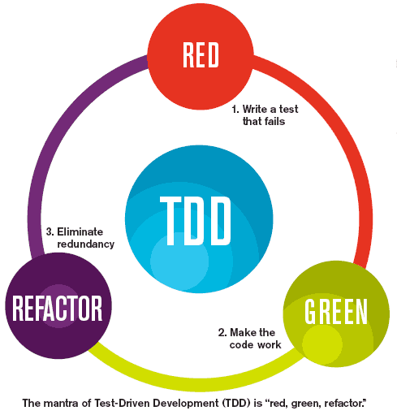

# TDD란?
TDD는 테스트부터 시작한다.
구현을 먼저 하는것이 아닌 테스트 케이스를 먼저 만든다음 구현을 뒤로 미룬다.
기능을 검증하는 테스트 코드를 먼저 작성하고 테스트를 통과시키기 위해 개발을 진행하는것을 의미한다.
작성한 테스트를 통과하지 못하면 테스트를 통과할 만큼만 코드를 작성한다.
테스트를 통과한 뒤에는 개선할 코드가 있으면 리팩토링한다.
리팩토링을 수행한 뒤에는 다시 테스트를 실행해서 기존 기능이 망가지지 않았는지 확인한다.
이 과정을 반복하면서 점진적으로 기능을 완성해 나가는 것, 이것이 전형적인 TDD의 흐름이다.

테스트코드를 작성할 때 `src/main/java`에 먼저 만들기 보다는 `src/test/java`에 먼저 구현한뒤 테스트 코드가 완성되면 `src/main/java`로 이동한다. 이렇게 한다면 완성되지 않은 코드가 배포되는 것을 방지하는 효과가 있다.


1. 항상 실패하는 테스트를 먼저 작성 (Red)
2. 테스트가 통과하는 프로덕션 코드를 작성 (Green)
3. 테스트가 통과하면 프로덕션 코드를 리팩토링 (Refactor)

> **레드-그린-리팩터**
> TDD 사이클을 Red-Green-Refactor로 부르기도 한다.
> 여기서 레드는 실패하는 테스트를 의미한다. 테드는 테스트 코드가 실패하면 빨간색을 이용해서 실패한 테스트를 보여주는데서 비롯했다.
> 비슷하게 그린은 성공한 테스트를 의미한다. 즉 코드를 구현해서 실패하는 테스트를 통과시키는 것을 뜻한다.
> 마지막으로 리팩터는 이름 그대로 리팩토링 과정을 의미한다.

단위 테스트는 TDD의 첫 번째 단계인 기능 단위의 테스트 코드를 작성.
TDD와 달리 테스트 코드를 꼭 먼저 작성해야 하는것도 아니고 리팩토링도 포함되지 않으며 테스트 코드만 작성하는것을 의미

> `TDD`와 `단위 테스트(Unit Test)`는 다른 이야기.

참고 자료 - [채수원 - TDD 실천법과 도구](https://repo.yona.io/doortts/blog/issue/1)

## 단위 테스트의 중요성
- 단위 테스트는 개발단계 초기에 문제를 발견하게 도와줌
- 단위 테스트는 개발자가 나중에 코드를 리팩토링하거나 라이브러리 업그레이드 등에서 기존 기능이 올바르게 작동하는지 확인 가능 (ex: 회귀 테스트)
- 단위 테스트는 기능에 대한 불확실성을 감소시킬 수 있음.
- 단위 테스트는 시스템에 대한 실제 문서를 제공. 즉, 단위 테스트 자체가 문서로 사용 가능

## 단위 테스트 예제들

### Basic Controller Test
```java
RunWith(SpringRunner.class)
@WebMvcTest(controllers = HelloController.class)
public class HelloControllerTest {
    
    @Autowired
    private MockMvc mvc;
    
    public void hello가_리턴된다() throws Exception {
        String hello = "hello";
        
        mvc.perform(get("/hello"))
                .andExpect(status().isOk())
                .andExpect(content().string(hello));
    }
}
```
1. `@RunWith(SpringRunner.class)`
	- 테스트를 진행할 때 `JUnit`에 내장된 실행자 외에 다른 실행자를 실행
	- 여기서는 `SpringRunner`라는 스프링 실행자를 사용.
	- 즉, 스프링 부트 테스트와 JUnit 사이에 연결자 역할을 수행
2. `@WebMvcTest`
	- 여러 스프링 테스트 어노테이션 중, Web(Spring MVC)에 집중할 수 있는 어노테이션
	- 선언할 경우 `@Controller`, `@ControllerAdvice` 등을 사용할 수 **있음**.
	- 단 `@Service`, `@Component`, `@Repository` 등은 사용할 수 **없음**.
3. `@Autowired`
	- 빈 주입 받기
4. `private MockMvc mvc`
	- 웹 API를 테스트 할 때 사용
	- 스프링 MVC 테스트의 시작점
	- 이 클래스를 통해 HTTP GET, POST 등에 대한 API 테스트
5. `mvc.perform(get("/hello"))`
	- MockMvc를 통해 /hello 주소로 HTTP GET 요청
	- 체이닝이 지원되어 아래와 같이 여러 검증 기능을 이어서 선언 가능
6. `andExpect(status().isOk())`
	- mvc.perform의 결과를 검증
	- HTTP Header의 Status를 검증 (200, 400, 500)
7. `andExpect(content().string(hello))`
	- mvc.perform의 결과를 검증
	- 응답 본문의 내용을 검증

### JPA Controller Test
``` java
@RunWith(SpringRunner.class)
@SpringBootTest(webEnvironment = SpringBootTest.WebEnvironment.RANDOM_PORT)
public class PostsApiControllerTest {

    @LocalServerPort
    private int port;

    @Autowired
    private TestRestTemplate restTemplate;

    @Autowired
    private PostsRepository postsRepository;

    @After
    public void tearDown() throws Exception {
        postsRepository.deleteAll();
    }

    @Test
    public void Posts_등록된다() throws Exception {
        // given
        String title = "title";
        String content = "content";
        PostsSaveRequestDto requestDto = PostsSaveRequestDto.builder()
                .title(title)
                .content(content)
                .author("author")
                .build();

        String url = "http://localhost:" + port + "/api/v1/posts";

        // when
        ResponseEntity<Long> responseEntity = restTemplate.postForEntity(url, requestDto, Long.class);

        // then
        assertThat(responseEntity.getStatusCode()).isEqualTo(HttpStatus.OK);
        assertThat(responseEntity.getBody()).isGreaterThan(0L);

        List<Posts> all = postsRepository.findAll();
        assertThat(all.get(0).getTitle()).isEqualTo(title);
        assertThat(all.get(0).getContent()).isEqualTo(content);
    }
}
```
위 예제에서는 `@WebMvcTest`를 사용하지 않았는데 그 이유는 `@WebMvcTest`에서는 JPA 기능이 작동하지 않기 때문. Controller, ControllerAdvice등 외부 연동과 관련된 부분만 활성화 되니 JPA 기능이 필요한 경우 `@SpringBootTest`와 `TestRestTemplate`를 사용하면 된다.


## JUnit과 비교하여 assertJ의 장점
- CoreMatchers와 달리 추가적으로 라이브러리가 필요하지 않음
	- JUnit의 assertThat을 쓰게 되면 is()와 같이 CoreMatchers 라이브러리가 필요함
- 자동완성이 좀 더 확실하게 지원
	- IDE에서는 CoreMatchers와 같은 Matcher 라이브러리의 자동완성 지원이 약함
- [AssertJ가 JUnit의 assertThat 보다 편리한 이유](https://www.youtube.com/watch?v=zLx_fI24UXM)
