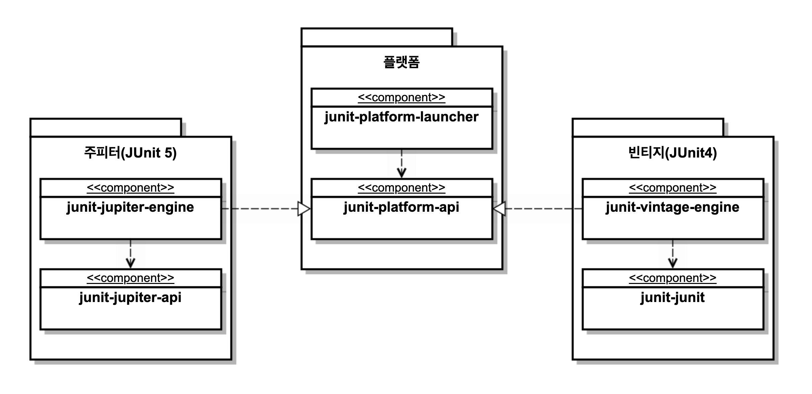
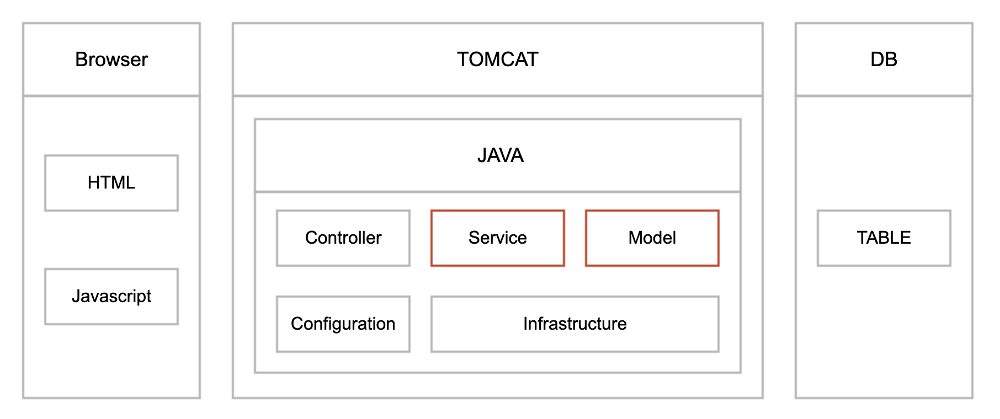
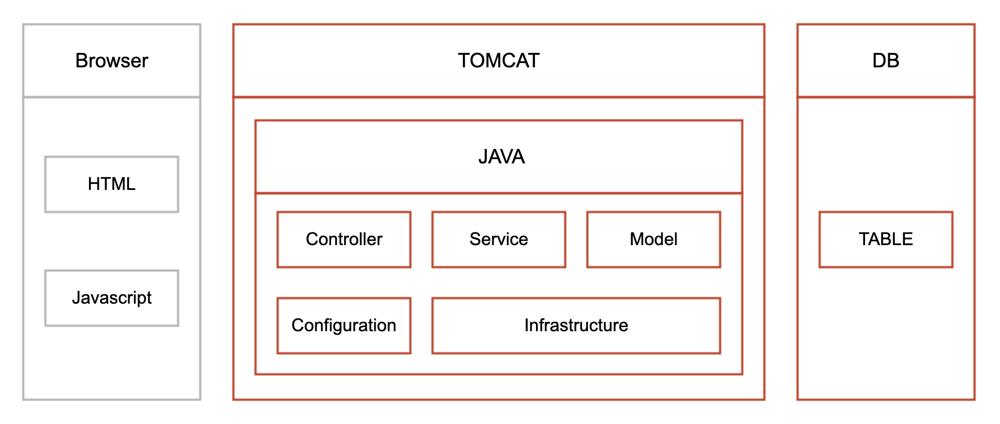
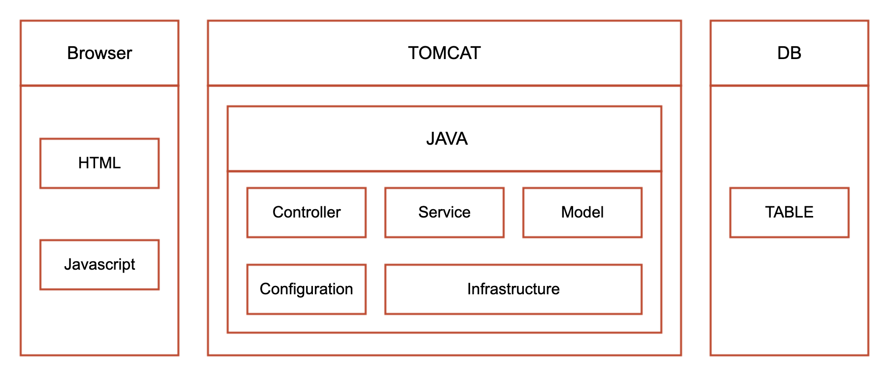

#TDD

> `최범균 - 테스트 주도 개발 시작하기`를 보고 정리한 글

<!--[TOC level=5]: # "## Table of Contents"-->

## Table of Contents
- [TDD란?](#tdd란)
- [환경설정](#환경설정)
- [테스트 코드 작성 순서](#테스트-코드-작성-순서)
  - [완급조절](#완급조절)
  - [지속적인 리팩토링](#지속적인-리팩토링)
- [TDD.기능 명세.설계](#tdd기능-명세설계)
  - [필요한 만큼만 설계하기](#필요한-만큼만-설계하기)
  - [기능 명세 구체화](#기능-명세-구체화)
- [JUnit 5 기초](#junit-5-기초)
  - [주요 메서드](#주요-메서드)
  - [테스트 라이프 사이클](#테스트-라이프-사이클)
    - [@BeforeEach, @AfterEach](#beforeeach-aftereach)
    - [@BeforeAll, @AfterAll](#beforeall-afterall)
    - [테스트 메서드 간 실행 순서 의존과 필드 공유하지 않기](#테스트-메서드-간-실행-순서-의존과-필드-공유하지-않기)
    - [Display 관련 Annotation](#display-관련-annotation)
    - [모든 테스트 실행하기](#모든-테스트-실행하기)
  - [조건에 따른 테스트](#조건에-따른-테스트)
  - [태깅과 필터링](#태깅과-필터링)
  - [중첩 테스트 클래스](#중첩-테스트-클래스)
  - [테스트 메시지](#테스트-메시지)
  - [임시 폴더 생성](#임시-폴더-생성)
  - [테스트 실행 시간 검증](#테스트-실행-시간-검증)
- [테스트 코드 구성](#테스트-코드-구성)
  - [구성요소 : 상황, 실행, 결과 확인](#구성요소--상황-실행-결과-확인)
  - [외부 상태가 테스트 결과에 영향을 주지 않게 하기](#외부-상태가-테스트-결과에-영향을-주지-않게-하기)
  - [외부 상태와 테스트 어려움](#외부-상태와-테스트-어려움)
- [대역](#대역)
  - [대역의 종류](#대역의-종류)
  - [상황과 결과 확인을 위한 협업 대상(의존) 도출과 대역 사용](#상황과-결과-확인을-위한-협업-대상의존-도출과-대역-사용)
  - [모의 객체를 과하게 사용하지 않기](#모의-객체를-과하게-사용하지-않기)
- [테스트 가능한 설계](#테스트-가능한-설계)
  - [테스트가 어려운 코드](#테스트가-어려운-코드)
    - [하드 코딩된 경로](#하드-코딩된-경로)
    - [의존객체를 직접 생성](#의존객체를-직접-생성)
    - [정적메소드 사용](#정적메소드-사용)
    - [실행 시점에 따라 달라지는 결과](#실행-시점에-따라-달라지는-결과)
    - [외부 라이브러리 사용](#외부-라이브러리-사용)
    - [그 외 테스트가 어려운 코드](#그-외-테스트가-어려운-코드)
- [테스트 범위와 종류](#테스트-범위와-종류)
  - [단위 테스트 (Unit Test)](#단위-테스트-unit-test)
  - [통합테스트 (Integration Test)](#통합테스트-integration-test)
  - [기능테스트 (Functional Test)](#기능테스트-functional-test)
  - [테스트 범위간 차이](#테스트-범위간-차이)
- [테스트 코드와 유지보수](#테스트-코드와-유지보수)
- [변수나 필드를 사용해서 기댓값 표현하지 않기``` java](#변수나-필드를-사용해서-기댓값-표현하지-않기-java)
  - [셋업을 이용해서 중복된 상황을 설정하지 않기](#셋업을-이용해서-중복된-상황을-설정하지-않기)
  - [통합 테스트에서 데이터 공유 주의하기](#통합-테스트에서-데이터-공유-주의하기)
  - [통합 테스트의 상황 설정을 위한 보조 클래스 사용](#통합-테스트의-상황-설정을-위한-보조-클래스-사용)
  - [실행 환경이 다르다고 실패하지 않기](#실행-환경이-다르다고-실패하지-않기)
  - [실행 시점이 다르다고 실패하지 않기](#실행-시점이-다르다고-실패하지-않기)
  - [랜덤하게 실패하지 않기](#랜덤하게-실패하지-않기)
  - [필요하지 않은 값은 설정하지 않기](#필요하지-않은-값은-설정하지-않기)
  - [단위 테스트를 위한 객체 생성 보조 클래스](#단위-테스트를-위한-객체-생성-보조-클래스)
  - [조건부로 검증하지 않기](#조건부로-검증하지-않기)
  - [통합 테스트는 필요하지 않은 범위까지 연동하지 않기](#통합-테스트는-필요하지-않은-범위까지-연동하지-않기)
  - [더이상 쓸모 없는 테스트 코드](#더이상-쓸모-없는-테스트-코드)
- [Mockito 기초 사용법](#mockito-기초-사용법)
  - [행위 검증](#행위-검증)
  - [인자 캡쳐](#인자-캡쳐)


## TDD란?
TDD는 테스트부터 시작한다.
구현을 먼저 하는것이 아닌 테스트 케이스를 먼저 만든다음 구현을 뒤로 미룬다.
기능을 검증하는 테스트 코드를 먼저 작성하고 테스트를 통과시키기 위해 개발을 진행하는것을 의미한다.
작성한 테스트를 통과하지 못하면 테스트를 통과할 만큼만 코드를 작성한다.
테스트를 통과한 뒤에는 개선할 코드가 있으면 리팩토링한다.
리팩토링을 수행한 뒤에는 다시 테스트를 실행해서 기존 기능이 망가지지 않았는지 확인한다.
이 과정을 반복하면서 점진적으로 기능을 완성해 나가는 것, 이것이 전형적인 TDD의 흐름이다.


테스트코드를 작성할 때 `src/main/java`에 먼저 만들기 보다는 `src/test/java`에 먼저 구현한뒤 테스트 코드가 완성되면 `src/main/java`로 이동한다. 이렇게 한다면 완성되지 않은 코드가 배포되는 것을 방지하는 효과가 있다.


> **레드-그린-리팩터**
> TDD 사이클을 Red-Green-Refactor로 부르기도 한다.
> 여기서 레드는 실패하는 테스트를 의미한다. 테드는 테스트 코드가 실패하면 빨간색을 이용해서 실패한 테스트를 보여주는데서 비롯했다.
> 비슷하게 그린은 성공한 테스트를 의미한다. 즉 코드를 구현해서 실패하는 테스트를 통과시키는 것을 뜻한다.
> 마지막으로 리팩터는 이름 그대로 리팩토링 과정을 의미한다.


## 환경설정
Gradle 프로젝트에서 JUnit 설정
``` gradle
plugins {
    id 'java'
}

sourceCompatibility = '11'
targetCompatibility = '11'
compileJava.options.encoding = 'UTF-8'
compileTestJava.options.encoding = 'UTF-8'

repositories {
    mavenCentral()
}

dependencies {
    testImplementation('org.junit.jupiter:junit-jupiter:5.5.0')
}

test {
    useJUnitPlatform()
    testLogging {
        events "passed", "skipped", "failed"
    }
}
```

## 테스트 코드 작성 순서
- 쉬운 경우에서 어려운 경우로 진행
- 예외적인 경우에서 정상인 경우로 진행

반대로 어려운 경우를 먼저 시작하거나 정상 상황을 먼저 시작하면 구현 과정이 원활하게 진행되지 않기도 한다.

1. 구현하기 쉬운 테스트부터 시작
	- 구현하기 어려운 테스트부터 시작하면 구현해야 할 코드량이 많아진다.
	- 한 번에 구현하는 시간이 짧아지면 디버깅 할 때에 유리하다. 작성한 코드가 많지 않고 작성 시간도 짧으면 머릿속에 코드에 대한 내용이 생생하게 남아 있기 때문에 디버깅 할 떄 문제 원인을 빠르게 찾을 수 잇다.
2. 예외 상황을 먼저 테스트
	- 초반에 예외를 처리하지 않으면 코드를 복잡하게 만들면 버그 발생 가능성을 높인다.
	- 예외 상황에 따른 if-else 구조가 미리 만들어지기 떄문에 많은 코드를 완성한 뒤에 예외 상황을 반영할 때보다 코드 구조가 덜 바뀐다.

### 완급조절
테스트 코드를 작성할때는 하드코딩으로 테스트를 통과시키고 그 다음에 하드코딩했던 상수를 제거하고 구현을 일반화한다.
몇 차례 상수를 사용해서 테스트를 통과시키고 뒤에 구현을 일반화 하는 과정이 처음에는 지루하게 느껴질 수도 있지만 이런 연습 과정은 나중에 만들어야 할 코드가 잘 떠오르지 않을 때 점진적으로 구현을 진행할 수 있는 밑거름이 된다.

### 지속적인 리팩토링
테스트를 통과하면 리팩토링을 진행한다.
매번 리팩토링을 진행하는것은 아니지만 적당한 후보가 보이면 리팩토링을 진행한다.
코드 중복은 대표적인 리팩토링 대상이고 코드가 길어지면 메서드 추출과 같은 기법을 사용해서 메서드 이름으로 코드의 의미를 표현할 수 있다.


## TDD.기능 명세.설계
TDD는 테스트를 만드는 것부터 시작하낟. 테스트 코드를 먼저 만들고 테스트를 통과시키기 위해 코드를 구현하고 리팩토링하는 과정을 반복한다. 여기서 중요한 것은 테스트 코드를 가장 먼저 작성해야 한다는 점이다.
테스트 코드를 위해 필요한점은 다음과 같다.
- 테스트할 기능을 실행
	- 클래스 이름
	- 메서드 이름
	- 메서드 파라미터 정의
- 실행 결과를 검증
	- 리턴 값, 리턴 타입 정의

위의 과정은 곧 설계의 과정이다. 타입의 이름을 정의하고, 타입이 제공할 기능을 결정하는 것은 기본적인 설계 행위이다.
TDD를 하다보면 테스트 코드를 작성하는 과정에서 일부 설계를 진행하게 된다.

> 이름은 설계에서 매우 중요하다. 설계 과정에서 구현하는 기능을 저확하게 표현하는 이름을 사용하는 것만큼 중요한 것은 없다. 잘못 지은 이름은 두고두고 개발자를 속인다. 레거시 코드를 보면 이름에서 기대하는 것과 다르게 동작하는 코드를 종종 만나게 된다. 이런 이름은 개발자를 속일 뿐만 아니라 코드를 분석하는 시간을 증가시켜 코드 수정을 어렵게 만드는 원인이 된다.
> 시간이 다소 걸리더라도 설계시점에 알맞은 이름을 찾아야한다. 이름을 고민하는 시간을 아까워하지 말아야한다.

### 필요한 만큼만 설계하기
TDD는 테스트를 통과할 만큼만 코드를 작성한다. 필요할 것으로 예측해서 미리 코드를 만들지 않는다.
이와 관련하여 미리 앞서서 필요해 보이는 익셉션 타입을 만들지 않는다. 테스트를 진행하는 과정에서 실제 익셉션이 필요한 시점에 익셉션을 도출한다.

유연한 설계는 필요한 시점에 추가한다. 이를 통해 설계가 불필요하게 복잡해지는 것을 방지할 수 있다.
요구사항은 계속해서 변경되지 마련이므로 처음에 필요하다고 생각했던 설계 요소가 구현 과정에서 쓸모가 없어지기도 하고 반대로 처음에 예상하지 못했던 설계 요소가 나중에 출현하기도 한다.
TDD는 미리 앞서서 코드를 만들지 않으므로 불필요한 구성 요소를 덜 만들게 된다.

### 기능 명세 구체화
테스트 코드를 작성하기 앞서 개발자는 기능 명세를 정리해야 하낟.
보통 개발자는 기획자가 적성한 스토리보드나 와이어프레임과 같은 형태로 요구사항 명세를 전달받는다.
이런 문서는 사용자나 기획자가 보기에는 적당할지 모르나 개발자가 기능을 구현하기에는 생략된 내용이 많다.

테스트코드의 파라미터와 결과값을 정해야하므로 요구사항 문서에서 기능의 입력과 결과를 도출해야 하는데 텟트 사례를 추가하는 과정에서 구현하기 애매한 점들을 많이 발견하게 된다.
테스트 코드를 작성하기 위해서는 입력과 결과가 명확해야 하므로 애매한 점을 발견하면 기획자나 실무 담당자와 얘기해서 기능 명세를 구체화 해야한다.

테스트 코드는 바로 실행할 수 있다. 테스트 코드를 이용하면 구체적인 예를 이용해서 기능을 바로 실행해 볼 수 있다. 이는 유지보수에 큰 도움이 된다. 특정 상황에서 코드가 어떻게 동작 하는지 이해하고 싶다면 해당 상황을 검증하는 테스트를 실행하고 이해가 필요한 코드를 추적하면 된다.

> 복잡한 로직을 구현해야 하는 것은 결국 개발자이므로 개발자는 최대한 예외적인 상황이나 복잡한 상황에 해당하는 구체적인 예를 끄집어내야 한다. 이를 위한 가장 좋은 방법은 담당자와 대화를 하는 것이다. 대화 과정이 쉽지 않을때도 있지만 대화를 하지 않으면 올바르게 원하는 결과물을 개발하지 못한다.


## JUnit 5 기초
tdd-junit5-package
JUnit5는 크게 세 개의 요소로 구성되어 있다.
- **JUnit Platform** - 테스팅 프레임워크를 구동하기 위한 런처와 테스트 엔진을 위함 API 제공
- **JUnit Jupiter** - JUnit 5를 위한 테스트 API와 실행 엔진을 제공
- **JUnit Vintage** - JUnit 3, JUnit 4 로 작성된 테스트를 JUnit 5 플랫폼에서 실행하기 위한 모듈을 제공

JUnit 5는 테스트를 위한 API로 주피터 API를 제공한다. 주피터 API를 사용해서 테스트를 작성하고 실행하려면 주피터 관련 모듈을 의존에 추가하면 된다.

JUnit 5를 이용해서 테스트를 실행하려면 JUnit 5 플랫폼이 제공하는 플랫폼 런처를 사용해야 한다.
Maven은 `maven-surefire-plugin:2.22.0` 버전부터 JUnit5 플랫폼을 지원하므로 따로 플랫폼 설정하지 않아도 된다.
``` xml

<dependencies>
	<dependency>
		<groupId>org.junit.jupiter</groupId>
		<artifactId>junit-jupiter</artifactId>
		<version>5.5.0</version>
		<scope>test</scope>
	</dependency>
</dependencies>

<build>
	<plugins>
		<plugin>
			<artifactId>maven-surefire-plugin</artifactId>
			<version>2.22.1</version>
		</plugin>
	</plugins>
</build>
```

Gragle의 경우 `test` task 내부에 JUnit Platform을 사용한다고 명시를 해준다.
``` gradle
dependencies {
	testImplementation('org.junit.jupiter:junit.jupiter:5.5.0')
}

test {
	useJUnitPlatform()
	...
}
```

### 주요 메서드
|메서드|설명|
|:-|:-|
|assertEquals(expected, actual)|실제값이 특정값과 같은지 검사|
|assertNotEquals(unexpected, actual)|실제값이 특정값과 같이 않은지 검사|
|assertSame(Object expected, Object actual)|두 객체가 동일한 객체인지 검사|
|assertNotSame(Object unexpected, Object actual)|두 객체가 동일하지 않은 객체인지 검사|
|assertTrue(boolean condition)|값이 true인지 검사|
|assertFalse(boolean condition)|값이 false인지 검사|
|assertNull(Object actual)|값이 null인지 검사|
|assertNotNull(Object actual)|값이 null이 아닌지 검사|
|fail()|테스트를 실패 처리한다.|
|assertThrows(Class<T> expectedType, Executable executable)|executable을 실행한 결과로 지정한 타입의 익셉션이 발생하는지 검사|
|assertDoesNotThrow(Executable executable)|executable을 실행한 결과로 익셉션이 발생하지 않는지 검사|

### 테스트 라이프 사이클

#### @BeforeEach, @AfterEach
JUnit은 각 테스트 메서드마다 다음 순서대로 코드를 실행한다.
1. 테스트 메서드를 포함한 객체 생성
2. `@BeforeEach` 애노테이션이 붙은 메서드 실행
3. `@Test` 애노테이션이 붙은 메서드 실행
4. `@AfterEach` 애노테이션이 붙은 메서드 실행

> 각 `@Test`마다
> `생성자`-> `@BeforeEach` -> `@Test`-> `@AfterEach`  순으로 항상 실행
> `@BeforeEach`, `@AfterEach`, `@Test` 가 붙은 메소드는 private여서는 안된다.


#### @BeforeAll, @AfterAll
한 클래스의 모든 테스트 메서드가 실행되기 전에 특정 작업을 수행해야 한다면 `@BeforeAll` 애노테이션을 사용한다. `@BeforeAll` 메서드는 클래스의 모든 테스트 메서드를 실행하기 전에 한 번 실행된다.
`@AfterAll` 애노테이션은 반대로 클래스의 모든 테스트 메서드를 실행한 뒤에 실행된다.

#### 테스트 메서드 간 실행 순서 의존과 필드 공유하지 않기
JUnit은 테스트 메서드의 실행 순서를 지정하는 방법을 제공하고 있다. 하지만 각 테스트 메서드는 독립적으로 동작해야 한다. 테스트 메서드 간에 의존이 생기면 이는 테스트 코드의 유지보수를 어렵게 만든다. 테스트 코드 역시 코드이므로 유지보수가 중요하다. 테스트 코드를 작성할 때에는 이 점에 유념해야 한다.

#### Display 관련 Annotation
자바는 메서드 이름에 공백이나 특수 문자를 사용할 수 없기 때문에 메서드 이름만으로 테스트 내용을 설명하기가 부족할 수 있다. 이럴 때는 `@DisplayName` 애노테이션을 사용해서 테스트에 표시 이름을 붙일 수 있고 특정 테스트를 실행하지 않고 싶을 때는 `@Disabled`애노테이션을 사용하여 테스트 실행 대상에서 제외할 수 있다.
``` java
@DisplayName("@DisplayName 테스트")
public class DisplayNameTest {
	@DisplayName("값 같은지 비교")
	@Test
	void assertEqualsMethod() {
		...
	}

	@Disabled
	@Test
	void assertAllTest() {
		...
	}
}
```
> `@Disable` 관련하여 여러가지 관련된 어노테이션들이 있다.
> @EnabledOnOs, @DisabledOnOs
> @EnabledOnJre, @DisabledOnJre
> @EnabledIfSystemProperty, @DisabledSyustemProperty
> @EnabledIfEnvironmentVariable, @DisabledIfEnvironmentVariable

#### 모든 테스트 실행하기
- mvn  test (mvnw test)
- gradle test (gradlew test)

### 조건에 따른 테스트

테스트 실행여부의 조건을 설정하는 어노테이션들이 있다.
- `@EnabledOnOs`, `@DisabledOnOs`
- `@EnabledOnJre`, `@DisabledOnJre`
- `@EnabledIfSystemProperty`, `@DisabledSystemProperty`
- `@EnabledIfEnvironmentVariable`, `@DisabledIfEnvironmentVariable`
``` java
@Test
// OS가 일치할떄만 테스트 
@EnabledOnOS(OS.WINDOWS)
void windowTempPath() {
	...
}

@Test
// 자바 버전이 맞으면 테스트
@EnabledOnJre({JRE.JAVA_8, JRE.JAVA_9, JRE.JAVA_10, JRE.JAVA_11})
void testOnJre() {
	...
}

@Test
// 시스템 프로퍼티 값을 비교하여 테스트 실행 
@EnableIfSystemProperty(named = "java.vm.name", matchers=".*OpenJDK")
void openJdk() {
	...
}

@Test
// 환경변수 값을 비교하여 테스트 실행 
@EnableIfEnvironmentVariable(named = "java.vm.name", matchers=".*OpenJDK")
void openJdk() {
	...
}
```
### 태깅과 필터링

테스트에 태그를 달아서 필터링을 가능하게 만든다.

``` java
@Tag("integration")
public class TagTest {
	@Tag("very-slow")
	@Test
	void verySlow() {
		...
	}
}
```
태그의 규칙
- null이나 공백이면 안된다.
- 좌우 공백을 제거한 뒤에 공백을 포함하면 안 된다.
- ISO 제어 문자를 포함하면 안된다.
- 다음 글자를 포함하면 안 된다 : `.` `(` `)` `&` `|` `!`

gragle, maven에서 아래의 설정을 이용하여 실행할 테스트를 선택할 수  있다.
``` xml
<plugin>
    <artifactId>maven-surefire-plugin</artifactId>
    <version>2.22.1</version>
    <configuration>
	    <groups>integration</groups>
	    <excludedGroups>slow | very-slow</excludedGroups>
    </configuration>
</plugin>
```
``` gradle
test {
	useJUnitPlatform {
		includeTags 'integration'
		excludeTags 'slow | very-slow'
	}
}
```
테스트 필터링을 설정할 때 다음과 같은 연상자를 이용해서 식을 조합할 수 있다.
- `!` : NOT 연산
	- `!integration`
- `&` : AND 연산
	- `slow & mock-server`
- `|` : OR 연산
	- `slow | very-slow`

### 중첩 테스트 클래스
`@Nested`애노테이션을 이용하여 중첩 클래스에 테스트 메서드를 추가할 수 있다.
``` java
public class Outer {
	
	@BeforeEach void outerBefore() {}
	@Test outer() {}
	@AfterEach void outerAfter() {}

	@Nested
	class NestedA {
		@BeforeEach void nestedBefore() {}
		@Test void nested() {}
		@AfterEach void nestedAfter() {}
	}
}
```
실행순서
1. Outer 객체 생성
2. NestedA 객체 생성
3. outerBefore()
4. nestedBefore()
5. nested()
6. nestedAfter()
7. outerAfter()

### 테스트 메시지
assertEquals(1, 2) 를 테스트 할때 3번째 인자값으로 String을 넘겨주면 console에 나오는 테스트 결과에 해당 메시지도 같이 뜬다.

``` java
assertEquals(expected.get(i), ret.get(i), "ret[" + i + "]");

// org.opentest4j.AssertionFailedError : ret[1] ==>
// Expected : 2
// Actual : 6
```

### 임시 폴더 생성
`File`이나 `Path`타입에 대해서 `@TempDir` 을 이용해 임시적인 폴더를 만들어 사용할 수 있다.
이는 테스트때 만들어지고 테스트가 끝나면 지워지게 된다.
``` java
@TempDir
File tempFolder;

@Test
void fileTest(@TempDir Path tempFolder) {
	...
}
```

### 테스트 실행 시간 검증
JUnit5.5 부터 지원하는 기능으로 일정시간 내에 실행되는지 검증이 가능하다.
애노테이션에 지정된 시간이 지나면 테스트가 실패된다.
``` java
public class TimeoutTest {
	@Test
	@Timeout(value = 500, unit = TimeUnit.MILLISECONDS)
	void sleep2seconds() throws InterruptedException {
		Thread.sleep(2000);
	}
}
```

## 테스트 코드 구성
### 구성요소 : 상황, 실행, 결과 확인
테스트 코드는 기능을 실행하고 그 결과를 확인하므로 상황 실행 결과 확인의
테스트 코드를 구성할때에는 `상황`, `실행`, `결과 확인` 세 가지 요소로 테스트를 구성 할 수 있다. 어떤 상황이 주어지고 그 상황에서 기능을 실행하고, 그 상황에서 기능을 실행하고, 실행한 결과를 확인하는 세 가지가 테스트 코드의 기본 골격을 이루게 된다.
> 상황, 실행, 결과 확인은 영어로 given, when, then 으로 표시한다.

하지만 상황-실행-결과 확인 구조가 테스트 코드를 작성하는데 도움이 되는 것은 맞지만 꼭 모든 테스트 메서드를 이 구조로 만들어야 하는 것은 아니다.

### 외부 상태가 테스트 결과에 영향을 주지 않게 하기
TDD를 진행하면서 테스트코드는 한번만 실행되지 않고 개발이 끝난 이후에도 지속적으로 실행이 되기때문에 상황에 따라 간헐적으로 실패하거나 다른 테스트 다음에 실행해야 성공하는 테스트가 나올 수 있다.
예를들어 아이디 생성하여 검사하는 테스트를 만들면 디비에는 아이디가 남게되고 다음 테스트에서는 아이디가 존재하는것으로 판단되어 테스트가 실패하게 된다.
이렇게 외부 상태에 따라 테스트의 성공 여부가 바뀌지 않으려면 테스트 실행 전에 외부를 원하는 상태로 만들거나 테스트 실행 후에 외부 상태를 원래대로 되돌려 놓아야 한다.
> 대표적인 예로는 트랜젝션을 이용한 롤백이 있다.

### 외부 상태와 테스트 어려움
상황과 결과에 영향을 주는 외부 요인은 파일, DBMS, 외부 서버 등 다양하다. 이들 외부 환경을 테스트에 맞게 구성하는 것이 항상 가능한 것이 아니다.
 REST API 서버에 연결할 수 없는 상황이나 REST API 서버에서 지정한 시간 안에 응답을 주지 않는 상황을 임의적으로 만들수가 없다.
이처럼 테스트 대상이 아닌 외부 요인은 테스트 코드에서 다루기 힘든 존재이다. 외부 상황은 테스트 코드에서 마음대로 제어할 수 없는 경우가 있다.
 또한, 테스트 코드에서 생성한 외부 결과를 마음대로 초기화하기 불가능 할 때도 있다. 이렇게 테스트 대상의 상황과 결과에 외부 요인이 관여할 경우 대역을 사용하면 테스트 작성이 쉬워진다. 대역은 테스트 대상이 의존하는 대상의 실제 구현을 대신하는 구현인데 이 대역을 통해서 외부 상황이나 결과를 대체할 수 있다.

## 대역
외부 요인이 테스트에 관여하는 주요 에
- 테스트 대상에서 파일 시스템을 사용
- 테스트 대상에서 DB로부터 데이터 조회하거나 데이터를 추가
- 테스트 대상에서 외부의 HTTP 서버와 통신

테스트 대상이 이런 외부 요인에 의존하면 테스트를 작성하고 실행하기 어려워진다.
테스트 대상 코드에서 사용하는 외부 API 서버가 일시적으로 장애가 나면 테스트를 원활하게 수행할 수 없다.

TDD는 `테스트 작성 -> 통과시킬 만큼 구현 -> 리팩토링`의 사이클을  반복해야 하는데  외부에서  테스트환경이 제공되지 않거나 연동해야 하는 개발에 있어서 협업이 어려울 시기에는 대역을 통하여 테스트를 진행해야한다.

### 대역의 종류
|대역 종류|설명|
|:-|:-|
|스텁 (Stub)|구현을 단순화한 것으로 대체한다. 테스트에 맞게 단순히 원하는 동작을 수행한다.|
|가짜 (Fake)|제품에는 적합하지 않지만, 실제 동작하는 구현을 제공한다. (ex. DB 대신에 메모리를 이용)|
|스파이 (Spy)|호출된 내역을 기록한다. 기록한 내용은 테스트 결과를 검증할 때 사용한다.|
|모의 (Mock)|기대한 대로 상호작용하는지 행위를 검증한다. 기대한 대로 동작하지 않으면 Exception을 발생할 수 있다. 모의 객체는 Stub이자 Spy도 된다.|

### 상황과 결과 확인을 위한 협업 대상(의존) 도출과 대역 사용

TDD시에 제어하기 힘든 외부 상황이 존재하면 다음과 같은 방법으로 의존을 도출하고 이를 대역으로 대신할 수 있다.
- 제어하기 힘든 외부 상황을 별도 타입으로 분리
- 테스트 코드는 별도로 분리한 타입의 대역을 생성
- 생성한 대역을 테스트 대상의 생성자 등을 이용해서 전달
- 대역을 이용해서 상황 구성

### 모의 객체를 과하게 사용하지 않기
모의 객체는 스텁과 스파이를 지원하므로 대역으로 모의 객체를 많이 사용하지만 모의 객체를 과하게 사용하면 오히려 테스트 코드가 복잡해지는 경우도 발생한다.
모의 객체가 아닌 단순하게 구현하는 방법이 오히려 쉽게 테스트코드가 작성되는 경우도 있다.
모의 객체를 이용하면 대역 객체를 따로 만들지 않아도되어 편할 수 있지만 결과 값을 확인하는 수단으로 모의 객체를 사용하기 시작하면 결과 검증 코드가 길어지고 복잡해진다.
 특히 하나의 테스트를 위해 여러 모의 객체를 사용하기 시작하면 결과 검증 코드의 복잡도는 배로 증가하게 된다.
  기본적으로 메서드 호출 여부를 검증하는 수단이기 때문에 테스트 대상과 모의 객체 간의 상호 작용이 조금만 바뀌어도 테스트가 깨지기 쉽다.

## 테스트 가능한 설계

### 테스트가 어려운 코드

#### 하드 코딩된 경로
파일 경로가 하드코딩 되어있는 경우 경로가 윈도우라면 맥 사용자들은 그 테스트를 진행할 수 없다.
경로뿐만 아니라 하드코딩 된 IP, PORT 또한 테스트를 어렵게 만든다.

> **해결방법**
> 해당 상황에 대해서는 하드코딩된 상수를 생성자나 메서드 파라미터로 이동하여 교체가 가능하게 설계를 해야한다.
> 가장 쉬운 방법은 Setter 혹은 생성자에서 받거나 실행하는 함수의 인자값으로 전달받는것이다.
> 테스트 코드에서 데이터를 읽을 때 사용하는 파일은 소스 코드 리포지토리에 함께 등록해야 한다.
> `src/test/file`, `src/test/resource`가 정당한 위치이다.

#### 의존객체를 직접 생성
의존 대상을 객체 내에서 직접 생성하여 사용한다면 테스트에서 똑같은 조건을 맞추기가 힘들어지는 경우가 있다.
> **해결방법**
> 의존 대상은 주입 받을 수 있는 수단을 제공해서 교체할 수 있도록 한다.
> 생성자나 Setter를 통해 의존 대상을 교체할 수 있도록 설계하여 대역을 사용 가능하게끔 만들어준다.

#### 정적메소드 사용
테스트를 진행해야하는 코드가 정적 클래스의 정적 메서드를 사용하고 있다면 해당 기능의 테스트 환경을 만들기가 쉽지 않다.
정적메서드가 서버 통신이나 시스템 프로퍼티에서 서버 정보를 가지고온다면 개발환경에 맞춰서 시스템 프로퍼티에 아이디와 비밀번호를 다시 구성해줘야 하는 문제도 생긴다.
> **해결방법**
> 정적메소드와 테스트 해야하는 코드가 다른 의존관계에 강하게 결합이 되어있다면 테스트 하고싶은 부분만 뗴어내서  따로 클래스를 구성해서 외부 주입과 테스트 환경에서 동작이 가능하게끔 유연한 설계를 가저가는것이 좋다.

#### 실행 시점에 따라 달라지는 결과
실제 실행 함수에 LocalDate.now()를 가져와 완료시점을 판단하여 실행시점에 따라 결과가 달라지는 경우나 Random을 사용하여 임의의 값을 사용하는 경우도 실행시마다 테스트가 성공/실패 할 수있어 믿을 수 없는 테스트 코드가 생기게된다.
> **해결방법**
> 시간이나 임의의 값을 제공하는 기능을 별도로 분리해서 테스트 가능성을 높일 수 있다.
> LocalDate.now() 같은 기능을 해당기능을 제공하는 클래스를 따로 뺀 뒤 today()라는 함수에서 LocalDate.now()를 리턴하도록 구현한다.

#### 외부 라이브러리 사용
테스트 대상이 사용하는 외부 라이브러리를 쉽게 대체할 수 없는 경우도 있다. 외부 라이브러리가 정적 메서드를 제공한다면 대체할 수 없다.
> **해결방법**
> 이렇게 대역으로 대체하기 어려운 라이브러리가 있다면 외부 라이브러리를 직접 사용하지 말고 외부 라이브러리와 연동하기 위한 Wrapper class를 따로 만들어준다.
> 그리고 테스트 대상은 그 Wrapper class를 사용하게 함으로 외부 연동이 필요한 기능을 쉽게 대역으로 대체할 수 있게 된다.

#### 그 외 테스트가 어려운 코드
- 역할이 섞여있는 코드
- 메서드 중간에 소켓 통신 코드가 포함
- 콘솔에서 입력을 받거나 결과를 콘솔에 출력
- 테스트 대상이 사용하는 의존 대상 클래스나 메서드가 final인 경우 대역으로 대체가 어려움
- 테스트 대상의 소스를 소유하고 있지 않아 수정이 어려운 경우

## 테스트 범위와 종류
### 단위 테스트 (Unit Test)


개별 코드나 컴포넌트가 기대한대로 동작하는지 확인하는 테스트
단위 테스트는 한 클래스나 한 메서드와 같은 작은 범위를 테스트한다.
일부 의존 대상은 스텁이나 모의 객체 등을 이용해서 대역으로 대체한다.


### 통합테스트 (Integration Test)

시스템의 각 구성 요소가 올바르게 연동되는지 확인하는 테스트
기능 테스트가 사용자 입장에서 테스트하는 데 반해 통합 테스트는 소프트웨어의 코드를 직접 테스트한다. 모바일 앱을 예로 들면 기능 테스트는 앱을 통해 가입 기능을 테스트 한다면 통합 테스트는 서버의 회원 가입 코드를 직접 테스트 하는 식이다.
 스프링 프레임워크나 마이바티스 설정이 올바른지 SQL 쿼리가 맞는지 DB트렌젝션이 잘 동작하는지 등을 검증 할 수 있다.

### 기능테스트 (Functional Test)

기능 테스트는 사용자 입장에서 시스템이 제공하는 기능이 올바르게 동작하는지 확인한다.
이 테스트를 수행하려면 시스템을 구동하고 사용하는데 필요한 모든 구성 요소가 필요하다.
사용자가 직접 사용하는 웹 브라우저나 모바일 앱부터 시작해서 데이터베이스나 외부 서비스에 이르기까지 모든 구성 요소를 하나로 엮어서 진행한다.
이는 E2E(End To End)의 모든 구성 요소를 논리적으로 완전한 하나의 기능으로 다룬다.
QA 조직에서 수행하는 테스트가 이 기능 테스트이다.

### 테스트 범위간 차이
|분류|통합 테스트|기능 테스트|단위 테스트|
|:-:|:-|:-|:-|
|테스트 환경 구성|DB, 캐시 서버등 연동 대상을 구성|별도구성 필요없음|별도구성 필요없음|
|테스트 실행 속도|DB연결, 소켓 통신, 스프링 컨테이너 초기화와 같이 테스트실행 속도를 느리게 만드는 요인이 많다.|브라우저, 앱을 구동한 뒤 화면의 흐름에 따라 알맞은 상호 작용|서버구동 및 DB 연결 없이 대역으로만 처리 가능|
|외부 연동 요인|외부연동 없인 테스트 불가|외부연동 없인 테스트 불가|대역을 통한 테스트가 가능|
|속도|느림|중간|빠름|
|테스트 코드 개수|적음|중간|많음|

TDD를 하는지 여부에 상관없이 테스트 코드를 작성하는 개발자는 단위 테스트와 통합 테스트를 섞어서 작성하게 된다.
보통 통합 테스트보다는 단위 테스트 코드를 더 많이 작성한다.

단위 테스트는 통합 테스트로도 만들기 힘든 상황을 쉽게 구성할 수 있다.
더 작은 단위를 대상으로 테스트 코드를 만들고 더 다양한 상황을 다르기 때문에 통합 테스트보다 단위 테스트 코드를 더 많이 작성한다.

기능테스트나 통합테스트에서 모든 예외 상황을 테스트한다면 중복되는 단위 테스트가 줄어들지만 단위 테스트의 속도는 다른것보다 월등히 빠르기 떄문에 가능하면 단위 테스트에서 다양한 상황을 다루고 통합테스트나 기능 테스트는 주요 상황에 초점을 맞춰야 한다.

테스트 실행속도가 느려지면 테스트를 작성하지 않거나 테스트 실행을 생략하는 상황이 벌어지며 이는 곧 소프트웨어의 품질 저하로 이어질 수 있기 때문에 가능하면 빠른 시간 내에 테스트를 실행할 수 있도록 해야한다.

## 테스트 코드와 유지보수
빠른 서비스 출시를 위해 CI(Continuous Integration)/CD(Continuous Delivery)를 도입하는 곳이 증가하고있다.
지속적으로 코드를 ㅋ통합하고 출시 가능한 상태로 만들고 배포하려면 새로 추가한 코드가 기존 기능을 망가뜨리지 않는지 확인할 수 있어야 하며 이런 이유로 자동화 테스트는 CI/CD의 필수 요건 중 하나이다.
 TDD를 하는 과정에서 작성한 테스트 코드는 CI/CD에서 자동화 테스트로 사용되어 버그가 배포되는 것을 막아주고 이는 소프트웨어 품질이 저하되는 것을 방지한다.

   테스트 코드를 유지보수하는데 시간이 많이 들기 시작하면 점점 테스트 코드를 손보지 않아 실패하는 테스트가 증가하게 된다. 깨지는 테스트를 방치하는 상황이 길어지면 다음과 같은 문제가 발생한다.
   - 실패한 테스트가 새로 발생해도 무감각해진다. 테스트 실패 여부에 상관없이 빌드하고 배포하기 시작한다.
   - 빌드를 통과시키기 위해 실패한 테스트를 주석 처리하고 실패한 테스트는 고치지 않는다.
테스트 코드는 코드를 변경했을 때 기존 기능이 올바르게 동작하는지 확인하는 회귀 테스트(regression test)를 자동화하는 수단으로 사용되는데 깨진 테스트를 방치하기 시작하면 회귀 테스트가 검증하는 범위가 줄어 버그가 발생했을 때 이를 놓칠 가능성이 커진다. (즉 소프트웨어 품질이 낮아진다)

 유지보수하기 좋은 코드를 만들기 위해 필요한 좋은 패턴과 원칙이 존재하는 것처럼 좋은 테스트 코드를 만들려면 몇 가지 주의해야 할 사항이 있다.

## 변수나 필드를 사용해서 기댓값 표현하지 않기``` java
Test
// 가독성이 떨어지며 date.getMonthValue 대신 date.getMonth를 사용하면 테스트가 깨진다
void dateFormat() {
    LocalDate date = LocalDate.of(1945, 8, 15);
    String dateStr = formatDate(date);
    assertEquals(date.getYear()+ "년 "
            + date.getMonthValue() + "월 "
            + date.getDayOfMonth() + "일", dateStr);
}

@Test
// 복잡하지도 않고 기대하는 값도 명확하게 표현하고 있다.
void dateFormat() {
    LocalDate date = LocalDate.of(1945, 8, 15);
    String dateStr = formatDate(date);
    assertEquals("1945년 8월 15", dateStr);
}
```
위에 코드는 테스트가 성공하더라도 이 테스트를 작성하지 않은 사람이 보면 테스트 코드를 분석하여 이해해야한다.

### 두 개 이상을 검증하지 않기
하나의 테스트 메서드에서 두가지를 검증하려 할때는 테스트의 집중도가 떨어질 수 있고 첫번째 검증이 실패가된다면 두번째 테스트는 진행을 하지 않기 때문에 검증 성공 여부를 알기 힘들며 테스트 에러가 발생한 즉시 둘 중 어떤 테스트에서 실패 했는지 알기위해선 코드분석이 필요하다.
 테스트 메서드가 반드시 한 가지만 검증해야 하는 것은 아니지만, 검증 대상이 명확하게 구분된다면 테스트 메서드도 구분하는 것이 유지보수에 유리하다.

### 정확하게 일치하는 값으로 모의 객체 설정하지 않기
모의 객체는 가능한 범용적인 값을 사용해서 기술해야 한다. 한정된 값에 일치하도록 모의 객체를 사용하면 약간의 코드 수정 만으로도 테스트는 실패하게 된다. 이 경우 테스트 코드의 일부 값을 수정하면 모의 객체 관련 코드도 함께 수정하는 번거로움이 있다.

테스트의 의도를 해치지 않는 범위에서 "pw"와 같은 문자열보다는 Mockito.anyString()과 같은 범용적인 값을 사용해야 한다. 이렇게 해야 약간의 코드 수정 때문에 테스트가 실패하는 것을 방지할 수 있다. 또한 코드를 수정할 때 모의 객체 관련 코드를 함께 수정해야 하는 빈도도 줄어든다.

### 과도하게 구현 검증하지 않기
테스트 코드를 작성할 때 주의할 점은 테스트 대상의 내부 구현을 검증하는 것이다. 모의 객체를 처음 사용할 때 특히 이런 유혹에 빠지기 쉽다. 모의 객체를 이용해서 내부 구현을 검증하는 코드는 결과적으로 유지보수에 도움이 되지 않는다.
``` java
@Test
void registerAndSendMail() {
    userRegister.register("id", "pw", "email");

    // PasswordChecker#checkPasswordWeak() 메서드 호출 여부 검사
    BDDMockito.then(mockPassworkChecker)
            .should()
            .checkPasswordWeak(Mockito.anyString());
    
    // UserRepository#findById 메서드를 호출하지 않는 것을 검사
    BDDMockito.then(mockRepository)
            .should(Mockito.never())
            .findById(Mockito.anyString());
}
```
위 테스트 코드는 해당 메서드에서 내부적으로 어떤 메서드를 호출하고 어떤 메서드를 호출하지 않는지 확인하는 것은 결국 메서드의 내부 구현을 검증하는 것이다.

 내부 구현을 검증하는것은 나쁜것은 아니지만 구현이 조금이라도 틀려지면 모든 테스트케이스를 다시 작성해야 하는 상황이 발생한다.
 내부 구현은 언제든지 바뀔 수 있기 때문에 테스트 코드는 내부 구현보다 실행 결과를 검증해야 한다.

### 셋업을 이용해서 중복된 상황을 설정하지 않기
테스트 코드에서 동일한 상황이 필요한 경우 중복된 코드를 제거하기 위해 `@BeforeEach` 메서드를 이용해서 상황을 구성할 수 있다. [@BeforeEach 바로가기](#beforeeach-aftereach)

 하지만 중복을 제거하고 코드 길이도 짧아졌지만 테스트 코드가 실패한다면 `@BeforeEach`의 코드까지 보면서 실패 원인을 분석해야한다.
 `@BeforeEach`를 사용한 메서드를 이용한 상황 설정으로 다른 문제는 테스트가 깨지기 쉬운 구조가 된다는 점이다. 모든 테스트 메서드가 동일한 상황 코드를 공유하기 떄문에 조금만 내용을 변경해도 테스트가 깨질 수 있다.

 `@BeforeEach`를 사용하는 메서드는 최소한의 초기화만 진행하고 각 메서드에서 사용될 객체생성은 메서드 안으로 할당하여야 초기화 메서드가 가지는 공통점으로 인한 제약이 줄어들게된다.
 테스트 메서드는 자체적으로 검증하는 내용을 완전히 기술하고 있어야 테스트 코드를 유지보수하는 노력을 줄일 수 있다.

### 통합 테스트에서 데이터 공유 주의하기
통합테스트 시작전에 DB 데이터를 초기화해야 하는 경우가 생긴다.
DB 연동을 포함한 통합 테스트를 실행하려면 DB 데이터를 알맞게 구성해야 한다. 이를 위한 방법은 테스트를 실행할 때마다 DB 데이터를 초기화해주는 쿼리를 실행하는 것이다.
 스프링 프레임워크에서는 `@Sql` 을 사용하여 테스트 실행 전 특정 쿼리를 실행할 수 있다.
``` java
@SpringBootTest
@Sql("classpath:init0-data-sql")
public class UserRegisterIntTestUsingSql {
    @Autowired
    private UserRegister register;
    
    @Autowired
    private JdbcTemplate jdbcTemplate;
    
    @Test
    void 동일_ID가_이미_존재하면_익셉션() {
        // 실행 결과 확인
        assertThrows(DupIdException.class,
                () -> register.register("abc", "pw", "email@email.com"));
    }
}
```

통합 테스트 코드를 만들 때는 다음의 두 가지로 초기화 데이터를 나눠서 생각해야 한다.
- 모든 테스트가 같은 값을 사용하는 데이터 : 예 ) 코드값 데이터
- 테스트 메서드에서만 필요한 데이터 : 예) 중복 ID 검사를 의한 회원 데이터

코드값은 거이 바뀌지 않고 오히려 바뀌면 문제가 발생한다. 이런 코드의 경우 모든 테스트에서 공유해도 되는 데이터이다.
특정 테스트만 사용하는 데이터라면 테스트 코드 내부에서 생성하여 공통으로 가지고 있으면 안된다.
즉 @Sql에서 실행되는 쿼리는 모든 환경에서 사용 되는 공통 코드만 넣는것이 올바른 경우다.

### 통합 테스트의 상황 설정을 위한 보조 클래스 사용
독립된 테스트 환경에서 사용되는 데이터를 그 테스트 메서드에서 생성을 하였는데 똑같은 중복 코드들이 많이 발생하는 경우에는 Helper Class를 사용하여 공통적인 작업들을 한곳에서 동일하게 처리할 수 있도록 구현한다.


### 실행 환경이 다르다고 실패하지 않기
같은 테스트 메서드가 실행 환경에 따라 성공하거나 실패하면 안 된다.
로컬 개발 환경에서는 성공하는데 빌드 서버에서는 실패하거나 윈도우에서는 성공하는데 Mac에서는 실패하는식으로 환경에 다라 테스트가 다르게 동작하면 안 된다.

- 파일경로
	- 절대경로가 아닌 상대경로로 지정해야한다.
	- `src/test/resource` 경로에 파일을 생성하고 `src/test/resources/file.txt` 형식으로 경로를 지정한다.
- 특정 OS 환경만 실행
	- @EnabledOnOs, @DisabledOnOs 어노테이션을 이용하여 OS별 테스트 지정이 가능하다.
``` java
@Test
@EnabledOnOs({ OS.LINUX, OS.MAC })
void callBash() {
	...
}
```

### 실행 시점이 다르다고 실패하지 않기
`LocalDateTime.now`를 이용하여 테스트 할 경우에는 실행 시점에 따라서 테스트 성공 실패가 나뉜다.
``` java
// BizClock.java
public class BizClock {
    private static BizClock DEFAULT = new BizClock();
    private static BizClock instance = DEFAULT;

    public static void reset() {
        instance = DEFAULT;
    }

    public static LocalDateTime now() {
        return instance.timeNow();
    }

    public void setInstance(BizClock bizClock) {
        BizClock.instance = bizClock;
    }

    public LocalDateTime timeNow() {
        return LocalDateTime.now();
    }
}


// BizClock.java
public class BizClock {
    private static BizClock DEFAULT = new BizClock();
    private static BizClock instance = DEFAULT;

    public static void reset() {
        instance = DEFAULT;
    }

    public static LocalDateTime now() {
        return instance.timeNow();
    }

    public void setInstance(BizClock bizClock) {
        BizClock.instance = bizClock;
    }

    public LocalDateTime timeNow() {
        return LocalDateTime.now();
    }
}
```
Test가 아닌 환경에서는 `BizClock.now()` 형식으로 호출하는 코드들을 사용하고 테스트 환경에서는 다음과 같이 실행하여 BizClock을 이용하여 사용하는 now들에 대해서 기준시간을 정하여 시간의 시점을 컨트럴 할 수 있게 끔 한다.
``` java
TestBizClock testClock = new TestBizClock();
...
testClock.setNow(LocalDateTime.of(2019, 1, 1, 13, 0, 0));
...
```


### 랜덤하게 실패하지 않기
랜덤의 경우 항상 다른 값이 나오기 때문에 실행 할 때마다 테스트 케이스는 실패한다
랜덤값은 랜덤으로 하는게 생성자를 통해 값을 받도록 수정하면 테스트가 가능해진다.
``` java
@Test
void noMatch() {
	GameNumGen gen = mock(GameNumGen.class);
	given(gen.generate()).willReturn(new int[]{1, 2, 3});
	
	Game g = new Game();
	Score s = g.guess(4, 5, 6);
	assertEquals(0, s.strikes());
	assertEquals(0, s.ball());
}
```


### 필요하지 않은 값은 설정하지 않기

``` java
// 아이디 중복체크만 하는데 너무 많은 정보가 들어간다.
User.builder().id("dupid").name("name")
	.email("mail@mail.com")
	.password("password")
	.regDate(LocalDateTime.now())
	.build();

// 필요한 값만 지정한다.
User.builder().id("dupid").build();
```
사용하지 않는 다른 정보에 대해서는 다른 사람에게 혼란을 야기시킬 경우가 있다.
사용하지 않는 코드를 생략함으로써 가독성도 많이 좋아진다.

### 단위 테스트를 위한 객체 생성 보조 클래스
단위 테스트 코드를 작성하다 보면 상황 구성을 위해 필요한 데이터가 다소 복잡할 때가 있다.
데이터 객체 안에 다른 리스트 객체들이 엮여있으면 데이터를 만드는 코드가 복잡해지고 여러군데서 사용한다면 코드량이 많아지는 상황이 벌어질 수 있다.
이를 대비해서 테스트를 위한 객체를 따로 생성하는 보조 Factory Class를 생성하여 간단하게 호출하여 사용한다.

### 조건부로 검증하지 않기
테스트 메서드는 실행이되면 성공하거나 실패해야 한다. 테스트가 성공 또는 실패하려면 반드시 단언을 실행해야한다.

``` java
@Test
void canTranslateBasicWord() {
	Translator tr = new Translator();
	if (tr.contains("cat")) {
		assertEquals("고양이", tr.translate("cat"));
	}
}
```
해당 조건에서 cat이 없으면 테스트를 수행하지 않고 넘어간다.
번역하는것이 반드시 행해져야하는 테스트라면 이는 문제가 된다.
그래서 아래와 같이 검사하여 테스트를 놓치는 것을 방지할 수 있다.
``` java
@Test
void canTranslateBasicWord() {
	Translator tr = new Translator();
	assertTranslationOfBasicWord(tr, "cat");
}

private void assertTranslationOfBasicWord(Translator tr, String word) {
	assertTrue(tr.contatins("cat"));
	assertEquals("고양이", tr.translate("cat"));
}
```

### 통합 테스트는 필요하지 않은 범위까지 연동하지 않기
`@SpringBootTest`를 사용하면 서비스 컨트롤러등 모든 스프링 빈을 초기화한다.
DB 관련된 설정 외에 나머지 설정도 처리하므로 스프링 초기화하는 시간이 길어질 수 있다.
스프링부트가 제공하는 `@JdbcTest`어노테이션을 사용하면 DataSource, JdbcTemplate등 DB연동과 관련된 설정만 초기화하여 스프링 초기화 하는 시간을 짧게한다.


### 더이상 쓸모 없는 테스트 코드
개발하는 도중에 java, kotlin 특정 api의 기능을 테스트해보고 싶을 경우가 있는데 이때 테스트 환경에서 테스트 해 볼수 있다.
이런 테스트 코드들은 단지 런타임 환경만 제공하고 테스트코드로서의 역할은 하지 않는 코드여서 오래 유지할 필요가 없어 목적이 끝나면 바로 삭제를 해주어야한다.

테스트 커버리지를 높이기 위한 목적으로 작성한 테스트 코드도 유지할 필요가 없다. 코드 품질을 측정하는 수단으로 테스트 커버리지를 많이 사용하는데 이 수치를 높이기 위해 단순이 작성되는 테스트 코드는 유지보수에 아무 도움이 되지 않으므로 삭제하는것이 맞다.

> 테스트 커버리지란?
> 테스트하는 동안 실행하는 코드가 얼마나 되는지 설명하기 위해 사용하는 지표로 보통 비율을 사용한다. 예를들어 단순하게 계산하면 한 메서드의 길이가 10줄인데 테스트하는 동안 8줄의 코드를 실행한다면 이때 테스트 커버리지는 80%가 된다. if-else 블록, 하위 타입, 반복문 등이 존대하므로 텟트 커버리지를 구하는 것은 복잡하다.

## Mockito 기초 사용법
Mockito는 모의 객체 생성, 검증, 스텁을 지원하는 프레임워크
``` xml
<dependencies>
	<dependency>
		<groupId>org.mockito</groupId>
		<artifactId>mockito-core</artifactId>
		<version>2.26.0</version>
		<scope>test</scope>
	</dependency>
</dependencies>
```
``` java
dependencies {
	testImplementation('org.mockito:mockito-core:2.26.0')
}
```

```
// GameNumGen.java
public interface GameNumGen {
    String generate(GameLevel level);
}

// GameLevel.java
public enum GameLevel {
    EASY, NORMAL, HARD
}

// GameGenMockTest.java
public class GameGenMockTest {

    @Test
    void mockStubTest() {
        // 모의 객체 생성
        GameNumGen genMock = mock(GameNumGen.class);
        // 스텁 설정
        given(genMock.generate(GameLevel.EASY)).willReturn("123");
        // 스텁 설정에 매칭되는 메서드 실행
        String num = genMock.generate(GameLevel.EASY);
        assertEquals("123", num);
    }

    @Test
    void anyMatchTest() {
        GameNumGen genMock = mock(GameNumGen.class);
        // 이전에는 EASY만 "123"을 리턴하게 하였지만 any()를 사용하면 어떤 인자값이든 "456"을 리턴한다
        given(genMock.generate(any())).willReturn("456");

        String num = genMock.generate(GameLevel.EASY);
        assertEquals("456", num);

        String num2 = genMock.generate(GameLevel.NORMAL);
        assertEquals("456", num2);
    }

    @Test
    void mockThrowTest() {
        GameNumGen genMock = mock(GameNumGen.class);
        given(genMock.generate(null)).willThrow(new IllegalArgumentException());

        assertThrows(
                IllegalArgumentException.class,
                () -> genMock.generate(null));
    }

    @Test
    void voidMethodWillThrowTest() {
        List<String> mockList = mock(List.class);
        // 반환값이 void인 경우 Exception을 발생시키기위해 willThrow부터 정의한다.
        willThrow(UnsupportedOperationException.class)
                .given(mockList)
                .clear();

        assertThrows(
                UnsupportedOperationException.class,
                () -> mockList.clear()
        );
    }
}

```


 **스텁을 설정할 인자가 두 개 이상인 경우 주의할점**
 ArgumentMatchers의 anyInt나 any()등의 메서드는 내부적으로 인작의 일치 여부를 판단하기 위해 ArgumentMatcher를 등록한다.
 Mockito는 한 인자라도 ArgumentMatcher를 사용해서 설정한 경우 모든 인자를 ArgumentMatcher를 이용하여 설정하도록 하고있다.
따라서 다음 코드는 Exception을 발생한다.
```
@Test
void mixAnyAndEq() {
    List<String> mockList = mock(List.class);

    given(mockList.set(anyInt(), "123")).willReturn("456");

    String old = mockList.set(5, "123");
    assertEquals("456", old);
}
```
두개의 인자값중 하나는 ArgumentMatcher, 하나는 하드코딩으로 들어가있어서인데 이를 다음과 같이 변경해주어야 한다.
``` java
  given(mockList.set(anyInt(), eq("123"))).willReturn("456");
```
ArgumentMatcher는 다음과 같은 메서드를 제공한다
|method|설명|
|:-|:-|
|anyInt()<br>anyShort()<br>anyLong()<br>anyByte()<br>anyChar()<br>anyDouble()<br>anyFloat()<br>anyBoolean()|기본 데이터 타입에 대한 임의 값 일치|
|anyString()|문자열에 대한 임의 값 일치|
|any()|임의 타입에 대한 일치|
|anyList()<br>anySet()<br>anyMap()<br>anyCollection()|임의 콜렉션에 대한 일치|
|matchers(String)<br>matchers(Pattern)|정규표현식을 이용한 String 값 일치 여부|
|eq()|특정 값과 일치 여부|

### 행위 검증
다음 코드는 모의 객체의 특정 메서드가 불렸는지 검증하는 코드이다.
``` java
public class GameTest {
    @Test
    void init() {
        GameNumGen genMock = mock(GameNumGen.class);
        Game game = new Game(genMock);;
        game.init(GameLevel.EASY);

		// GameLevel.EASY인자값으로 호출되었는지 확인
        then(genMock).should(only()).generate(GameLevel.EASY);

		// 정확한게 아니라 메서드 호출 유무만 판단할때        
        then(genMock).should().generate(any());
        
        // 한번만 호출된 것을 검증할때
        then(genMock).should(only()).generate(any());
    }
}
```
`BDDMockito.then()`은 메서드 호출 여부를 검증할 모의 객체를 전달받는다.
should() 메서드에서 다음에 실제로 불려야 할 메서드를 지정한다.

메서드 호출 횟수를 검증하기 위해 Mockito에서 제공하는 메소드
|Methos|설명|
|:-|:-|
|only()|한번만 호출|
|times(int)|지정한 횟수만큼 호출|
|never()|호출하지 않음|
|atLeast(int)|적어도 지정한 횟수만큼 호출|
|atLeastOnce()|atLeast(1)과 동일|
|atMost(int)|최대 지정한 횟수만큼 호출|

### 인자 캡쳐
단위 테스트를 실행하다보면 모의 객체를 호출할 때 사용한 인자를 검증해야 할 때가 있다.
Mockito의 ArgumentCaptor를 사용하면 메서드 호출 여부를 검증하는 과정에서 실제 호출할때 전달한 인자를 보관할 수 있다.
``` java
public class UserRegisterMockTest {
    private UserRegister userRegister;
    private EmailNotifier mockEmailNotifier = Mockito.mock(EmailNotifier.class);

    @Test
    void whenRegisterThenSendMail() {
        userRegister.register("id", "pw", "email@email.com");

        ArgumentCaptor<String> captor = ArgumentCaptor.forClass(String.class);
        BDDMockito.then(mockEmailNotifier).should().sendRegisterEmail(captor.capture());

        String realEmail = captor.getValue();
        assertEquals("email@email.com", realEmail);
    }
}
```