**A 서비스** 작업중 **B 서비스** 서버에서의 401 응답에서만 유독 body가 null로 오는 이슈에 대해서 정리해 봤습니다.


## 이슈
Openfeign을 이용하여 **A 서비스**에서 **B 서비스**로 잘못된 회원번호를 전달하였을 경우 401응답 에서 유독 body가 null인 상황이 생겼습니다.

**B 서비스**가 아닌 다른 서버에서 401이 오는 경우에는 정상적으로 body가 오는것을 확인했지만 하나의 요청에만 문제가 일어나는 원인을 파악해보고 싶었습니다.

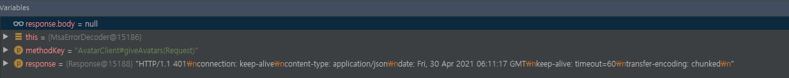

처음에는 **B 서비스**에서 응답을 안보낸게 아닌지 의심을 했었지만 같은 요청을 postman으로 보냈을때에는 body가 정확하게 찍혀 있는것을 확인하였습니다.
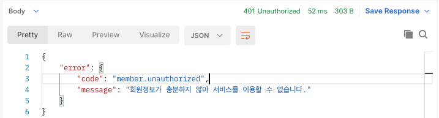

그래서 openfeign으로 전송할때에 다른 특정 header 때문에 body가 정확히 안들어오는게 아닌가 하고 openfeign을 통해서 전송을 할때 `wireshark`를 통하여  패킷을 확인해보았습니다.
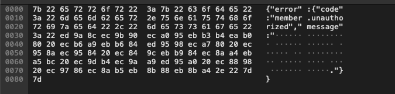

body 는 확실하게 들어가있었고 어디서 누락이 되는건지 원인을 찾아야겠습니다.

## 원인

### Body를 찾아서.
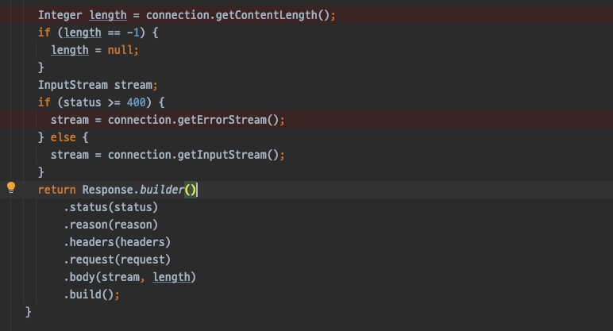


이 로직은 openfeign에서 기본으로 사용하는 `Client`의 소스입니다.

여기서 우리가 유추해 볼 수 있는건 Response Builder의 body에 값이 들어가게 하기 위해서는 다음 두가지 조건이 성립되어야 한다는걸 알 수 있습니다.
1. length는 null이 아니여야 할것이다.
2. body에 들어가는 stream 객채에 값이 있어야 한다.

그래서 하나씩 뜯어보기로 했습니다.

### length 값을 구하자.

openfeign에서 http 통신에는 `sun.net.www.protocol.http.HttpURLConnection` 클래스를 사용하여 처리하고 있었습니다.

그래서 해당 클래스와 그 부모 클래스인 `java.net.HttpURLConnection` 클래스 중심으로 설명을 드릴 예정입니다.

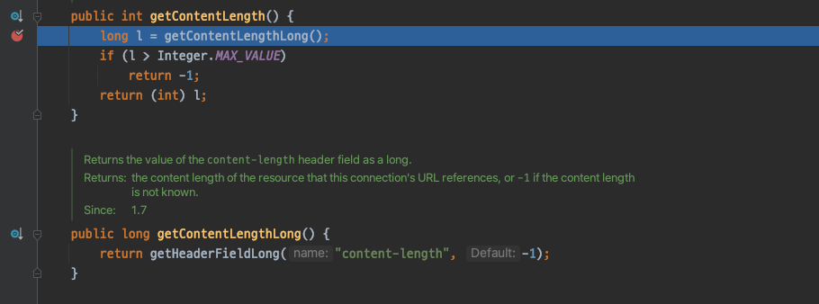

length 값을 구하는 로직에서는 connection의 header의 `content-length`값을 구해오고 있습니다.

하지만 기존에 보았던 아바타에서 왔던 응답에는 `content-length`가 존재하지 않습니다.


하지만 `content-length`가 없는 이유는 다음과 같았습니다.

`transfer-encoding: chunked`


[mozilla 설명](https://developer.mozilla.org/ko/docs/Web/HTTP/Headers/Transfer-Encoding) 에 따르면 chunked가 들어오면 content-length가 생략된다고 설명이 되어있습니다.

그런 이유로 `getContentLength()` 항상 `-1`로 리턴됩니다.


### stream이라도 구해보자
builder의 body의 로직을 봤을때 content-length가 없어도 stream에 값이 있으면 body에 넣어주는것 같았습니다.

다행히 stream이라도 구하면 body에 값을 넣을 수 있을것 같습니다.

stream을 구하는 로직을 살펴보겠습니다.

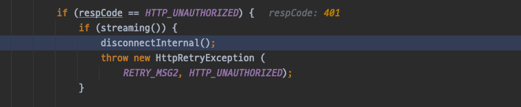
responseCode가 401인 경우에는 해당 로직처럼 처리가 됩니다.

`streaming()` 함수를 간략하게 설명하자면 `request`에 body가 존재하면 `streaming() == true` 으로 처리가 됩니다.

response가 아닌 request의 body 값에 따라 결정되게 됩니다.

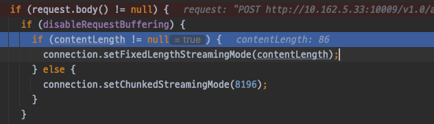

request의 body의 유무에 따라 `setFixedLengthStreamingMode`로 들어가게 되면서 `fixedContentLength` field의 값을 변경하고 이 `HttpURLConnection`은 streming 함수를 항상 true로 리턴하게 변경합니다.

`streaming()`이 true가 되면서 `disconnectInternal()` 함수가 실행되는데 하는일은 다음과 같습니다.

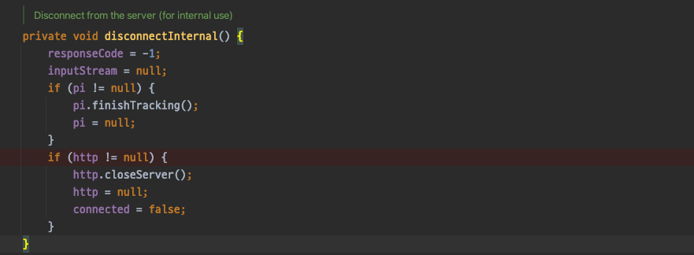

해당 connection을 disconnect 시키면서 `connected`가 `false`로 변경이 됩니다.

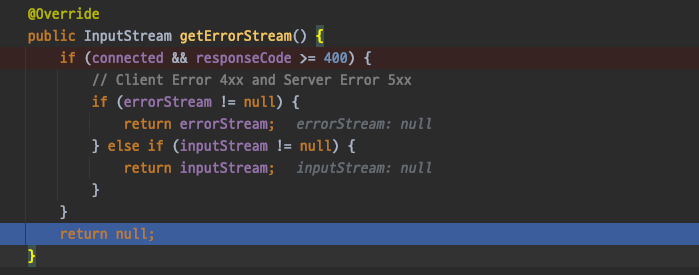

`connected`가 `false`인 경우에는 `getErrorStream()`은 항상 `null`을 리턴하게 되어있습니다.

결국엔 stream 객체도 null로 리턴이 되는것을 확인하였습니다.

### 결국 둘다 못구했다.

이제 위에 client 로직을 다시한번 보도록 하겠습니다.


`.body(stream, length)` 코드는 다음과 같습니다 `.body(null, null)`

그래서 우리는 body를 결국 얻지 못했습니다.

앞에 코드들로 우리는 **POST**의 요청이 **chunked**의 응답을 받으면서 **401** 응답코드 에 관련된 body를 정상적으로 만들지 못한다는것을 확인하였습니다.

다른 방법은 없을까요?

## 해결방법
openfeign에서 사용되는 기본 client를 3rd-party library로 변경하기로 했습니다.

openfeign에서 대체 가능한 Client의 종류는 다음과 같습니다.
- apache HttpClient
- OkHttp

HttpClient, OkHttp중에 어떤것을 고를지 참고하기 위해 다음과 같이 정리된 표를 참고하기로 했습니다.
[link](https://www.mocklab.io/blog/which-java-http-client-should-i-use-in-2020/)
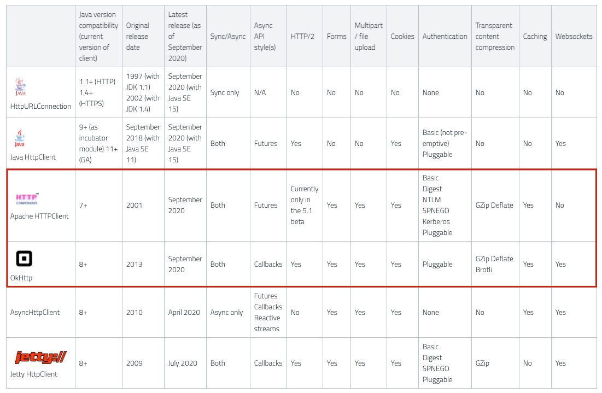

java에서 사용되는 여러가지 client들이 있지만 다양한 기존에 안드로이드에서 안정성있게 사용했던 경험이 있는 `OkHttp`를 사용하기로 했습니다.


OkHttp의 장점은 다음과 같습니다.
[link](https://github.com/square/okhttp/issues/3472)
```
  OkHttp has HTTP/2, a built-in response cache, web sockets, and a simpler API. 
  It’s got better defaults and is easier to use efficiently. 
  It’s got a better URL model, a better cookie model, a better headers model and a better call model. OkHttp makes canceling calls easy. 
  OkHttp has carefully managed TLS defaults that are secure and widely compatible. 
  Okhttp works with Retrofit, which is a brilliant API for REST. 
  It also works with Okio, which is a great library for data streams. 
  OkHttp is a small library with one small dependency (Okio) and is less code to learn. 
  OkHttp is more widely deployed, with a billion Android 4.4+ devices using it internally.

```
이 외에 라이브러리의 용량이 적고 사용하기 편리하다는 장점이 있습니다.

하지만 단점으로는 인증문제나 DNS를 못찾는 경우가 발생하는 경우가 있는데
그럴경우에 대비하여 언제든지 `apache httpclient`로 옮겨갈 준비를 항상 해놔야할것같습니다.

## 해결
okhttp를 적용시키기 위해서 다음과 같은 depencency와 설정을 추가하여줍니다.
``` groovy 
compile 'io.github.openfeign:feign-okhttp'
```
``` yaml
# feign default client 를 okhttp로 설정
feign:
  okhttp:
    enabled: true
```

그렇게 client를 변경하여 테스트를 해본결과 성공적으로 body가 들어오는것을 확인할 수 있었습니다.
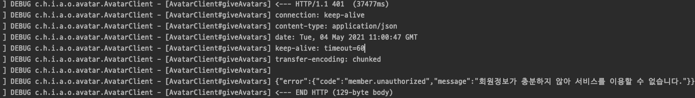

## 참고
- https://developer.mozilla.org/ko/docs/Web/HTTP/Headers/Transfer-Encoding
- https://www.mocklab.io/blog/which-java-http-client-should-i-use-in-2020/
- https://gunju-ko.github.io/spring/spring-boot/2018/06/16/SpringBootCompression.html
- https://github.com/square/okhttp/issues/3472
