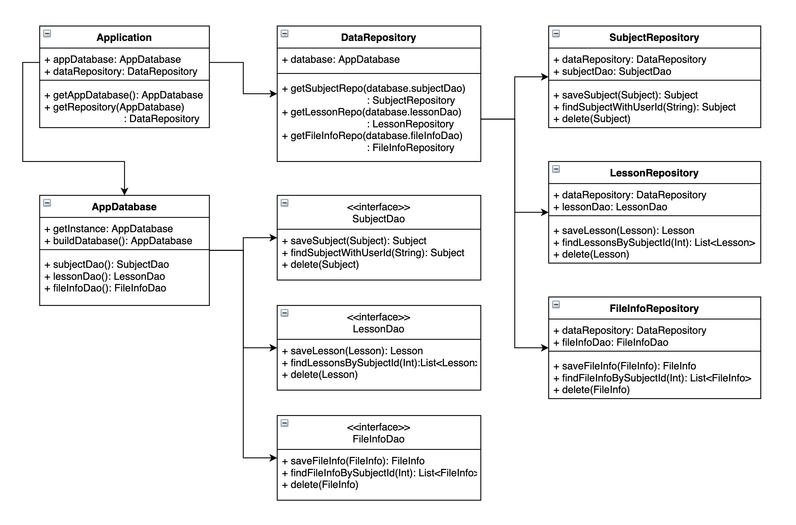
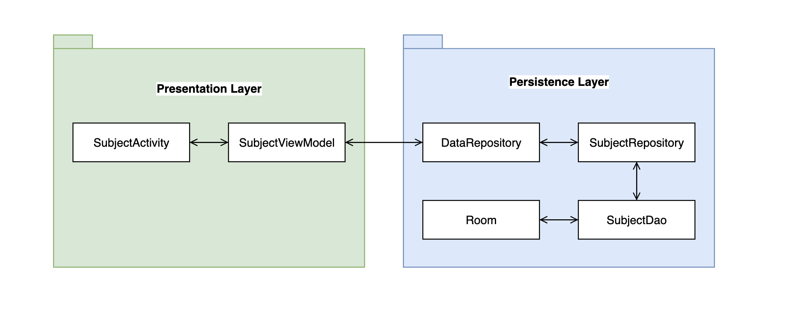
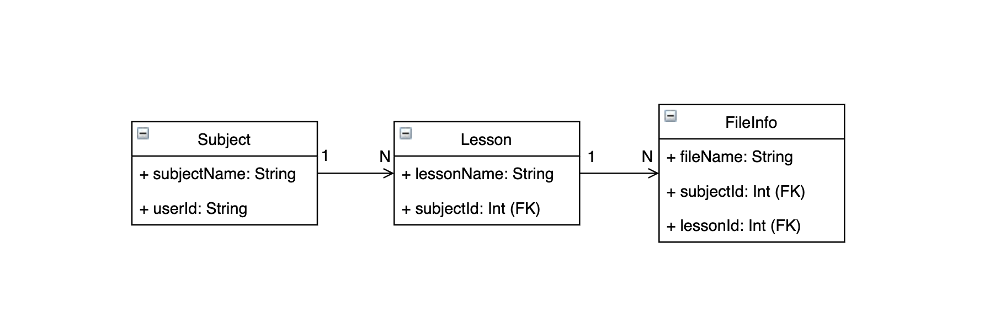

# Project
기존에 완료했던 프로젝트에서 `Kotlin` + `Room` + `LiveData` + `ViewModel`을 사용하여 안정적이고 간편하게 UI를 구성할 수 있게 만든 구조를 정리하면서 나중에 까먹더라도 다시와서 확인 가능하도록 정리를 해보았습니다.

데이터 구조는 `Subject`안에 `Lesson`(1:N)이 있고 `Lesson`안에 여러 화질의 `FileInfo`(1:N)가 있는 구조인데 간략하게 보여주기 위해서 필요없는 정보들은 다 제거하였습니다.

개인이 보기위해 두서없이 작성하였으니 감안해서 보시기 바랍니다.









## AppDatabase
`@Database`로 지정된 클래스는 다음과 같은 조건들을 충족해야 합니다.
- RoomDatabase를 상속받아 생성되는 클래스는 추상클래스여야 한다.
- 주석 내에 데이터베이스와 연결된 항목의 목록을 포함해야 한다.
- 기본생성자를 가져야 하며 `@Dao`로 주석이 지정된 클래스를 반환하는 추상 메서드를 포함해야 한다.
- 런타임 시 `Room.databaseBuilder()` 또는 `Room.inMemoryDatabaseBuilder()`를 호출하여 Database 인스턴스를 가져올 수 있다.

``` kotlin
// AppDatabase.kt
@Database(version = 1, exportSchema = false,
    entities = [
      Subject::class,
      Lesson::class,
      FileInfo::class
    ]
)
@TypeConverters(TypeConverter::class)
abstract class AppDatabase : RoomDatabase() {

  abstract fun subjectDao(): SubjectDao
  abstract fun lessonDao(): LessonDao
  abstract fun fileInfoDao(): FileInfoDao

  companion object {
    private const val DATABASE_NAME = "database-file-name"

    fun getInstance(context: Context): AppDatabase {
      return buildDatabase(context)
    }

    private fun buildDatabase(context: Context): AppDatabase {
      return Room.databaseBuilder(context, AppDatabase::class.java, DATABASE_NAME)
          .addCallback(object : RoomDatabase.Callback() {
            override fun onCreate(db: SupportSQLiteDatabase) {
              super.onCreate(db)
              // 여기서 생성시에 필요한 추가적인 작업을 한다.
              CoroutineScope(Dispatchers.IO).launch { println(db) }
            }
          })
          .fallbackToDestructiveMigration()
          .build()
    }
  }
}
```
`@Database`에 정의된 Class 내부에 abstact로 정의된 함수들 찾아 Runtime시 `Room.databaseBuilder`함수를 통해 인스턴화 시켜줍니다.
> interface로 정의한 `@Dao` Class를 찾아서 Mapping

`Room.inMemoryDatabaseBuilder`를 이용하여 메모리방식의 DB를 만들수 있지만 앱 종료시 모두 휘발되어 특별한 경우 상황에 맞추어 사용하는것이 좋습니다.

`@Database` 어노테이션 내부의 `entities` 항목에서는 Room에서 관리되고 사용 할 Entity Class들을 나열하여줍니다.
이곳에 정의한 Entity에 대해서는 자동으로 테이블을 생성하여줍니다.

Entity의 형태는 다음과 같이 정의합니다.
``` kotlin
// Subject.kt
@Entity(tableName = "TB_SUBJECT")
data class Subject(

  // 유저 아이디
  var userId: String? = "",

  // 강좌 명
  var subjectName: String? = null

) : BaseEntity()


// BaseEntity.kt
open class BaseEntity {
  // PK
  @PrimaryKey(autoGenerate = true)
  var id: Int? = null

  var createDate = Date()
}
```
`exportSchema=false` 해당 옵션을 true로 하게 되면 빌드시에 테이블 생성에 관련된 쿼리 및 Table Column 정보를 json 파일로 생성하여 프로젝트 내에 생성하여줍니다.
> 릴리즈 빌드시에 반드시 해당 옵션을 반드시 **false**로 해주어야 합니다


생성될 json 파일 경로는 아래와 같이 gradle에 명시해줍니다
``` gradle
android { 
  defaultConfig {
    javaCompileOptions {
      annotationProcessorOptions {
        arguments = ["room.schemaLocation": "$projectDir/schemas".toString()]
      }
    }
  }
}
```


## LiveData

LiveData는 관찰자 패턴방식으로 데이터가 변경되면 Observer 객체에 알려 즉시 UI에 업데이트가 가능하여 **최신 데이터를 보장**합니다.

관찰자의 생명주기가 비활성 상태에서는 데이터를 수신하지 않고 활성 상태에만 데이터를 수신하여 비정상적인 앱 종료(NullpointException)가 되는 현상이 발생하지 않고, Background에서 Foreground로 올라올때 최신 데이터를 수신하여 Background 상황에서 문제가 발생 될 상황이 없어집니다.

LiveData는 데이터를 관찰하는 동안 생명주기 상태의 변경을 자동으로 인식하여 처리하여 번거롭게 일일이 해제하거나 등록하여주지 않아도 됩니다.

그래서 기기 회전이나 Fragment 재생성시에도 별 문제 없이 최식 데이터를 받아와서 복잡한 처리없이 데이터 바인딩이 가능합니다.

그리고 Application이나 Koin Dagger와 같은곳에서 싱글톤 패턴으로 LiveData를 구성해 놓으면 이벤트 전달자로서의 역할도 가능하게 됩니다.
> 서비스에서는 LiveData의 이벤트를 받아 처리하는 상황에서 앱이 종료되고 서비스는 살아 있는 상황이 있어 LiveData가 null이 되는 상황이 발생합니다.


## Repository
Repository들을 한꺼번에 관리하는 DataRepository 객체를 만들어 공통적인 처리를 담당하게 하였습니다.
Koin을 사용하여 어디서든 쉽게 불러서 사용하게끔 설정하였습니다.
``` kotlin
// DataRepository.kt
class DataRepository: KoinComponent {
	val database: AppDatabase = get()

    fun getSubjectRepo() = SubjectRepository.getInstance(this)
    fun getLessonRepo() = LessonRepository.getInstance(this)
    fun getFileInfoRepo() = FileInfoRepository.getInstance(this)
}
```

Database를 사용하다보면 한꺼번에 다량의 데이터가 오고 가는 경우가 있어 코틀린에서 제공해주는 object를 사용하지 않고 자체적으로 싱글턴을 만들어서 사용하였습니다.
``` kotlin
// SubjectRepository.kt
class SubjectRepository(
    private val dataRepository: DataRepository
) {
  companion object {
    @Volatile
    private var instance: SubjectRepository? = null

    fun getInstance(dataRepository: DataRepository): SubjectRepository {
      return instance ?: synchronized(this) {
        instance ?: SubjectRepository(dataRepository).also { instance = it }
      }
    }
  }

  private val userId: String?
    get() = dataRepository.userInfo.id.value

  private val subjectDao: SubjectDao
    get() = dataRepository.database.subjectDao()

  suspend fun saveSubject(subject: Subject): Subject {
    subjectDao.saveSubject(subject)
  }

  suspend fun findSubjectWithUserId(subjectUniqueId: String): Subject? {
    return subjectDao.selectSubjectBySubjectUniqueId(subjectUniqueId, userId)
  }

  suspend fun findSubjectById(subjectId: Int?): Subject? {
    if (subjectId == null) return null
    return subjectDao.selectSubjectById(subjectId)
  }

  suspend fun delete(subject: Subject) {
    subjectDao.delete(subject)
  }

  suspend fun findSubjectWithLessons(): List<SubjectWithLessons> {
    return subjectDao.selectSubjectWithLessons()
  }
}
```
> Spring에서는 Repository와 Dao를 잘 구분하지는 않지만 Room에서는 네이밍을 Repository와 Dao와는 구분되게 짓는걸 권장하는거 같다.


## Dao
``` kotlin
@Dao
interface SubjectDao : BaseDao<Subject> {

  /**
   * SELECT - 강좌 고유키, 사용자 아이디와 일치하는 강좌 1개 탐색
   * */
  @Query("SELECT * FROM TB_SUBJECT WHERE userId = :userId AND subjectUniqueId = :subjectUniqueId LIMIT 1")
  suspend fun selectSubjectBySubjectUniqueId(subjectUniqueId: String?, userId: String?): Subject?

  /**
   * SELECT - 강좌 인덱스키와 일치하는 강좌 1개 탐색
   * */
  @Query("SELECT * FROM TB_SUBJECT WHERE id = :id LIMIT 1")
  suspend fun selectSubjectById(id: Int): Subject?

  /**
   * SELECT - 강좌 인덱스키와 사용자 아이디가 일치하는 강좌 1개 탐색
   * */
  @Query("SELECT * FROM TB_SUBJECT WHERE userId = :userId AND id = :id LIMIT 1")
  fun selectSubjectByIdAsync(id: Int, userId: String?): LiveData<Subject?>


  /**
   * JOIN SELECT - 강좌와 연관관계에 있는 강의를 보유한 객체 탐색
   * */
  @Transaction
  @Query("SELECT * FROM TB_SUBJECT")
  suspend fun selectSubjectWithLessons(): List<SubjectWithLessons>

  /**
   * DELETE - 인덱스키 일치하는 강좌 삭제
   * */
  @Query("DELETE FROM TB_SUBJECT WHERE id = :subjectId")
  suspend fun delete(subjectId: Int)
}
```


`LiveData<Object>`, `Object`, `List<Object>`의 형태를 리턴형태로 하는 함수를 작성하면 자동으로 Room이 해당 타입에 맞추어 리턴을 해줍니다.

`@Dao`내부 함수들을 `suspend`로 만들게 되면 별도의 Thread나 Persistance Transaction영역에서 실행하지 않아도 되어 편의성이 좋아지고 보일러플레이트 코드들이 줄어들게 됩니다.
하지만 해당 기능을 사용하려면 gradle에서 일반 room이 아닌 kotlin용 room를 추가해주어야 합니다.
``` gradle
implementation "androidx.room:room-ktx:$room_version"
```
Room에서는 LiveData 타입의 형태로 리턴받으면 LiveData 자체가 Async하게 동작하기 때문에 별도의 Thread에서 호출할 필요 없이 Main Thread에서 호출하여도 에러 없이 수신이 가능합니다.

여기서 중요하게 봐야할건 `SubjectWithLessons` 타입인데 이 타입은 Subject객체에 연관관계가 맵핑되어있는 하위에 Entity(Lesson)를 찾아 프로젝션 객체로 리턴하여줍니다.

해당 아래와 같이 간단하게 설정이되지만 오타에 주의하여 작성해야 합니다.
``` kotlin
// Subject.kt
@Entity(tableName = "TB_SUBJECT")
data class Subject(

  // 유저 아이디
  var userId: String? = "",

  // 강좌 명
  var subjectName: String? = null

) : BaseEntity()


// Lesson.kt
@Entity(
    tableName = "TB_LESSON",
    foreignKeys = [
      ForeignKey(entity = Subject::class, parentColumns = ["id"], childColumns = ["subjectId"])],
    indices = [Index(value = ["subjectId"])]
)
data class Lesson(

  // 강의명
  var lessonName: String? = null,

  // 강좌 아이디 (FK)
  var subjectId: Int? = null,

) : BaseEntity()


// SubjectWithLessons.kt
class SubjectWithLessons {
  @Embedded
  var subject: Subject? = null

  @Relation(parentColumn = "id", entityColumn = "subjectId", entity = Lesson::class)
  var lessons: List<Lesson> = mutableListOf()
}
```
예제에서는 하나의 1:N 관계만 설정하였지만 1:N 관계가 많은 상위 Entity를 한번에 처리하기에 상당히 유용한 기능입니다.

해당 `SubjectWithLessons` 객체를 호출하는 Dao 에서는 `@Transaction`이라는 어노테이션을 붙여주어야 합니다. Optional이긴 하지만 안할경우 빌드할 때 경고가 나오게 됩니다.
아마도 여러개의 쿼리를 하는 도중에 발생될 에러에 대해서 RollBack 처리하기 위함으로 예상됩니다.

## ViewModel

ViewModel DataRepository

``` kotlin
// SubjectActivity.kt
override fun doCreate(savedInstanceState: Bundle?) {
  super.doCreate(savedInstanceState)
  val factory = SubjectViewModel.Companion.Factory(application)
  viewModel = ViewModelProvider(viewModelStore, factory)
		  .get(SubjectViewModel::class.java)
}

private fun subscribeUi() {
  // database에 변경이 있을때마다 호출된다.
  viewModel.getSubjects().observe(this, Observer<List<Subject>> { list ->
	... // something
  })
}

```
``` kotlin
// SubjectViewModel.kt
open class SubjectViewModel(
    application: Application
) : AndroidViewModel(application), CoroutineScope {

  companion object {
    class Factory(private val app: Application) : ViewModelProvider.NewInstanceFactory() {
      @Suppress("unchecked_cast")
      override fun <T : ViewModel> create(modelClass: Class<T>): T {
        if (modelClass.isAssignableFrom(SubjectViewModel::class.java)) {
          return SubjectViewModel(app) as T
        }
        throw IllegalArgumentException("Unknown ViewModel class")
      }
    }
  }

  /**
   * 코루틴 관련 객체
   * */
  private val job = SupervisorJob()

  override val coroutineContext: CoroutineContext
    get() = Dispatchers.IO + job

  override fun onCleared() {
    super.onCleared()
    job.cancel()
  }

  /**
   * Repository
   * */
  private val repository: DataRepository = application.get()

  private val subjectRepository: SubjectRepository
    get() = repository.getSubjectRepo()

  /**
   * Observer 객체들
   * */
  private val observableSubjects: LiveData<List<Subject>>


  init {
    val userId = application.get<UserInfo>().id.value

    val subjects = subjectRepository.findMySubject(userId)
    observableSubjects = MediatorLiveData()
    observableSubjects.value = null
    observableSubjects.addSource(subjects) { observableSubjects.value = it }
  }

  /**
   * 강좌 목록 LiveData
   * */
  fun getSubjects(): LiveData<List<Subject>> {
    return observableSubjects
  }

  /**
   * 강좌 목록 저장
   * */
  fun saveSubjectList(subjectList: List<Subject>) = launch {
    subjectRepository.insertSubject(subjectList)
  }

  /**
   * 강좌 삭제
   * */
  fun removeSubject(subject: Subject) = launch {
    val subjectId = subject.id
    if (subjectId != null) {
      subjectRepository.delete(subject)
    }
  }
}
```

## Migration

``` kotlin
val MIGRATION_1_2 = object : Migration(1, 2) {
  override fun migrate(database: SupportSQLiteDatabase) {
    database.execSQL("CREATE TABLE `Fruit` (`id` INTEGER, `name` TEXT, " +
            "PRIMARY KEY(`id`))")
  }
}

val MIGRATION_2_3 = object : Migration(2, 3) {
  override fun migrate(database: SupportSQLiteDatabase) {
    database.execSQL("ALTER TABLE Book ADD COLUMN pub_year INTEGER")
  }
}

Room.databaseBuilder(applicationContext, MyDb::class.java, "database-name")
        .addMigrations(MIGRATION_1_2, MIGRATION_2_3).build()
```
Room에서는 해당 형태로 마이그레이션이 가능합니다.
하지만 sqlite에서는 테이블 수정이 제약적인 상황이 있어 대부분 큰 변화가 있는 경우 다음과 같은 형태로 마이그레이션을 진행해야 합니다.

1. TempSubject 테이블 생성
2. Subject 데이터 TempSubject로 Copy
3. Subject 테이블 삭제
4. TempSubject -> Subject로 테이블 이름 변경

> sqlite 공식 페이지 에서도 해당 형태로 스키마 변경을 권유하고있다. [link](https://www.sqlite.org/lang_altertable.html#otheralter)

해당 프로젝트에서는 테이블 정보를 다시 재설계하여 마이그레이션하는데에 한계가 있어 새로운 데이터베이스를 생성하여 마이그레이션을 진행 하였습니다.
일반적인 방법으로는 마이그레이션 진행이 많은 어려움이 있고 쿼리로 진행하기에는 TypeSafe 하지 않아 좀더 안전한 방법으로 진행하였습니다.

어플리케이션 구동 초기 런타임시에 마이그레이션 여부를 체크하여 마이그레이션을 진행하며 성공여부를 Preference에 저장하여 이후에는 마이그레이션 하지 않도록 합니다.
``` kotlin
  private suspend fun dbMigration() {
    /** 마이그레이션 유/무 체크 */
    val migrationFlag = coreService?.getPrefsValue(Constant.KEY_MIGRATION_SUCCESS).isNullOrBlank()
    if (migrationFlag) {
      withContext(Dispatchers.IO) {
        val dbFile: File? = this@Activity.getDatabasePath(MigrationDbHelper.DATABASE_NAME)
        val isSuccess = if (dbFile?.exists() == true) {
          val dbHelper = MigrationDbHelper(this@Activity, repository)
          dbHelper.migration()
        } else {
          true
        }
        if (isSuccess) {
          coreService?.putPrefsValue(Constant.KEY_MIGRATION_SUCCESS, true.toString())
        }
      }
    } // if End
  }
```
``` kotlin
// MigrationDbHelper.kt
@Suppress("ClassName")
class MigrationDbHelper(
    val context: Context,
    val repository: DataRepository
) : SQLiteOpenHelper(context, DATABASE_NAME, null, DATABASE_VERSION) {

  companion object {
    const val DATABASE_NAME = "database-filename"
    const val DATABASE_VERSION = 10 // old version
  }

  /**
   * 테이블 정보를 나타내는 interface
   * */
  interface BaseTableInfo {
    val tableName: String
  }

  /**
   * 테이블 컬럼 정보를 나타내는 interface
   * */
  interface BaseColumnInfo

  /**
   * OLD - TB_MOVIEINFO Table 정보
   * */
  object TB_MovieInfo : BaseTableInfo {

    override val tableName = "TB_MOVIE_INFO"

    /**
     * TB_MovieInfo Data Class
     * */
    data class MovieInfo(
        val uniqueId: String? = null,
        val userId: String? = null,
        val subjectId: String? = null,
        val subjectName: String? = null,
        val lessonId: String? = null,
        val lessonName: String? = null,
        ...
    )

    /**
     * TB_MovieInfo Column Info
     * */
    object ColumnInfo : BaseColumnInfo {
      const val UNIQUE_ID = "unique_id"
      const val USER_ID = "userid"
      const val SUBJECT_ID = "sbjt_id"
      const val SUBJECT_NAME = "sbjt_name"
      const val LESSON_ID = "lesson_id"
      const val LESSON_NAME = "lesson_name"
      ...
    }
  }

  /**
   * 마이그레이션 진행 할 디비 존재 여부
   * (디비가 없으면 onCreate 에서 변경된다)
   * */
  private var isAlreadyDBExist = true

  /**
   * onCreate
   * */
  override fun onCreate(db: SQLiteDatabase?) {
    isAlreadyDBExist = false
  }

  override fun onUpgrade(db: SQLiteDatabase?, oldVersion: Int, newVersion: Int) {}

  /**
   * 실제로 마이그레이션 진행되는 영역
   * */
  @Transaction
  suspend fun migration(): Boolean {

    // 성공여부
    var isComplete = true

    try {

      val movieInfoList = selectMovieInfo()

      /** 마이그레이션 할 데이터가 없다면 완료 */
      if (movieInfoList.isEmpty()) {
        return true
      }

      movieInfoList.forEach { movieInfo ->
        // 마이그레이션 진행
        ...
      }

    } catch (e: Exception) {
      /** DB가 방금 생성된거라면 완료 */
      if (!isAlreadyDBExist) {
        return true
      }
      isComplete = false
    }
    return isComplete
  }


  /**
   * 예전 디비에서 영상 정보를 가져온다.
   */
  private fun selectMovieInfo(): List<TB_MovieInfo.MovieInfo> {
    val list = mutableListOf<TB_MovieInfo.MovieInfo>()
    val db = readableDatabase
    val projection = arrayOf(
        TB_MovieInfo.ColumnInfo.UNIQUE_ID,
        TB_MovieInfo.ColumnInfo.USER_ID,
        TB_MovieInfo.ColumnInfo.SUBJECT_ID,
        TB_MovieInfo.ColumnInfo.SUBJECT_NAME,
        TB_MovieInfo.ColumnInfo.LESSON_ID,
        TB_MovieInfo.ColumnInfo.LESSON_NAME,
        ...
    )
    val cursor = db.query(TB_MovieInfo.tableName, projection, null, null, null, null, null)

    with(cursor) {
      while (moveToNext()) {
        val movieInfo = TB_MovieInfo.MovieInfo(
            uniqueId = getString(TB_MovieInfo.ColumnInfo.UNIQUE_ID),
            userId = getString(TB_MovieInfo.ColumnInfo.USER_ID),
            subjectId = getString(TB_MovieInfo.ColumnInfo.SUBJECT_ID),
            subjectName = getString(TB_MovieInfo.ColumnInfo.SUBJECT_NAME),
            lessonId = getString(TB_MovieInfo.ColumnInfo.LESSON_ID),
            lessonName = getString(TB_MovieInfo.ColumnInfo.LESSON_NAME),
            ...
        )
        list.add(movieInfo)
      }
    }
    return list
  }

  /**
   * 확장함수
   * */
  fun Cursor.getString(string: String): String? {
    return getStringOrNull(getColumnIndex(string))
  }

  fun Cursor.getInt(string: String, defaultValue: Int = 0): Int {
    return getIntOrNull(getColumnIndex(string)) ?: defaultValue
  }
}
```