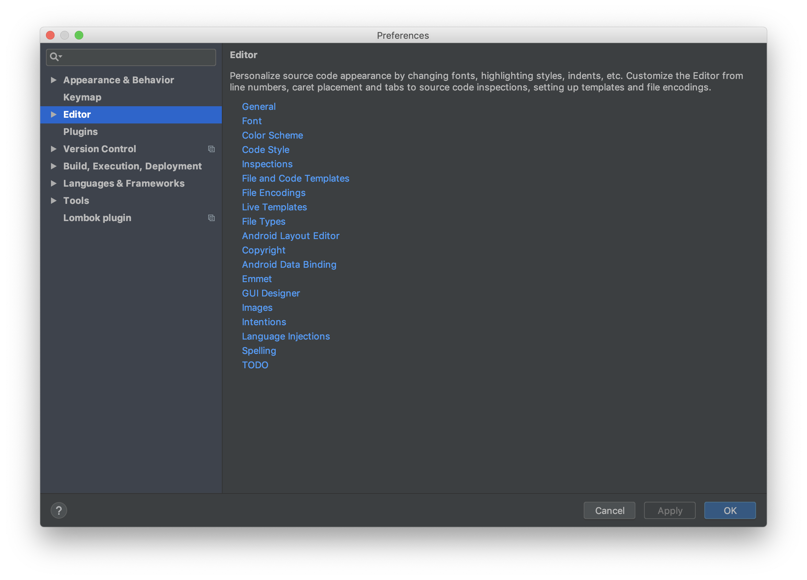
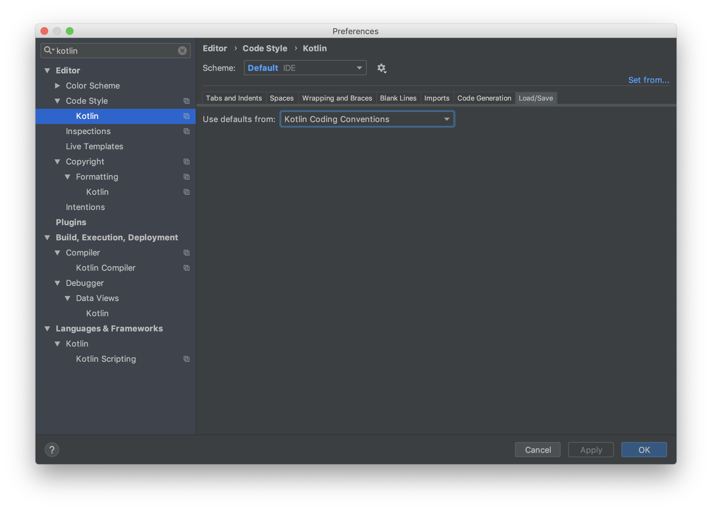
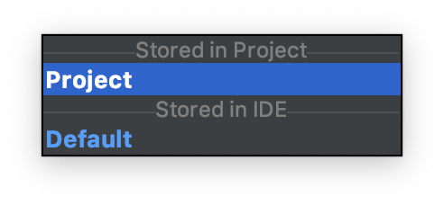
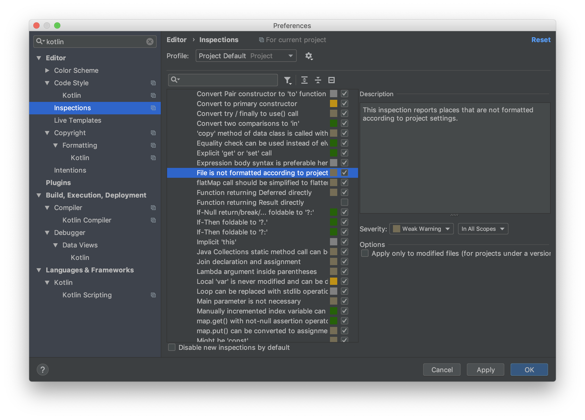
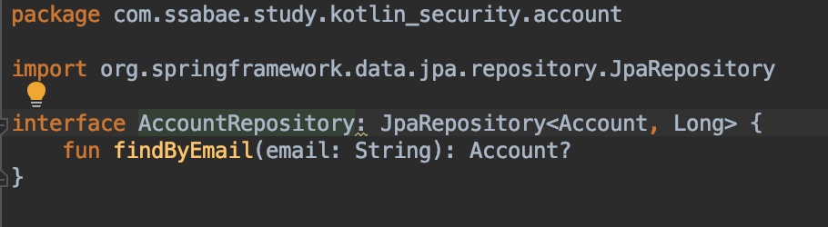
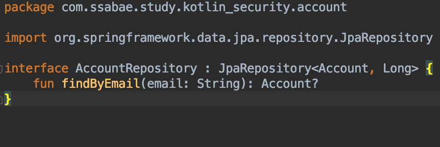

회사에서 팀 단위로 일하다보면 각자 다른 코딩 스타일에 많은 비용이 소모된 경험들 다들 있으실겁니다.
그래서 어느정도 규모가 있는 회사나 팀인 경우에는 코드컨벤션을 맞춰놓고 각자 개발을 하게 됩니다.
Java, Javascript는 구글이나 Airbnb 코드 스타일을 많이 사용하는걸 어렵지 않게 볼 수 있습니다.
그래서 Kotlin 코드 스타일도 찾아본 결과 [코틀린 공식 사이트](http://kotlinlang.org/docs/reference/coding-conventions.html)에서 제공하는 코드 컨벤션을 IntelliJ에서 설정 할 수 있어 공유 하고자 글을 남깁니다.

일단 IntelliJ 설정창(`⌘ + ,`을 열어 놓은뒤 검색에 Kotlin을 입력합니다.

`Code Style` -> `Kotlin`을 선택하면 해당 화면이 보이는데 여기서 오른쪽 상단에 있는 `Set from..`을 클릭합니다.

여기서 `Kotlin style guide`를 선택합니다.

설정은 Scheme 에서 Default만 되어있는 경우 Project에 적용이 안될 수 있으니 둘다 해주셔야 합니다.

`Editor` -> `Inspections` 메뉴에 진입한 뒤
`Kotlin` - `Style Issues` - `File is not formatted according to project settings` 항목에 체크를 해주면 완료입니다.

`AccountRepository` 바로 오른쪽에 `:`이 붙어있다고 경고가 나오고 있습니다.
권장사항대로 `⌥ + enter`키를 이용하여 `Refommat File`을 해주면 아래와 같이 변경이 됩니다.

더 많은 사항에 대해서는 하단 링크에 가셔서 확인 하시기 바랍니다.
http://kotlinlang.org/docs/reference/coding-conventions.html
