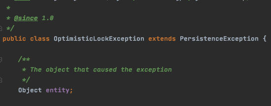

# JPA의 낙관적 잠금(Optimistic Lock), 비관적 잠금(Pessimistic Lock)
요청이 많은 서버에서 여러 트랜잭션이 동시에 같은 데이터에 업데이트를 발생시킬 경우에  일부 요청이 유실되는 경우가 발생하여 장애로 이어질 수 있습니다.

그 만큼 엔터프라이즈 애플리케이션의 경우 데이터베이스에 대한 동시 액세스(concurrency)를 적절하게 관리하는 것이 중요합니다.

여러곳에서 동시에 발생하는 트랜잭션을 처리 할 수 있어야 하며 동시 읽기/업데이트 간에 데이터가 일관되게 유지되도록 해야합니다.


## JPA의 낙관적 잠금
낙관적 잠금이란 데이터 갱신시 충돌이 발생하지 않을 것이라고 낙관적으로 보고 잠금을 거는 기법입니다.
> 디비에 락을 걸기보다는 충돌 방지(Conflict detection)에 가깝다고 볼 수 있음

동시성 처리를 위해 JPA 에서는 **낙관적 잠금(`Optimistic Lock`)**을 손쉽게 사용할 수 있도록 제공합니다.

낙관적 잠금이란 동시에 동일한 데이터에 대한 여러 업데이트가 서로 간섭하지 않도록 방지하는 `version`이라는 속성을 확인하여 Entity의 변경사항을 감지하는 메커니즘 입니다.

JPA에서 낙관적 잠금을 사용하기 위해서는 Entity 내부에 `@Version` Annotation이 붙은 Int, Long Type의 변수를 구현하여줌으로써 간단하게 구현이 가능합니다.

`@Version`을 명시할때는 다음과 같은 주의사항이 있습니다.
- 각 엔티티 클래스에는 하나의 버전 속성 만 있어야합니다.
- 여러 테이블에 매핑 된 엔티티의 경우 기본 테이블에 배치되어야합니다.
- 버전에 명시할 타입은 `int`, `Integer`, `long`, `Long`, `short`, `Short`, `java.sql.Timestamp` 중 하나 여야합니다.


> 만약 `@Version`을 명시한 변수의 타입이 자동으로 지원하는 타입이 아니라면 다음과 같은 오류가 발생한다.
> `class org.hibernate.type.StringType cannot be cast to class org.hibernate.type.VersionType`
> 이때 `org.hibernate.type.VersionType`를 상속받아
> seed(초기값), next(증가하는 로직), getComparator(버전 비교 함수)을 구현하여주면 커스텀하게 버저닝 사용이 가능하다.

JPA는 Select시에 트랜잭션 내부에 버전 속성의 값을 보유하고 트랜젝션이 업데이트를 하기 전에 버전 속성을 다시 확인합니다.
그 동안에 버전 정보가 변경이 되면 `OptimisticLockException`이 발생하고 변경되지 않으면 트랜잭션은 버전속성을 증가하는 업데이트 하게 됩니다.

### 낙관적 잠금의 LockModeType

#### NONE
별도의 옵션을 사용하지 않아도 Entity에 @Version이 적용된 필드만 있으면 낙관적 잠금이 적용됩니다. (하단에 암시적 잠금 참조)

#### OPTIMISTIC (Read)
Entity 수정시에만 발생하는 낙관적 잠금이 읽기 시에도 발생하도록 설정합니다.
읽기시에도 버전을 체크하고 트랜잭션이 종료될 때까지 다른 트랜잭션에서 변경하지 않음을 보장합니다.
이를 통해 `dirty read`와 `non-repeatable read`를 방지합니다.
``` java
entityManager.find(Student.class, studentId, LockModeType.OPTIMISTIC);
```
#### OPTIMISTIC_FORCE_INCREMENT (Write)
낙관적 잠금을 사용하면서 버전 정보를 강제로 증가시키는 옵션입니다.

#### READ, WRITE
`READ`는 `OPTIMISTIC`과 같은 역할을하며
`WRITE`는 `OPTIMISTIC_FORCE_INCREMENT`와 같은 역할을 합니다
JPA 1.0의 호환성을 유지하기 위해서 존재하는 옵션입니다.

### 사용 방법
``` java
@Entity
public class Student {
    @Id
    private Long id;
 
    private String name;
 
    private String lastName;
 
    @Version
    private Integer version;
}
```
Query 객체 의 setLockMode 메소드를 사용하는 예제
``` java
Query query = entityManager.createQuery("from Student where id = :id");
query.setParameter("id", studentId);
query.setLockMode(LockModeType.OPTIMISTIC_INCREMENT);
query.getResultList()
```
`@NamedQuery`에서 사용 예제
``` java
@NamedQuery(name="optimisticLock",
  query="SELECT s FROM Student s WHERE s.id LIKE :id",
  lockMode = WRITE)
```

``` java
Student student = entityManager.find(Student.class, id);
entityManager.lock(student, LockModeType.OPTIMISTIC_FORCE_INCREMENT);
```

### OptimisticLockException
persistence provider
Persistence Provider가 Entity에서 낙관적 잠금 충돌을 감지하면 `OptimisticLockException`을 발생시키게 되고 트랜잭션은 롤백을 처리합니다.

권장되는 예외처리 방법에서는 Entity를 다시 로드하거나 새로고침하여 업데이트를 재 시도하는 방법입니다.


예외처리시에 발생되는 Exception에서 충돌되는 Entity를 제공해주고 있어 쉽게 처리가 가능하도록 되어있습니다.


## 비관적 잠금
트랜잭션의 충돌이 발생한다고 가정하고 우선 락을 걸고 보는 방법
트랜잭션안에서 서비스로직이 진행되어야함.
비관적 잠금 메커니즘은 데이터베이스 수준에서 엔티티 잠금을 포함합니다.


`PersistenceException`이 발생


### 비관적 잠금의 LockModeType
JPA 사양은 우리가 논의 할 세 가지 비관적 잠금 모드를 정의합니다.
아래 항목들은 모두 트랜잭션이 커밋되거나 롤백될때까지 유지됩니다.

#### PESSIMISTIC_READ
`dirty read`가 발생하지 않을 때마다 공윺 잠금(`Shared Lock`)을 획득하고 데이터가 `UPDATE`, `DELETE` 되는 것을 방지 할 수 있습니다.
> PESSIMISTIC_READ를 지원하지 않는 데이터 베이스도 있지만 그럴 경우에는 PESSIMISTIC_WRITE로 대체된다.

#### PESSIMISTIC_WRITE
배타적 잠금(`Exclusive Lock`)을 획득하고 데이터를 다른 트랜잭션에서 `READ`, `UPDATE`, `DELETE` 하는것을 방지 할 수 있습니다.

#### PESSIMISTIC_FORCE_INCREMENT
이 잠금은 `PESSIMISTIC_WRITE`와 유사하게 작동 하지만 `@Version`이 지정된 Entity와 협력하기 위해 도입되어 `PESSIMISTIC_FORCE_INCREMENT` 잠금을 획득할 시 버전이 업데이트 됩니다.
> `@Version`이 지정된 엔티티의 모든 업데이트는 `PESSIMISTIC_FORCE_INCREMENT` 잠금을 확보하기 전에 업데이트가 될 수도 있습니다.

### Exception

#### PessimisticLockException
잠금은 Shared Lock 또는 Exclusive Lock 둘중에 하나만 획득할 수 있으며 그 락을 획득하는데 실패하면 발생되는 예외입니다.

#### LockTimeoutException
락을 대기하다 설정해놓은 wait time이 초과되었을때 발생하는 예외입니다.

#### PersistenceException
NoResultException , NonUniqueResultException, LockTimeoutException 및  QueryTimeoutException을 제외한 PersistanceException 예외에 대해서는 트랜잭션에 롤백을 마킹합니다.

### Lock Scope
#### PessimisticLockScope.NORMAL
기본값으로써 해당 entity만 잠금이 설정됩니다.
`@Inheritance(strategy = InheritanceType.JOINED)`와 같이 조인 상속을 사용하면 부모도 함께 잠금이 설정됩니다.
#### PessimisticLockScope.EXTENDED
`@ElementCollection`, `@OneToOne`, `@OneToMany` 등 연관된 entity들도 잠금이 설정됩니다.

### 사용 방법
Find에서의 사용 예제
``` java
entityManager.find(Student.class, studentId, LockModeType.PESSIMISTIC_READ);
```

Query에서의 사용 예제
``` java
Query query = entityManager.createQuery("from Student where studentId = :studentId");
query.setParameter("studentId", studentId);
query.setLockMode(LockModeType.PESSIMISTIC_WRITE);
query.getResultList()
```
명시적 잠금에서의 예제
``` java
Student resultStudent = entityManager.find(Student.class, studentId);
entityManager.lock(resultStudent, LockModeType.PESSIMISTIC_WRITE);
```
데이터를 새로 갱신하는 예제
``` java
Student resultStudent = entityManager.find(Student.class, studentId);
entityManager.refresh(resultStudent, LockModeType.PESSIMISTIC_FORCE_INCREMENT);
```

`@NamedQuery`에서의 예제
``` java
@NamedQuery(name="lockStudent",
  query="SELECT s FROM Student s WHERE s.id LIKE :studentId",
  lockMode = PESSIMISTIC_READ)
```


## 암시적 잠금과 명시적 잠금
### 암시적 잠금 (Implicit Lock)
JPA에서는 `@Version`이 붙은 필드가 존재하거나 `@OptimisticLocking` 어노테이션이 설정되어 있을 경우 자동적으로 충돌감지를 위한 잠금이 실행됩니다. 이는 Annotation만 설정해주면 별도의 추가 설정이 없어도 JPA에서 자동적으로 행하여주는 잠금입니다.
그리고 추가로 삭제 쿼리가 발생할시에는 암시적으로 해당 로우에 대한 행 배타잠금(Row Exclusive Lock)을 제공하여줍니다.

### 명시적 잠금 (Explicit Lock)
프로그램을 통해 의도적으로 잠금을 실행하는 것이 명시적 잠금입니다. JPA에서 EntityManager를 통하여 엔터티를 조회할 때 LockMode를 지정하거나 select for update 쿼리를 통해서 직접 잠금을 지정할 수 있습니다.
``` java
Student student = entityManager.find(Student.class, id);
entityManager.lock(student, LockModeType.OPTIMISTIC);

Student resultStudent = entityManager.find(Student.class, studentId);
entityManager.lock(resultStudent, LockModeType.PESSIMISTIC_WRITE);
```

> 출처
> https://www.baeldung.com/jpa-optimistic-locking
> https://reiphiel.tistory.com/entry/understanding-jpa-lock