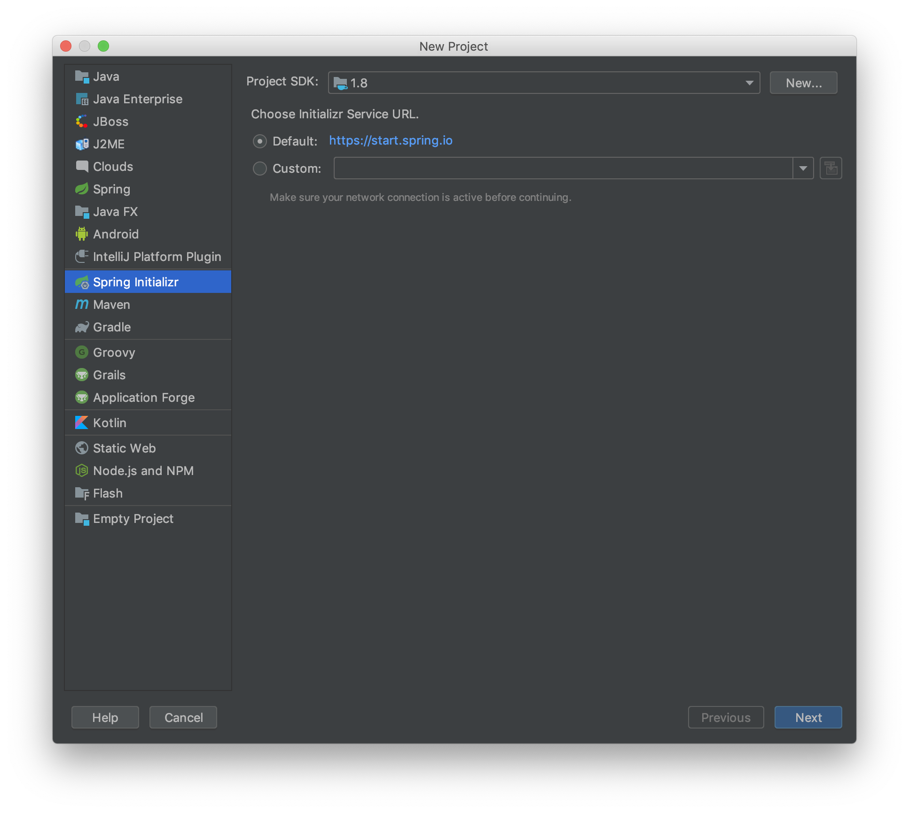
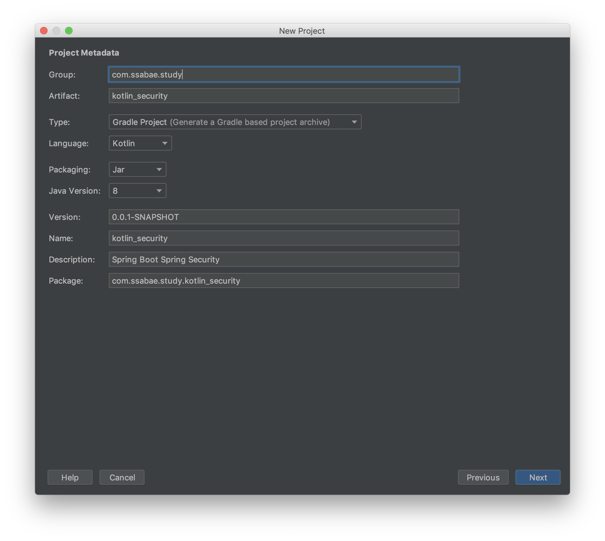
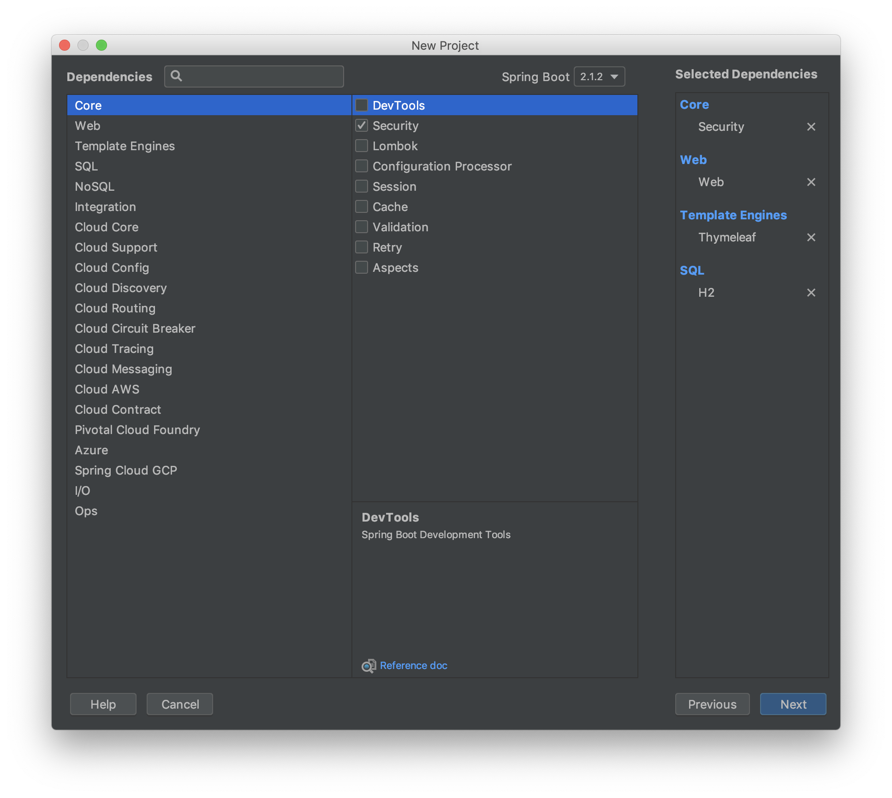
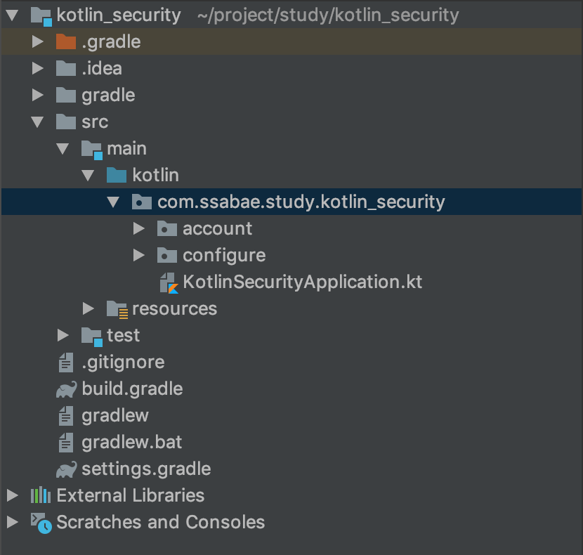
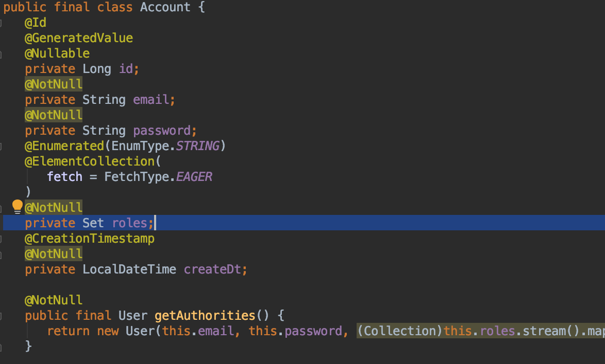
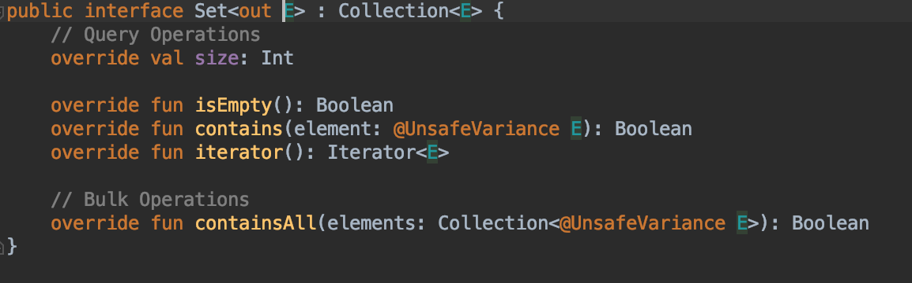
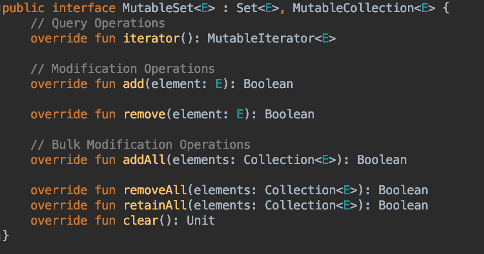
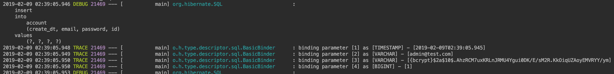
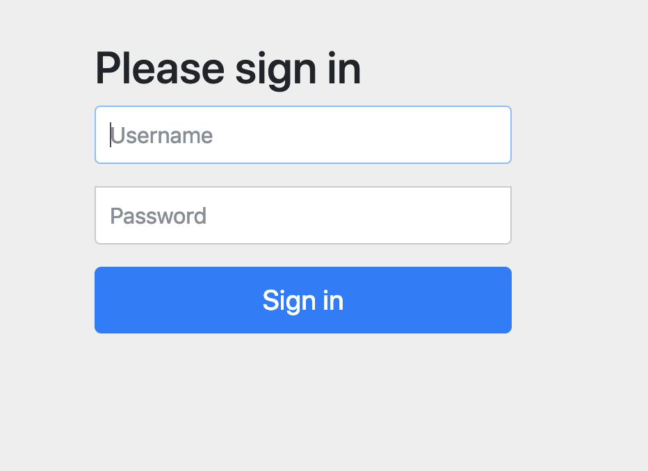
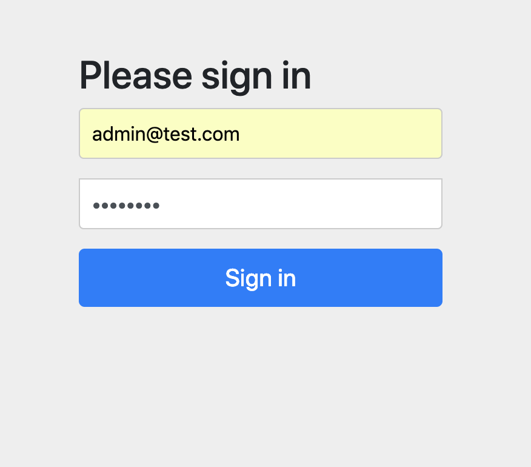

Spring Boot 2.0 이후로 Kotlin을 이용한 Spring 서버사이드 개발이 가능해졌습니다.
Google에서 Kotlin을 Android 개발 언어로 정식 인정한 뒤 Android 진영에서 빠른 변화가 있었습니다.
신규 프로젝트를 Java로 Android 개발하는 회사가 많이 없어졌을 정도로 Kotlin의 인기가 많습니다.
이 유행에 편승하고자 Kotlin 연습겸 Spring Boot에서 Security 샘플소스를 만들어보았습니다.
해당 코드는 백기선님([유투브](https://www.youtube.com/channel/UCwjaZf1WggZdbczi36bWlBA), [Inflearn](https://www.inflearn.com/?post_type=course&s=%EB%B0%B1%EA%B8%B0%EC%84%A0)) 코드를 Base로 조금 변경하여 진행 하였습니다.

---

# 1. 프로젝트 생성
우선 IntelliJ에서 ``Spring Initializr``를 이용하여 프로젝트를 생성하여줍니다.



프로젝트 정보를 입력하여 주시고 ``Language`` 항목에 ``Kotlin``을 선택하여 줍니다.
(여기에서는 Gradle을 사용하겠습니다.)



Project Defendencies는 ``Security``, ``Web``, ``Thymeleaf``, ``H2``를 선택하여줍니다.
(추후에 ``JPA``를 따로 추가할 예정이니 이 단계에서 추가하셔도 됩니다.)


해당 프로젝트 생성이 완료되면 아래와 같이 만들어집니다.
여기서 Root 디렉토리에 ``account``, ``configure`` package를 생성하여 줍니다.



# 2. Account 관련 Domain 생성
회원과 관련된 ``DAO``를 추가하기 위해서 아래와 같은 파일들을 생성하여 줍니다.

### Account.kt
``` kotlin
data class Account(
    var id: Long,
    var email: String,
    var password: String,
    var roles: Set<AccountRole>,
    var createDt: LocalDateTime
)
```
Java -> Kotlin으로 넘어오면서 더이상 Boilerplate Code(Setter, Getter, toString, equals, hashCode)를 남발하거나 [Lombok](https://projectlombok.org/")에 의존하지 않아도 됩니다.
단지 Data 객체를``data class`` 를 선언함으로서 모든것이 해결됩니다.


> 해당 블로그에서는 data class를 사용하면 좋다는 취지로 설명하였지만
> 실제로 data class와 Entity의 궁합은 많이 좋지 않습니다.
> data class를 사용하기보다는 일반 class로 선언하여 사용하심을 추천드립니다
> 2020.07.15 수정

해당 클래스를 JAVA code로 표현한다면 아래와 같은 코드가 될것입니다.

``` java
public class Account_Java {

    private long id;

    private String email;

    private String password;

    private Set<AccountRole> roles;

    private LocalDateTime createDt = LocalDateTime.now();

    public long getId() {
        return id;
    }

    public void setId(long id) {
        this.id = id;
    }

    public String getEmail() {
        return email;
    }

    public void setEmail(String email) {
        this.email = email;
    }

    public String getPassword() {
        return password;
    }

    public void setPassword(String password) {
        this.password = password;
    }

    public Set<AccountRole> getRoles() {
        return roles;
    }

    public void setRoles(Set<AccountRole> roles) {
        this.roles = roles;
    }

    public LocalDateTime getCreateDt() {
        return createDt;
    }

    public void setCreateDt(LocalDateTime createDt) {
        this.createDt = createDt;
    }

    public Account_Java() {}

    @Override
    public String toString() {
        return "Account_Java{" +
                "id=" + id +
                ", email='" + email + '\'' +
                ", password='" + password + '\'' +
                ", roles=" + roles +
                ", createDt=" + createDt +
                '}';
    }

    @Override
    public boolean equals(Object o) {
        if (this == o) return true;
        if (o == null || getClass() != o.getClass()) return false;
        Account_Java that = (Account_Java) o;
        return id == that.id &&
                Objects.equals(email, that.email) &&
                Objects.equals(password, that.password) &&
                Objects.equals(roles, that.roles) &&
                Objects.equals(createDt, that.createDt);
    }

    @Override
    public int hashCode() {
        return Objects.hash(id, email, password, roles, createDt);
    }
}
```


**Data Class의 기능**
- 객체 비교를 위한 equals()/hashCode() 제공
 - JVM 기반 언어는 equals()가 true를 반환하는 두 객체는 반드시 같은 HashCode를 반환해야 함
 - Hash 환경에서 사용 가능하게끔 hashCode() 제공
- toString() 함수 제공 ex) Account(id=10, email=llsb156@gmail.com...)
- [componentN()](https://kotlinlang.org/docs/reference/multi-declarations.html "Destructuring Declarations") 선언한 순서대로 정해집니다.
- copy() function (see below).

**Data Class의 제약사항**
- 기본 생성자에는 하나 이상의 매개 변수가 있어야합니다.
- 모든 기본 생성자 매개 변수는 val 또는 var로 표시해야합니다.
- 데이터 클래스는 abstract, open, sealed, inner 와 같이 사용 될 수 없습니다.


Account 클래스를 선언 한뒤 JPA에서 사용하기 위해 Entity로 선언하여줍니다.

### build.gradle
``` gradle
dependencies {
    implementation 'org.springframework.boot:spring-boot-starter-data-jpa'
    ...
}

apply plugin: "kotlin-jpa"
```
dependencies를 추가한 뒤에 JPA 적용을 위해 다음과 같이 Annotaion을 추가해줍니다.
``` kotlin
@Entity
data class Account(
    @Id @GeneratedValue
    var id: Long? = null,
    var email: String,
    var password: String,

    @Enumerated(EnumType.STRING)
    @ElementCollection(fetch = FetchType.EAGER)
    var roles: Set<AccountRole>,

    @CreationTimestamp
    var createDt: LocalDateTime = LocalDateTime.now()
)
```
### AccountRole.kt
``` kotlin
enum class AccountRole {
    ADMIN, USER
}
```


# 3. Repository & Service
Security를 연동하기 이전에 회원계정에 대한 정보를 저장하고 불러오는 기능을 추가하겠습니다.
우선 Security에서 Authentication 관련하여 userService를 만들어 주려면 UserDetailsService를 상속 받는 Service를 만들어야 합니다.
여기서 구현하는 함수에 UserDetails Type을 return 해주어야 하는데 이 기능을 Account Data class에  선언 하도록 하겠습니다.

### Account.kt
``` kotlin
@Entity
data class Account(

    @Id @GeneratedValue
    var id: Long? = null,
    var email: String,
    var password: String,

    @Enumerated(EnumType.STRING)
    @ElementCollection(fetch = FetchType.EAGER)
    var roles: Set<AccountRole>,

    @CreationTimestamp
    var createDt: LocalDateTime = LocalDateTime.now()
){
    fun getAuthorities(): User {
        return User(
            this.email, this.password,
            this.roles.stream().map { role -> SimpleGrantedAuthority("ROLE_$role") }.collect(Collectors.toSet())
        )
    }
}
```

### BeanConfig.kt
공통으로 사용될 `@Bean` 항목들을 여기에 구현한다.
``` kotlin
@Configuration
class BeanConfig {
    @Bean
    fun passwordEncoder(): PasswordEncoder {
        return PasswordEncoderFactories.createDelegatingPasswordEncoder()
    }
}
```

### AccountService.kt
``` kotlin
@Service
class AccountService(@Autowired private val accountRepository: AccountRepository,
                     @Autowired private val passwordEncoder: PasswordEncoder): UserDetailsService {

    fun saveAccount(account: Account): Account {
        account.password = this.passwordEncoder.encode(account.password)
        return accountRepository.save(account)
    }

    override fun loadUserByUsername(username: String): UserDetails {
        return accountRepository.findByEmail(username)?.getAuthorities()
            ?: throw UsernameNotFoundException("$username Can Not Found")
    }
}
```

### AccountRepository.kt
``` kotlin
interface AccountRepository: JpaRepository<Account, Long> {
    fun findByEmail(email: String): Account?
}
```
여기까지 진행하였다면 Security를 활성화 시킬 준비는 다 되었습니다

`application.properties` 파일에 DB Datasource, JPA 설정값, Log Level등을 지정합니다.
```
spring.datasource.username=ssabae
spring.datasource.password=test
spring.datasource.url=jdbc:h2:mem:testSecurity
spring.datasource.driver-class-name=org.h2.Driver
spring.datasource.hikari.jdbc-url=jdbc:h2:mem:testSecurity

spring.jpa.open-in-view=true
spring.jpa.hibernate.ddl-auto=create-drop
spring.jpa.properties.hibernate.format_sql=true
spring.jpa.properties.hibernate.dialect=org.hibernate.dialect.H2Dialect
spring.jpa.properties.hibernate.jdbc.lob.non_contextual_creation=true

logging.level.org.hibernate.SQL=DEBUG
logging.level.org.hibernate.type.descriptor.sql.BasicBinder=TRACE

logging.level.org.springframework.security=DEBUG
```
properties 설정이 완료 되었으면 서버를 가동합니다.

하지만 서버를 가동시키면 이상한 에러가 발생합니다.

``` text
Error starting ApplicationContext. To display the conditions report re-run your application with 'debug' enabled.
2019-02-09 00:41:28.694 ERROR 21064 --- [           main] o.s.boot.SpringApplication               : Application run failed

org.springframework.beans.factory.BeanCreationException: 
	Error creating bean with name 'entityManagerFactory' defined in class path resource 
    [org/springframework/boot/autoconfigure/orm/jpa/HibernateJpaConfiguration.class]:
	Invocation of init method failed; 
nested exception is org.hibernate.AnnotationException: 
	Collection has neither generic type or OneToMany.targetEntity() defined:
	com.ssabae.study.kotlin_security.account.Account.roles

...

Caused by: org.hibernate.AnnotationException: 
	Collection has neither generic type or OneToMany.targetEntity() defined: 
    com.ssabae.study.kotlin_security.account.Account.roles
```
``Caused by: org.hibernate.AnnotationException``
``Collection has neither generic type or OneToMany.targetEntity() defined``

에러나는 부분과 원인은 아래와 같습니다.


해당 부분의 에러는 Kotlin에서 Set Interface 구현에 대한 문제입니다.
하이버네이트는 OneToMany에 들어오는 Collection Type에 대해서  generic type을 허용하지 않습니다.
Concrete class만 가능 하기 떄문에 Java에서의 ``Class<? extends Class>`` 형태가 들어올 수 없습니다.


Kotlin에서 Set은 ``Set<out E>`` 형태로 구현이 되어있습니다.
이를 JAVA 로 변환하자면 ``Set<? extends E>`` 형태로 표현됩니다.
이에 대한 해결방법은 ``<E>`` 형태를 리턴해주는 ``MutableSet<E>`` 을 사용 하면 해결 됩니다.

``` kotlin
@Entity
data class Account(

    @Id @GeneratedValue
    var id: Long? = null,
    var email: String,
    var password: String,

    @Enumerated(EnumType.STRING)
    @ElementCollection(fetch = FetchType.EAGER)
    var roles: MutableSet<AccountRole>,

    @CreationTimestamp
    var createDt: LocalDateTime = LocalDateTime.now()
){
    fun getAuthorities(): User {
        return User(
            this.email, this.password,
            this.roles.stream().map { role -> SimpleGrantedAuthority("ROLE_$role") }.collect(Collectors.toSet())
        )
    }
}
```
# 4. Security Enable
### SecurityConfig.kt
``` kotlin
@EnableWebSecurity
class SecurityConfig(@Autowired private val accountService: AccountService,
                     @Autowired private val passwordEncoder: PasswordEncoder): WebSecurityConfigurerAdapter() {

    companion object {
        const val LOGIN_SUCCESS_URL: String = "/view/success"
    }

    override fun configure(auth: AuthenticationManagerBuilder) {
        auth
            .userDetailsService(accountService)
            .passwordEncoder(passwordEncoder)
    }

    override fun configure(http: HttpSecurity) {
        http.anonymous()
                .and()
            .formLogin()
                .successForwardUrl(LOGIN_SUCCESS_URL)
                .and()
            .authorizeRequests()
                .anyRequest().authenticated()
    }
}
```
`AuthenticationManagerBuilder`에 ₩UserDetailsService₩를 상속받아 구현하였던 `AccountService`와 `BeanConfig`에서 `@Bean` 으로 등록하였던 `PasswordEncoder`를 주입시켜줍니다.


# 5. View & Controller
### AccountController.kt
``` kotlin
@Controller
@RequestMapping("/view")
class AccountController {

    @RequestMapping("/success")
    fun success(request: HttpServletRequest): String {
        return "success"
    }
}
```

### success.html
해당 HTML 파일은 `resources/templates/` 폴더 내부에 생성하여준다.
``` html
<html xmlns:th="http://www.thymeleaf.org">
<head>
    <meta charset="UTF-8" />
    <title>WELCOME</title>
</head>
<body>
<dl>
    <dt>LOGIN SUCCESS</dt>
</dl>
</body>
</html>
```

# 6. Run Application
이제 모든 코드는 생성이 되었고 로그인 테스트만 남았습니다.
로그인 테스트를 위한 계정을 서버 시작시에 Application Runner를 이용하여 다음과 같이 생성하여줍니다.

### BeanConfig.kt
``` kotlin
@Configuration
class BeanConfig {
	...
    @Bean
    fun applicationRunner(): ApplicationRunner {
        return object : ApplicationRunner {

            @Autowired
            lateinit var accountService: AccountService

            @Throws(Exception::class)
            override fun run(args: ApplicationArguments) {
                val admin = Account(null,
                    "admin@test.com",
                    "password",
                    mutableSetOf(AccountRole.ADMIN, AccountRole.USER))
                accountService.saveAccount(admin)
            }
        }
    }
}
```

 이제 서버를 가동시키고 `http://localhost:8080/login` 으로 접속하여줍니다.


서버 시작할때 회원정보를 DB에 insert 하는게 확인이 됩니다.



서버 가동시 DB에 밀어 넣었던 회원 정보의 `admin@test.com`/`password` 로 로그인을 시도합니다.



로그인이 완료 된것을 확인 할 수 있습니다.

