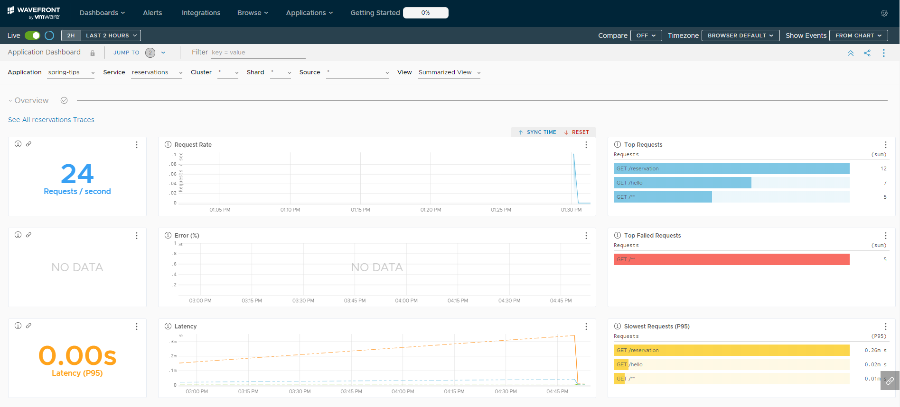
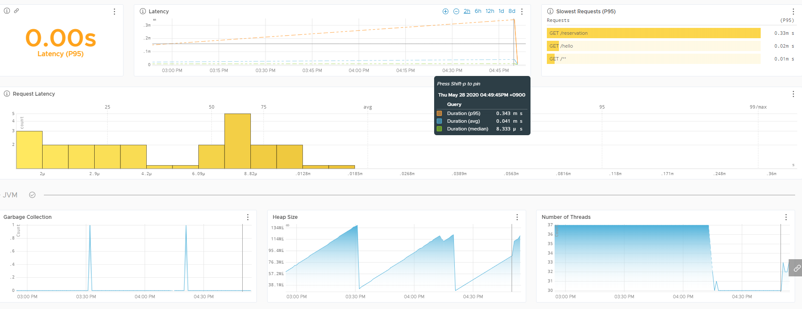
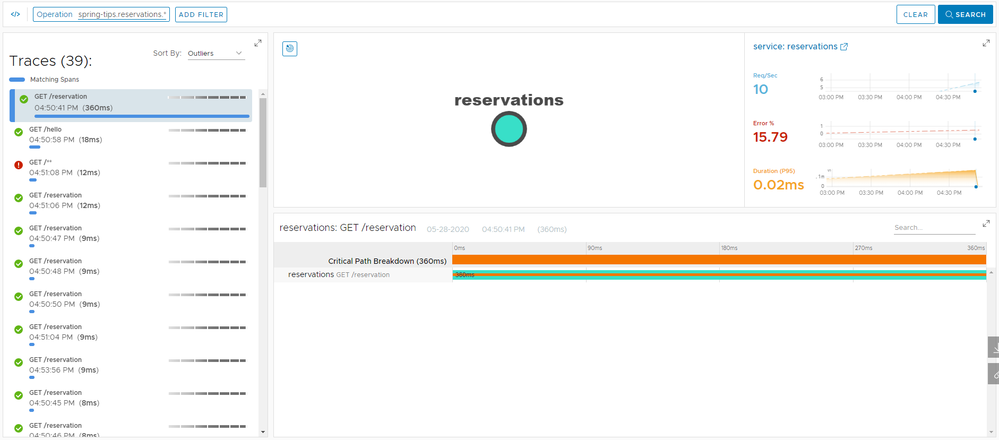

# Wavefront

[Wavefront By vmware](https://docs.wavefront.com/wavefront_springboot.html)

이 글은 아래의 동영상을 보고 따라했던 체험을 공유합니다.
해당 예제는 `Spring Boot`, `Java`에 `Reactive Web`기반으로 작성되었습니다.
[Spring Tips: The Wavefront Observability Platform](https://www.youtube.com/watch?v=R8RAgTJvbEc)

## Wavefront란?

`Wavefront`는 일반 액츄에이터와 달리 어플리케이션이 가동중인 서버 내에 설치되어 동작되는 방식이 아니라 클라우드에 이벤트가 전송되어 web상으로 실시간 확인이 가능한 솔루션입니다.

현재 서버의 상태, Request 횟수, Error 현황, Request Latency 등을 실시간그래프 및 각 통계별 확인이 가능하며 어플리케이션이 동작하는 서버의 `JVM` 상태, `CG`, `Thread Count`, `Head Size`등이 실시간으로 확인이 가능합니다.

각각의 마이크로 서비스에 설정을 해놓으면 각 서비스별 상태 확인이 가능하며 쿠버네티스, AWS Lambda, 클라우드 서비스(AWS, MS AZURE, Google Cloud Platform), Docker등의 환경에도 적용이 가능합니다.

트래픽 그래프의 수직 업틱이나 갑자기 하락하는 중단이 감지된다면 Wavefront는 경고를 생성하여 미리 등록해놓은곳으로 메시지를 발송하게 하는 기능도 있습니다. (Slack, Email, bigPanda ...)


## 일반 설정

### Spring Initializr Dependencies

스프링 이니셜라이저를 사용하여 다음과 같은 디펜던시를 추가하여줍니다.

`Java 11`, `Maven`, `Spring Boot 2.3.0`

- Sleuth
- Spring Reactive Web
- Spring Data R2DBC
- PostgreSQL Driver
- Lombok

> - `Spring Cloud Sleuth`는 한 노드에서 다른 노드로 메시지 플로우를 캡처하기 위한 추상화입니다.
> Dependency만 등록해놓으면 다른 설정 없이 자동으로 설정이 적용됩니다.
> - `Reactive Web` 환경이라 Blocking DB 작업을 Non-Blocking으로 동작하게 해주는 `R2DBC`를 이용하였습니다.

### Properties 추가

``` properties
spring.r2dbc.url=r2dbc:postgresql://localhost/{Database}
spring.r2dbc.username={UserName}
spring.r2dbc.password={Password}

wavefront.application.name={Project Name}
wavefront.application.service={Microservice Name}
```
데이터 베이스 사용을 위한 디비 커넥트 설정과 Wavefront에서 사용할 식별자들을 정하여줍니다.
`wavefront.application.name`은 그룹이 되며 `wavefront.application.service`는 서비스명으로 그룹 하위로 들어가게 됩니다.

> Proxy 환경일 경우 다음과 같이 프록시 설정이 가능합니다.
`management.metrics.export.wavefront.uri=proxy://localhost:2878`


### Dependencies 추가 설정
추후에는 메이븐에 추가 되겠지만 `wavefront-spring-boot-starter`는 아직 다른 저장소에서 모듈을 가져와야해서 `sonatype-snapshots` 저장소를 별도로 추가하여줍니다.

```xml
    <!-- pom.xml -->
    <dependencies>
        ...
        <dependency>
            <groupId>com.wavefront</groupId>
            <artifactId>wavefront-spring-boot-starter</artifactId>
            <version>2.0.0-SNAPSHOT</version>
        </dependency>
    </dependencies>
    <repositories>
        <repository>
            <id>sonatype-snapshots</id>
            <name>Sonatype Snapshos</name>
            <url>https://oss.sonatype.org/content/repositories/snapshots</url>
        </repository>
    </repositories>
```

### Database 생성
레이턴시 이벤트 확인을 위해 실제 DB인 `PostgresQL`을 사용하여 실제 데이터 베이스를 연결해 주어야 합니다. 해당 예제에서 사용하는 간단한 예약 테이블을 미리 생성하여줍니다.
```sql
-- postgresql
CREATE TABLE public.reservation
(
    name character varying COLLATE pg_catalog."default",
    id bigint NOT NULL GENERATED ALWAYS AS IDENTITY ( INCREMENT 1 START 1 MINVALUE 1 MAXVALUE 9223372036854775807 CACHE 1 )
)
TABLESPACE pg_default;
```


## Application Coding

### Application
``` java
@SpringBootApplication
public class WavefrontApplication {

    public static void main(String[] args) {
        SpringApplication.run(WavefrontApplication.class, args);
    }

    @Bean
    RouterFunction<ServerResponse> routes(ReservationRepository rr) {
        return route()
                .GET("/reservation", r -> ok().body(rr.findAll(), Reservation.class))
                .GET("/hello", r -> ok().bodyValue("Hi, Spring!!"))
                .build();
    }

    @Bean
    ApplicationRunner runner(@Autowired ReservationRepository reservationRepository) {
        return args -> {
            var data = Flux
                    .just("A", "B", "C", "D")
                    .map(name -> new Reservation(null, name))
                    .flatMap(reservationRepository::save);

            reservationRepository
                    .deleteAll()
                    .thenMany(data)
                    .thenMany(reservationRepository.findAll())
                    .subscribe(System.out::println);
        };
    }
}
```
서버가 재 실행 될때마다 항상 4개의 데이터가 있게 설정하여주고
Reactive 스타일로 라우팅을하여 두개의 url에 맵핑하여줍니다.
`/reservation`는 실제 DB에 질의하여 데이터를 가져오는 요청이고
`/hello` 는 아주 단순한 문자열을 리턴하게 만들어 요청시간에 각 두 요청에 대한 차이를 두는 예제를 만듭니다.

### Entity & Repository
``` java
// Entity
@Data
@NoArgsConstructor
@AllArgsConstructor
class Reservation {
    @Id
    private String id;
    private String name;
}

// Repository
interface ReservationRepository extends ReactiveCrudRepository<Reservation, String> {}
```

`DTO`객체와 `DAO`를 생성하여 데이터베이스에서 사용될 환경을 만들어줍니다.

다른 모든것들은 자동으로 설정이 되기 때문에 이제 실행만 시켜주면 됩니다.

## 실행 후 토큰 얻기
어플리케이션 실행을 하면 구동이 완료된 후 다음 메시지와 함께 `API Token`과 `one-time use link` URL이 생성되어 브라우저에서 현재 서버 상태 확인이 가능합니다.
(기본적으로 1분 넘게 있어야 이벤트가 올라오기 시작합니다)

토큰은 `~/.wavefront_freemium` 경로와 파일명으로 생성되니 다른 서비스에 적용하기위해 백업을 해두시기 바랍니다.

해당 토큰 파일이 없어진 경우 서버 재구동시에 오류가 뜨게 되면서 종료가 되는데 또 다시 한번 서버를 구동하여주면 정상적으로 구동이 되면서 다시 새로운 API를 받아오게됩니다.
```xml
A Wavefront account has been provisioned successfully and the API token has been saved to disk.

To share this account, make sure the following is added to your configuration:

	management.metrics.export.wavefront.api-token={API TOKEN}
	management.metrics.export.wavefront.uri=https://wavefront.surf

Connect to your Wavefront dashboard using this one-time use link:
https://wavefront.surf/us/{ONE_TIME_LINK}
```

서버 구동이 완료되었으면 URL로 접속하고 다른 새로운 브라우저 창을 띄워놓고 페이지 새로고침을 연타하여주고 기다리면 wavefront의 대쉬보드에 이벤트들이 올라오기 시작합니다.

> API Token 생성되면 다음과 같이 각 서비스의 properties에 토큰 값 설정이 가능합니다.
`management.metrics.export.wavefront.api-token={YOUR_API_TOKEN}`









## 마치며
유투브를 보던도중 재미있어 보이는게 있어서 리서칭도 해보고 따라해보긴 했지만 국내에 아직 많이 소개되진 않고 `Spring Boot Actuator` 관련자료만 많길래 정리한번 해보자 하고 정리한 블로그라 전문적인 지식이 포함되어있지 않은 점 양해바랍니다.

추후에 더 많은 지식을 갖게 되었을때 다시한번 정리하는 시간이 있었으면 좋겠습니다.

더 자세한 설명은 상단의 링크 및 하단 동영상 시청 참고 바랍니다.

!youtube[R8RAgTJvbEc]